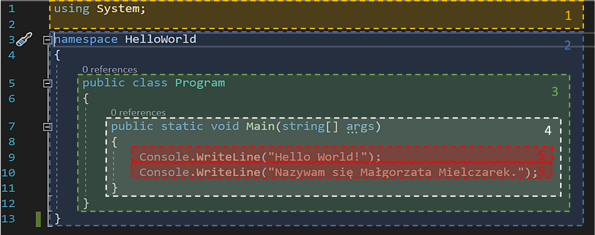
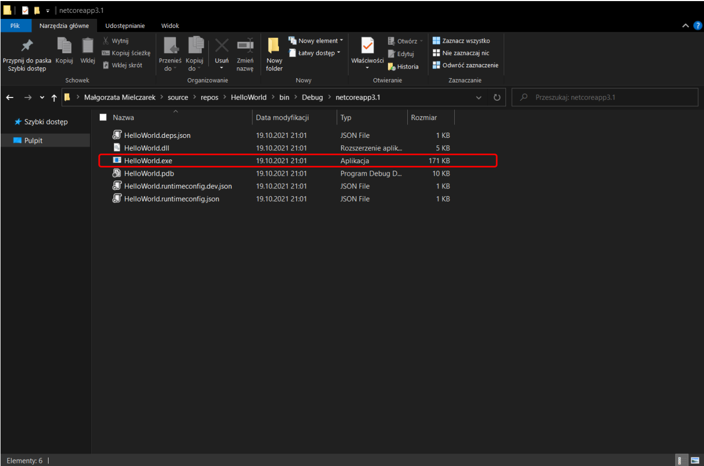
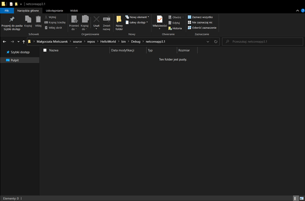
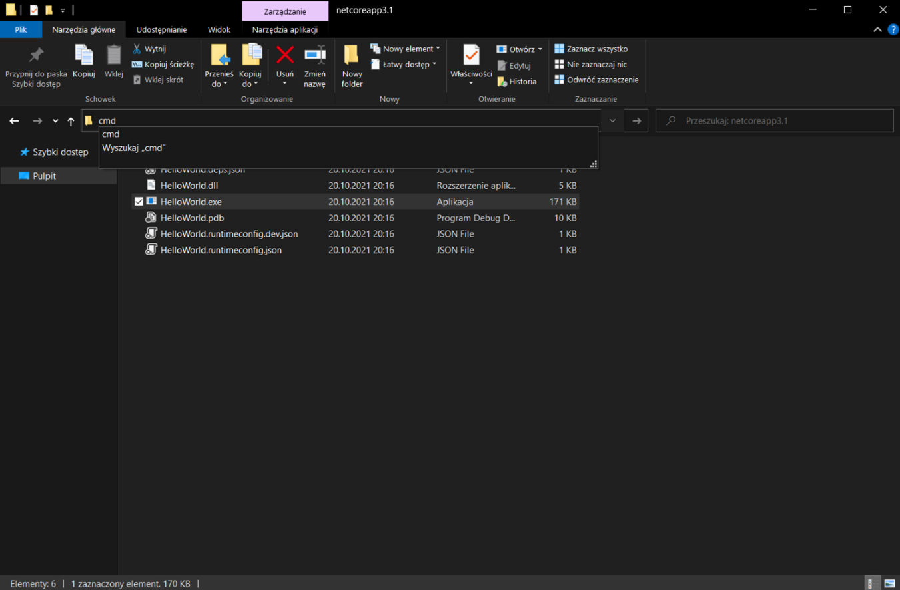

# Kurs "Zostań programistą ASP.NET" - notatki
## Spis treści
### Tydzien1
#### [BONUS 1 – Tworzenie Repozytorium GitHub](#bonus-1--tworzenie-repozytorium-github-1)
#### [BONUS 2 – Podstawy pracy z GITem](#bonus-2--podstawy-pracy-z-gitem-1)
#### [LEKCJA 1 – Powitanie](#lekcja-1--powitanie-5)
#### [LEKCJA 2 – Plan gry](#lekcja-2--plan-gry-1)
#### [LEKCJA 3 – Jak studiować ten kurs](#lekcja-3--jak-studiować-ten-kurs-1)
#### [LEKCJA 4 – Co musisz umieć zanim przejdziesz dalej](#lekcja-4--co-musisz-umieć-zanim-przejdziesz-dalej-1)
#### [LEKCJA 5 – Czym jest .NET](#lekcja-5--czym-jest-net-1)
#### [LEKCJA 6 – Wymagania (potrzebne oprogramowanie)](#lekcja-6--wymagania-potrzebne-oprogramowanie-1)
#### [LEKCJA 7 – Twój pierwszy program](#lekcja-7--twój-pierwszy-program-1)
#### [LEKCJA 8 – Jak pracować z Visual Studio](#lekcja-8--jak-pracować-z-visual-studio-1)
#### [LEKCJA 9 – Konwencje pisania (Dobre praktyki programowania)](#lekcja-9--konwencje-pisania-dobre-praktyki-programowania-1)
#### [LEKCJA 10 – Kompilator](#lekcja-10--kompilator-1)
#### [LEKCJA 11 – Debugowanie](#lekcja-11--debugowanie-1)
#### [LEKCJA 12 – Błędy początkujących](#lekcja-12--błędy-początkujących-1)
#### [LEKCJA 13 – Praca domowa](#lekcja-13--praca-domowa-1)
### Tydzien2
#### [LEKCJA 1 – Powitanie](#lekcja-1--powitanie-6)
#### [LEKCJA 2 – Zmienne i stałe](#lekcja-2--zmienne-i-stałe-1)
#### [LEKCJA 3 – Typy wartościowe](#lekcja-3--typy-wartościowe-1)
#### [LEKCJA 4 – Typy referencyjne](#lekcja-4--typy-referencyjne-1)
#### [LEKCJA 5 – Warunki](#lekcja-5--warunki-1)
#### [LEKCJA 6 – Operatory](#lekcja-6--operatory-1)
#### [LEKCJA 7 – Operatory Logiczne](#lekcja-7--operatory-logiczne-1)
#### [LEKCJA 8 – Pętle](#lekcja-8--pętle-1)
#### [LEKCJA 9 – Instrukcje skoku](#lekcja-9--instrukcje-skoku-1)
#### [LEKCJA 10 – Tablice](#lekcja-10--tablice-1)
#### [LEKCJA 11 – Listy](#lekcja-11--listy-1)
#### [LEKCJA 12 – Enum](#lekcja-12--enum-1)
#### [LEKCJA 13 – Klasy i obiekty](#lekcja-13--klasy-i-obiekty-1)
#### [LEKCJA 14 – Metody](#lekcja-14--metody-1)
#### [LEKCJA 15 – Parametry metod](#lekcja-15--parametry-metod-1)
#### [LEKCJA 16 – Pola i właściwości](#lekcja-16--pola-i-właściwości-1)
#### [LEKCJA 17 – Zakresy widoczności](#lekcja-17--zakresy-widoczności-1)
#### [LEKCJA 18 – Piszemy aplikację](#lekcja-18--piszemy-aplikację-1)
#### [LEKCJA 19 – Błędy początkujących](#lekcja-19--błędy-początkujących-1)
#### [LEKCJA 20 – Praca domowa](#lekcja-20--praca-domowa-1)
### Tydzien3
#### [LEKCJA 1 – Powitanie](#lekcja-1--powitanie-7)
#### [LEKCJA 2 – Konstruktory](#lekcja-2--konstruktory-1)
#### [LEKCJA 3 – Przeciążenia](#lekcja-3--przeciążenia-1)
#### [LEKCJA 4 – Dziedziczenie](#lekcja-4--dziedziczenie-1)
#### [LEKCJA 5 – Polimorfizm](#lekcja-5--polimorfizm-1)
#### [LEKCJA 6 – Hermetyzacja](#lekcja-6--hermetyzacja-1)
#### [LEKCJA 7 – Klasy abstrakcyjne](#lekcja-7--klasy-abstrakcyjne-1)
#### [LEKCJA 8 – Interfejsy](#lekcja-8--interfejsy-1)
#### [LEKCJA 9 – Typy generyczne](#lekcja-9--typy-generyczne-1)
#### [LEKCJA 10 – Refaktoryzacja](#lekcja-10--refaktoryzacja-1)
#### [LEKCJA 11 – Błędy początkujących](#lekcja-11--błędy-początkujących-1)
#### [LEKCJA 12 – Praca domowa](#lekcja-12--praca-domowa-1)
### Tydzien4
#### [LEKCJA 1 – Powitanie](#lekcja-1--powitanie-8)
#### [LEKCJA 2 – Projekt z testami](#lekcja-2--projekt-z-testami-1)
#### [LEKCJA 3 – Twój pierwszy test](#lekcja-3--twój-pierwszy-test-1)
#### [LEKCJA 4 – Testy jednostkowe](#lekcja-4--testy-jednostkowe-1)
#### [LEKCJA 5 – Moq](#lekcja-5--moq-1)
#### [LEKCJA 6 – FluentAssertions](#lekcja-6--fluentassertions-1)
#### [LEKCJA 7 – Pokrycie kodu testami](#lekcja-7--pokrycie-kodu-testami-1)
#### [LEKCJA 8 – TDD](#lekcja-8--tdd-1)
#### [LEKCJA 9 – Testy integracyjne](#lekcja-9--testy-integracyjne-1)
#### [LEKCJA 10 – Błędy początkujących](#lekcja-10--błędy-początkujących-1)
#### [LEKCJA 11 – Praca domowa](#lekcja-11--praca-domowa-1)
### Tydzien5
#### [LEKCJA 1 – Powitanie](#lekcja-1--powitanie-9)
#### [LEKCJA 2 – Kolekcje w .NET](#lekcja-2--kolekcje-w-net-1)
#### [LEKCJA 3 – IQueryable i IEnumerable](#lekcja-3--iqueryable-i-ienumerable-1)
#### [LEKCJA 4 – LINQ podstawy](#lekcja-4--linq-podstawy-1)
#### [LEKCJA 5 – Manipulacje plikami](#lekcja-5--manipulacje-plikami-1)

## [BONUS 1 – Tworzenie Repozytorium GitHub](https://kurs.szkoladotneta.pl/zostan-programista-asp-net/tydzien-1-plan-gry/bonus-1-tworzenie-repozytorium-github/)
Pracę z GitHubem rozpoczynamy od założenia konta na stronie [github.com](https://github.com/) poprzez kliknięcie przycisku ___Sign up___. Następnie wypełniamy formularz postępując zgodnie z instrukcjami pojawiającymi się na ekranie. Po założeniu konta możemy utworzyć nasze pierwsze repozytorium.

__Repozytorium__ - czyli po prostu nasz projekt, a dokładniej zapis składających się na niego plików, wraz z nanoszonymi na nie zmianami. Można powiedzieć, że jest to historia powstawania naszego projektu.

Tworząc projekty w Visual Studio najłatwiej zarządzać repozytoriami poprzez zintegrowanie naszego konta na GitHubie z naszym IDE.
1. Kiedy utworzyliśmy już nasz projekt, wybieramy w Visual Studio zakładkę _Git Changes_ i klikamy przycisk _Create Git Repository..._. Jeżeli nie widzimy zakładki, możemy ją wyszukać w belce _Search (Ctrl+Q)_, wpisując jej nazwę. Po kliknięciu przycisku _Create Git Repository..._ otworzy nam się okno.
2. W _Push to a new remote_ powinniśmy mieć wybraną opcję _GitHub_. Następnie Sprawdzamy i uzupełniamy dane. Używając GitHuba zawsze będziemy tworzyć dwa repozytoria. Pierwsze lokalne powstanie na dysku naszego komputera. Będziemy w nim zapisywać kolejne wprowadzane przez nas zmiany. Drugie będzie repozytorium zdalnym i będzie się znajdywać na serwerach witryny GitHub. Po zapisaniu jakichś zmian w repozytorium lokalnym będziemy je następnie wysyłać do repozytorium zdalnego (_Push_).
3. Pierwsza sekcja (_Initialize a local Git repository_) odpowiada za utworzenie repozytorium lokalnego.
    * W _Local path_ powinniśmy mieć ścieżkę do głównego katalogu naszego projektu.
    * Opcja _.gitignore template_ odpowiada za utworzenie pliku _.gitignore_ na podstawie predefiniowanego schematu. Tworząc projekty w Visual Studio powinniśmy wybrać opcję _Default (Visual Studio)_ lub _Visual Studio_. Plik _.gitignore_ zawiera listę plików, typów plików, folderów itp. wchodzących w skład naszego projektu, których jednak nie chcemy zapisywać w naszym repozytorium. Będą to np. pliki powstałe po kompilacji, które będą zmieniać się przy każdej zmianie w kodzie, więc ich zapisywanie mija się z celem, a zwiększa tylko objętość naszego repozytorium.
    * Następnie mamy pole _License template_ gdzie możemy wybrać szablon licencji, np. jeżeli tworzymy projekt komercyjny typu open-source, czyli z wolnym dostępem do naszego kodu. Licencja określa wówczas na jakich zasadach można korzystać z naszego kodu.
    * Poniżej mamy możliwość wybrania opcji _Add a README.md_. Jej zaznaczenie spowoduje automatyczne dodanie pliku _README.md_ do naszego projektu, co jest dobrą praktyką. W pliku tym umieszczamy szczegółowy opis naszego projektu. Opisujemy do czego służy nasz program, w jakich technologiach został utworzony, jak go używać. Możemy załączać do niego screeny naszego programu, fragmenty kodu z przykładami użycia jakichś funkcji itd.
4. Następnie mamy sekcję _Create a new GitHub repository_. To tutaj tworzymy repozytorium zdalne i łączymy nasze lokalne repozytorium Git z tym utworzonym na naszym koncie GitHub.
    * Na początku musimy więc wybrać nasze konto w polu _Account_. Jeżeli jeszcze nie przyłączyliśmy naszego konta logujemy się wybierając opcję _Add an account: GitHub_. Otworzy się nam strona na której wpisujemy nasz login i hasło, i klikamy _Sign in_.
    * Kiedy nasze konto zostanie połączone w polu poniżej (_Owner_) pojawi się nazwa użytkownika naszego konta. Będzie ona używana jako nasz identyfikator określający, że to właśnie my wprowadziliśmy daną zmianę w projekcie. Kiedy będziemy tworzyć projekty w zespołach umożliwi to stwierdzenie kto wprowadziła jaką zmianę w kodzie. 
    * Następnie w polu _Repository name_ wpisujemy nazwę jaką chcemy aby miało nasze zdalne repozytorium. Domyślnie zostaje tam wstawiona nazwa projektu, możemy ją jednak zmienić, chociaż raczej nie jest to zalecane.
    * Poniżej możemy umieścić krótki opis naszego projektu. Na stronie będzie on wyświetlany przy nazwie tego repozytorium i ułatwi potem identyfikację projektów.
    * Na końcu możemy wybrać opcję _Private repository_. Jej zaznaczenie spowoduje, że nasze zdalne repozytorium będzie prywatne, czyli widoczne i dostępne tylko dla nas i użytkowników z którymi je współtworzymy. Inni użytkownicy nie będą mogli go znaleźć. Odznaczenie tej opcji spowoduje utworzenie repozytorium publicznego, czyli takiego do którego dostęp mają wszyscy.
5. Po wypełnieniu wszystkich pól klikamy przycisk _Create and Push_. Spowoduje to utworzenie repozytorium lokalnego i zdalnego, i zapisanie w plików naszego projektu, w takim stanie, w jakim są obecnie.

## [BONUS 2 – Podstawy pracy z GITem](https://kurs.szkoladotneta.pl/zostan-programista-asp-net/tydzien-1-plan-gry/bonus-2-podstawy-pracy-z-gitem/)
W Visual Studio możemy nie tylko tworzyć repozytoria, ale również na bieżąco nimi zarządzać. Jeśli nasz projekt jest połączony z repozytorium możemy śledzić jakie zmiany wprowadziliśmy od czasu jego ostatniego zapisania w repozytorium.

 W używanej ostatnio zakładce _Git Changes_ będziemy mieli wypisane wszystkie zmienione pliki. Będą one miały odpowiednie statusy. Status można sprawdzić najeżdżając myszką na nazwę pliku lub patrząc na oznaczenie literowe znajdujące się na końcu linii.
 <ul>
 A - od ang. <i>added</i>, oznacza nowo dodany plik, czyli plik który nie istniał jeszcze podczas ostatniego zapisywania projektu w repozytorium.
 <br/>M - od ang. <i>modified</i>, oznacza zmieniony plik, czyli taki, który istnieje już w repozytorium, jednak od ostatniego zapisu zostały w nim wprowadzone zmiany.
 </ul>
 
 W _Solution Explorer_ przed nazwami plików widzimy teraz dodatkowe ikonki.
<ul>
 oznacza, że plik jest zapisany w repozytorium i nie został zmieniony od czasów ostatniego zapisu.
<br/> oznacza, że plik istnieje już w repozytorium, ale został zmieniony od czasu ostatniego zapisu.
<br/> oznacza, że jest to nowy plik, który został utworzony po ostatnim zapisie projektu w repozytorium.
<br/> oznacza, że dany plik jest ignorowany przy zapisie projektu w repozytorium (znajduje się w pliku <i>.gitignore</i>).
</ul>

Aby zapisać zmiany w repozytorium musimy wykonać kolejno dwie czynności:
1. _Commit_ - jest to zapisanie zmian w projekcie do repozytorium lokalnego. Tworząc nowy commit możemy wybrać zmiany w jakich plikach chcemy w nim uwzględnić lub zapisać zmiany we wszystkich zmienionych plikach. Musimy również zawrzeć krótki opis wprowadzonych zmian w polu _Enter a message \<Required\>_.
2. _Push_ - jest to zapisanie zmian w repozytorium lokalnym do repozytorium zdalnego. Push zapisuje w repozytorium zdalnym wszystkie nowe (niezapisane jeszcze) commity z repozytorium lokalnego razem z ich opisami.

Możemy to zrobić przyciskając _Commit All_. Przycisk ten ma trzy opcje wykonania commita do wyboru:
* _Commit All_ - zapisuje wszystkie zmiany w śledzonych plikach projektu w repozytorium lokalnym.
* _Commit All and Push_ - zapisuje zmiany w śledzonych plikach projektu w repozytorium lokalnym, a następnie automatycznie przesyła utworzony commit do repozytorium zdalnego. Na początku tej opcji będziemy zapewne używać najczęściej.
* _Commit All and Sync_ - zapisuje wszystkie zmiany w śledzonych plikach projektu w repozytorium lokalnym i pobiera wszystkie niezapisane lokalnie zmiany z repozytorium zdalnego. Opcja ta jest przydatna szczególnie gdy pracujemy nad projektem zespołowo i chcemy sprawdzić czy ktoś nie wprowadził w między czasie żadnych zmian w projekcie. Możemy wówczas sprawdzić, czy w połączonym kodzie niema kolizji i ewentualnie naprawić je, zanim wyślemy zmiany do wspólnego repozytorium zdalnego.

Jeżeli chcemy na razie zapisać w repozytorium tylko część zmienionych plików, wówczas możemy kliknąć znak plusa znajdujący się po prawej stronie wybranych przez nas plików z listy w zakładce _Git Changes_. Spowoduje to dodanie ich do tzw. _Staged Changes_, czyli listy plików których zmiany chcemy zapisać w najbliższym commit'cie. Jeżeli wybierzemy w ten sposób jakieś pliki, wówczas we wszystkich opisanych powyżej opcjach _Commit All_ zostanie zastąpione przez _Commit Staged_ i w efekcie wykonywanego commitu zostaną zapisane tylko wybrane przez nas pliki.

Jeżeli wykonaliśmy sam commit, bez pusha, to w efekcie otrzymamy coś takiego:


Możemy teraz zrobić push klikając widoczną na rysunku powyżej ikonkę ze strzałką w górę. Oczywiście możemy od razu zapisać na repozytorium zdalnym kilka commitów.
<br/>Na powyższej ilustracji po lewej od ikonki _push_ widzimy jeszcze dwie przydatne funkcje. Pierwsza z nich (ta bardziej po lewej) to _Fetch_ jej kliknięcie spowoduje sprawdzenie, czy mamy aktualną wersję projektu (czy na repozytorium zdalnym ktoś nie zapisał jakichś commitów, których nie mamy na swoim repozytorium lokalnym). Jeżeli _fetch_ wykryje jakieś różnice należy zrobić _pull_, używając do tego sąsiedniego przycisku. Spowoduje to pobranie z repozytorium zdalnego "dodatkowych" commitów i zapisanie ich w naszym repozytorium lokalnym.

Repozytoria mają tzw. branche (ang. _branch_ - gałąź). Główna gałąź projektu najczęściej nazywana jest _master_, jeżeli tworzymy nowe repozytorium przy pomocy Visual Studio lub _main_, jeżeli robimy to na stronie github.com. Branch jest to można powiedzieć odmiana/wariant naszego projektu. Jeżeli planujemy wprowadzić w projekcie jakieś duże zmiany, albo przetestować jakieś rozwiązanie to dobrą praktyką jest utworzenie nowej gałęzi i przeprowadzanie tych zmian właśnie w niej. Oznacza to, że od pewnego momentu nasz projekt będzie mógł składać się z różnych plików lub te same pliki będą mogły mieć różną zawartość w zależności od tego na który branchu będziemy pracować. Dzięki temu możemy mieć w jednym miejscu działający program, a w drugim swobodnie go modyfikować i ulepszać bez obaw, że coś zepsujemy. Jeżeli przeprowadzone przez nas zmiany uznamy za sukces, możemy gałęzie połączyć i ponownie mieć tylko jedną wersję programu.

## [LEKCJA 1 – Powitanie](https://kurs.szkoladotneta.pl/zostan-programista-asp-net/tydzien-1-plan-gry/lekcja-1-powitanie/)
Zaczynam Kurs Szkoły Dotneta [Zostań programistą ASP.NET](https://kurs.szkoladotneta.pl/zostan-programista-asp-net/).
W takich plikach będę zamieszczać swoje notatki i przemyślenia dotyczące kolejnych lekcji.

## [LEKCJA 2 – Plan gry](https://kurs.szkoladotneta.pl/zostan-programista-asp-net/tydzien-1-plan-gry/lekcja-3-plan-gry/)
* Tydzień 1 – Wprowadzenie, pierwszy program, wybór projektów
* Tygodnie 2-4 – Aplikacja konsolowa – nauka podstaw składni języka C# (zmienne, pętle, warunki itd.)
* Tygodnie 5-8 – Aplikacja internetowa w ASP.NET Core MVC

## [LEKCJA 3 – Jak studiować ten kurs](https://kurs.szkoladotneta.pl/zostan-programista-asp-net/tydzien-1-plan-gry/lekcja-4-jak-studiowac-ten-kurs/)
Kurs należy studiować po kolei, nawet jeżeli coś już się umie. Pomaga to w usystematyzowaniu swojej wiedzy i nauczeniu się dobrych praktyk. Co więcej ułatwia to zrozumienie i zmniejsza prawdopodobieństwo pogubienia się w dalszej części kursu. Należy również wykonywać wszystkie zadania domowe umieszczone na końcu każdego tygodnia. Po ich zrobieniu publikuje się je na przeznaczonej do tego grupie.

## [LEKCJA 4 – Co musisz umieć zanim przejdziesz dalej](https://kurs.szkoladotneta.pl/zostan-programista-asp-net/tydzien-1-plan-gry/lekcja-5-czym-jest-net/)
Co musisz umieć zanim przejdziesz dalej? 	–	 **Nic**:bangbang: :scream_cat:
Wszystkie potrzebne informacje zostaną podane w kursie: w lekcjach video lub w dodatkowych materiałach pdf do których linki umieszczone są w opisach pod filmikami.

## [LEKCJA 5 – Czym jest .NET](https://kurs.szkoladotneta.pl/zostan-programista-asp-net/tydzien-1-plan-gry/lekcja-6-co-musisz-umiec-zanim-przejdziesz-dalej/)
#### Co to jest .NET?
.NET jest technologią cross-platformową służącą do tworzenia oprogramowania.

Technologia cross-platformowa to technologia pozwalająca na uruchamianie tworzonego oprogramowania na różnych systemach operacyjnych takich jak np. Windows, Linux, czy Mac OS.

#### W jakim języku się w nim programuje?
W .NETcie  można programować przy pomocy różnych języków. Głównie są to:
* C# – najbardziej powszechny i najczęściej stosowany język technologii .NET. Właśnie nim zajmiemy się w kursie;
* F# – rzadziej stosowany język, gdyż jest to język funkcyjny;
* Visual Basic – nowsza wersja języka BASIC;
* TypeScript – nadzbiór języka JavaScript umożliwiający opcjonalne statyczne typowanie (kod sprawdzany podczas kompilacji), kompilowany do języka JavaScript;

#### Jakie aplikacje można za jego pomocą tworzyć?
Można przy jej pomocy tworzyć aplikacje:
1. desktopowe, <br/>
        Aplikacje desktopowe, czyli programy instalowane i uruchamiane bezpośrednio na komputerze użytkownika. Są to zazwyczaj tzw. aplikacje okienkowe popularne w systemach Windows.
2. internetowe (webowe), <br/>
        Aplikacja internetowa to program pracujący na serwerze, komunikujący się z użytkownikiem (hostem) przy pomocy sieci. W tym celu wykorzystywana jest przeglądarka internetowa użytkownika. W pracy aplikacji internetowej musi pośredniczyć serwer www.
3. gry, <br/>
        Gry w technologii .NET tworzy się przy pomocy silnika gier Unity.
4. mobilne, <br/>
        Aplikacje mobilne, czyli programy przeznaczone na urządzenia przenośne. Mogą być to zarówno aplikacje:
    * samodzielne, czyli działające bez dostępu do Internetu (odpowiednik aplikacji desktopowych),
    * klienckie, aplikacja (klient) jest zainstalowana i działa na urządzeniu użytkownika, jednak na życzenie klienta łączy się z serwerem (pobieranie, zapisywanie danych) poprzez sieć internetową,
    * internetowe, czyli aplikacje mobilne przystosowane do obsługi na urządzeniach mobilnych,
    * gry komputerowe, w technologii .NET również tworzone najczęściej przy pomocy silnika Unity, zaprojektowane jednak do obsługi na urządzeniach mobilnych.

    Do tworzenia cross-platformowych aplikacji mobilnych technologia .NET posiada specjalną platformę Xamarin, do programowania najczęściej w języku C#.
5. z zakresu uczenia maszynowego i sztucznej inteligencji,
6. związane z IoT (ang. Internet of Things – internet rzeczy) <br/>
        IoT jest to koncepcja, wedle której jednoznacznie identyfikowalne przedmioty mogą pośrednio albo bezpośrednio gromadzić, przetwarzać lub wymieniać dane za pośrednictwem instalacji elektrycznej inteligentnej KNX lub sieci komputerowej. Stosowana np. w rozwiązaniach inteligentnych domów.

####
.NET jest technologią firmy Microsoft, aktywnie przez nią wspieraną i rozwijaną. Posiada ponadto duże środowisko używających jej i rozwijających ją programistów. Dzięki temu łatwiej znaleźć pomoc przy pisaniu programów, a sama technologia nie prędko wyjdzie z użytku.

## [LEKCJA 6 – Wymagania (potrzebne oprogramowanie)](https://kurs.szkoladotneta.pl/zostan-programista-asp-net/tydzien-1-plan-gry/lekcja-7-wymagania-potrzebne-oprogramowanie/)
W tej lekcji pobieramy i instalujemy oprogramowanie z którego będziemy korzystać podczas wykonywania kursu. Będziemy korzystać z programów:
* Visual Studio 2022 Community
* Visual Studio Code
* SQL Server Management Studio
* Postman

1. Przed instalacją należy sprawdzić czy nasz sprzęt spełnia wymagania systemowe: [link](https://docs.microsoft.com/en-us/visualstudio/releases/2022/system-requirements)  
Powyższy link kieruje do strony z wymaganiami systemowymi oprogramowania Visual Studio 2022 Community. Jeżeli sprzęt spełnia te wymagania, to na pewno spełni też wymagania wszystkich innych programów.
2. Pobieranie i instalacja oprogramowania:
    * [Visual Studio 2022 Community](https://visualstudio.microsoft.com/pl/vs/community/)
    * [Visual Studio Code](https://code.visualstudio.com/download)
    * [SQL Server Management Studio](https://learn.microsoft.com/en-us/sql/ssms/download-sql-server-management-studio-ssms?view=sql-server-ver15)


Jak zainstalować poszczególne programy można zobaczyć w filmie instruktarzowym z [tej lekcji](https://kurs.szkoladotneta.pl/zostan-programista-asp-net/tydzien-1-plan-gry/lekcja-7-wymagania-potrzebne-oprogramowanie/) lub instrukcjach instalacji poszczególnych programów. Instalacja programów szczególnie Visual Studio zajmie sporo czasu.


## [LEKCJA 7 – Twój pierwszy program](https://kurs.szkoladotneta.pl/zostan-programista-asp-net/tydzien-1-plan-gry/lekcja-8-konwencje-pisania/)
W tej lekcji piszemy pierwszy program w języku C#. Zgodnie z programistyczną tradycją będzie to Hello World. Stworzymy cross-platformową konsolową aplikację desktopową w technologii ASP.NET Core. Należy zwrócić uwagę aby wybrać wersję aplikacji konsolowej wspierającej wszystkie platformy (Window, Linux, macOS), w odróżnieniu od starszej wersji tworzonej przy użyciu .NET Framework, wspierającej jedynie platformę Windows. Zarówno tworzonemu projektowi (_Project name_) jak i solucji (_Solution name_) nadajemy nazwę HelloWorld. W nowszej wersji kursu używa się frameworka .NET 6.0. Poniżej opisany program był tworzony wcześniej jeszcze w starszej wersji 3.1.
### 1. [Kod programu HelloWorld](https://github.com/malgorzataMielczarek/HelloWorld/blob/cbc46abed557bb000ed8696b578ac3c082309107/Program.cs)
```csharp = 
using System;

namespace HelloWorld
{
    public class Program
    {
        public static void Main(string[] args)
        {
            Console.WriteLine("Hello World!");
            Console.WriteLine("Nazywam się Małgorzata Mielczarek.");
        }
    }
}
```



Aplikacja tworzona w nowszych wersjach (począwszy od .NET 5 - C# 9) może używać tzw. instrukcji najwyższego poziomu (ang. _top-level statements_). Oznacza to, że nie musimy już jawnie ustawiać metody Main(). Powyższy zapis może więc wyglądać prościej:
```csharp = 
    Console.WriteLine("Hello World!");
    Console.WriteLine("Nazywam się Małgorzata Mielczarek.");
```
### 2. Ogólna budowa programu:
#### :orange_circle: 1. [Sekcja „using”](https://github.com/malgorzataMielczarek/HelloWorld/blob/cbc46abed557bb000ed8696b578ac3c082309107/Program.cs#L1-L2)
Część programu w której po słowie kluczowym _using_ umieszcza się nazwę biblioteki z których korzysta się w programie i kończy linię średnikiem. Jeżeli korzystamy z kilku bibliotek umieszczamy kilka takich linijek
```csharp
using nazwa_biblioteki;
```
Biblioteka – paczka kodu zawierająca funkcje, stałe i klasy służące do określonego celu.
Później będziemy np. korzystać z takich bibliotek jak:
* _System.IO_ - służącej m.in. do obsługi plików, wejścia, wyjścia
* _System.Linq_ - do działania na kolekcjach
* _System.Security_ - do kryptografii, zabezpieczania aplikacji
* _System.Text_ - do działania na tekście, formatowania JSON-a.
#### :large_blue_circle: 2. [Namespace](https://github.com/malgorzataMielczarek/HelloWorld/blob/cbc46abed557bb000ed8696b578ac3c082309107/Program.cs#L3-L13) – z ang. przestrzeń nazw
Miejsce skupiające podobne klasy (o podobnych funkcjonalnościach lub roli w programie). Służy głównie do uporządkowania nazw typów, klas, funkcji itd., aby zmniejszyć ryzyko  kolizji nazw. Na ogół jest ona związana z folderem w którym znajduje się dany plik. Pliki będące w tej samej przestrzeni nazw mogą bezpośrednio się z sobą komunikować. Żeby móc skorzystać z elementów należących do innego namespace-a trzeba natomiast dodać go do sekcji "using" (_using nazwa-namespace;_). [Przestrzeń nazw tworzy się](https://github.com/malgorzataMielczarek/HelloWorld/blob/cbc46abed557bb000ed8696b578ac3c082309107/Program.cs#L3) podając kolejno słowo kluczowe _namespace_ i nazwę, którą chcemy mu nadać. [Wnętrze przestrzeni nazw](https://github.com/malgorzataMielczarek/HelloWorld/blob/cbc46abed557bb000ed8696b578ac3c082309107/Program.cs#L4-L13) (klasy które zawiera) są ujęte w nawiasie klamrowym. Nawias klamrowy w języku C# oznacza zakres danego elementu, w tym wypadku przestrzeni nazw.
```csharp
namespace Nazwa_przestrzeni_nazw
{
    //klasy w niej zawarte
}
```
#### :green_circle: 3. [Klasa](https://github.com/malgorzataMielczarek/HelloWorld/blob/cbc46abed557bb000ed8696b578ac3c082309107/Program.cs#L5-L12)
Częściowa lub całkowita definicja dla obiektu. Opisuje domyślny początkowy stan obiektów, oraz ich zachowanie itp. Jest to zbiór atrybutów i metod opisujący jakiś obiekt (zbiór obiektów). [Klasę tworzy się](https://github.com/malgorzataMielczarek/HelloWorld/blob/cbc46abed557bb000ed8696b578ac3c082309107/Program.cs#L5) podając kolejno modyfikator dostępu określający poziom dostępu klasy, słowo kluczowe _class_ i nazwę klasy. [Wnętrze klasy](https://github.com/malgorzataMielczarek/HelloWorld/blob/cbc46abed557bb000ed8696b578ac3c082309107/Program.cs#L6-L12), wszystkie atrybuty i metody ją tworzące, są ujęte wewnątrz nawiasu klamrowego (ciało klasy jest ograniczone nawiasem klamrowym).
```csharp
modyfikator_dostępu class Nazwa_klasy
{
    //atrybuty i/lub jej metody
}
```
W języku C# występują 4 modyfikatory dostępu:
* _public_ (z ang. publiczny),
* _protected_ (z ang. chroniony),
* _internal_ (z ang. wewnętrzny),
* _private_ (z ang. prywatny).

Przy ich pomocy można określić 6 poziomów dostępu:
* _public_ – określa, że klasa jest ogólnie dostępna, ze wszystkich części programu (dostęp nie jest ograniczony);
* _protected_ – określa, że dostęp jest ograniczony do zawierającej klasy lub typów pochodzących od klasy zawierającej;
* _internal_ – określa, że dostęp jest ograniczony do bieżącego zestawu.  
Zestaw (ang. _assembly_) – zbiór typów i źródeł działających razem i tworzących logiczną jednostkę funkcjonalną. Tworzy ona plik .exe lub  .dll;
* _protected internal_ – określa, że dostęp jest ograniczony do bieżącego zestawu lub typów pochodzących od klasy zawierającej;
* _private_ – określa, że dostęp jest ograniczony do typu zawierającego;
* _private protected_ – określa, że dostęp jest ograniczony do zawierającej klasy lub typów pochodzących od klasy zawierającej w bieżącym zestawie.
#### :white_circle: 4. [Metoda](https://github.com/malgorzataMielczarek/HelloWorld/blob/cbc46abed557bb000ed8696b578ac3c082309107/Program.cs#L7-L11)
Funkcja będąca częścią klasy. Zawiera logikę konkretnej czynności wykonywany przez obiekt danego typu. [Tworzy się ją](https://github.com/malgorzataMielczarek/HelloWorld/blob/cbc46abed557bb000ed8696b578ac3c082309107/Program.cs#L7) podając kolejno modyfikatory dostępu, następnie jeżeli chcemy aby klasa była statyczna wpisujemy słowo kluczowe _static_, po czym obowiązkowo musimy podać typ zmiennej zwracanej przez metodę, nazwę tworzonej metody i w nawiasie okrągłym parametry funkcji (dane przyjmowane przez metodę). Parametry określamy podając kolejno typ i nazwę każdego z nich. Jeżeli metoda przyjmuje więcej niż jeden parametr to oddzielamy je od siebie przecinkami. Wnętrze metody ([ciało metody](https://github.com/malgorzataMielczarek/HelloWorld/blob/cbc46abed557bb000ed8696b578ac3c082309107/Program.cs#L8-L11)) jest ujęte w nawiasach klamrowych.
```csharp
modyfikatory_dostępu opcjonalnie_inne_modyfikatory typ_danych_zwracanych_przez_metodę nazwa_metody(/*opcjonalnie*/ typ_parametru_1 nazwa_parametru_1, typ_parametru_2 nazwa_parametru_2 ...)
{
    //logika metody
}
```
Metoda statyczna – metoda tworzona na etapie kompilacji programu. W programie istnieje tylko jedna instancja tej metody (nie ma oddzielnej kopii dla każdego obiektu klasy). W praktyce oznacza to m.in., że można ją wykonywać przed utworzeniem obiektu klasy do której ta metoda należy.  
Metoda _Main_ (z ang. główna) – metoda odpowiedzialna za kontrolę wykonywania pracy programu. Każda wykonywalna aplikacja (np. aplikacja konsolowa) musi ją zawierać. Tu program rozpoczyna i kończy swoją  pracę. Jest punktem wejściowym w pliku .exe programu. Aplikacja może mieć tylko jeden punkt wejściowy. Jeżeli więc w kodzie programu mamy kilka metod _Main_ na etapie kompilacji musimy podać która z nich będzie tym punktem (metody te muszą jednak należeć do różnych klas). Najlepiej jednak, aby aplikacja posiadała tylko jedną metodę _Main_. Musi ona być statyczna. Deklaruje się ją wewnątrz klasy lub struktury. Metoda _Main_ może, lecz nie musi zwracać dane w postaci liczb całkowitych (mieszczących się w pewnym zakresie). Jeżeli nie chcemy aby metoda cokolwiek zwracała, przypisujemy jej typ _void_ (z ang. pusty). Natomiast gdy chcemy uzyskać dane (najczęściej dotyczące poprawności wykonania programu – kody błędów) na zakończenie działania programu, przypisujemy jej typ _int_ (ang. integer – liczba całkowita). Metoda _Main_ może nie przyjmować żadnych parametrów. Wówczas po nazwie wstawiamy pusty nawias okrągły. Może również pobierać argumenty z wywołania programu w wierszu poleceń. Dane te są pobierane w postaci tablicy ciągu znaków alfanumerycznych. Wówczas wewnątrz nawiasu okrągłego wpisujemy _string[] args_.
#### :red_circle: 5. [Polecenia](https://github.com/malgorzataMielczarek/HelloWorld/blob/cbc46abed557bb000ed8696b578ac3c082309107/Program.cs#L9-L10)
Czynności wykonywane kolejno przez program. Każde polecenie zakończone jest średnikiem. Takim poleceniem może [np.](https://github.com/malgorzataMielczarek/HelloWorld/blob/cbc46abed557bb000ed8696b578ac3c082309107/Program.cs#L9) być wywołanie funkcji bibliotecznej. Wówczas podajemy nazwę metody której chcemy użyć, wraz z całą ścieżką dostępu. Następnie znajduje się nawias okrągły, a po nim średnik kończący polecenie. Jeżeli wywołana przez nas metoda przyjmuje jakieś parametry, dane określonego typu (same dane bez typu) podajemy wewnątrz, znajdującego się po nazwie, nawiasu okrągłego. Jeżeli funkcja ma kilka parametrów to dane które chcemy przypisać do kolejnych parametrów oddzielamy od siebie przecinkami.
Przez ścieżkę dostępu rozumie się nazwy klas w których zawarta jest metoda oddzielonych od siebie kropkami. Klasy podaje się od najbardziej zewnętrznej do wewnętrznej, do której bezpośrednio należy wywoływana funkcja. Następnie wstawia się kropkę i nazwę żądanej metody.

### 3. Elementy użyte w programie
#### :orange_circle: 1. [Biblioteka System](https://github.com/malgorzataMielczarek/HelloWorld/blob/cbc46abed557bb000ed8696b578ac3c082309107/Program.cs#L1) – biblioteka systemowa
Jedna z podstawowych i najczęściej używanych bibliotek C#. Zawiera podstawowe klasy, definiuje podstawowe typy danych itd.
#### :large_blue_circle: 2. [Przestrzeń nazw _HelloWorld_](https://github.com/malgorzataMielczarek/HelloWorld/blob/cbc46abed557bb000ed8696b578ac3c082309107/Program.cs#L3-L13)
Utworzona przez nas przestrzeń nazw zawierającą cały kod naszego programu.
#### :green_circle: 3. [Klasa _Program_](https://github.com/malgorzataMielczarek/HelloWorld/blob/cbc46abed557bb000ed8696b578ac3c082309107/Program.cs#L5-L12)
Jedyna utworzona przez nas klasa zawierająca całą logikę naszego programu. Należy do przestrzeni nazw _HelloWorld_. Jest to klasa publiczna, co oznacza, że dostęp do niej można uzyskać z dowolnego miejsca programu.
#### :white_circle: 4. [Metoda _Main_](https://github.com/malgorzataMielczarek/HelloWorld/blob/cbc46abed557bb000ed8696b578ac3c082309107/Program.cs#L7-L11)
Stworzona przez nas publiczna, statyczna metoda klasy _Program_. Nasza metoda nie zwraca żadnych wartości (jest typu _void_). Przyjmuje natomiast dane w postaci tablicy ciągu znaków (_string[]_) i zapisuje do parametru _args_.
#### :red_circle: 5. [Metoda _WriteLine_](https://github.com/malgorzataMielczarek/HelloWorld/blob/cbc46abed557bb000ed8696b578ac3c082309107/Program.cs#L9-L10)
Metoda klasy _Console_ wyświetlająca w konsoli podaną linijkę tekstu (wypisywanie tekstu jest zakończone przejściem do nowej linii). Metoda przyjmuje jako argument ciąg znaków alfanumerycznych łącznie ze znakami białymi (spacje itp.) – typ _string_. Tekst który chcemy wyświetlić w konsoli umieszczamy wewnątrz nawiasu okrągłego wywołania metody, w cudzysłowie. Pierwsze z wywołań spowoduje pojawienie się w konsoli linijki tekstu – [_Hello World!_](https://github.com/malgorzataMielczarek/HelloWorld/blob/cbc46abed557bb000ed8696b578ac3c082309107/Program.cs#L9). Drugie natomiast linijki – [_Nazywam się Małgorzata Mielczarek._](https://github.com/malgorzataMielczarek/HelloWorld/blob/cbc46abed557bb000ed8696b578ac3c082309107/Program.cs#L10).


## [LEKCJA 8 – Jak pracować z Visual Studio](https://kurs.szkoladotneta.pl/zostan-programista-asp-net/tydzien-1-plan-gry/lekcja-9-pierwszy-program/)
Na potrzeby tej lekcji wykorzystamy zmodyfikowany program z lekcji poprzedniej - [HelloWorld](https://github.com/malgorzataMielczarek/HelloWorld/tree/fb82e35c1d13ff597543adc0384cb5bfe5577c85). W tej lekcji poznajemy podstawowy układ IDE w którym będziemy pracować – *Visual Studio*.
##### IDE (ang. _integrated development environment_ – zintegrowane środowisko programistyczne)
>Program lub zespół programów służących do tworzenia, modyfikowania, testowania i konserwacji oprogramowania. Programy będące zintegrowanymi środowiskami programistycznymi charakteryzują się tym, że udostępniają złożoną, wieloraką funkcjonalność obejmującą edycję kodu źródłowego, kompilowanie kodu źródłowego, tworzenie zasobów programu (tzn. formatek/ekranów/okien dialogowych, menu, raportów, elementów graficznych jak ikony, obrazy), tworzenie baz danych, komponentów i innych.
><br/> _Źródło: [Wikipedia](https://pl.wikipedia.org/wiki/Zintegrowane_środowisko_programistyczne)_

### Podstawowe okno programu Visual Studio


#### :red_circle: Okno edytora kodu
Obszar IDE w którym wyświetlany jest cały kod klasy/pliku który przeglądamy.
#### :green_circle: Zakładki
Wszystkie otwarte w programie pliki.<br/>
Przełączanie zakładek umożliwia szybkie przeskakiwanie między klasami. Gwiazdka na końcu nazwy pliku oznacza, że są w nim niezapisane zmiany. Aktualnie otwarta karta (zakładka oznaczająca plik którego treść jest aktualnie widoczna w oknie edytora kodu) jest podświetlona.
#### :large_blue_circle: _Solution Explorer_
Z ang. eksplorator rozwiązań. Zawiera drzewo rozwiązania (solucji) – wszystkie składające się na nie projekty, foldery, biblioteki, pliki, klasy itd..
##### Solucja (ang. _solution_ – rozwiązanie)
Jest to zbiór powiązanych ze sobą projektów, związanych z jedną aplikacją.<br/>
Głównym jej zadaniem jest grupowanie oraz ułatwienie zarządzania powiązanych ze sobą projektów. Solucja może być pusta (nie zawiera żadnego projektu - kodu), lub składać się z przynajmniej jednego projektu. Jeżeli jest ich kilka jest to najczęściej projekt tworzonego programu oraz pisane do niego biblioteki. Projekty mogą być pisane w różnych językach programowania. Jeden z projektów musi być projektem startowym. Jest on wyróżniony poprzez pogrubienie nazwy w drzewie solucji pokazanym w oknie eksploratora rozwiązań (ang. _Solution Explorer_).
##### Projekt (ang. _project_)
Jest kontenerem zawierającym i porządkującym pliki z kodami źródłowymi aplikacji. Pozwala również na zarządzanie jej bibliotekami i pewnymi właściwościami takimi jak debugowanie, kompilacja, architektura, docelowa wersja platformy itd..
##### Projekt startowy
Jest to pierwszy projekt budowany w danej solucji. Musi być to projekt wykonywalny (np. _Consol Application_ – aplikacja konsolowa). Nie może nim być np. biblioteka (ang. _library_). Z pozostałych projektów można skorzystać tylko poprzez podpięcie ich do projektu startowego.

Rozwiązanie przedstawione na obrazku powyżej zawiera tylko jeden projekt (_HelloWorld_), będący projektem startowym. Nowe projekty można dodać do solucji poprzez kliknięcie jej nazwy, w oknie eksploratora rozwiązań, prawym przyciskiem myszki, a następnie wybranie **Add** -> **New Project...** Projekt startowy można natomiast zmienić klikając w Solution Explorerze nazwę projektu, który chcemy ustawić jako projekt startowy, prawym przyciskiem myszki, a następnie wybierając **Set as Startup Project**. W eksploratorze rozwiązań można również dodawać do projektu nowe pliki, klasy, foldery itd. (prawy przycisk myszki na nazwę projektu, następnie **Add** -> **New Item...**/**Class...**/**New Folder**/itd.). Podobnie można tu również zmieniać nazwy plików/projektów (**Rename**), usuwać je z solucji (**Remove**/**Delete**) i wiele, wiele innych.
#### :yellow_circle: Pasek narzędzi 
Pasek w górnej części okna programu, zawierający ikonki z podstawowymi funkcjami.<br/>
Jego prawa część składa się z typowych funkcjonalności programu, takich jak: przyciski nawigacji, nowy projekt, otwórz plik, zapisz plik wyświetlany aktualnie w oknie edytora kodu, zapisz wszystkie pliki, cofnij zmiany, wprowadź ponownie cofnięte zmiany itd.. Następnie znajdują się pola związane z uruchamianiem pisanej aplikacji. Możemy wybrać konfigurację w jakiej ma być uruchomiona solucja, platformy na których ma działać i uruchomić program (pole z zieloną strzałką "play"). Na końcu mamy inne przydatne funkcjonalności. Wyświetlany pasek może w rzeczywistości składać się z wielu pasków narzędzi. W standardowym układzie są to trzy paski: standardowych opcji, związany z edycją tekstu oraz z funkcjonalnościami dotyczącymi kontroli źródła. Paski narzędzi można dostosować do swoich potrzeb wybierając te, z pośród wielu dostępnych pasków i funkcjonalności programu, z których korzystamy najczęściej. Po lewej stronie paska znajdują się jeszcze dwa przyciski: do współpracy z innymi programistami w czasie rzeczywistym (_Visual Studio Live Share_) oraz do komunikacji z wytwórcą IDE.
### Okno programu Visual Studio podczas działania aplikacji


#### :large_blue_circle: Narzędzia diagnostyczne
Wyświetlają się tylko podczas pracy pisanej aplikacji. Umożliwia monitorowanie ilości zasobów używanych przez nasz program (ilość zajmowanej przez proces pamięci – _Process Memory_) oraz obciążenie procesorów (_CPU_).
#### :green_circle: Monitor zmiennych
Lista wszystkich aktualnie istniejących zmiennych, wraz z ich aktualnymi wartościami i typami.<br/>
Na dole tego okna widzimy trzy zakładki:
* _Autos_ – pokazuje tylko zmienne używane w pobliżu aktualnie wykonywanej instrukcji,
* _Locals_ – lista wszystkich zmiennych lokalnych,
* _Watch 1_ – śledzi wybrane przez użytkownika zmienne.
#### :red_circle: Okno natychmiastowe (ang. _Immediate Window_)
Służy do wprowadzania poleceń wykonywanych w locie na działającej aplikacji. Mają one skutek tylko w tym konkretnym uruchomieniu, nie wprowadzając zmian w kodzie programu. Skutek działania wprowadzonych komend jest natychmiastowy. Służy głównie do sprawdzenia czy dane polecenie da oczekiwany rezultat. Na dole okna znajdują się zakładki z innymi narzędziami.
#### :orange_circle: Szybkie akcje (ang. _Quick Actions_)
Narzędzie proponujące zmiany w kodzie i wprowadzające je za zgodą programisty. Umożliwia ono np. poprawienie formatowania, utworzenie konstruktora klasy, obwarowanie pól klasy metodami _get_/_set_ itd. Ikona jest widoczna zarówno podczas pisania kodu, jak i w czasie pracy programu. Umożliwia ona dostęp do swoich funkcji w obu przypadkach. Wprowadzone w kodzie zmiany zostaną jednak zastosowane dopiero przy następnym uruchomieniu programu.
#### :yellow_circle: Punkt przerwania pracy programu (ang. _Breakpoint_)
Zaznaczone przez programistę miejsce w kodzie, w którym wykonywanie programu będzie przerwane podczas debugowania. Breakpointy wstawia się poprzez kliknięcie lewym przyciskiem myszki na szary pasek po lewej stronie okna edytora kodu na wysokości linii przed którą chcemy zatrzymać program. Punkty przerwania pracy programu są widoczne zarówno podczas edycji kodu, jak i podczas działania aplikacji. W obu przypadkach można również wstawiać nowe punkty. Działający program zatrzyma się we wprowadzanych na bieżąco punktach o ile występują one w miejscach gdzie jeszcze się nie wykonał.

## [LEKCJA 9 – Konwencje pisania (Dobre praktyki programowania)](https://kurs.szkoladotneta.pl/zostan-programista-asp-net/tydzien-1-plan-gry/lekcja-10-kompilator/)
Konwencje programowania, są to ogólnie przyjęte zasady pisania kodu. Nie mają one wpływu na działanie programu. Stosowanie ich zwiększa jednak czytelność i ułatwia programistą czytanie cudzego kodu. Konwencji programowania jest bardzo dużo. W tej lekcji poznamy tylko kilka z nich. Warto od razu wyrobić sobie nawyk ich stosowania, aby ułatwić sobie pracę w przyszłości.
### Konwencje nazywania elementów programu
#### **PascalCase**

| Wygląd | Zastosowanie |
|:---|:---|
| Wszystkie wyrazy nazwy piszemy razem, bez żadnych przerw. Pierwsza litera każdego wyrazu jest wielka a kolejne małe. | Nazywanie klas, plików, przestrzeni nazw (`namespace`), metod. |
|Np.: `CaloriesCalculator`, `HelloWorld`, `AddYears`. ||
#### **camelCase**

| Wygląd | Zastosowanie|
|:---|:---|
| Wszystkie wyrazy nazwy piszemy razem, bez żadnych przerw. Pierwsza litera prawie każdego wyrazu jest wielka a kolejne małe. Wyjątek stanowi pierwszy wyraz, który w całości jest pisany małymi literami. | Nazywanie lokalnych zmiennych i prywatnych elementów programu. |
| Np.: `addedYears`, `displayScreen`, `numberOfCircles`. ||
#### **UPPER_CASE**

| Wygląd | Zastosowanie |
|:---|:---|
| Nazwę piszemy w całości wielkimi literami (wszystkie litery). Wyrazy oddzielamy od siebie przy pomocy podkreślnika („_”). | Nazywanie stałych. |
| Np.: `PI_NUMBER`, `AGE_OF_CONSENT`, `NUMBER_OF_THREADS`. ||
### Konwencja zapisu nawiasów klamrowych
Nawiasy klamrowe są częstym elementem kodu w języku C#. Definiują zasięgi przestrzeni nazw, klas, metod oraz instrukcji warunkowych i pętli. W odróżnieniu od większości instrukcji, po nawiasie klamrowym nie stawia się średnika. W języku C# przyjęło się, że nawias klamrowy stawiamy w kolejnej linii niż instrukcja której dotyczy. Visual Studio domyślnie pomaga w utrzymaniu tej konwencji.

Np.:
```csharp
namespace HelloWorld
{
	wnętrzePrzestrzeniNazw;
}
```
```csharp
public class Program
{
	wnętrzeKlasy;
}
```
```csharp
public static void Main(string[] args)
{
	instrukcjeMetody;
}
```
```csharp
if(a>b)
{
	instrukcjeWykonywaneWPrzypadkuSpełnieniaWarunku;
}
```
```csharp
while(a>b)
{
	instrukcjeWykonywaneWPrzypadkuSpełnieniaWarunku;
	a--;
}
```
### Konwencja tworzenia nowych metod
Pomiędzy kolejnymi metodami umieszcza się maksymalnie jedną linię odstępu (pustą linię). Stosowanie większych odstępów zmniejsza czytelność kodu. Powoduje jego niepotrzebne wydłużenie. To z kolei utrudnia sprawną nawigację po kodzie.
### Konwencja pisania modyfikatorów dostępu
Zaleca się pisanie modyfikatora dostępu za każdym razem, nawet kiedy nie jest on wymagany. Standardowym i domyślnym modyfikatorem dostępu dla większości elementów języka C# jest `private` lub `internal`. W niektórych przypadkach można więc je pominąć, bez wpływu na funkcjonowanie programu. Zaleca się jednak zapisywanie ich w postaci jawnej, aby zwiększyć przejrzystość kodu. Związane jest to ze stosowaniem wielu słów kluczowych przed nazwami metod (takich jak `static`, czy typ zwracany przez metodę). Zapisanie modyfikatorów dostępu w postaci jawnej ułatwia przeglądanie kodu w poszukiwaniu metod o określonym typie dostępu.
### Konwencja tworzenia klas
Każda klasa powinna znajdować się w oddzielnym pliku (każdy plik powinien zawierać tylko jedną klasę). Język C# umożliwia umieszczenie wielu klas w jednym pliku. W miarę rozrastania się programu zmniejsza to jednak jego czytelność i utrudnia nawigację. Visual Studio umożliwia łatwe przeniesienie utworzonych już klas do nowych plików, przy pomocy Szybkich akcji.
### Konwencja stosowania typów w nazwach
W odróżnieniu od niektórych innych języków programowania, w języku C# w większości przypadków nazwy elementu NIE rozpoczyna się od jego typu (ani skrótu od nazwy typu elementu). Od tej zasady występuje jeden wyjątek, a mianowicie interfejs. Nazwy interfejsów zawsze rozpoczyna się od wielkiej litery „i” („I”, jak `interface`).

Np.:
```csharp
public interface IProgram
{
}
```

## [LEKCJA 10 – Kompilator](https://kurs.szkoladotneta.pl/zostan-programista-asp-net/tydzien-1-plan-gry/lekcja-11-jak-pracowac-z-visual-studio/)
Kompilator jest narzędziem służącym do kompilacji naszego kodu.
### Kompilacja
Proces tłumaczenia kodu programu napisanego w języku programowania (np. C#) na tzw. kod pośredni (ang. _Intermediate Code_). W jego wyniku tworzony jest dodatkowy plik możliwy do uruchomienia w danym środowisku. W przypadku platformy .NET i systemu operacyjnego Windows jest to plik .exe (ang. _executive_ – wykonywalny).
Jeżeli uruchomimy program w Visual Studio przy pomocy odpowiedniego przycisku z paska narzędzi w konfiguracji _Debug_, to zostanie uruchomiona kompilacja, nasz projekt zostanie zbudowany i uruchomiony, a w folderze _bin_ > _Debug_ utworzą nam się pliki wynikowe m.in. właśnie plik .exe

<br/>
_Rysunek 1 Pliki utworzone przez kompilator_

Pliki utworzone podczas poprzednich uruchomień programu można łatwo usunąć. W tym celu klikamy prawym przyciskiem myszki na nazwę solucji w _Solution Explorer_, a następnie wybieramy opcję _Clean Solution_. 

<br/>
_Rysunek 2 Czyszczenie solucji_

<br/>
_Rysunek 3 Folder z Rysunku 1. po wyczyszczeniu solucji_

Nasz program możemy również skompilować bez jego uruchamiania. W tym celu ponownie klikamy prawym przyciskiem myszki na nazwę solucji w _Solution Explorer_, a następnie wybieramy opcję _Build Solution_.

<br/>
_Rysunek 4 Kompilowanie solucji_

W ten sposób otrzymamy takie same pliki wynikowe co podczas uruchomienia programu „zieloną strzałką”, jednak bez uruchomienia programu. W tym wypadku polegało by ono na otwarciu konsoli i wyświetleniu w niej napisu:<br/>
Hello World!<br/>
Nazywam się Małgorzata Mielczarek.

<br/>
_Rysunek 5 Folder z Rysunku 1. po zbudowaniu solucji_

#### Plik .exe
Plik odpowiadający za uruchomienie utworzonego programu.
#### Plik .dll
Plik posiadający wszystkie pozostałe zaimplementowane przez nas klasy. To tu znajduje się cała logika naszej aplikacji.
#### Pliki .json
Ponieważ pisaliśmy aplikację na platformie .NET Core dodatkowo utworzone zostały pliki .json zawierające informacje na jakiej platformie możemy uruchomić nasz program (zbudowany).

Program skompilowaliśmy na system operacyjny Windows. Gdybyśmy zrobili to na inny system, powiedzmy Linux, wówczas w wyniku zbudowania solucji otrzymalibyśmy inne pliki wynikowe (tzw. pliki runtime).
### Uruchomienie
Uruchomić możemy również bezpośrednio skompilowany plik .exe. Można to zrobić tradycyjnie poprzez dwukrotne kliknięcie na nazwę pliku w folderze. Takie uruchomienie spowoduje jednak automatyczne zamknięcie konsoli z naszym programem po zakończeniu jego działania. W naszym wypadku zaraz po wyświetleniu napisu:<br/>
Hello World!<br/>
Nazywam się Małgorzata Mielczarek.<br/>
konsola zostanie zamknięta. Efekt będzie więc taki, że okno konsoli tylko mignie nam przed oczami i nie zdążymy przeczytać co zostało w nim wyświetlone. Możemy tego uniknąć na kilka sposobów.
#### 1.	Uruchomienie programu z konsoli
Po pierwsze zamiast tradycyjnego sposobu uruchamiania, możemy najpierw otworzyć konsolę Windows (cmd – ang. _Commend Line_), a następnie z jej poziomu uruchomić naszą aplikację. Skoro mamy już otwarty folder zawierający nasz plik .exe to najprościej będzie to zrobić poprzez kliknięcie w pasek adresu eksploratora plików, wpisanie „cmd” i wciśnięcie klawisza _Enter_.

<br/>
_Rysunek 6 Otwieranie konsoli Windows w danej lokalizacji_

Spowoduje to otwarcie konsoli Windows w tej lokalizacji (w naszym folderze _Debug_). Następnie uruchamiamy nasz program poprzez wpisanie nazwy pliku (_HelloWorld.exe_) i wciśnięcie _Enter_. Nie trzeba przy tym ręcznie wpisywać całej nazwy pliku. Można zacząć ją wpisywać a następnie wybrać odpowiedni plik poprzez wciskanie klawisza _Tab_. Można również oczywiście skopiować i wkleić nazwę pliku.

<br/>
_Rysunek 7 Uruchomienie programu w konsoli_

Jak widać na obrazku powyżej program zakończył swoją pracę, ale konsola w tym wypadku nie została zamknięta. Jeżeli jednak chcemy móc otwierać naszą aplikację tradycyjnie, również na to istnieją sposoby.
#### 2.	Wstrzymanie pracy programu
Aby móc zobaczyć co zostało wyświetlone w konsoli zanim zostanie ona zamknięta musimy wstrzymać pracę programu po wykonaniu wszystkich pożądanych instrukcji. Najprościej zrobić to poprzez oczekiwanie na wciśnięcie przez użytkownika jakiegoś klawisza. Wówczas program zakończy się (konsola zostanie zamknięta) dopiero gdy użytkownik wciśnie klawisz _Enter_ (lub dowolny klawisz, w zależności od wersji kodu którą zaraz dopiszemy). W tym celu na końcu kodu naszego programu (tuż przed klamrą zamykającą metody _Main_) dopisujemy któryś z poniższych fragmentów kodu:
1. program oczekuje na wpisanie w konsoli przez użytkownika linii tekstu, kończy się więc, gdy wciśniemy _Enter_
``` csharp
Console.WriteLine();
Console.WriteLine("Press enter to close . . ."); 
Console.ReadLine(); 
```
2. program oczekuje na wpisanie przez użytkownika w konsoli jakiegoś tekstu i podobnie jak w poprzednim przypadku kończy swoją pracę po wciśnięciu _Enter_
``` csharp
Console.WriteLine();
Console.WriteLine("Press enter to close . . .");
Console.Read();
```
3. program oczekuje na wciśnięcie przez użytkownika jednego dowolnego klawisza (również może być to _Enter_) po czym kończy swoją pracę
``` csharp
Console.WriteLine();
Console.WriteLine("Press any key to close . . .");
Console.ReadKey();
```
Dodatkowo możemy wybrany z powyższych fragmentów kodu obudować dyrektywą preprocesora `#if DEBUG`, dzięki czemu takie wstrzymanie będzie miało miejsce tylko w przypadku zbudowania aplikacji w wersji do debugowania, ale nie wystąpi w ostatecznej wersji aplikacji (budowania solucji w wersji _Release_). Np.:
``` csharp
##if DEBUG
 Console.WriteLine();
 Console.WriteLine("Press enter to close . . .");
 Console.ReadLine();
##endif
```
Jeszcze dodatkowo możemy chcieć dodać instrukcję `try{}`, aby pozostawić okno konsoli otwarte nawet jeśli wystąpi jakiś niespodziewany (niewyłapywany przez nasz program) błąd. Wówczas nasz kod dopisujemy poniżej niej wewnątrz instrukcji `finally{}`. Np.:
 ``` csharp
##if DEBUG
 try
 {
 // to keep window open if uncaught exception was thrown
 }
 finally
 {
 Console.WriteLine();
 Console.WriteLine("Press enter to close . . .");
 Console.ReadLine();
 }
##endif
```
Po dopisaniu na końcu kodu naszego programu wybranego fragmentu kodu po dwukrotnym kliknięciu na nazwę pliku (_HelloWorld.exe_) otworzy nam się konsola w której zostanie wyświetlone np.:

<br/>
_Rysunek 8 Przykładowa konsola programu po dopisaniu kodu wstrzymującego jego pracę_

W powyższym przykładzie program będzie działał, a co za tym idzie konsola będzie otwarta, tak długo dopóki użytkownik nie wciśnie klawisza _Enter_ lub nie zamknie konsoli.
### Kod pośredni (ang. _Intermediate Code_)
Kod programu zapisany w pliku .exe. Powstał po przetłumaczeniu kodu napisanego w języku programowania (np. C#) przez kompilator. Kod ten nie jest jeszcze zrozumiały przez procesor naszego komputera, dlatego właśnie nazywamy go pośrednim.
### CLR (ang. _Common Language Runtime_ – Środowisko Uruchomieniowe Wspólnego Języka)
Jest to środowisko uruchomieniowe dla naszych aplikacji. W przypadku .NET Core jest to CLR Core. Działa on na różnych platformach. W pewnym zakresie różni się w zależności od nich. Te zmiany są związane z dostosowaniem pod konkretny system operacyjny i konfigurację komputera. Jednym z głównych jego mechanizmów jest JIT.
#### JIT (ang. _just-in-time compiler_ – kompilator _just-in-time_)
Kompilator tłumaczący dynamicznie (na bieżąco, podczas działania programu) kod pośredni na kod maszynowy (kod najniższego poziomu, zrozumiały dla procesora). Jest on automatycznie uruchamiany wraz z plikiem .exe. Umożliwia on dostosowanie aplikacji do konkretnego komputera, na którym jest uruchamiana.<br/>
JIT tłumaczy kod z pliku .exe, nie z pisanego przez nas kodu. Oznacza to, że w uruchomionym programie nie zobaczymy wprowadzanych przez nas zmian w kodzie projektu dopóki nie zostanie on ponownie skompilowany (do pliku .exe) i uruchomiony.
### Języki kompilowane, a języki skryptowe
#### Języki skryptowe
Programy napisane w językach skryptowych uruchamia się bezpośrednio w interpreterze (serwerze aplikacji). Oznacza to, że napisany przez nas kod jest bezpośrednio uruchamiany. Aby program działał nie wykonuje się więc żadnych dodatkowych czynności. Oznacza to również, że wprowadzane przez nas zmiany w kodzie programu są od razu widoczne w jego działaniu.
#### Języki kompilowane
Język C# należy do języków kompilowanych. Oznacza to, że w odróżnieniu od języków skryptowych, aby napisany przez nas kod działał trzeba go najpierw skompilować do języka pośredniego. Dopiero plik napisany w języku pośrednim nadaje się do uruchomienia. Oznacza to, że wprowadzanych przez nas zmian w kodzie nie widzimy w skompilowanym wcześniej pliku, czyli również w działaniu programu. Choć może się to wydawać pewną niedogodnością, jednak taki sposób działania ma swoje zalety.
1.	Skompilowany kod jest trudniej wykraść/podrobić.
Kiedy oddajemy aplikację do użytku nasza praca jest więc lepiej zabezpieczona.
2.	Aplikacja napisana w języku kompilowanym jest lepiej zoptymalizowana pod kontem uruchomienia na danej platformie.
Podczas kompilacji naszego kodu do kodu pośredniego, jest on dostosowywany do konkretnego systemu operacyjnego. Następnie jest on przystosowywany do danego komputera przez JIT. Oznacza to, że takie aplikacje są o wiele wydajniejsze, lepiej wykorzystują dostępne zasoby. Minusem jest jednak konieczność osobnej kompilacji kodu na różne systemy operacyjne.

## [LEKCJA 11 – Debugowanie](https://kurs.szkoladotneta.pl/zostan-programista-asp-net/tydzien-1-plan-gry/lekcja-12-debugowanie/)
Debugowanie, z ang. odrobaczanie, polega na sprawdzaniu wykonywania programu (czy jest zgodne z oczekiwaniami) poprzez jego zatrzymywanie, w wybranych miejscach. Jest to funkcja każdego dobrego IDE. Znacznie ułatwia ona pracę programisty, a w szczególności wyszukiwanie błędów w kodzie. Bez debugera (narzędzia do debugowania) trzeba ręcznie wypisywać wszystkie wartości, które chcemy sprawdzić, do konsoli, co wydłuża proces i zaciemnia obraz programu. Narzędzie to jest tym bardziej potrzebne, że debugowanie zajmuje przeciętnie 80 procent czasu pracy programisty. Można spróbować go jednak nieco skrócić poprzez stosowanie testów.
### Debuger w Visual Studio
#### Utworzenie/usunięcie punktu zatrzymania programu (ang. _Breakpoint_)
1.	Kliknięcie myszką na lewym pasku okna edytora kodu, na wysokości linii (polecenia/instrukcji) w której chcemy wstawić/usunąć _Breakpoint_. Jeżeli w danej linii znajduje się kilka instrukcji to wykonywanie programu zostanie wstrzymane przed pierwszą z nich. Tym sposobem można wstawić w linii tylko jeden _Breakpoint_.
2.	Alternatywnie można użyć skrótu __F9__, co utworzy/usunie punkt zatrzymania przed poleceniem, w którym się właśnie znajdujemy. Jeżeli w jednej linii znajduje się wiele instrukcji, to tym sposobem można w niej utworzyć kilka punktów zatrzymania, maksymalnie po jednym na każdą instrukcję. Można również utworzyć tylko _Breakpoint_ dla kolejnej (nie pierwszej) instrukcji w linii.
3.	Ostatnią metodą jest kliknięcie na wybraną instrukcję (instrukcję przed którą chcemy zatrzymać wykonywanie programu) prawym przyciskiem myszki i wybranie opcji _Breakpoint_ > _Insert Breakpoint_. Sposób ten działa analogicznie do użycia skrótu F9.
Polecenie którego dotyczy wstawiony punkt zatrzymania programu zaznaczone będzie w oknie edytora kodu czerwoną ramką. Wykonywanie programu, uruchomionego w trybie _Debug_, zostanie zatrzymane w miejscu w którym utworzyliśmy _Breakpoint_. Punktów zatrzymania można wstawić w programie dowolną ilość (maksymalnie jeden na polecenie). Można je również tworzyć i usuwać podczas pracy programu, a działania te zostaną zachowane również po jego zakończeniu. Działają one jednak tylko w IDE w którym je utworzyliśmy. Podczas działania programu polecenie przed którego wykonaniem praca aplikacji została w danym momencie wstrzymana jest zaznaczone w oknie edytora kodu żółtą ramką.
#### Kontynuacja debugowania
Kiedy praca naszego programu została już wstrzymana możemy ją kontynuować na kilka sposobów.
##### Przejście do kolejnego polecenia
Możemy przejść do kolejnego polecenia (wykonać tylko jedną instrukcję i ponownie zatrzymać program). W tym celu możemy użyć skrótu __F10__, odpowiedniego przycisku z paska narzędzi (_Step Over_), opcji z menu głównego (_Debug_ > _Step Over_) lub sposobu opisanego niżej jako [„Kontynuowanie działania programu do wybranej linii”](#Kontynuowanie-działania-programu-od-wybranej-linii), wybierając kolejną linię.
##### Wejście do wnętrza klasy/metody
Zamiast przechodzić do kolejnego polecenia można wejść do wnętrza metody/klasy użytej w instrukcji przed którą program został wstrzymany. W tym celu możemy użyć skrótu __F11__, odpowiedniego przycisku z paska narzędzi (_Step Into_), opcji z menu głównego (_Debug_ > _Step Into_) lub sposobu opisanego niżej jako [„Kontynuowanie działania programu od wybranej linii”](#Kontynuowanie-działania-programu-od-wybranej-linii) wybierając pierwszą linię implementacji tej metody.
##### Wyjście z wnętrza klasy/metody
Debuger Visual Studio umożliwia również wyjście z metody/klasy w której właśnie się znajdujemy. W tym celu możemy użyć skrótu __Shift + F11__, odpowiedniego przycisku z paska narzędzi (_Step Out_) lub opcji z menu głównego (_Debug_ > _Step Out_). Powoduje to przejście do miejsca w kodzie po wykonaniu metody, w której właśnie się znajdujemy. Tak więc jeżeli znajdujemy się w metodzie _Main_ spowoduje to zakończenie działania programu (kontynuację jego pracy do kolejnego _Breakpointa_ lub innego zatrzymania niezwiązanego z debugerem). W innym wypadku przechodzimy do poleceń metody znajdującej się o poziom wyżej. Załóżmy, że zatrzymaliśmy program przed instrukcją przypisania wyniku działania jakiejś metody do zmiennej. Np.:
 ``` csharp
 Person me = new Person("Małgorzata", "Mielczarek");
 ```
Przeszliśmy następnie do wnętrza konstruktora _Person_. Po sprawdzeniu w nim co chcieliśmy wyszliśmy z jego wnętrza. Wykonywanie metody _Person_ zostało więc zakończone. Krok wyjścia spowodował przeniesienie wykonywania programu przed operację przypisania (przed powyższą przykładową instrukcję).
##### Kontynuowanie działania programu od wybranej linii
Możemy również kontynuować wykonywanie programu zatrzymując go dopiero w wybranym miejscu. W tym celu możemy oczywiście wstawić kolejny punkt zatrzymania programu (zgodnie z opisem z punktu [„Utworzenie/usunięcie punktu zatrzymania programu (ang. _Breakpoint_)”](#utworzenieusunięcie-punktu-zatrzymania-programu-ang-breakpoint)) i kontynuować jego wykonywanie zgodnie ze sposobami opisanymi poniżej w punkcie [„Kontynuowanie działania programu”](#Kontynuowanie-działania-programu). Można to również zrobić bez wstawiania nowych _Breakpointów_. Podczas działania programu w konfiguracji _Debug_ po najechaniu wskaźnikiem myszki na linijki kodu na początku linii pojawia się ikonka  _Run execution to here_). Jej kliknięcie powoduje zatrzymanie działania programu przed rozpoczęciem wykonywania znajdujących się w niej instrukcji. Ten sposób sprawdza się, gdy chcemy coś jednorazowo sprawdzić, gdyż nie będziemy musieli wówczas kasować _Breakpointa_. Jeżeli jednak kilkukrotnie będziemy chcieli wykonać program zatrzymując go za każdym razem w tym samym miejscu, warto wstawić tam punkt zatrzymania pracy programu.
##### Kontynuowanie działania programu
Wykonywanie programu można również kontynuować do momentu napotkania kolejnego punktu zatrzymania lub innego wydarzenia powodującego wstrzymanie programu (np. polecenia pobierającego dane od użytkownika). W tym celu można użyć skrótu __F5__, odpowiedniego przycisku z paska narzędzi (zielona strzałka _Continue_) lub opcji z menu głównego (_Debug_ > _Continue_). Jeżeli znajdujemy się w funkcji _Main_, to możemy również skorzystać z opisanego wcześniej sposobu na wyjście z wnętrza metody ([„Wyjście z wnętrza klasy/metody”](#Wyjście-z-wnętrza-klasymetody)). Jeżeli w pozostałej części programu nie ma już żadnych przyczyn powodujących zatrzymanie pracy programu, to wówczas jego działanie zostaje zakończone.
#### Sprawdzanie wartości zmiennych podczas debugowania
Podczas działania programu w konfiguracji _Debug_, możemy sprawdzać wartości zmiennych w danym momencie wykonywania programu. Ich zmieniające się wartości możemy podglądać w monitorze zmiennych. W zakładce _Locals_ znajdziemy aktualne wartości wszystkich zmiennych, które istnieją w naszym programie. Istnieją, oznacza, że zostały zainicjowane, zadeklarowane i wciąż przetrzymują jakąś wartość. Jeżeli wyjdziemy z jakiejś metody/klasy to, o ile nie wskażemy inaczej, utworzone w niej zmienne przestają istnieć, więc znikają z zakładki _Locals_. Poza tym wartości zmiennych można podejrzeć najeżdżając wskaźnikiem myszki na nazwy zmiennych w kodzie programu w czasie debugowania. Jeżeli zmienna w danym momencie istnieje przy wskaźniku pojawi nam się okienko z nazwą zmiennej i jej aktualną wartością.

## [LEKCJA 12 – Błędy początkujących](https://kurs.szkoladotneta.pl/zostan-programista-asp-net/tydzien-1-plan-gry/lekcja-13-bledy-poczatkujacych/)
Od początku nauki warto wyłapywać i poprawiać swoje błędy. Po pierwsze zwróćmy więc uwagę na użyte w naszych programach nazewnictwo. Nazwy naszych zmiennych, metod, klas itd. powinny być w języku angielskim. Jest to ogólnie przyjęta zasada w środowisku programistów. Zwiększa to uniwersalność naszego kodu. Po drugie naprawdę warto mieć po angielsku również samo IDE Visual Studio. Jest to najpowszechniej używana jego wersja. Jeżeli więc będziemy szukać pomocy dotyczącej tego oprogramowania, nazwy funkcjonalności itp. najczęściej występować więc będą w tym języku.

## [LEKCJA 13 – Praca domowa](https://kurs.szkoladotneta.pl/zostan-programista-asp-net/tydzien-1-plan-gry/lekcja-14-praca-domowa/)
Pracą domową na pierwszy tydzień jest dołączenie do grupy, przywitanie się na forum (#tydzien1 #przywitanie) i założenie konta na [githubie](https://github.com/) (#tydzien2 #github [link do githuba](https://github.com/malgorzataMielczarek)).

## [LEKCJA 1 – Powitanie](https://kurs.szkoladotneta.pl/zostan-programista-asp-net/tydzien-2-podstawy-jezyka-c/lekcja-1-powitanie/)
W tygodniu 2. poznamy między innymi:
* jakie typy danych występują w języku C#,
* instrukcje warunkowe,
* pętle,
* tablice,
* listy,
* klasy,
* metody,
* pola,
* właściwości
* itd.

Wybierzemy również projekt do wykonania. W pliku załączonym do lekcji podano przykładowe projekty.

## [LEKCJA 2 – Zmienne i stałe](https://kurs.szkoladotneta.pl/zostan-programista-asp-net/tydzien-2-podstawy-jezyka-c/lekcja-2-zmienne-i-stale/)
Zaczynamy tworzenie naszej aplikacji konsolowej.
### Utworzenie nowego projektu
Tworzymy nowy projekt (_Create a new project_) aplikacji konsolowej .NET Core (_Console App (.NET Core)_). Aby zawęzić opcje wyszukiwania odpowiedniego typu aplikacji możemy ustawić język wyszukiwania (rozwijane menu z napisem _All languages_) wybierając opcję **C#**. Następnie możemy ustawić platformę, na której ma działać nasz program (rozwijane menu z napisem _All platforms_) jako **Windows**, oraz wybrać typ projektu (rozwijane menu z napisem _All project types_) – aplikacja konsolowa (**Console**). Przy wyborze typu projektu należy zwrócić uwagę, aby wybrać opcję z językiem _C#_, a nie np. _Visual Basic_ (_VB_). Następnie nadajemy nazwę naszemu projektowi. Przypominamy, że nazwa powinna być w formacie PascalCase (wyrazy pisane łącznie, pierwsza litera każdego wyrazu wielka, nazwa najlepiej w języku angielskim). Jeżeli chcemy możemy zmienić lokalizację projektu (_Location_), aby później łatwo było nam go znaleźć. Tworzymy nasz projekt. Możemy go od razu umieścić na naszym koncie na githubie, tworząc nowe repozytorium.
### Umieszczenie projektu na naszym koncie na githubie
#### Za pośrednictwem Visual Studio
Można to zrobić np. poprzez kliknięcie zakładki _Git_ z menu głównego i wybranie opcji _Create Git Repository_. Następnie uzupełniamy dane w oknie _Create a Git Repository_, które nam się pojawi. Zmieniamy w nim typ repozytorium z prywatnego (odznaczamy opcję _Private repository_, jeżeli jest zaznaczona) na publiczny (dostępny dla wszystkich).
#### Za pośrednictwem strony internetowej
Alternatywnie możemy utworzyć nowe repozytorium na swoim koncie przez [stronę internetową](https://github.com/login), a następnie umieścić w nim nasz projekt.

1.	Zaloguj się na swoim koncie github.
2.	Kliknij przycisk _New_ przy _Repositories_.
3.	Wpisz nazwę repozytorium (_Repository name_), najlepiej taką samą jak nazwa naszego projektu. Jeśli chcemy możemy dodać opis projektu (_Description_). Pozostawiamy wybraną opcję _Public_ (tworzymy repozytorium publiczne – dostępne dla wszystkich).
4.	Można również dodać plik **README**, zaznaczając opcję _Add a README file_, w którym możemy opisać nasz projekt.
5.	Od razu możemy dodać też plik **.gitignore** zawierający pliki będące częścią naszego projektu, które nie chcemy jednak, aby zostały umieszczone w naszym repozytorium. Możemy wybrać gotowy szablon pliku (_.gitignore template_). Nie ma na razie szablonu dla platformy .NET Core. Możemy więc wybrać szablon _Visual Studio_ lub utworzyć pusty plik (typ szablonu _None_). Utworzony plik można później zmodyfikować do naszych potrzeb.
#### Przy pomocy konsoli Windows (cmd – ang. _Command Line_ - Wiersz poleceń)
Można również wykonać te czynności za pośrednictwem konsoli Windows, poprzez użycie odpowiednich poleceń (tekst po polsku należy zastąpić właściwymi danymi):
 
```
cd ścieżka\do\folderu\z\projektem
git init
dotnet new gitignore
git add -A
git commit -m "Initialize project"
```

Jeżeli nasza konsola nie obsługuje poleceń git, to być może nie mamy go jeszcze zainstalowanego w naszym systemie. Należy go wówczas pobrać i zainstalować zgodnie ze wskazówkami ze [strony](https://github.com/git-guides/install-git). Dotneta zainstalowaliśmy razem z programem Visual Studio, ale jeżeli nasza konsola nie obsługuje polecenia _dotnet_, być może musimy dodać jego lokalizację do Path w zmiennych środowiskowych (Klikamy ikonkę Windows i wyszukujemy _Edytuj zmienne środowiskowe systemu_. -\> Po kliknięciu na wynik wyszukiwania pojawi nam się okno _Właściwości systemu_, zakładka _Zaawansowane_. -\> Klikamy _Zmienne środowiskowe..._ -\>  W _Zmienne systemowe_ wybieramy zmienną _Path_, _path_ lub _PATH_ i klikamy _Edytuj... _-\> Klikamy _Nowy_. -\> Wpisujemy ścieżkę dostępu do folderu zawierającego plik _dotnet.exe_, np. _C:\Program Files\dotnet_. -\> Na zakończanie klikamy _OK_.). Jeżeli nasza konsola nie obsługuje poleceń _git_, pomimo, że jest on zainstalowany w systemie to być może również trzeba dodać go do Path w zmiennych środowiskowych, analogicznie jak dotnet. Kiedy już wszystko zainstalujemy i wykonamy powyższe polecenia, to znaczy, że utworzyliśmy już lokalne repozytorium gitowe i umieściliśmy w nim nasz projekt. Teraz musimy wejść na nasze konto github na [stronie internetowej](https://github.com/login) i utworzyć nowe puste repozytorium, najlepiej o tej samej nazwie co nasz projekt. Następnie możemy wrócić do naszej konsoli i wykonać kolejne polecenia:
 
```
git remote add origin url/utworzonego/przed/chwilą/ repozytorium/na/naszym/koncie/github
git push --set-upstream origin master
```

Po ich wykonaniu aktualna wersja naszego projektu została umieszczona w repozytorium na naszym koncie github. Być może będziemy musieli ustawić opcje w globalnej konfiguracji git, takie jak nazwa użytkownika (autora), czy e-mail:

```
git config --global user.name NazwaUżytkownika(naszPodpis)
git config --global user.email NaszAdresEmail
```

Powyższe polecenia ustawią nazwę użytkownika i email, które będą stosowane dla wszystkich repozytoriów utworzonych przez aktualnie zalogowanego użytkownika systemu. Można również ustawić te właściwości tylko dla danego repozytorium, wówczas zamiast _--global_, piszemy _--local_.

Alternatywnie możemy utworzyć nowe repozytorium i umieścić w nim nasz projekt przy pomocy przeznaczonej do tego aplikacji, takiej jak np. **GitHub Desktop** czy **Git GUI**.
### Kod projektu
#### Sekcja „using” – używanie aliasów namespace’ów
W górnej części pliku .cs, jak już wiemy, mamy sekcję „using”. Znajdują się w niej aliasy używanych przez nas bibliotek. Np. polecenia `Console.WriteLine` (służące do wypisania linijki tekstu w konsoli), czy `Console.ReadLine` (służące do pobierania z konsoli wpisanej przez użytkownika linijki tekstu) znajdują się w bibliotece `System`. Możemy z nich skorzystać zapisując całą ścieżkę dostępu (`System.Console.WriteLine`, `System.Console.ReadLine`) lub używając właśnie aliasu. Drugi sposób oznacza, że na górze pliku w którym korzystać będziemy z tej/tych funkcji zapisujemy `using System;`. Wówczas możemy używać skróconego zapisu nazw funkcji (`Console.WriteLine`, `Console.ReadLine`). Alias oznacza, że do naszej przestrzeni nazw (_namespace_) ładujemy wszystkie klasy, metody itd. znajdujące się pod podaną ścieżką dostępu. Dzięki temu możemy z nich korzystać tak, jakby umieszczone były w naszym namespace’ie. Metody tej warto użyć, jeżeli w danym pliku wielokrotnie używamy jakiejś klasy/metody lub wielu elementów z danej przestrzeni nazw, aby skrócić ich zapis. Jeżeli natomiast takie użycia są jednostkowe, lepiej korzystać z pełnych ścieżek dostępów.
##### Metoda Main
Jak już wiemy jest to główna metoda programu. Od niej zaczyna on swoją pracę i wykonuje kolejne znajdujące się w niej polecenia. Jeżeli więc na jej początku umieścimy kilka poleceń `Console.WriteLine("tekst")`, to właśnie umieszczony w nich tekst wyświetli się jako pierwszy w konsoli.

###### Polecenia `Console.WriteLine`, `Console.ReadLine`<br/>
Tych metod można użyć do stworzenia prostego menu:<br/>
```csharp =
Console.WriteLine("Witamy w aplikacji Zwierzak");
Console.WriteLine();
Console.WriteLine("Co chcesz zrobić ze swoim zwierzakiem?");
Console.WriteLine("\t1. Nakarm Zwierzaka.");
Console.WriteLine("\t2. Baw się ze Zwierzakiem.");
Console.WriteLine("\t3. Zabierz Zwierzaka na spacer.");
Console.WriteLine("\t4. Połóż Zwierzaka spać.");
Console.WriteLine();
Console.Write("Wybierz co chcesz zrobić wpisując numer czynności (1, 2, 3, 4): ");
string action = Console.ReadLine();
int actionNo;
Int32.TryParse(action, out actionNo);
```
<br/>Powyższy kod spowoduje wyświetlenie się w konsoli:

    Witamy w aplikacji Zwierzak

    Co chcesz zrobić ze swoim zwierzakiem?
    1. Nakarm Zwierzaka.
    2. Baw się ze Zwierzakiem.
    3. Zabierz Zwierzaka na spacer.
    4. Połóż Zwierzaka spać.

    Wybierz co chcesz zrobić wpisując numer czynności (1, 2, 3, 4): 

 
Metoda `Console.Write` spowoduje wyświetlenie w konsoli podanego jej tekstu, bez przejścia do nowej linii.<br/>
Po wyświetleniu tekstu program czeka na wpisanie przez użytkownika w konsoli dowolnego tekstu i wciśnięciu klawisza **Enter** (metoda `Console.ReadLine`). Wpisaną przez użytkownika wartość zapisujemy w zmiennej `action` (`string action = Console.ReadLine();`). Jest to zmienna typu `string`, czyli typu tekstowego (przechowująca tekst). Następnie tworzymy zmienną typu `int`, czyli mogącą przechowywać liczby całkowite z pewnego zakresu. Na koniec przy pomocy metody `Int32.TryParse(string number, out int no)` próbujemy dokonać konwersji z typu `string` na `int` (liczbę zapisaną w formie tekstu przekształcamy w wartość liczbową), a wynik tej operacji zapisujemy w zmiennej wyjściowej (`out`).
### Stałe
Stała jest to taki element aplikacji, który raz zdefiniowany nie może zostać zmieniony. Tworzymy ją podając kolejno słowo kluczowe `const`, typ stałej (np. `string` lub `int`) i jej nazwę. Następnie po znaku `=` możemy zadeklarować tą stałą konkretną wartością.

```csharp =
const string APPLICATION_NAME = "Zwierzak";
const int NUMBER_OF_MEALS_PER_DAY = 2;
```

Jest to jedyne miejsce w kodzie w którym stałej możemy przypisać wartość. Wartość ta jest niezmienna. Gdybyśmy w dalszej części programu próbowali stałej przypisać nową wartość, to otrzymamy błąd kompilacji, nawet jeśli ta nowa wartość będzie taka sama jak obecna. Przypominamy, że nazwy stałych tworzymy najczęściej używając konwencji nazewnictwa UPPER_CASE. Stałe często są w pewien sposób globalne dla całej klasy lub dla większej części projektu. W związku z tym można jej definicję umieścić poza metodą `Main` i w jej zapisie typ stałej poprzedzić modyfikatorem dostępu. Jeżeli stała będzie globalna, oznaczać to będzie, że zarezerwowane zostanie dla niej miejsce w pamięci, na cały okres działania programu. W przeciwnym razie przestanie ona istnieć w momencie gdy program wyjdzie poza zakres w którym została utworzona (najczęściej poza nawiasy klamrowe między którymi znajduje się jej definicja).
### Zmienne
Podobny do stałej element aplikacji, umożliwiający przechowywanie wartości w znanym miejscu pamięci aplikacji, jednak w odróżnieniu od stałej przechowywana tam wartość może się wielokrotnie zmieniać. Aby używać zmiennej musimy ją najpierw zadeklarować. W tym celu podajemy typ danych jakie przechowywać będzie nasza zmienna i jej nazwę (zapisaną najczęściej w konwencji camelCase). Na początku przed typem można jeszcze podać modyfikator dostępu. Utworzoną zmienną można teraz zainicjalizować konkretną wartością. Można to zrobić od razu z deklaracją, czyli analogicznie jak przy stałej, po nazwie zmiennej wstawić znak przypisania (`=`) i podać wartość jaką chcemy przypisać do zmiennej, zakańczając jak zawsze linię średnikiem. Można również po nazwie zmiennej wstawić średnik, a inicjalizacji dokonać w dalszej części programu. Kiedy do zdefiniowanej już zmiennej będziemy chcieli przypisać jakąś wartość (wszystko jedno czy po raz pierwszy, czy kolejny) wystarczy podać nazwę zmiennej, znak przypisania (`=`), wybraną wartość i średnik. Np.:

```csharp =
string petName;
int actionNo = 0;
…
petName = "Rex";
…
actionNo = 1;
…
actionNo = 2;
```

Zmienna przestaje istnieć w momencie gdy program wyjdzie poza zakres w którym została utworzona (najczęściej poza nawiasy klamrowe między którymi znajduje się jej definicja). Wyjątek stanowią zmienne globalne, które istnieją przez cały czas trwania programu.

## [LEKCJA 3 – Typy wartościowe](https://kurs.szkoladotneta.pl/zostan-programista-asp-net/tydzien-2-podstawy-jezyka-c/lekcja-3-typy-wartosciowe/)

Typy wartościowe, są to typy których zmienne są przechowywane na stosie. Oznacza to, że ilość zajmowanej przez nie pamięci musi być góry wiadoma, w momencie kompilacji i zawsze jest taka sama, nie zależnie od przechowywanych w nich danych. Stos jest bowiem bardzo uporządkowaną strukturą pamięci podręcznej. Przeszukiwanie jej jest bardzo wydajne, jednak może ona bezpośrednio przechowywać jedynie typy wartościowe alokowane w sposób statyczny i zajmującą stałą ilość pamięci. Do typów wartościowych zaliczamy przede wszystkim
### 1. Typy proste
Zmienne tych typów tworzymy poprzez podanie nazwy typu i nazwy zmiennej, np.:
```csharp =
int customers;
short baskets;
double price;
char state;
bool isAvaliable;
```
Możemy teraz przypisać do nich wartości:
```csharp =
customers = 2000;
baskets = 100;
price = 25.99;
state = 'N';
isAvaliable = true;
```
Można też od razu przy deklaracji zmiennej zainicjalizować ją konkretną wartością, wpisaną wprost lub będącą wynikiem jakichś obliczeń, np.:
```csharp =
long headphones = 400000;
double value = price * headphones;
bool isFreeBasket = baskets > customers; 
```
#### 1. Typy liczbowe
Wartością domyślną (`default`) dla wszystkich typów liczbowych jest zero (`0`). Wartość domyślna jest to wartość jaką przyjmuje zmienna danego typu przed inicjalizacją.
1. **Typy liczbowe całkowite**<br/>
Wartościowe typy proste reprezentujące liczby całkowite. Mogą być inicjalizowane literałami, czyli w tym przypadku wprost wpisanymi w kod liczbami całkowitymi. Literały liczb całkowitych mogą być:
    | System liczbowy | Prefiks | Przykład |
    | :---: | :--- | :--- |
    | dziesiętny |  | `var decimalLiteral = 42;` |
    | szesnastkowy | `0x` lub `0X` | `var hexLiteral = 0x2A;` |
    | binarny | `0b` lub `0B` | `var binaryLiteral = 0b_0010_1010;`\* |
    
    \*W przykładzie pokazano użycie `_` jako separatora cyfr. Można go używać ze wszystkimi rodzajami literałów liczbowych.<br/>
    
    W przykładach w tabeli użyto słowa kluczowego `var`, które oznacza, że typ zmiennej zostanie ustalony na podstawie inicjalizującej ją wartości. Jeśli wartość reprezentowana przez literał liczby całkowitej przekracza _UInt64.MaxValue_, występuje błąd kompilatora CS1021. Typy literałów są określane w następujący sposób:
    | Sufiks | Typ - pierwszy z kolejnych typów w którym wartość może być reprezentowana | Uwagi|
    | :---: | :---: | :--- |
    |  | `int`, `uint`, `long`, `ulong`| Literały są interpretowane jako wartości dodatnie. Na przykład literał `0xFF_FF_FF_FF` reprezentuje liczbę `4294967295` typu `uint`, choć ma taką samą reprezentację bitów, jak liczba `-1` typu `int`. Jeśli potrzebujesz wartości określonego typu, wykonaj rzutowanie literał do tego typu. Użyj operatora `unchecked`, jeśli wartości literału nie można przedstawić w typie docelowym. Na przykład `unchecked((int)0xFF_FF_FF_FF)` tworzy wartość `-1`. |
    | `U` lub `u` | `uint`, `ulong` |  |
    | `L` lub `l` | `long`, `ulong` | Małą literę `l` można użyć jako sufiksu. Generuje to jednak ostrzeżenie kompilatora, ponieważ literę l można mylić z cyfrą 1. Użyj `L` w celu zapewnienia przejrzystości. |
    | `UL`, `Ul`, `Lu`, `LU`, `ul`, `lU`, `uL` lub `lu` | `ulong` | Podobnie jak powyżej użycie małej litery l w sufiksie jest poprawne, lecz niezalecane |
    
    Wszystkie całkowite typy liczbowe obsługują operatory arytmetyczne, logiczne bitowe, porównania i równości. Można przekonwertować dowolny całkowity typ liczbowy na dowolny inny całkowity typ liczbowy. Jeśli typ docelowy może przechowywać wszystkie wartości typu źródłowego, konwersja jest niejawna. W przeciwnym razie należy użyć wyrażenia rzutowania w celu przeprowadzenia jawnej konwersji.
    
    * **int**<br/>
	Pochodzi od ang. _integer_, czyli liczba całkowita. Jest to tak na prawdę alias struktury Int32, czyli typu reprezentującego liczby całkowite w zakresie \<-2 147 483 648, 2 147 483 647\>, przechowywane na 32 bitach pamięci. Aby podejrzeć metadane tej struktury wystarczy na słowie kluczowym `int` lub `Int32` wcisnąć  klawisz **F12**. Możemy wówczas zobaczyć jakie metody zawiera dana struktura, jaka jest minimalna i maksymalna liczba jaką może przechowywać zmienna tego typu itd. Jeżeli spróbujemy zapisać w niej liczbę z poza tego zakresu (większą lub mniejszą) aplikacja wyrzuci nam błąd kompilacji lub wyjątek bezpieczeństwa. W zależności od sytuacji może on być różnego typu, np. wyjątki _OverflowException_, _ArgumentOutOfRangeException_ lub błędy kompilacji _Compiler Error CS0220 The operation overflows at compile time in checked mode_, czy _Compiler Error CS0266 Cannot implicitly convert type 'type1' to 'type2'_.
    * **short**<br/>
	Alias struktury Int16. Służy do przechowywania mniejszych liczb całkowitych, mieszczących się w zakresie \<-32 768, 32 767\>. Aby utworzyć zmienną tego typu używamy słów kluczowych `short`, `Int16` lub `System.Int16`. Zajmuje ona 16 bitów pamięci. Podobnie jak przy zmiennej typu _int_ próba zapisania w niej liczby z poza zakresu będzie skutkować wystąpieniem błędu. Metadane tego typu również możemy podejrzeć używając klawisza **F12**.
    * **long**<br/>
	Alias struktury Int64. Służy do przechowywania większych liczb całkowitych, mieszczących się w zakresie \<-9 223 372 036 854 775 808, 9 223 372 036 854 775 807\>. Aby utworzyć zmienną tego typu używamy słów kluczowych `long`, `Int64` lub `System.Int64`. Zajmuje ona 64 bitów pamięci. Podobnie jak w powyższych dwóch przypadkach próba zapisania w niej liczby z poza zakresu będzie skutkować wystąpieniem błędu. Metadane tego typu również możemy podejrzeć używając klawisza **F12**.
	
	Podsumowanie wszystkich typów liczbowych całkowitych znajduje się w tabelce poniżej:
	| Alias | Typ | Zakres | Rozmiar | Dodatkowe informacje |
	| :---: | :---: | :---: | :---: | :--- |
	| `sbyte` | `System.SByte` | \<-128, 127\> | 8 bitów (1 bajt) | Liczba całkowita znakowa. Pierwszy bit w zapisie jest bitem znaku (dodatnia/ujemna) |
	| `byte` | `System.Byte` | \<0, 255\> | 8 bitów (1 bajt) | Liczba całkowita bez znakowa |
	| `short` | `System.Int16` | \<-32 768, 32 767\> | 16 bitów (2 bajty) | Liczba całkowita znakowa |
	| `ushort` | `System.UInt16` | \<0, 65 535\> | 16 bitów (2 bajty) | Liczba całkowita bez znakowa |
	| `int` | `System.Int32` | \<-2 147 483 648, 2 147 483 647\> | 32 bity (4 bajty) | Liczba całkowita znakowa |
	| `uint` | `System.UInt32` | \<0, 4 294 967 295\> | 32 bity (4 bajty) | Liczba całkowita bez znakowa |
	| `long` | `System.Int64` | \<-9 223 372 036 854 775 808, 9 223 372 036 854 775 807\> | 64 bity (8 bajtów) | Liczba całkowita znakowa |
	| `ulong` | `System.UInt64` | \<0, 18 446 744 073 709 551 615\> | 64 bity (8 bajtów) | Liczba całkowita bez znakowa |
	| `nint` | `System.IntPtr` | Zależy od platformy (obliczana w czasie wykonywania programu) | 32 lub 64 bity (4 lub 8 bajtów) | Liczba całkowita znakowa o rozmiarze natywnym. Odpowiada typowi Int32, jeżeli jest uruchamiana w procesie 32-bitowym, a typowi Int64, gdy jest uruchamiana w procesie 64-bitowym |
	| `nuint` | `System.UIntPtr` | Zależy od platformy (obliczana w czasie wykonywania programu) | 32 lub 64 bity (4 lub 8 bajtów) | Liczba całkowita bez znakowa o rozmiarze natywnym. Odpowiada typowi UInt32, jeżeli jest uruchamiana w procesie 32-bitowym, a typowi UInt64, gdy jest uruchamiana w procesie 64-bitowym |
	
	\*Przedrostek _u-_ w nazwach typów pochodzi od ang. _unsigned_, czyli bez znaku, przedrostek _s-_ od ang. _signed_, czyli ze znakiem, a przedrostek _n-_ od ang. _native_, czyli natywny, w tym wypadku najlepszy dla danego procesora
  
2. **Typy liczbowe zmiennoprzecinkowe**<br/>
Wartościowe typy proste reprezentujące liczby rzeczywiste. Mogą być inicjowane literałami, czyli w tym przypadku wprost wpisanymi w kod liczbami rzeczywistymi. Typ literałów liczb rzeczywistych jest determinowany przez sufiks:
    | Sufiks | Typ | Przykład |
    | :---: | :---: | :--- |
	| brak, `d` lub `D` | `double` | <pre>double d = 3D;<br/>d = 4d;<br/>d = 3.934_001;</pre> |
	| `f` lub `F` | `float` | <pre>float f = 3_000.5F;<br/>f = 5.4f;</pre> |
	| `m` lub `M` | `decimal` | <pre>decimal myMoney = 3_000.5m;<br/>myMoney = 400.75M;</pre> |
    
    \*W przykładzie pokazano użycie `_` jako separatora cyfr. Można go używać ze wszystkimi rodzajami literałów liczbowych.<br/>

	Wszystkie typy liczbowe zmiennoprzecinkowe obsługują operatory arytmetyczne, porównania i równości. Ich wartością domyślną jest zero. Niejawna konwersja pomiędzy typami zmiennoprzecinkowymi jest możliwa tylko z typu _float_ na _double_. Można jednak dokonać jawnej konwersji między dowolnymi dwoma typami liczbowymi zmiennoprzecinkowymi. W wyrażeniach można również mieszać typy liczbowe całkowite i typy liczbowe zmiennoprzecinkowe. W tym wypadku typy całkowite są niejawnie konwertowane do typów zmiennoprzecinkowych. Jeżeli w jednym wyrażeniu mieszamy typy całkowite, _float_ i _double_ obowiązują następujące zasady:
	<ol>
		<li> typy liczbowe całkowite są konwertowane do jednego z typów zmiennoprzecinkowych (_float_ lub _double_)</li>
		<li> jeżeli jest to konieczne _float_ jest niejawnie konwertowany do _double_</li>
		<li> jeżeli w wyrażeniu występuje _double_, wyrażenie oblicza wartość _double_ lub _bool_ w porównaniach relacyjnych i równości</li>
		<li> jeżeli w wyrażeniu nie występuje _double_, wyrażenie oblicza wartość _float_ lub _bool_ w porównaniach relacyjnych i równości</li>
	</ol>
	
	Możemy również mieszać typy całkowite z typem _decimal_. Wówczas typy całkowite są niejawnie konwertowane do typu _decimal_, a całość wyrażenia obliczana jest do typu _decimal_ lub _bool_ w porównaniach relacyjnych i równości.<br/>
	Nie jest za to możliwe mieszanie typów _float_ i _double_ z typem _decimal_. W takim wypadku trzeba dokonać jawnej konwersji, np.:
	
	```csharp =
	double a = 1.0;
	decimal b = 2.1m;
	Console.WriteLine(a + (double)b);
	Console.WriteLine((decimal)a + b);
	```
	
    * **float**<br/>
	Pochodzi od ang. _floating-point_, czyli zmiennoprzecinkowy. Jest tak naprawdę aliasem struktury Single, czyli typu reprezentującego liczby zmiennoprzecinkowe w zakresie \<-3.40282347E+38, 3.40282347E+38\> (najmniejsza - `Single.MinValue` i największa - `Single.MaxValue` wartość możliwa do przedstawienia przy pomocy tego typu), z dokładnością 1.401298E-45 (najmniejsza wartość dodatnia możliwa do przedstawienia przy pomocy tego typu, która jest większa niż zero - `Single.Epsilon`), przechowywane na 32 bitach pamięci. Jest to tzw. typ zmiennoprzecinkowy pojedynczej precyzji (ang. _single precision_). Aby podejrzeć metadane tej struktury wystarczy jak poprzednio na słowie kluczowym `float` lub `Single` wcisnąć  klawisz **F12**. Możemy wówczas zobaczyć jakie metody zawiera dana struktura, jaka jest minimalna i maksymalna liczba jaką może przechowywać zmienna tego typu itd. Struktura `System.Single`, poza występującymi również w typach liczbowych całkowitych stałymi `MinValue` i `MaxValue` dostarczającymi minimalną i maksymalną skończoną wartość tego typu, definiuje również wspomnianą wcześniej stałą `Single.Epsilon`, oraz stałe reprezentujące wartość nienumeryczną (`Single.NaN` - ang. _not-a-number_) i wartości nieskończone (`Single.PositiveInfinity` - nieskończoność dodatnia i `Single.NegativeInfinity` - nieskończoność ujemna). Wartości przechowywane w zmiennych typu _float_ są pewnymi zaokrągleniami (w systemie dwójkowym). Niema na przykład wystąpienia liczby 0,1. Jest ona przedstawiana jedynie przy pomocy pewnego zaokrąglenia. Będzie to powodować błędy przybliżeń w obliczeniach. Jest to dobry typ jeżeli bardziej niż na dokładności obliczeń zależy nam na oszczędności pamięci.
    * **duble**<br/>
	Alias struktury Double, czyli typu reprezentującego liczby zmiennoprzecinkowe w zakresie \<-1.7976931348623157E+308, 1.7976931348623157E+308\> (najmniejsza - `Double.MinValue` i największa - `Double.MaxValue` wartość możliwa do przedstawienia przy pomocy tego typu), z dokładnością 4.94065645841247E-324 (najmniejsza wartość dodatnia możliwa do przedstawienia przy pomocy tego typu, która jest większa niż zero - `Double.Epsilon`), przechowywane na 64 bitach pamięci. Jest to tzw. typ podwójnej precyzji (ang. _double precision_). Aby podejrzeć metadane tej struktury wystarczy jak poprzednio na słowie kluczowym `double` lub `Double` wcisnąć  klawisz **F12**. Możemy wówczas zobaczyć jakie metody zawiera dana struktura, jaka jest minimalna i maksymalna liczba jaką może przechowywać zmienna tego typu itd. Struktura `System.Double` definiuje takie same jak typ _float_ stałe, o analogicznym znaczeniu: `Double.MinValue`, `Double.MaxValue`, `Double.Epsilon`, `Double.NaN`, `Double.PositiveInfinity` i `Double.NegativeInfinity`. Wartości przechowywane w zmiennych typu _double_ są pewnymi zaokrągleniami (w systemie dwójkowym). Niema na przykład wystąpienia liczby 0,1. Jest ona przedstawiana jedynie przy pomocy pewnego zaokrąglenia. Będzie to powodować błędy przybliżeń w obliczeniach. Jest to dobry typ jeżeli bardziej niż na dokładności obliczeń zależy nam na oszczędności pamięci i/lub szybkości obliczeń. Różnice w szybkości wykonywania obliczeń w stosunku do dokładniejszego typu _decimal_ będą jednak widoczne dopiero przy znacznej liczbie obliczeń (jedynie w najbardziej wymagających obliczeniowo aplikacjach).
    * **decimal**<br/>
	Alias struktury Decimal, czyli typu reprezentującego dziesiętne liczby zmiennoprzecinkowe w zakresie \<-79 228 162 514 264 337 593 543 950 335, 79 228 162 514 264 337 593 543 950 335\> (najmniejsza - `Decimal.MinValue` i największa - `Decimal.MaxValue` wartość możliwa do przedstawienia przy pomocy tego typu), z dokładnością 0.000000000000000000000000001 (najmniejsza wartość dodatnia możliwa do przedstawienia przy pomocy tego typu, która jest większa niż zero - `Decimal.NearPositiveZero`), przechowywane na 128 bitach pamięci. Aby podejrzeć metadane tej struktury wystarczy jak poprzednio na słowie kluczowym `dacimal` lub `Decimal` wcisnąć  klawisz **F12**. Możemy wówczas zobaczyć jakie metody zawiera dana struktura, jaka jest minimalna i maksymalna liczba jaką może przechowywać zmienna tego typu itd. Wartości przechowywane w zmiennych typu _decimal_ nie są wolne od zaokrągleń (w systemie dwójkowym). Dacimal raczej zmniejsza błąd dzięki zaokrągleniom. W odróżnieniu od zmiennych typu _float_ i _double_, liczba 0,1 może być dokładnie reprezentowana przez _decimal_. Jest to dobry typ jeżeli zależy nam na dokładności obliczeń. Odbywa się to jednak kosztem szybkości i znacznym kosztem zajętości pamięci (zmienna typu _decimal_ zajmuje 4 razy więcej pamięci niż zmienna typu _float_). Zmniejszenie szybkości wykonywania obliczeń w stosunku do mniej dokładnego typu _double_ będzie jednak widoczne dopiero przy znacznej liczbie obliczeń (jedynie w najbardziej wymagających obliczeniowo aplikacjach).
	
	Podsumowanie wszystkich typów liczbowych zmiennoprzecinkowych znajduje się w tabelce poniżej:
	| Alias | Typ | Przybliżony zakres | Dokładność | Rozmiar | Dodatkowe informacje |
	| :---: | :---: | :---: | :---: | :---: | :--- |
	| `float` | `System.Single` | ±1,5 x 10^−45 do ±3,4 x 10^38 | ~6-9 cyfry | 4 bajty | Najodpowiedniejszy typ gdy zależy nam na znacznej oszczędności pamięci |
	| `double` | `System.Double` | ±5,0 × 10^−324 do ±1,7 × 10^308 | ~15-17 cyfr | 8 bajtów | Kompromis między zajętością pamięci, a precyzją obliczeń. Najodpowiedniejszy typ do wyboru w najbardziej wymagających obliczeniowo aplikacjach, w celu przyspieszenia ich działania lub gdy dokładność obliczeń nie jest aż tak istotna.  |
	| `decimal` | `System.Decimal` | ±1,0 x 10^–28 do ±7,9228 x 10^28 | 28–29 cyfr | 16 bajtów | Najodpowiedniejszy, gdy wymagany stopień dokładności jest określany przez liczbę cyfr po prawej stronie przecinka (punktu dziesiętnego). Używany np. w aplikacjach finansowych do reprezentacji kursów walutowych, stóp procentowych itd. |
#### 2. bool
Słowo kluczowe `bool` jest aliasem struktury `System.Boolean` (ang. _boolean_ - logiczny, od nazwiska angielskiego uczonego George'a Boole'a, współtwórcy logiki matematycznej). Reprezentuje ona wartość logiczną mogącą przyjmować tylko jedną z dwóch wartości: `true` - prawda lub `false` - fałsz. Wartością domyślną jest `false`. Na tym typie danych można przeprowadzać operacje logiczne, o których mowa będzie w kolejnych lekcjach tego tygodnia (Lekcja 7). Jest on również rezultatem porównań relacyjnych (\<, \>, \<=, \>=) i równości. Wyrażeń typu _bool_ będziemy często używać w wyrażeniach warunkowych wyrażenia `if`, pętli, czy operatora warunkowego `?:`, o których również w dalszych lekcjach tego tygodnia. Nie istnieje żadna standardowa konwersja między typem _bool_ a innymi typami wartościowymi. W odróżnieniu od innych języków takich jak C, czy C++, gdzie wartość zero liczby całkowitej lub zmiennoprzecinkowej oraz wskaźnik null są konwertowane do wartości _bool_ `false`, a wartości niezerowe liczb lub wskaźniki niebędące nullami do wartości `true`, w C# taka konwersja jest niemożliwa. Można ją osiągnąć przez jawne porównanie liczb do zera lub referencji do obiektu do wartości null. Tak jak zmienne innych typów wartościowych, zmienne typu _bool_ również można inicjalizować literałami, np.:

```csharp =
bool check = true;
System.Boolean isCheckFinished = false;
```
Jeżeli potrzebujesz natomiast logiki trzy-wartościowej można skorzystać z nullowalnego typu bool, czyli typu `bool?`. Poza wartościami `true` i `false` może on jeszcze przyjmować wartość `null`. Może się to przydać np. przy pracy z bazami danych lub gdy zadajemy pytanie na które odpowiedź może być tak/nie/nie wiem.
#### 3. char
Słowo kluczowe `char` jest aliasem struktury `System.Char` (ang. _character_ - znak). Reprezentuje ona znak UNICODE UTF-16.
| Alias | Typ | Zakres | Rozmiar |
| :---: | :---: | :---: | :---: |
| `char` | `System.Char` | U+0000 do U+FFFF (0 do 65535) | 16 bitów |

Wartością domyślną typu _char_ jest wartość `\0`, czyli U+0000, czyli znak zerowy (nie mylić ze znakiem przedstawiającym cyfrę zero). Typ _char_ obsługuje operatory porównania, równości, inkrementacji i dekrementacji. Co więcej w przypadku operandów _char_ operatory arytmetyczne i bitowe wykonują operacje na odpowiednich kodach znaków i generują wynik typu _int_. Typ referencyjny _string_ o którym będzie mowa już w kolejnej lekcji reprezentuje tekst w postaci ciągu znaków _char_. Jak zmienne wszystkich typów wartościowych, zmienne tego typu mogą zostać zainicjalizowane literałami znaku. Poza tym można to zrobić używając kodów znaków na trzy sposoby:

* sekwencja ucieczki Unicode, czyli `\u` po czym następuje czteroznakowa reprezentacja szesnastkowa znaku (muszą być podane wszystkie 4 znaki, aby sekwencja była prawidłowa)
* sekwencja ucieczki szesnastkowej, czyli `\x` po czym następuje reprezentacja szesnastkowa kodu znaku (w przypadku tej sekwencji można pominąć wiodące zera)
* jawna konwersja wartości reprezentującej kod znaku na typ _char_
	
```csharp =
var chars = new[]
{
	'j',
	'\u006A',
	'\x006A',
	(char)106,
};
Console.WriteLine(string.Join(" ", chars));  // w konsoli wyświetli się: j j j j
```

Typ `char` jest niejawnie konwertowany na następujące typy całkowite: `ushort`, `uint`, `int`, `long` i `ulong`. Jest również niejawnie konwertowany na wbudowane typy liczbowe zmiennoprzecinkowe : `float`, `double` i `decimal`. Jawnie można go również konwertować na typy całkowite `sbyte`, `byte` i `short`. Nie ma natomiast niejawnych konwersji z innych typów na typ `char`. Jednak każdy typ liczbowy całkowity lub zmiennoprzecinkowy może być jawnie konwertowany na `char`.
### 2. Enumy - typy wyliczeniowe
Enumy tworzymy poprzez podanie modyfikatora dostępu, słowa kluczowego `enum` i nazwy naszego typu wyliczeniowego. Następnie między klamrami podajemy informacje jakie chcemy przetrzymywać w naszym typie wyliczeniowym, oddzielone od siebie przecinkami. Służy on do przechowywania danych typu słownikowego. Przykład nowego typu wyliczeniowego:
```csharp =
public enum ItemTypes
{
  Grocery,
  Clothing,
  Electronics
}
```
Więcej informacji o typach wyliczeniowych znajdzie się w kolejnych lekcjach tego tygodnia (Lekcja 12 - Enum). Wartością domyślną dla enumów są ich elementy zerowe.
### 3. Struktury
Typ bardzo podobny do klasy. Możemy w nim zadeklarować zmienne (tzw. pola), metody, właściwości. W odróżnieniu od klas jest to jednak typ wartościowy. Oznacza to, że będzie przechowywany na stosie, w stałym miejscu pamięci, a ilość zajmowanego przez niego miejsca w pamięci jest zawsze taka sama, nie zależnie ilu zmiennym struktury przypiszemy jakieś wartości. Strukturę tworzymy podając modyfikator dostępu, słowo kluczowe `struct` nazwę nowej struktury, a w klamrach ciało struktury (zmienne, metody itd.), np.:
```csharp =
public struct SomeStructure
{
  private int no;
  private string name;
  public SomeStructure(int number, string name)
  {
    this.no = number;
    this.name = name;
  }
  public string GetNameIfNo(int number)
  {
    if(this.no == number)
      return this.name;
    else
      return "";
  }
}
```

### Wartości domyślne typów w C#
Wartość domyślna jest to wartość, jaką przyjmuje niezainicjalizowana zmienna danego typu. Możemy ją również jawnie przypisać używając domyślnego operatora lub domyślnego literału.

#### Domyślny operator (_default operator_)
Służy do uzyskania wartości domyślnej dla danego typu.

```csharp =
typ nazwaZmiennej = default(typ);

// np. dla typu int
int a = default(int);
```

#### Domyślny literał (_default literal_)
Służy do (jawnej) inicjalizacji zmiennej wartością domyślną jej typu.
```csharp =
typ nazwaZmiennej = default;

//np. dla typu int
int a = default;
```

#### Wartości domyślne dla poszczególnych typów
| Typ | Wartość domyślna |
| :--- | :---: |
| Jakikolwiek typ referencyjny | `null` |
| Wbudowane typy liczbowe całkowite (`int`, `long` itd.) | `0` (zero) |
| Wbudowane typy zmiennoprzecinkowe (`float`, `double`, `decimal`) | `0` (zero) |
| `bool` | `false` |
| `char` | `'\0'` (U+0000) |
| `enum` | wartość wyrażenia `(E)0`, gdzie `E` to identyfikator enuma (nazwa) |
| `struct` (struktura) | wartość uzyskana w wyniku przypisania wszystkim polom typów wartościowych odpowiadających im wartości domyślnych, a polom typów referencyjnych wartości `null` |
| Wszystkie typy wartościowe nullowalne (typy wartościowe mogące przyjąć wartość `null` np. `int?`, `bool?` itd.) | Instancja, dla której właściwość `HasValue` ma wartość `false`, a właściwość `Value` jest niezdefiniowana (`undefined`). Jest znana również jako wartość `null` typu wartościowego nullowalnego (dopuszczającego wartość `null`) |

## [LEKCJA 4 – Typy referencyjne](https://kurs.szkoladotneta.pl/zostan-programista-asp-net/tydzien-2-podstawy-jezyka-c/lekcja-4-typy-referencyjne/)

Zmienne w programie są przechowywane na dwóch typach pamięci: na stosie i na stercie.

### Stos
ang. _stack_, jak mówiliśmy w poprzedniej lekcji, jest to fragment bardzo uporządkowanej pamięci wirtualnej, przydzielonej aplikacji podczas uruchamiania. Jest strukturą typu LIFO (Last-In-First-Out - ostatni włożony, pierwszy wyjęty). Można go sobie wyobrazić jako górę pudełek, ułożonych równo jedno na drugim. Pudełka te są naszymi zmiennymi. Mogą się one od siebie różnić, mieć różną pojemność, ale każde pudełko ma z góry znane wymiary i można wsadzić do niego tylko tyle ile zmieści się do środka. Niezależnie jednak co do nich włożymy (jaka wartość jest aktualnie przypisana do zmiennej), jak bardzo je wypełnimy, pudełko zawsze będzie zajmowało taką samą przestrzeń w naszej wierzy (w pamięci, na stosie). Tworząc nową zmienną "dokładamy nowe pudełko na szczyt naszej wierzy". Jeżeli będziemy sięgnąć "do wnętrza jakiegoś pudełka" będziemy to robić sięgając "od góry po kolejne pudełka". Oznacza to, że najszybciej uzyskamy dostęp do zmiennej, którą ostatnio utworzyliśmy lub użyliśmy. Najczęściej są to właśnie te zmienne do których chcemy się dostać. Przeszukiwanie stosu jest więc bardzo efektywne i umożliwia szybki dostęp do zmiennych. Można jednak przechowywać na nim wyłącznie zmienne o z góry określonym, stałym rozmiarze, alokowane statycznie (kiedy budujemy wierzę, musimy mieć wcześniej przygotowane pudełka). Przechowuje się więc w niej stałe i zmienne typów wartościowych, które zawsze mają taki sam, z góry ustalony, rozmiar, nie zależnie od przechowywanych w nich aktualnie wartości. Poza nimi na stosie znajdują się również referencje do zmiennych referencyjnych, czyli jakby odnośniki do miejsca na stercie, w którym faktycznie przechowywana jest nasza zmienna referencyjna (a dokładniej, gdzie się zaczyna).

### Sterta
ang. _heap_, jest to fragment pamięci wirtualnej nieuporządkowanej aplikacji, o bardziej złożonej strukturze. Służy do przechowywania zmiennych typów referencyjnych, czyli obiektów (ang. _objects_). W odróżnieniu od stosu, który umożliwia tylko dodawanie/usuwanie zmiennych "z wierzchu", na stercie możemy uzyskać dostęp do dowolnego elementu w dowolnym czasie. Oznacza to jednak, że struktura i zarządzanie stosem są o wiele bardziej złożone, co łączy się również z mniejszą wydajnością. Sterta umożliwia dynamiczne alokowanie pamięci i służy do przechowywanie zmiennych typów referencyjnych. Oznacza to, że nie musimy z góry znać wielkości naszej zmiennej, a pamięć jest nam  przydzielana/odbierana na bieżąco wedle potrzeb. Za zarządzanie alokowaniem i zwalnianiem pamięci na stercie w C# odpowiada program zwany _garbage collector_ (GC).

### Zmienne typów referencyjnych
Zmienne typów referencyjnych, inaczej obiekty, deklarujemy analogicznie jak typy wartościowe. Załóżmy, że tworzymy obiekt będący instancją klasy _Item_ (zmienną typu _Item_):

```csharp =
Item item;
```

Powyższy kod spowodował utworzenie na stosie zmiennej typu _Item_. Zmienna ta nie może jednak przechowywać żadnej wartości, a jedynie adres pamięci sterty, gdzie przetrzymywany będzie nasz obiekt. Na razie jednak na stercie nie został jeszcze zarezerwowany żaden fragment pamięci, więc w zmiennej _item_ nie możemy przetrzymywać jeszcze żadnych danych. Aby zaalokować na stercie pamięć dla naszej zmiennej, musimy posłużyć się słowem kluczowym `new` i konstruktorem (specjalną metodą, tworzącą obiekt danego typu) danej klasy, czyli np.:

```csharp =
item = new Item();
```

Możemy oczywiście dwie powyższe czynności wykonać od razu, w jednej linii:

```csharp =
Item item = new Item();
```

Teraz nasza zmienna istnieje zarówno na stosie, jak i na stercie. Możemy więc już korzystać z metod danej klasy, wypełniać jej pola danymi itd. Jeżeli zmienne tworzymy wewnątrz jakiejś metody, po wyjściu z tej metody usunięte zostaną wszystkie utworzone na stosie, również zmienna typu referencyjnego. Obiekt znajdujący się na stercie jednak dalej tam pozostanie. Oby wyczyścić pamięć sterty z niepotrzebnych już obiektów możemy skorzystać z dostarczanego przez .NET, utworzonego w tym celu mechanizmu _garbage collector_ lub podobnie jak w innych językach programowania zrobić to osobiście, używając odpowiedniej metody.

### Typy referencyjne
Do typów referencyjnych zaliczamy przede wszystkim typy dziedziczące po klasie `System.Object`. Są to przede wszystkim elementy tworzone przez samego programistę, czyli klasy, interfejsy. Dodatkowo powszechnie używanym typem referencyjnym jest typ `string`, służący do przechowywania i obsługi tekstu.

#### Tworzenie własnego typu referencyjnego - klasy
Aby utworzyć klasę podajemy po kolei modyfikator dostępu, ewentualnie dodatkowe modyfikatorów, słowo kluczowe `class`, nazwę klasy i w nawiasach klamrowych wnętrze klasy. Poniżej pokazano prosty przykład stworzonej przez programistę klasy:

```csharp =
namespace Application
{
	public class Item
	{
		public int Id { get; set; }
		public string Name { get; set }
	}
}
```

Przypominamy, że do dobrych praktyk należy tworzenie każdej klasy w osobnym pliku.<br/>
Teraz już możemy tworzyć obiekty tej klasy. Np. w metodzie `Main` naszej aplikacji możemy wpisać kod:

```csharp =
Item item = new Item() { Id = 1, Name = "Apple" };
```

Jak widać, na podstawie powyższego fragmentu kodu, podczas tworzenia obiektu możemy od razu przypisać wartości jego właściwością. Wartości te możemy później zmieniać, np.:

```csharp =
item.Id = 5;
item.Name = "Banana";
```

#### Przypisywanie zmiennych typów referencyjnych
Jeżeli mamy dwie zmienne tego samego typu wartościowego i dokonamy przypisania jednej zmiennej do drugiej, to przypiszemy jedynie aktualnie przechowywaną tam wartość. Czyli np.:

```csharp =
int a = 5;
int b = 6;
Console.WriteLine(a);	//wyświetli się: 5
Console.WriteLine(b);	//wyświetli się: 6

b = a;
Console.WriteLine(a);	//wyświetli się: 5
Console.WriteLine(b);	//wyświetli się: 5

b = 4;
Console.WriteLine(a);	//wyświetli się: 5
Console.WriteLine(b);	//wyświetli się: 4

b = a;
a = 3;
Console.WriteLine(a);	//wyświetli się: 3
Console.WriteLine(b);	//wyświetli się: 5
```

Jeżeli natomiast analogiczne przypisanie wykonalibyśmy między dwoma zmiennymi tego samego typu referencyjnego, to tak na prawdę nie dokonamy przypisania wartości (nie będziemy mieć dwóch obiektów z takimi samymi wartościami właściwości), a jedynie referencji (adresu, pod którym obiekt istnieje na stercie). Oznacza to, że tak na prawdę istnieje tylko jeden obiekt do którego mamy dwie referencje (aliasy), istnieje pod dwoma nazwami. Czyli np.:

```csharp =
Item item = new Item() { Id = 1, Name = "Apple" };
Item item2 = new Item() { Id = 2; Name = "Orange" };
Console.WriteLine(item.Name);	//wyświetli się: Apple
Console.WriteLine(item2.Name);	//wyświetli się Orange

item2 = item;
Console.WriteLine(item.Name);	//wyświetli się: Apple
Console.WriteLine(item2.Name);	//wyświetli się Apple

item2.Name = "Banana";
Console.WriteLine(item.Name);	//wyświetli się: Banana
Console.WriteLine(item2.Name);	//wyświetli się Banana

item.Name = "Melon";
Console.WriteLine(item.Name);	//wyświetli się: Melon
Console.WriteLine(item2.Name);	//wyświetli się Melon
```

W powyższym kodzie mamy więc dwie referencje do obiektu utworzonego w pierwszej linijce, pod nazwami `item` i `item2`. Obiekt utworzony w drugiej linijce dalej istnieje na stercie, ale nie ma już do niego żaden referencji.

Jest możliwe, aby znak przypisania między zmiennymi typu referencyjnego, zamiast przypisania referencji, powodował utworzenie kopii obiektu (drugiego obiektu z przypisanymi takimi samymi wartościami), jednak wymaga to celowej implementacji w klasie.

#### String
Klasa `System.String` służąca do przechowywania sekwencji znaków UNICODE UTF-16, czyli sekwencję `char`ów. Zmienne tego typu można również tworzyć używając aliasu `string`, analogicznie do zmiennych typów wartościowych. Tekst który chcemy umieścić w obiekcie typu `string` umieszczamy w cudzysłowach. W _stringach_
występują również tzw. znaki specjalne, np.

| Znak specjalny | Opis |
| ---: | :--- |
| \r | powrót karetki, pozostałość po maszynie do pisania, oznacza powrót na początek linii |
| \n | nowa linia |
| \t | tabulacja |
| \b | backspace |
| \ | backslash jest tzw. znakiem ucieczki, oznacza to, że umożliwia on wstawianie w tekście znaków używanych w innym kontekście, jak np. cudzysłowów |

| Sekwencja wpisana w stringu | wyświetlany tekst | Opis|
| ---: | :---: | :--- |
| `\'` | ' | pojedynczy cudzysłów, apostrof |
| `\"` | " | cudzysłów |
| `\\` | \ | backslash |

Możemy również "wyłączyć" interpretowanie znaków specjalnych. W tym celu przed cudzysłowem rozpoczynającym nasz string wstawiamy znak `@`. Oczywiście wstawienie kolejnego znaku `"` będzie dalej oznaczać zakończenie naszego stringa, a znak `\` nie będzie już interpretowany jako znak ucieczki, tylko po prostu backslash. W tak tworzonym stringu nie da się więc wstawić znaku cudzysłowa. W wielu sytuacjach zapis taki może być jednak bardzo pomocny, np. przy zapisywaniu ścieżek do plików, aby zwiększyć czytelność. Np.:

```csharp
const string FILE = "C:\\Users\\adam\\Images\\smiley.bmp";
// można też zapisać np.
const string SMILEY_PATH = @"C:\Users\adam\Images\smiley.bmp";
```

Wstawiony przed rozpoczynającym string cudzysłowem znaku `$` daje znać kompilatorowi, że chcemy w stringu używać wartości innych zmiennych. Możemy wówczas wpisać wewnątrz stringu nazwę zmiennej otoczoną klamrami. Kompilator zastąpi nam tą sekwencję aktualną wartością zmiennej przekonwertowaną do typu `string`;

## [LEKCJA 5 – Warunki](https://kurs.szkoladotneta.pl/zostan-programista-asp-net/tydzien-2-podstawy-jezyka-c/lekcja-5-warunki/)
Instrukcje warunkowe umożliwiają wykonanie określonych instrukcji lub zwrócenie określonej wartości w zależności od spełnienia jakiegoś warunku.
### if
Podstawową instrukcją warunkową jest instrukcja `if`. Ma ona postać:

```csharp =
if (warunek)
{
	//instrukcje wykonywane jeśli warunek jest spełniony (ma wartość bool true)
}
```

Działa ona w następujący sposób. Jeżeli warunek, będący wyrażeniem typu `bool`, ma wartość `true`, to zostają wykonane kolejno instrukcje znajdujące się pomiędzy klamrami. Jeśli natomiast warunek ma wartość `false` instrukcje znajdujące się pomiędzy klamrami są pomijane i program przechodzi bezpośrednio do kodu znajdującego się po instrukcji `if`.

Ta instrukcja warunkowa może mieć bardziej rozbudowaną formę tzw. `if else`. Wygląda wówczas następująco:

```csharp =
if (warunek)
{
	// pierwszy blok instrukcji - instrukcje wykonywane jeśli warunek jest spełniony (ma wartość bool true)
}
else
{
	//drugi blok instrukcji - instrukcje wykonywane jeśli warunek nie jest spełniony (ma wartość bool false)
}
```

W powyższym przypadku, jeżeli warunek ma wartość `true` wykonują się instrukcje z pierwszego bloku (znajdujące się między klamrami po słowie kluczowym `if`), natomiast blok drugi (instrukcje między klamrami po słowie kluczowym `else`) jest ignorowany. Natomiast jeśli warunek ma wartość `false`, pierwszy blok kodu jest ignorowany, a wykonuje się drugi blok.

Możemy również dokonywać wyborów wielowariantowych. Wówczas polecenie `if else` rozbudowujemy o sekcję `else if`, czyli:

```csharp =
if (warunek1)
{
	//pierwszy blok instrukcji - instrukcje wykonywane jeśli warunek1 jest spełniony (ma wartość bool true)
}
else if (warunek2)
{
	//drugi blok instrukcji - instrukcje wykonywane jeśli warunek1 ma wartość false, ale warunek2 jest spełniony (ma wartość bool true)
}
else
{
	//ostatni blok instrukcji - instrukcje wykonywane jeśli żaden z warunków nie jest spełniony (zarówno warunek1, jak i warunek2 mają wartość bool false)
}
```

Sekcji `else if` może być dowolnie dużo (możemy więc sprawdzać dowolną ilość warunków). Powyższa instrukcja działa analogicznie jak poprzednie, z zastrzeżeniem, że po napotkaniu pierwszego warunku o wartości `true`, kolejne warunki nie są nawet sprawdzane. Tak więc najpierw obliczana jest wartość warunku `warunek1`. Jeżeli wynosi ona `true` to wykonuje się pierwszy blok instrukcji, a reszta instrukcji warunkowej jest ignorowana. Natomiast gdy `warunek1` ma aktualnie wartość `false`, pominięty zostaje pierwszy blok instrukcji i przechodzimy do obliczania wartości `warunek2`. Jeżeli wynosi ona `true` wykonuje się drugi blok instrukcji, a pozostała część instrukcji warunkowej jest ignorowana. Gdy natomiast ma ona wartość `false`, drugi blok instrukcji jest ignorowany i jeżeli jest więcej sekcji `else if` to postępujemy z nimi analogicznie, a jak nie to wykonują się instrukcje z ostatniego bloku, po słowie kluczowym `else`. Instrukcja warunkowa wielowariantowa nie musi zawierać sekcji `else`. Wówczas, jeżeli żaden z warunków nie jest spełniony to żadna z instrukcji wewnątrz instrukcji warunkowej się nie wykona.

We wszystkich powyższych przypadkach, jeżeli któryś z bloków instrukcji składa się tylko z jednego polecenia to otaczające je nawiasy klamrowe można pominąć.

Możliwe jest również zagnieżdżanie instrukcji `if` dowolnych wariantów. To znaczy, że blok instrukcji może również zawierać instrukcję `if` (`if else`, `if else if else` itd.).

### Operator trójargumentowy
ang. _conditional operator_ lub _ternary conditional operator_ (operator warunkowy, operator trójargumentowy), czyli operator `?:` zwracający różne wartości w zależności od spełnienia określonego warunku. Ma on następującą budowę:

```csharp =
var zmienna = warunek ? wartosc1 : wartosc2;
```

Jeżeli wyrażenie warunkowe ma wartość `true` ( `warunek` jest równy `true`) `zmienna` przyjmie wartość `wartosc1`. Gdy natomiast ma wartość `false`, to `zmienna` będzie mieć wartość `wartosc2`. Operatory mogą być również w sobie zagnieżdżone. Tą samą operację można przeprowadzić używając instrukcji `if else`, jednak użycie operatora trójargumentowego skraca zapis. Np. operacja:

```csharp =
int index = item.Name == 'Banana' ? 1 : 0;
```

zapisana przy pomocy instrukcji `if else` będzie wyglądać następująco:

```csharp =
int index;
if (item.Name == "Banana")
{
	index = 1;
}
else
{
	index = 0;
}
```

### switch
Instrukcja warunkowa sprawdzająca czy jej argument jest równy konkretnej, z góry znanej wartości. Ma ona następującą budowę:

```csharp =
switch (argument)
{
	case wartosc1:
		//blok 1 - instrukcje wykonywane gdy argument == wartosc1
		break;
	case wartosc2:
		//blok 2 - instrukcje wykonywane gdy argument == wartosc2
		break;
	.
	.
	.
	default:
		//ostatni blok - instrukcje wykonywane gdy argument nie jest równy żadnej z wymienionych wyżej wartości
		break;
}
```

Powyższa instrukcja działa tak samo jak następująca instrukcja `if`:

```csharp =
if (argument == wartosc1)
{
	//blok 1
}
else if (argument == wartosc2)
{
	//blok 2
}
.
.
.
else
{
	//ostatni blok
}
```

Operator `==` jest operatorem porównania, czyli wyrażenie `a == b` ma wartość `true`, jeżeli zmienna `a` ma taką samą wartość jak zmienna `b`. W przeciwnym razie wyrażenie ma wartość `false`. Słowo kluczowe `break` oznacza przerwanie wykonywania danej instrukcji. Czyli po dojściu do instrukcji `break` program natychmiast przerywa wykonywanie instrukcji `switch` i przechodzi do wykonywania kolejnych poleceń po niej występujących. W odróżnieniu np. od instrukcji `if` bloki instrukcji nie są otoczone nawiasami klamrowymi. Dany blok zaczyna się za znakiem `:` i kończy poleceniem `break` (zamiast `break` możliwe jest również użycie instrukcji `return` lub `throw`). Taki zapis jest wynikiem zaszłości z języków poprzedzających język C#. W odróżnieniu od np. C++, w C# umieszczenie instrukcji `break` jest obligatoryjne. W instrukcji `switch` analogicznie do instrukcji `if` może być sprawdzana dowolna liczba przypadków (dowolna liczba bloków `case`). Można również pominąć blok `default` (czyli odpowiednik `else` z `if`a). Instrukcja `switch` ma ograniczone działanie w stosunku do instrukcji `if`. Tradycyjnie po pierwsze jej warunki są wyłącznie operacjami porównania dwóch wartości typów podstawowych (typy wartościowe, stringi), `argument` musi więc być zmienną/wyrażeniem typu podstawowego. Sytuacja ta zmieniła się nieco od wersji C# 7, od której składnia i możliwości instrukcji `switch` zostały znacznie rozbudowane i są jeszcze bardziej rozszerzane w kolejnych wersjach języka (dla zainteresowanych ciekawy artykuł o `switch` w C# 7 i C# 8 - [link](https://geek.justjoin.it/nowy-switch-w-c-8-0-jak-dziala-property-pattern/)). Drugim ograniczeniem jest, że wartości z którymi porównywany jest nasz `argument` muszą być stałymi (wartościami znanymi jeż na etapie kompilacji), w odróżnieniu od instrukcji `if`, gdzie wartości te obliczane są dopiero podczas wykonywania instrukcji (sprawdzania warunku). Przez te ograniczenia instrukcja `switch` jest dość rzadko stosowana. Może nam się jednak przydać np. do obsługi menu naszej aplikacji konsolowej, co jest dobrym przykładem jej zastosowania.

### switch expressions
Występujące od C# 8 wyrażenie o działaniu podobnym do instrukcji `switch`, które jednak podobnie jak operator trójargumentowy zwraca jakąś wartość (zależną od tego który warunek jest spełniony). Ma ono następującą budowę:

```csharp =
var zmienna = argument switch
{
	wzorzec1 => wartosc1,
	wzorzec2 => wartosc2,
	.
	.
	.
	_ => wartoscN
};
```

Ma ona następujące działanie:
1. sprawdzamy, czy `argument` jest zgodny ze wzorcem `wzorzec1`
	1. jeżeli tak, to `switch` zwraca wartość `wartosc1` i kończy swoje działanie
	2. jeżeli nie, to przechodzimy do punktu 2.
2. sprawdzamy, czy `argument` jest zgodny z kolejnym wzorcem
	1. jeżeli tak, to `switch` zwraca odpowiednią wartość i kończy swoje działanie
	2. jeżeli nie, to
		1. jeżeli są jeszcze jakieś wzorce do sprawdzenia, wracamy do punktu 2.
		2. jeżeli nie ma już żadnych wzorców przechodzimy do punktu 3.
3. ostatnim elementem wyrażenia `switch` może być `_`, choć nie jest to element obligatoryjny. Oznacza on dowolną wartość i jest równoważny sekcji `default` instrukcji `switch`. Jeżeli ten element istnieje i `argument` nie pasował do żadnego ze wzorców, wyrażenie zwraca wartość `wartoscN`.


Począwszy od C# 7 `argument` zarówno w instrukcji jak i wyrażeniu `switch` może być obiektem lub tulpem (zestawem wartości, zamiast jedną wartością). Począwszy od C# 9 możliwe jest również poza prostym porównaniem, porównanie relacyjne (<, <=, >, >=).

## [LEKCJA 6 – Operatory](https://kurs.szkoladotneta.pl/zostan-programista-asp-net/tydzien-2-podstawy-jezyka-c/lekcja-6-operatory/)

Kolejność wykonywania działań z użyciem operatorów jest zgodna z zasadami matematyki. Jeżeli kilka operacji jest równoważnych (tak samo ważnych jeśli chodzi o kolejność wykonywania działań) to są one wykonywane od lewej do prawej. Jeżeli ostateczny wynik będziemy znać po wykonaniu tylko części operacji (będzie to czasem miało miejsce np. w przypadku operacji logicznych), to dalsze operacje nie są wykonywane.

### Arytmetyczne
Zdefiniowanie zmiennych do przykładów z poniższej tabeli:

```csharp =
int a = 5;
int b = 10;
```

| Operator | Znaczenie | Przykład |
| :---: | :--- | :--- |
| `+` | dodawanie | `int c = a + b; // wynik: 15` |
| `-` | odejmowanie | `int c = b - a; // wynik: 5` |
| `*` | mnożenie | `int c = a * b; // wynik: 50` |
| `/` | dzielenie | `int c = b / a; // wynik: 2` |
| `%` | modulo - reszta z dzielenia | `int c = b % a; // wynik: 0` |

Jeżeli wynik operacji chcemy przypisać do zmiennej znajdującej się po lewej stronie operatora, zapis operacji możemy skrócić stosując operatory (`+=`, `-=`, `*=`, `/=` i `%=`), np.:

```csharp =
int a = 0;
int b = 10;
a += 2; // to samo co a = a + 2;
// czyli teraz a == 2, b == 10
a -= b; // to samo co a = a - b;
//teraz a == -8, b == 10
a *= -1; // to samo co a = a * (-1);
// a == 8, b == 10
b %= a; // to samo co b = b % a;
// a == 8, b == 2
a /= b; // to samo co a = a / b;
// a == 4, b == 2
```

### Inkrementacji/dekrementacji
1. **Inkrementacja** - zwiększenie wartości o jeden. Jest to operacja jednoargumentowa, której operatorem są dwa znaki plus (`++`). Może występować w dwóch wersjach:
	1. postinkrementacja -  operator wstawiamy po argumencie. W tym wypadku wyrażenie ma wartość argumentu (najpierw następuje przypisanie, a potem inkrementacja). Np.:
	
	```csharp =
	int i = 0;
	i++; // to samo co i = i + 1; lub i += 1;
	// wyrażenie ma wartość i
	```
	
	2. preinkrementacja -  operator wstawiamy przed argumentem. W tym wypadku wyrażenie ma wartość argumentu powiększonego o jeden (najpierw następuje inkrementacja, a potem przypisanie). Np.:
	
	```csharp =
	int i = 0;
	++i; // to samo co i = i + 1; lub i += 1;
	// wyrażenie ma wartość i + 1
	```
	
	Przykład pokazujący różnicę między postinkrementacją i preinkrementacją:
	
	```csharp =
	int i = 0, post, pre;
	
	// Postinkrementacja
	post = i++;
	/*
	Inaczej można to zapisać:
	post = i;
	i = i + 1;
	czyli teraz post == 0, a i == 1
	*/
	
	i = 0;
	//Preinkrementacja
	pre = ++i;
	/*
	Inaczej można to zapisać:
	i = i + 1;
	pre = i;
	czyli teraz pre == 1, a i == 1
	*/
	```

2. **Dekrementacja** - zmniejszenie wartości o jeden. Jest to operacja jednoargumentowa, której operatorem są dwa znaki minus (`--`). Podobnie jak inkrementacja, może występować w dwóch wersjach, o analogicznym działaniu:
	1. postdekrementacja -  operator wstawiamy po argumencie. W tym wypadku wyrażenie ma wartość argumentu (najpierw następuje przypisanie, a potem dekrementacja). Np.:
	
	```csharp =
	int i = 0;
	i--; // to samo co i = i - 1; lub i -= 1;
	// wyrażenie ma wartość i
	```
	
	2. predekrementacja -  operator wstawiamy przed argumentem. W tym wypadku wyrażenie ma wartość argumentu pomniejszonego o jeden (najpierw następuje dekrementacja, a potem przypisanie). Np.:
	
	```csharp =
	int i = 0;
	--i; // to samo co i = i - 1; lub i -= 1;
	// wyrażenie ma wartość i - 1
	```
	
	Przykład pokazujący różnicę między postdekrementacją i predekrementacją:
	
	```csharp =
	int i = 0, post, pre;
	
	// Postdekrementacja
	post = i--;
	/*
	Inaczej można to zapisać:
	post = i;
	i = i - 1;
	czyli teraz post == 0, a i == -1
	*/
	
	i = 0;
	//Predekrementacja
	pre = --i;
	/*
	Inaczej można to zapisać:
	i = i - 1;
	pre = i;
	czyli teraz pre == -1, a i == -1
	*/
	```
	
Podsumowanie:

| Operator | Znaczenie | Przykład |
| :---: | :--- | :--- |
| `++` | inkrementacja | `i++; // postinkrementacja`<br/>`++i; // preinkrementacja` |
| `--` | dekrementacja | `i--; // postdekrementacja`<br/>`--i; // predekrementacja` |

### Przypisania
Operator pozwalający nadać zmiennej wartość. Jest to po prostu znak równa się (`=`) i był już przez nas wielokrotnie stosowany, np.:

```csharp =
int a, b;
a = 5; // nadanie zmiennej a wartości 5
b = a; // nadanie zmiennej b takiej samej wartości jaką ma zmienna a, czyli 5
```

| Operator | Znaczenie | Przykład |
| :---: | :--- | :--- |
| `=` | przypisanie wartości do zmiennej | `int i = 0;` |

### Relacji
Operatory porównujące dwie wartości i zwracające wartość `bool` `true` jeśli zależność jest prawdziwa lub `false`, jeśli nie. Zdefiniowanie zmiennych do przykładów z poniższej tabeli:

```csharp =
int a = 5;
int b = 5;
```

| Operator | Znaczenie | Przykład |
| :---: | :--- | :--- |
| `==` | czy równe | `bool c = (a == b); // wynik: true` |
| `!=` | czy różne | `bool c = (a != b); //wynik: false` |
| `>` | większe niż | `bool c = (a > b); // wynik: false` |
| `<` | mniejsze niż | `bool c = (a < b); // wynik: false` |
| `>=` | większe równe | `bool c = (b >= a); // wynik: true` |
| `<=` | mniejsze równe | `bool c = (b <= a); // wynik: true` |

Przykład użycia:

```csharp =
int a = 5;
int b = 0;
int result;

if (b != 0)
{
	result = a / b;
	Console.WriteLine($"{a} // {b} = {result}");
}
else
{
	Console.WriteLine("Nie można dzielić przez zero.");
}
```	

### Logiczne warunkowe
Zostaną omówione w kolejnej lekcji (lekcja 7).

### Konkatenacji
czyli łączenia łańcuchów tekstowych. Operatorem konkatenacji jest znak plus (`+`). Np.:

```csharp =
string person = "Ala";
string action = "ma kota.";
string sentence = person + " " + action;
Console.WriteLine(sentence); //zostanie wypisane: Ala ma kota.
sentence = person + " miała kota";
sentence += ", ale zdechł.";
Console.WriteLine(sentence); //zostanie wypisane: Ala miała kota, ale zdechł.
```

Podobnie jak w przypadku operatora dodawania, można go łączyć z operatorem przypisania (`+=`), np.:

```csharp =
string a = "Ala";
a += " ma kota."; // to samo co a = a + " ma kota."
// wynik: Ala ma kota.
```

| Operator | Znaczenie | Przykład |
| :---: | :--- | :--- |
| `+` | dla argumentów typu `string` oznacza konkatenację, połączenie dwóch stringów w jeden | `string a = "Ala" + " miała kota." // wynik: Ala miała kota.` |

### Łączenia wartości null
ang. _null coalescing operator_. Operatorem łączenia wartości null jest podwójny znak zapytania (`??`). Jest to operator dwuargumentowy.

Budowa wyrażenia: `x ?? y`, gdzie `x` jest wyrażeniem dowolnego typu, który może przyjmować wartość `null`, a `y` typu, który może zostać przypisany do `x` (nie musi móc przyjmować wartości `null`).

Działanie:</br>
1. Obliczenie wartości wyrażenia `x`
2. Jeżeli `x` wynosi `null` to patrz 3., przeciwnie patrz 4.
3. Obliczanie wyrażenia `y`. `x ?? y` ma wartość wyrażenia `y`.
4. `x ?? y` ma wartość wyrażenia `x`.

Np.:
```csharp =
string? nullableString = null;
string notNullString = nullableString ?? "Tu jest NULL";
Console.WriteLine(notNullString); //zostanie wypisane: Tu jest NULL

nullableString = "Już niema NULL";
notNullString = nullableString ?? "Tu jest NULL";
Console.WriteLine(notNullString); //zostanie wypisane: Już niema NULL
```

Począwszy od C# 8.0 operator łączenia wartości null można również stosować w połączeniu z operatorem przypisania (`??=`). Wówczas wartość wyrażenia łączenia wartości null jest przypisywana do lewego argumentu tego wyrażenia. W tym wypadku lewy argument musi być zmienną, właściwością lub indeksatorem. Np.:

```csharp =
int? a = null;

a ??= 5; //to samo co a = a ?? 5;, czyli a jest teraz równe 5
a ??= 7; //to samo co a = a ?? 7;, czyli a jest nadal równe 5
```

Operatory `??` i `??=` są prawostronnie asocjacyjne. Oznacza to, że operatory te są grupowane od prawej do lewej. Czyli wyrażenie `a ?? b ?? c`, jest przetwarzane jako `a ?? (b ?? c)`, a wyrażenie `d ??= e ??= f`, jako `d ??= (e ??= f)`. Ogólnie wyrażenie postaci `E1 ?? E2 ?? ... ?? EN` zwraca wartość pierwszego argumentu różnego niż `null` lub `null`, jeżeli wszystkie argumenty mają wartość `null`. Analogicznie w wyrażeniu `E1 ??= E2 ??= ... ??= EN` `E1` będzie miał wartość pierwszego argumentu różnego od `null` lub `null`, jeżeli wszystkie argumentu mają wartość `null`.

## [LEKCJA 7 – Operatory Logiczne](https://kurs.szkoladotneta.pl/zostan-programista-asp-net/tydzien-2-podstawy-jezyka-c/lekcja-7-operatory-logiczne/)
W lekcji tej poznamy operatory logiczne warunkowe. Wyróżniamy operatory logiczne jednoargumentowe i dwuargumentowe. Wszystkie argumenty są typu `bool`. Wynik operacji logicznych również jest tego typu. Operatory logiczne są często stosowane w wyrażeniach warunkowych instrukcji `if`, pętli itp.

### Operatory logiczne jednoargumentowe
Jest tylko jedna jednoargumentowa operacja logiczna - NOT, czyli zaprzeczenie. Zmienia on wartość logiczną wyrażenia na przeciwną (z `true` na `false`, a z `false` na `true`). Operatorem NOT jest wykrzyknik (`!`) stawiany przed argumentem (wyrażeniem/zmienną itd.). Umożliwia on np. wykonanie jakichś czynności, gdy warunek nie jest spełniony.

| Operator | Nazwa | Przykład | Uwagi |
| :---: | :---: | :--- | :--- |
| `!` | NOT (nie, zaprzeczenie, negacja) | `bool a = !true; // wynik: false` | jest to operator jednoargumentowy, stojący po lewej stronie argumentu, spośród operacji logicznych negacja jest wykonywana jako pierwsza (ma najwyższy priorytet, nie licząc nawiasów) |

| Wartość argumentu | Negacja | Wynik |
| :---: | :---: | :--- |
| `true` | `!true` | `false` |
| `false` | `!false` | `true` |

### Operatory logiczne dwuargumentowe
Operacje logiczne dwuargumentowe mają postać `argument1 operator argument2`. Zarówno oba argumenty, jak i całość operacji są typu `bool`. Jeżeli argumenty są wyrażeniami, a operator jest operatorem warunkowym (`&&` lub `||`), to gdy wynik operacji jest znany po obliczeniu pierwszego argumentu, to drugi argument nie jest już w ogóle liczony. Możemy wymienić następujące operatory logiczne dwuargumentowe:

| Operator | Nazwa | Przykład | Uwagi |
| :---: | :---: | :--- | :--- |
| `&` | logiczne AND (i, koniunkcja) | `bool a = false & true; // wynik: false` | Zawsze obliczane są oba argumenty operacji, niezależnie od wyniku. Można ten operator łączyć z operatorem przypisania (`&=`), wówczas wynik operacji jest przypisany do zmiennej będącej jej lewym argumentem. |
| `&&` | warunkowy operator logiczny AND | `bool a = false && true; // wynik: false` | Jeżeli lewy argument operacji jest równy `false`, to prawy argument nie jest liczony (czyli jeżeli byłaby to np. funkcja zwracająca wartość logiczną, to w ogóle by się ona nie wykonała), a całość operacji daje wynik `false`. Operatora nie można łączyć z operatorem przypisania. |
| `\|` | logiczne OR (lub, alternatywa) | `bool a = false \| true; // wynik: true` | Zawsze obliczane są oba argumenty operacji, niezależnie od wyniku. Można ten operator łączyć z operatorem przypisania (`\|=`), wówczas wynik operacji jest przypisany do zmiennej będącej jej lewym argumentem. |
| `\|\|` | warunkowy operator logiczny OR | `bool a = false \|\| true; // wynik: true` | Jeżeli lewy argument operacji jest równy `true`, to prawy argument nie jest liczony (czyli jeżeli byłaby to np. funkcja zwracająca wartość logiczną, to w ogóle by się ona nie wykonała), a całość operacji daje wynik `false`. Operatora nie można łączyć z operatorem przypisania. |
| `^` | logiczne XOR (albo, alternatywa rozłączna, wykluczająca) | `bool a = false ^ true; // wynik: true` | Zawsze obliczane są oba argumenty operacji, niezależnie od wyniku. Można ten operator łączyć z operatorem przypisania (`^=`), wówczas wynik operacji jest przypisany do zmiennej będącej jej lewym argumentem. |

Operacje z użyciem powyższy operatorów przyjmują następujące wartości dla różnych wartości argumentów:

| argument 1 (`x`) | argument 2 (`y`) | AND (`x & y` lub `x && y`) | OR (`x \| y` lub `x \|\| y`) | XOR (`x ^ y`) |
| :---: | :---: | :---: | :---: | :---: |
| `true` | `true` | `true` | `true` | `false` |
| `true` | `false` | `false` | `true` | `true` |
| `false` | `true` | `false` | `true` | `true` |
| `false` | `false` | `false` | `false` | `false` |

Operatory `&` i `|` mogą również obsługiwać logikę trójwartościową, czyli przyjmować argumenty i zwracać wartość typu `bool?` (mającego jedną z trzech wartości: `true`, `false` lub `null`). Wówczas przyjmują one następujące wartości:

| argument 1 (`x`) | argument 2 (`y`) | AND (`x & y`) | OR (`x \| y`) |
| :---: | :---: | :---: | :---: |
| `true` | `true` | `true` | `true` |
| `true` | `fałsz` | `fałsz` | `true` |
| `true` | `null` | `null` | `true` |
| `fałsz` | `true` | `fałsz` | `true` |
| `fałsz` | `fałsz` | `fałsz` | `fałsz` |
| `fałsz` | `null` | `fałsz` | `null` |
| `null` | `true` | `null` | `true` |
| `null` | `fałsz` | `fałsz` | `null` |
| `null` | `null` | `null` | `null` |

### Łączenie operacji logicznych
Operacje logiczne, podobnie jak arytmetyczne można ze sobą łączyć w jedno wyrażenie logiczne. Podobnie jak w przypadku operatorów arytmetycznych obowiązuje tu również matematyczna kolejność wykonywania działań (zgodnie z logiką matematyczną). Kolejność ta jest następująca:
1. Operator negacji logicznej (`!`)
2. Operator logiczny AND (`&`)
3. Logiczny wyłączny operator OR - XOR (`^`)
4. Operator logiczny OR (`|`)
5. Warunkowy operator logiczny AND (`&&`)
6. Warunkowy operator logiczny OR (`||`)

## [LEKCJA 8 – Pętle](https://kurs.szkoladotneta.pl/zostan-programista-asp-net/tydzien-2-podstawy-jezyka-c/lekcja-8-petle/)
Służą do iteracyjnego powtórzenia jakiejś czynności. Oznacza to, że dany blok kodu wykona się określoną ilość razy, zależną od warunków początkowych jakie przyjmiemy i warunku przerwania. W języku C# wyróżniamy cztery rodzaje pętli:

### while
Najbardziej podstawowa pętla. Składa sią ze słowa kluczowego `while`, ujętego w nawias okrągły warunku typu `bool` i zawartego w klamrach bloku kodu:

```csharp =
while(warunek)
{
	//blok kodu
	//zrób coś tak długo jak warunek jest spełniony
	//najczęściej zmień parametry użyte w warunku
}
```

Pętla działa w następujący sposób:
1. Obliczenie warunku, sprawdzenie jego prawdziwości
2. Jeżeli warunek jest prawdziwy (ma wartość równą `true`) to patrz punkt 3., jeżeli nie (ma wartość równą `false`) to patrz punkt 5.
3. Wykonanie bloku kodu. Na jego końcu znajduje się najczęściej instrukcja zmieniająca parametry warunku.
4. Obliczenie na nowo warunku (najczęściej ze zmienionymi parametrami) i powrót do punktu 2.
5. Gdy warunek równy `false` blok kodu nie jest więcej wykonywany, a pętla kończy swoją pracę (przechodzimy do kodu po pętli).

Przykład:

```csharp =
// Program wypisujący w konsoli pięć znaków plus (+++++)
int i = 0;
while(i < 5)
{
	Console.Write("+");
	i++;
}
Console.WriteLine();
```

Pętlę `while` stosujemy najczęściej jeżeli nie wiemy dokładnie przez ile wykonań pętli warunek będzie spełniony.

### do while
Chyba najrzadziej stosowany rodzaj pętli, charakteryzujący się tym, że zawsze jest wykonywana przynajmniej raz (niezależnie od warunku). Składa sią ze słowa kluczowego `do`, zawartego w klamrach bloku kodu, słowa kluczowego `while`, ujętego w nawias okrągły warunku typu `bool` i postawionego na końcu instrukcji średnika:

```csharp =
do
{
	//blok kodu
	//zrób coś następnie sprawdź warunek i jeśli jest spełniony, to zrób to ponownie
	//najczęściej zmień parametry użyte w warunku
}
while(warunek);
```

Pętla działa w następujący sposób:
1. Wykonanie bloku kodu. Najczęściej zawiera on instrukcję, która będzie zmieniać parametry warunku.
2. Obliczenie warunku, sprawdzenie jego prawdziwości
3. Jeżeli warunek jest prawdziwy (ma wartość równą `true`) to patrz punkt 1., jeżeli nie (ma wartość równą `false`) to patrz punkt 4.
4. Gdy warunek równy `false` blok kodu nie jest więcej wykonywany, a pętla kończy swoją pracę (przechodzimy do kodu po pętli).

Przykład z pierwszego rodzaju pętli możemy również wykonać przy pomocy pętli `do while`:

```csharp =
// Program wypisujący w konsoli pięć znaków plus (+++++)
int i = 0;
do
{
	Console.Write("+");
	i++;
}
while(i < 5);
Console.WriteLine();
```

Prosty przykład pokazujący różnice między pętlą `while` i `do while`:

```csharp =
int i = 0;
while(i > 0)
{
	Console.Write(i);
	i++;
}
Console.WriteLine();
//zostanie wypisane:
//nic sią nie wypisze, bo pętla nie wykona się ani razu

int j = 0;
do
{
	Console.Write(j);
	j++;
}
while(j > 0);
Console.WriteLine();
//zostanie wypisane: 01234567891011121314151617181920212223...
//pętla nieskończona, będzie się wykonywać nieskończoną ilość razy
//UWAŻAĆ NA TAKIE PĘTLE!!!
```

### for
Jeden z najczęściej stosowanych rodzajów pętli. Składa się ze słowa kluczowego `for`, ujętego w nawias okrągły wyrażenia inicjalizacyjnego (inicjalizacja zmiennej użytej jako iterator pętli), warunku (wrażenie typu `bool`) i kroku pętli (instrukcje wykonywane po wykonaniu bloku kodu między klamrami) oddzielonych od siebie średnikami i ujętego w klamry bloku kodu:

```csharp =
for(inicjalizacja; warunek; krok)
{
	//blok kodu
	//zrób coś tak długo jak warunek jest spełniony
}
```

Pętla działa w następujący sposób:
1. Wykonanie instrukcji inicjalizacji.
2. Obliczenie warunku, sprawdzenie jego prawdziwości.
3. Jeżeli warunek jest prawdziwy (ma wartość równą `true`) to patrz punkt 4., jeżeli nie (ma wartość równą `false`) to patrz punkt 7.
4. Wykonanie bloku kodu.
5. Wykonanie instrukcji kroku.
6. Obliczenie na nowo warunku i powrót do punktu 3.
7. Gdy warunek równy `false` blok kodu nie jest więcej wykonywany, a pętla kończy swoją pracę (przechodzimy do kodu po pętli).

Przykład z poprzednich rodzajów pętli możemy również wykonać przy pomocy pętli `for` i jest to najlepszy wybór dla tego przypadku:

```csharp =
// Program wypisujący w konsoli pięć znaków plus (+++++)
for(int i = 0; i < 5; i++;)
{
	Console.Write("+");
}
Console.WriteLine();
```

Pętlę `for` stosujemy najczęściej jeżeli z góry wiemy ile razy pętla ma się wykonać. Pisząc instrukcję `for` możemy pominąć dowolny element z nawiasu okrągłego (inicjalizacje, warunek i/lub krok) pozostawiając jedynie średniki. Jeżeli nie podamy warunku, stworzymy pętlę nieskończoną (pętla `for( ; ; ){//kod}` będzie się wykonywać w nieskończoność).

### foreach
Pętla przeznaczona do iterowania po elementach kolekcji. Składa się ze słowa kluczowego `foreach`, ujętych w nawias okrągły definicji zmiennej przechowującej element kolekcji, słowa kluczowego `in` i kolekcji po której chcemy iterować. Na końcu umieszczony jest ujęty w klamry blok kodu:

```csharp =
foreach(var element in kolekcja)
{
	//blok kodu
	//zrób coś na kolejnych elementach kolekcji, dopóki kolekcja się nie skończy
}
```

Ten typ pętli zostanie dokładniej omówiony w lekcji 10, gdy poznamy tablice.

## [LEKCJA 9 – Instrukcje skoku](https://kurs.szkoladotneta.pl/zostan-programista-asp-net/tydzien-2-podstawy-jezyka-c/lekcja-9-instrukcje-skoku/)
Instrukcje składające się z określonego słowa kluczowego i średnika. Najogólniej mówiąc służą do przenoszenia do innej części kodu. Najczęściej stosuje się je w połączeniu z instrukcją warunkową `if`. Wyróżniamy następujące instrukcje skoku:

### break
Stosowana głównie w pętlach, gdy istnieje potrzeba przerwania działania pętli, nawet jeśli warunek zakończenia pętli nie został jeszcze spełniony (warunek dalej jest równy `true`). Kiedy program napotyka na instrukcję `break` wykonywana właśnie pętla (lub inna instrukcja np. `switch`) zostaje natychmiast przerwana (przeskakujemy do kodu wykonywanego po danej instrukcji). Weźmy np., użytą w poprzedniej lekcji do pokazania różnicy między pętlą `while` i `do while`, pętlę nieskończoną `do while` wypisującą podaną liczbę i kolejne liczby, jeżeli były one dodatnie. Użyjmy instrukcji `break`, aby wypisywać tą pętlą nie więcej niż 10 cyfr:

```csharp =
Console.Write("Podaj liczbę: ");
int j = Int32.Parse(Console.ReadLine());
int i = 0;
do
{
	Console.Write(j);
	if( i == 9) break;
	i++;
	j++;
}
while(j > 0);
Console.WriteLine();
//np. dla j = 0
//zostanie wypisane: 0123456789
//a dla j = 5
//zostanie wypisane: 567891011121314
//a dla j = -1
//zostanie wypisane: -1
```

Teraz powyższa pętla nie jest już pętlą nieskończoną.

### continue
Stosowana w pętlach, gdy istnieje potrzeba pominięcia części kodu w bloku kodu pętli. Po napotkaniu tej instrukcji program nie wykonuje następujących po niej instrukcji bloku kodu, a przeskakuje prosto do sprawdzenia warunku wykonywania pętli. Np.:

```csharp =
for(int i = 0; i < 10; i++)
{
	Console.Write("+");
	
	if (i%2 == 1) continue;
	
	Console.WriteLine(";");
	Console.Write(i/2);
}
//program wypisze w konsoli:
//	+;
//	0++;
//	1++;
//	2++;
//	3++;
//	4+
```

Oczywiście powyższy program niema większego sensu i można go zaprogramować z użyciem samej instrukcji warunkowej (bez instrukcji `continue`), ale chodziło nam tu tylko o pokazanie działania instrukcji `continue`.

### goto
Służy do przejścia w zupełne inne miejsce w kodzie. Składa się ze słowa kluczowego `goto` i nazwy etykiety oraz etykiety umieszczonej w kodzie w miejscu do którego chcemy się przenieść. Program po natrafieniu na instrukcję `goto` przeskakuje do miejsca w kodzie gdzie znajduje się etykieta o podanej nazwie i nie wraca już do miejsca w kodzie gdzie znajduje się instrukcja `goto`:

```csharp =
...
goto Etykieta;
.
.
.
Etykieta:
//kod wykonywany po napotkaniu instrukcji goto lub gdy program dotarł do niego w skutek normalnego wykonywania kolejnych instrukcji
```

Instrukcja `goto` jest pozostałością po językach niższego poziomu i nie jest stosowana we współczesnym programowaniu. Jeżeli jest to tylko możliwe (a praktycznie zawsze jest) unikaj więc jej stosowania, gdyż takie skakanie po kodzie zmniejsza jego spójność i czytelność.

### return
Stosowana głównie w metodach. Zostanie omówiona później w tym tygodniu w lekcji dotyczącej metod (Lekcja 14).

### throw
Stosowana do wyrzucania wyjątków. Zostanie omówiona później w kursie, przy okazji omawiania obsługi wyjątków.

## [LEKCJA 10 – Tablice](https://kurs.szkoladotneta.pl/zostan-programista-asp-net/tydzien-2-podstawy-jezyka-c/lekcja-10-tablice/)
Obiekty służące do przetrzymywania z góry określonej liczby danych tego samego typu. Klasą bazową dla tablic jest zawsze klasa `System.Array` (nie zależnie od tego jakiego typu dane przechowuje tablica). 

### Tworzenie tablic
Tablicę możemy sobie wyobrazić jako mebel na książki. Budując mebel (tablicę) z góry wiemy ile książek (danych) danego typu chcemy w nim umieścić - jakie wymiary ma mieć tablica. Wiemy też, czy ma to być półka (tablica jednowymiarowa), czy może regał (tablica dwuwymiarowa), albo mebel jeszcze innego typu (o innej liczbie wymiarów), czyli z góry wiemy ile wymiarów ma nieć nasza tablica. Oczywiście jeśli jest to regał to wiemy nie ile książek łącznie ma się na nim zmieścić, ale raczej ile ma mieć półek i ile książek zmieści się na każdej półce, a jeżeli jest to cała biblioteka z przesuwnymi regałami, to ile takich regałów ma się w niej znajdować. Inaczej mówiąc budując tablicę podajemy wielkość każdego jej wymiaru. 
#### 1. Deklaracja
Deklaracja zmiennej typu tablicowego składa się z typu danych jakie będziemy w niej przechowywać, nawiasu kwadratowego z wymiarami tablicy oddzielonymi przecinkami i nazwy zmiennej. Spowoduje to utworzenie zmiennej na stosie, ale bez rezerwacji miejsca na stercie (czyli nie możemy w niej jeszcze niczego przechowywać - na razie zmówiliśmy mebel, wiemy już czy będzie to półka, szafa, czy jeszcze co innego, ale na razie nikt jej nie buduje, więc nie musimy jeszcze znać jej dokładnych wymiarów). Na tym etapie nie musimy jeszcze znać konkretnych wartości jakie będzie mieć każdy z wymiarów, musimy jednak zaznaczyć ile tych wymiarów będzie. To znaczy w nawiasie kwadratowym nie wpisujemy liczb, ale musimy pozostawić przecinki.
#### 2. Inicjalizacja
Inicjalizację pętli wykonuje się z użyciem słowa kluczowego `new`, po którym następuje typ przechowywanych w niej danych i nawias kwadratowy z podanymi wielkościami wymiarów, oddzielonymi od siebie przecinkami (podajemy dokładne wymiary i mebel zostaje zbudowany). Tym razem musimy określić z ilu konkretnie elementów będzie się składał każdy z wymiarów (podać nieujemne wartości typu `int`). Tablic została już utworzona (zarezerwowano pamięć na stercie - mebel jest już zbudowany), ale na razie jest pusta. Pusta, to znaczy jeżeli dany typ danych przechowywany w tablicy może przyjmować wartość `null`, to właśnie taką wartość ma każdy z elementów tablicy. Gdy natomiast dany typ nie może być równy `null`, to każdy z elementów tablicy przyjmuje wartość domyślną dla danego typu (np. dla typu `int` jest to wartość `0`, a dla typu `string` tzw. pusty string - `String.Empty`, czyli inaczej `""`). Teraz powinniśmy więc wypełniać tablicę żądanymi wartościami.
#### 3. Wypełnienie tablicy danymi
Możemy to zrobić na kilka sposobów:
1. razem z inicjalizacją, czyli po nawiasie kwadratowym w klamrach podać wartości wszystkich kolejnych elementów oddzielone od siebie przecinkami. Jeżeli tablica jest wielowymiarowa to będziemy zagnieżdżać w sobie nawiasy klamrowe. Np. dla tablicy dwuwymiarowej piszemy nawias klamrowy w jego wnętrzu wstawiamy nawiasy klamrowe oddzielone przecinkami - tyle nawiasów klamrowych ile mamy rzędów (wielkość pierwszego wymiaru), a w każdym z tych nawiasów wypisujemy tyle przedzielonych przecinkami wartości ile rzędów ma nasza tablica (wielkość drugiego wymiaru). Czyli wracając do naszego przykładu z regałem - zewnętrzne klamry będą naszym regałem. Wewnątrz regału mamy półki (nawiasy klamrowe) które są porozdzielane (przecinki). Na każdej półce znajdują się książki (wartości jakie chcemy wpisać do tablicy), które również są pooddzielane przecinkami (nie chcemy przecież aby książki na półce skleiły się w jedną całość). Przy tym sposobie możemy pominąć podawanie wielkości tablicy w wyrażeniu inicjalizacyjnym, gdyż zostanie ona sprecyzowana przez ilość wartości które przypisujemy.
2. po inicjalizacji, w dowolnym miejscu programu. Wpisujemy wartość do konkretnej komórki tabeli. W tym celu podajemy nazwę tabeli, ujęty w nawias kwadratowy indeks, znak przypisania (`=`) i wartość jaką chcemy przypisać. Indeks mówi nam w którym miejscu tabeli mamy wpisać daną wartość (na której półce, w którym miejscu mam wsadzić tą książkę). Jeżeli tablica jest wielowymiarowa, to indeksy poszczególnych wymiarów rozdzielamy przecinkami. Indeksację w tablicach zaczynamy od zera tzn. pierwszy element w tablicy jednowymiarowej będzie miał indeks `[0]`, w dwuwymiarowej `[0, 0]`, t trójwymiarowej `[0, 0, 0]` itd. Możemy oczywiście ręcznie podawać indeksy wszystkich kolejnych elementów tablicy, ale przy wypełnianiu najczęściej robi się to przy pomocy pętli `for`, gdzie za indeks służy zmienna będąca iteratorem pętli. Jeżeli tablica jest wielowymiarowa, to stosuje się zagnieżdżone pętle 'for'. Przypisanie wartości do konkretnej komórki tabeli stosuje się też później w programie do zmian wartości konkretnej komórki.

Pokażmy więc przykład tablicy jedno-, dwu- i trójwymiarowej:

```csharp =
string[] animals;
animals = new string[10];
animals[0] = "cat";
animals[1] = "dog";
animals[2] = "dolphin";
animals[3] = "monkey";
animals[4] = "duck";
animals[5] = "bat";
animals[6] = "hamster";
animals[7] = "rat";
animals[8] = "wolf";
animals[9] = "tiger";

//number of animals in shelter1 - first column, and in shelter2 - second column
int[,] qtty = new int[10, 2] { { 2, 5 }, { 3, 8 }, { 4, 10 }, { 6, 2 }, { 9, 15 }, { 1, 0 }, { 5, 7 }, { 8, 0 }, { 0, 1 }, { 0, 0 } };

//animal index in animals, animal qtty from qtty for shelter1 and shelter2
int[,,] animalQtty = new int[2, 10, 2];
for(int i = 0; i < 2; i++)
{
	//shelter i
	for(int j = 0; j < 10; j++)
	{
		animalQtty[i, j, 0] = j;
		animalQtty[i, j, 1] = qtty[j, i];
	}
}

for(int i = 0; i < 2; i++)
{
	Console.WriteLine("--------------------------------------------------------------");
	Console.WriteLine("Shelter" + (i+1));
	for(int j = 0; j < 10; j++)
	{
		Console.Write(animals[j] + ":\t");
		Console.WriteLine(qtty[j, i]);
	}

}
Console.WriteLine("--------------------------------------------------------------");

/*output:
--------------------------------------------------------------
Shelter1
cat:    2
dog:    3
dolphin:        4
monkey: 6
duck:   9
bat:    1
hamster:        5
rat:    8
wolf:   0
tiger:  0
--------------------------------------------------------------
Shelter2
cat:    5
dog:    8
dolphin:        10
monkey: 2
duck:   15
bat:    0
hamster:        7
rat:    0
wolf:   1
tiger:  0
--------------------------------------------------------------
*/
int[] qtty1 = new int[10], qtty2 = new int[10], indexes1 = new int[10], indexes2 = new int[10];
for(int i = 0; i < 10; i++)
{
	qtty1[i] = qtty[i, 0];
	qtty2[i] = qtty[i, 1];
	indexes1[i] = i;
	indexes2[i] = i;
}
Array.Sort(qtty1, indexes1);
Array.Sort(qtty2, indexes2);

int[,,] animalsQttySorted = new int[2, 10, 2];
for( int i = 0; i < 10; i++)
{
	for (int j = 0; j < 2; j++)
		animalsQttySorted[0, i, j] = animalQtty[0, indexes1[i], j];
}
for (int i = 0; i < 10; i++)
{
	for (int j = 0; j < 2; j++)
		animalsQttySorted[1, i, j] = animalQtty[1, indexes2[i], j];
}
Console.WriteLine("\n\nAfter sorting");
for (int i = 0; i < 2; i++)
{
	Console.WriteLine("--------------------------------------------------------------");
	Console.WriteLine("Shelter" + (i+1));
	for (int j = 0; j < 10; j++)
	{
		Console.Write(animals[animalsQttySorted[i, j, 0]] + ":\t");
		Console.WriteLine(animalsQttySorted[i, j, 1]);
	}
}
Console.WriteLine("--------------------------------------------------------------");
/*output:


After sorting
--------------------------------------------------------------
Shelter1
wolf:   0
tiger:  0
bat:    1
cat:    2
dog:    3
dolphin:        4
hamster:        5
monkey: 6
rat:    8
duck:   9
--------------------------------------------------------------
Shelter2
bat:    0
rat:    0
tiger:  0
wolf:   1
monkey: 2
cat:    5
hamster:        7
dog:    8
dolphin:        10
duck:   15
--------------------------------------------------------------
*/

```

### Właściwości i metody klasy `System.Array`
Jak już wspomnieliśmy klasą bazową dla wszystkich tablic jest klasa `System.Array`. Możemy więc korzystać ze zdefiniowanych w niej właściwości (ang. _properties_) i metod (ang. _methods_). Jedną z podstawowych  właściwości jest `Length`. Przechowuje ona łączną liczbę wszystkich elementów tablicy. Jej wartość możemy uzyskać podając nazwę tablicy, kropkę i nazwę właściwości (`nazwaTablic.Length`). Możemy z niej korzystać np. iterując po wszystkich elementach tablicy, czy chcąc otrzymać ostatni element tablicy. Jednak **UWAGA**, `Length` zwraca liczbę elementów, czyli to co wpisaliśmy w nawiasie klamrowym przy inicjalizacji (a w przypadku tablicy wielowymiarowej wszystkie wartości przemnożone przez siebie). Natomiast indeksowanie w tablicach rozpoczyna się od zera. Oznacza to, że ostatni element tablicy będzie mieć indeks o jeden mniejszy niż długość (wielkość) tablicy (`tablica[tablica.Length - 1]`). Często stosowanymi metodami są np.:
1. `IndexOf` - metoda zwracająca numer indeksu pierwszego napotkanego elementu tablicy jednowymiarowej o podanej wartości (dokładnie tej wartości włącznie np. z wielkością liter). Stosuje się ją w następujący sposób: `Array.IndexOf(nazwaTablicy, szukanaWartosc)`. Czyli np. chcąc w tablicy `animals` z naszego przykładu sprawdzić pod jakim indeksem jest przechowywana małpa (`"monkey"`) napiszemy:

```csharp =
int monkeyIndex = Array.IndexOf(animals, "monkey");
```

2. `Sort` - metoda sortująca elementy w tablicy jednowymiarowej. Sortowanie odbywa się dla typów numerycznych w kolejności od najmniejszego do największego, dla typów znakowych w kolejności alfabetycznej, a dla innych obiektów według specjalnie zdefiniowanych zasad (implementacja interfejsu `IComparer`). W podstawowej wersji Użycie metody sort wygląda następująco: `Array.Sort(nazwaTablicy)`. Np. gdybyśmy nazwy zwierząt z tablicy `animals` (z naszego przykładu) uporządkować w kolejności alfabetycznej napisalibyśmy:

```csharp = 
//skopiujmy najpierw tablicę
string [] animalsSorted = new string[animals.Length];
animals.CopyTo(animalsSorted, 0); //lub Array.Copy(animals, animalsSorted, animals.Length);
//posortujmy nazwy zwierząt w tablicy animalsSorted
Array.Sort(animalsSorted);
```

3. `Clear` - metoda służąca do czyszczenia ("zerowania") tablicy. Przez czyszczenie rozumie się przypisanie takich wartości jak w przypadku inicjalizacji pustej tablicy (czyli dla typu `int` wartości `0`, dla typu `string` `String.Empty`, dla typów mogących przyjmować wartość `null` wartość `null` itd.). Można stosować ją na dwa sposoby. Aby wyczyścić całą tablicę napiszemy: `Array.Clear(nazwaTablicy);`. Gdy natomiast chcemy wyczyścić tylko część tablicy, możemy to zrobić podając dodatkowo jako parametr indeks elementu od którego chcemy zacząć czyszczenie i liczbę elementów które chcemy wyczyścić (`Array.Clear(nazwaTablicy, indeksElementuOdKtoregoZaczynamyCzyszczenie, liczbaElementowDoWyczyszczenia);`).

Metody `IndexOf` i `Sort` można stosować tylko w przypadku tablic jednowymiarowych. Mogą one przyjmować też inne argumenty (inna liczba i/lub typ). Np. w przykładowym kodzie użyliśmy metody `Sort` przyjmującej dwa argumenty typu `Array` (tablice). Pierwszy przechowuje klucze (identyfikatory), a drugi wartości. Pierwsza tablica zostanie posortowana normalnie, a druga według tej samej kolejności co pierwsza (jeżeli pierwszy element tablicy kluczy stanie się teraz jej trzecim elementem, to pierwszy element tablicy wartości również stanie się jej trzecim elementem). Więcej informacji dotyczących tych metod można znaleźć w dokumentacji ([`IndexOf`](https://learn.microsoft.com/en-us/dotnet/api/system.array.indexof?view=net-7.0), [`Sort`](https://learn.microsoft.com/en-us/dotnet/api/system.array.sort?view=net-7.0), [`Clear`](https://learn.microsoft.com/en-us/dotnet/api/system.array.clear?view=net-7.0)). Można tam też znaleźć więcej właściwości i metod klasy [`System.Array`](https://learn.microsoft.com/en-us/dotnet/api/system.array?view=net-7.0), np. użytą w przykładzie `Sort` metodę do kopiowania tablic [`CopyTo`](https://learn.microsoft.com/en-us/dotnet/api/system.array.copyto?view=net-7.0) lub [`Copy`](https://learn.microsoft.com/en-us/dotnet/api/system.array.copy?view=net-7.0).

### Operatory indeksu i zakresu
Począwszy od C# 8.0 wprowadzono nowe operatory do obsługi kolekcji.

#### Operator `^` - `System.Index` od końca
Prefix `^` użyty wraz z numerem indeksu, oznacza numer indeksu liczony od końca kolekcji. `^indeks`, oznacza więc to samo co `dlugoscKolekcji - indeks`.

Na przykład:
```csharp =
var array = new int[] { 1, 2, 3, 4, 5 };
var thirdItem = array[2];    // array[2]
var lastItem = array[^1];    // array[new Index(1, fromEnd: true)], czyli array[array.Length - 1], czyli array[4]

//wartosci array:			 1	 2	 3	 4	 5
//numer indeksu:			 0	 1	 2	 3	 4
//numer indeksu od konca:	^5	^4	^3	^2	^1
```

Zachowanie tego operatora jest zdefiniowane tylko dla wartości większych lub równych zero. Należy pamiętać, że indeksy `^0` i `^n`, gdzie `n` jest większe niż długość kolekcji, będę wskazywać na wartości spoza zakresu (za ostatnim lub przed pierwszym elementem kolekcji) - wyjątek `IndexOutOfRangeException`.

#### Operator zakresu `x..y`
Stosuje się go jako uproszczony zapis, który wywołuje odpowiednią metodę struktury `System.Range`. `x` w powyższym zapisie oznacza indeks początkowy, a `y` indeks końcowy zakresu. Przy czym obiekt o indeksie `x`, będzie znajdował się w tworzonym fragmencie kolekcji, natomiast obiekt o indeksie `y` nie. Zarówno argument `x` jak i `y` może być w tym zapisie pominięty. Pominięcie `x` oznacza, że wyznaczamy zakres od początku kolekcji, natomiast pominięcie `y`, że do końca.

Pokażmy to na przykładach:
```csharp =
var array = new int[] { 1, 2, 3, 4, 5 };
var slice1 = array[2..3];    // array[new Range(2, 3)], czyli { 3 }
var slice2 = array[..3];     // array[Range.EndAt(3)] lub inaczej array[0..3], czyli array[new Range(0, 3)], czyli { 1, 2, 3}
var slice3 = array[2..];     // array[Range.StartAt(2)] lub inaczej array[2..array.Length], czyli array[new Range(2, array.Length)], czyli { 3, 4, 5 }
var slice4 = array[..];      // array[Range.All], czyli cała tablica array, { 1, 2, 3, 4, 5 }
```

Możemy również łączyć oba operatory. Np.:
```csharp =
var array = new int[] { 1, 2, 3, 4, 5 };
var slice1 = array[2..^3];    // array[new Range(2, new Index(3, fromEnd: true))], czyli { } pusta kolekcja
var slice2 = array[..^3];     // array[Range.EndAt(new Index(3, fromEnd: true))], czyli { 1, 2 }
var slice3 = array[^2..];     // array[Range.StartAt(new Index(2, fromEnd: true))], czyli { 4, 5 }
var slice4 = array[0..^0];    // array[Range.All], czyli cała tablica array, { 1, 2, 3, 4, 5 }
```

Jeżeli indeks końcowy jest mniejszy niż początkowy, to zostanie wyrzucony wyjątek `IndexOutOfRangeException`.

### Operatory warunkowe null `?.` i `?[]`
W C# 6.0 wprowadzono operatory warunkowe null (ang. _null-conditional operators_) odnoszące się do operacji dostępu do składowej (`?.`) i elementu (`?[]`) obiektu. 

Budowa wyrażeń: `a?.x`, `a?[x]`

Działanie:
* Jeżeli `a` ma wartość `null`, to wyrażenia `a?.x` i `a?[x]` mają wartość `null`
* Jeżeli `a` ma wartość różną od `null`, to wyrażenie `a?.x` ma wartość wyrażenia `a.x`, natomiast wyrażenie `a?[x]` wyrażenia `a[x]`.

Np.:

```csharp =
string[] animals;
string pet = animals?[1]; // pet jest równe null

string[] pets = new string[3];
animals?.CopyTo(pets, 0); // wyrażenie ma wartość null i nic nie zostanie skopiowane

animals = new string[] {'dog', 'cat', 'parrot'};
pet = animals?[1]; // pet jest równe 'cat'
animals?.CopyTo(pets, 0); // pets jest równe {'dog', 'cat', 'parrot'}
```

Operatory te przydają się, gdy nie mamy pewności, czy używany obiekt została zainicjalizowany. Często będziemy go stosować w połączeniu z operatorem `??`. Np.:
```csharp =
int GetSumOfFirstTwoOrDefault(int[] numbers)
{
    if ((numbers?.Length ?? 0) < 2)
    {
        return 0;
    }
    return numbers[0] + numbers[1];
}

Console.WriteLine(GetSumOfFirstTwoOrDefault(null));  // output: 0
Console.WriteLine(GetSumOfFirstTwoOrDefault(new int[0]));  // output: 0
Console.WriteLine(GetSumOfFirstTwoOrDefault(new[] { 3, 4, 5 }));  // output: 7
```

## [LEKCJA 11 – Listy](https://kurs.szkoladotneta.pl/zostan-programista-asp-net/tydzien-2-podstawy-jezyka-c/lekcja-11-listy/)
Klasa `System.Collections.Generic.List` należy do tzw. typów generycznych. Oznacza to, że lista jest zawsze obiektem typu `List`, ale może przetrzymywać obiekty innego typu, który definiujemy podczas inicjalizacji. Podobnie jak tablice, listy służą do przechowywania wielu obiektów tego samego typu. Różnice między tymi dwoma typami powodują jednak, że stosuje się je w różnych sytuacjach.

### Różnice między listami a tablicami
#### 1. Tworzenie obiektów danego typu
Listy deklarujemy podając słowo kluczowe `List`, następnie w nawiasach ostrych (`<>`) podajemy typ jaki przetrzymywać będzie dana lista, a na koniec podajemy nazwę naszego obiektu. Wyrażenie inicjalizacyjne, jak w przypadku każdego obiektu, rozpoczyna się od słowa kluczowego `new`, następnie podajemy nazwę klasy do której należy nasz obiekt (`List`), w nawiasach ostrych typ jaki będzie przechowywać ta lista i na koniec nawias okrągły (wywołanie konstruktora klasy - więcej o konstruktorach w lekcji 2 kolejnego tygodnia). Nasza lista jest już utworzona. W przypadku list, podczas inicjalizacji nie podajemy jej rozmiaru. Jak tworzy się tablice omówiliśmy w poprzedniej lekcji. Dla przypomnienia pokażmy jeszcze jak tworzy się tablice i porównajmy to z tworzeniem listy, na przykładzie obiektów obu typów przechowujących `int`y:

```csharp =
//TABLICA
int[] tablica = new int[10]; //musimy z góry określić ile elementów będzie przechowywać nasza tablica i nie powinniśmy później zmieniać jej rozmiarów

//LISTA
List<int> lista = new List<int>();
```

Oczywiście jak zawsze inicjalizacji listy nie musimy przeprowadzać razem z deklaracją. Równie dobrze możemy to zrobić w dalszej części kodu. Jeśli jest to możliwe warto to jednak zrobić od razu, inaczej trzeba uważać, aby nie próbować używać obiektu, który nie został jeszcze zainicjalizowany.
#### 2. Sposób alokowania pamięci
**Tablice** są uporządkowanymi (ciągłymi) strukturami alokowanymi statycznie w momencie inicjalizacji. Jest rezerwowany obszar pamięci mogący pomieścić całą tablicę. Dla tego musimy z góry znać jej rozmiar i podać go przy inicjalizacji. Nie powinniśmy też tego rozmiaru później zmieniać. Dzięki temu dodawanie, usuwanie i odczytywanie wartości pod określonym indeksem jest w tablicach bardzo szybkie. Musimy jednak z góry wiedzieć ile wartości będziemy przechowywać, a rozmiar naszej tablicy będzie taki sam niezależnie ile z pośród tych wartości znamy już w tym momencie.

**Listy** mają z kolei bardziej rozrzuconą (nieciągłą) strukturę i są alokowane w sposób dynamiczny. Oznacza to, że w momencie inicjalizacji nie musimy wiedzieć ile obiektów będziemy chcieli w nich przechowywać. Możemy też w dowolnym momencie zmieniać rozmiar naszej listy (dodawać nowe obiekty, usuwać istniejące). Przy czym usuwanie obiektów w tablicy oznacza usunięcie ich z pamięci (zwolnienie pamięci, w odróżnieniu od tablicy, w której oznaczało to przypisanie obiektowi wartości domyślnej). Dzięki sposobowi alokacji list w pamięci, możemy już po inicjalizacji zarezerwować dla nich więcej pamięci lub zwolnić dowolną część z tej już przez nią zajmowanej. Daje to programiście większą swobodę działania, ale wiąże się ze zmniejszeniem szybkości dodawania, usuwania i odczytywania wartości danego obiektu. Jeżeli więc wiemy ile obiektów będziemy chcieli przechowywać i wartość ta jest niezmienna w czasie trwania programu, to warto stosować tablice, ze względu na szybkość ich działania. Ponieważ jednak listy należą do typów generycznych, więc mamy dostęp do większej liczby mechanizmów służących m.in. do sortowania, czy wyszukiwania elementów w liście.

| Cecha | Tablica | Lista |
| :--- | :---: | :---: |
| Tworzenie | Oryginalna struktura danych niższego poziomu, oparta o ideę indeksacji | Bazuje na tablicy |
| Sposób alokowania pamięci | Statyczny | Dynamiczny |
| Zajętość pamięci | Wydajna | Znacznie większa - każdy element (węzeł) ma swoją strukturę pamięci |
| Struktury | Uporządkowana - alokacja pamięci w sposób ciągły, gdzie najniższy adres wskazuje na pierwszy element, a najwyższy na ostatni | Nieuporządkowana - alokowana pamięć nie jest ciągła, a rozrzucona |
| Rozmiar | Stały, ustalony podczas inicjalizacji | Zmienny |
| Zmiana rozmiaru | Nie należy zmieniać (jest to bardzo kosztowne) | Można dowolnie zmieniać (zwiększać, zmniejszać) - listy są dynamiczne z natury |
| Indeksacja | Struktura oparta na indeksacji, gdzie najmniejszy adres jest pierwszy, a największy ostatni | Struktura nie oparta na indeksacji, ale na idei węzłów (ang. _nodes_) (każdy węzeł jest alokowany niezależnie i poza przechowywaniem danych wskazuje miejsce w pamięci gdzie przechowywany jest kolejny węzeł) |
| Szybkość dostępu do przechowywanych obiektów (dodawanie, usuwanie, odczytywanie wartości) | Duża, niezależna od pozycji obiektu (numeru indeksu - który to jest obiekt w tablicy) | Mała, operacja czasochłonna, zależna od pozycji obiektu (dotarcie do każdego kolejnego obiektu zajmie więcej czasu) |
| Typ dostępu do przechowywanych obiektów | Bezpośredni i sekwencyjny (można bezpośrednio uzyskać dostęp do obiektu o wybranym indeksie, adres jest obliczany poprzez dodanie do adresu pierwszego elementu odpowiedniej liczby wskazanej przez typ obiektu i numer indeksu, albo dostać się do każdego obiektu po kolei) | Tylko sekwencyjny (dostęp do obiektu można uzyskać tylko przechodząc przez wszystkie poprzedzające go obiekty) |
| Typ generyczny | Nie | Tak |
| Efektywność sortowania, przeszukiwania - liczba dostępnych metod | Mała | Duża |
| Zastosowanie | Częsty dostęp do przechowywanych obiektów, znany stały rozmiar | Częste dodawanie i usuwanie obiektów, zmienność rozmiaru |
| Wymiary | Może być wielowymiarowa (wsparcie dla obsługi wielowymiarowości) | Jednowymiarowa (można stworzyć pseudo wielowymiarową listę, tworząc listę list - "dwa wymiary", listę list list - "trzy wymiary" itd.|

### Operacje na listach

#### Dodawanie elementów

##### 1. Metoda `Add`
Metoda klasy `System.Collections.Generic.List` pozwalająca dodać jeden nowy obiekt na końcu listy (za jej ostatnim dotychczasowym elementem - pierwszy element jeśli lista była pusta). Np.:

```csharp =
List<int> list = new List<int>();
for (int i = 0; i < 5; i++)
	list.Add(i);
foreach (int i in list)
	Console.WriteLine(i);
/*Zostanie wypisane:
	0
	1
	2
	3
	4
*/
```

##### 2. Metoda `AddRange`
Metoda klasy `System.Collections.Generic.List` pozwalająca dodać istniejącą listę na końcu naszej listy. Np. do utworzonej przed chwilą listy dodajmy kolejne wartości:

```csharp =
list.AddRange(new List<int>() { 10, 11, 12, 13 });
for(int i = 0; i < list.Count; i++)
    Console.WriteLine(list[i]);
/*Zostanie wypisane:
	0
	1
	2
	3
	4
	10
	11
	12
	13
*/
```

##### 3. Metoda `Insert`
Metoda klasy `System.Collections.Generic.List` pozwalająca dodać jeden nowy obiekt w wybranym miejscu listy. Jako parametry tej metody podajemy numer indeksu pod którym ma się znaleźć nowy element, oraz dodawany obiekt. Numer indeksu jest liczbą całkowitą nie mniejszą od zera i nie większą od liczby elementów w liście (wskazanej przez właściwość `Count`). Np. do tworzonej przez nas listy dodajmy liczbę `5` po liczbie `4`:

```csharp =
int index = list.IndexOf(4);
list.Insert(index + 1, 5);
for(int i = 0; i < list.Count; i++)
    Console.WriteLine(list[i]);
/*Zostanie wypisane:
	0
	1
	2
	3
	4
	5
	10
	11
	12
	13
*/
```

##### 4. Metoda `InsertRange`
Metoda klasy `System.Collections.Generic.List` pozwalająca dodać listę obiektów w wybranym miejscu naszej listy. Jako parametry tej metody podajemy numer indeksu pod którym ma się zaczynać dodawana lista, oraz dodawana list. Numer indeksu jest liczbą całkowitą nie mniejszą od zera i nie większą od liczby elementów w liście (wskazanej przez właściwość `Count`). Np. do tworzonej przez nas listy dodajmy listę `new List<int>() { 6, 7, 8, 9 }`, zaraz za dodaną przed chwilą cyfrą `5`:

```csharp =
list.InsertRange(index + 2, new List<int>() { 6, 7, 8, 9 });
foreach (int i in list)
	Console.WriteLine(i);
/*Zostanie wypisane:
	0
	1
	2
	3
	4
	5
	6
	7
	8
	9
	10
	11
	12
	13
*/
```

#### Uzyskiwanie dostępu do elementów
Jak pokazano w powyższych przykładach dostęp do konkretnego elementu listy można uzyskać tak samo jak w przypadku tablic podając nazwę listy i otoczony nawiasami kwadratowymi numer indeksu. Można w ten sposób zarówno uzyskać aktualnie przechowywany w tym miejscu obiekt, zmodyfikować go lub przypisać nowy obiekt. Można również wyszukać w liście obiekt(y) spełniający(e) określone warunki. Do tego służą różne metody _find_ klasy `List`. Więcej na temat tych i innych metod i właściwości można znaleźć w [dokumentacji klasy `List`](https://learn.microsoft.com/en-us/dotnet/api/system.collections.generic.list-1?view=net-7.0).

#### Sortowanie elementów
Do uporządkowania elementów służy metoda `Sort` klasy `List`. Jej wywołanie wygląda następująco: `nazwaTablicy.Sort();`. Działa ona analogicznie jak omówiona w poprzedniej lekcji tablicowa metoda o takiej samej nazwie.

#### Usuwanie elementów
Jak już wspomniano dynamiczna natura list pozwala na łatwe zarówno dodawanie jak i usuwanie jej elementów. Do tego celu klasa `System.Collections.Generic.List` implementuje kilka metod:
##### 1. Metoda `Remove`
Służy do usunięcia z listy konkretnego obiektu, podanego jako argument (pierwszego wystąpienia tego obiektu na liście, czyli jeśli podany obiekt występuje w liści kilka razy, tylko pierwsze wystąpienie zostanie usunięte, a reszta pozostanie bez zmian). Np. gdybyśmy z naszej przykładowej listy chcieli usunąć `10`, napisalibyśmy:

```csharp =
list.Remove(10);
foreach (int i in list)
	Console.WriteLine(i);
/*Zostanie wypisane:
	0
	1
	2
	3
	4
	5
	6
	7
	8
	9
	11
	12
	13
*/
```

##### 2. Metoda `RemoveAll`
Służy do usunięcia z listy wszystkich obiektów spełniających podany warunek. Metoda `RemoveAll` przyjmuje jeden argument typu `Predicate<T>`, gdzie `T` oznacza typ obiektów przechowywanych w liście. Jest to tzw. delegata, która definiuje warunki usunięcia elementów. Więcej o metodach przyjmujących argumenty tego typu dowiemy się w kolejnych lekcjach.

##### 3. Metoda `RemoveRange`
Jak w przypadku dodawania obiektów do listy, usunąć również możemy od razu wiele elementów. Służy do tego metoda `RemoveRange`. Przyjmuje ona dwa argumenty: numer indeksu pierwszego elementu listy, który chcemy usunąć i liczbę elementów jakie chcemy usunąć. Załóżmy więc, że z naszej przykładowej listy chcemy teraz usunąć trzy ostatnie elementy. Napiszemy wówczas:

```csharp =
int startIndex = list.Count - 3;
list.RemoveRange(startIndex, 3);
foreach (int i in list)
	Console.WriteLine(i);
/*Zostanie wypisane:
	0
	1
	2
	3
	4
	5
	6
	7
	8
	9
*/
```

##### 4. Metoda `RemoveAt`
Możemy również usunąć obiekt o określonym indeksie. Do tego służy właśnie metoda `RemoveAt`, przyjmująca jako argument numer indeksu elementu, który chcemy usunąć (liczba całkowita z zakresu od `0` do `nazwaTablicy.Count - 1`). Załóżmy więc, że chcemy teraz usunąć ostatni element z naszej przykładowej listy. Napiszemy więc:

```csharp =
list.RemoveAt(list.Count - 1);
foreach (int i in list)
	Console.WriteLine(i);
/*Zostanie wypisane:
	0
	1
	2
	3
	4
	5
	6
	7
	8
*/
```

#### Wykonanie operacji na każdym elemencie listy
Jeżeli chcemy wykonać jakąś operację na wszystkich elementach listy możemy to zrobić na kilka sposobów. Dla przykładu, pokażemy jak wypisać w konsoli wszystkie elementy listy z powyższych przykładów, każdym z tych sposobów.
##### 1. Z użyciem iteratora
Jak już wiemy możemy uzyskać dostęp do konkretnego elementu listy używając "notacji tablicowej", czyli podając w nawiasie kwadratowym numer indeksu. Wiemy też, że możemy użyć pętli, aby uzyskać wartości kolejnych indeksów. Najczęściej będzie to stosowana już w powyższych przykładach pętla `for`:

```csharp =
for(int i = 0; i < list.Count; i++)
{
	Console.WriteLine(list[i]);
}
```

Choć oczywiście można również użyć pętli `while`:

```csharp =
int i = 0;
while(i < list.Count)
{
	Console.WriteLine(list[i++]);
}
```

##### 2. Z użyciem pętli `foreach`
Jak już wiemy pętla ta służy do uzyskiwania dostępu do każdego kolejnego elementu kolekcji. Zastosowaliśmy ją już w kilku przykładach powyżej, ale dla przypomnienia:
```csharp =
foreach(var item in list)
{
	Console.WriteLine(item);
}
```

Słowo kluczowe `var` oznacza zmienną dowolnego typu. Zmienna taka przyjmuje typ obiektu (literału), który został do niej przypisany podczas inicjalizacji. W naszym przypadku będzie to `int`, ale gdyby lista przechowywała obiekty innego typu, to byłby to ten inny typ. W powyższym przykładzie można też oczywiście podać typ elementu jawnie, czyli w naszym przypadku, zamiast słowa kluczowego `var`, napisać `int`.

##### 3. Z użyciem metody `ForEach`
Klasa `System.Collections.Generic.List` definiuje również specjalnie przeznaczoną do tego celu metodę `ForEach`. Przyjmuje ona jeden argument typu `Action<T>`, gdzie `T` jest typem obiektów naszej listy. Argument ten jest delegatą (metodą) wykonywaną na każdym elemencie listy. Można jej użyć na dwa sposoby:

1. Podając jako argument zdefiniowaną oddzielnie metodę:

```csharp =
list.ForEach(Print);

void Print(int i)
{
    Console.WriteLine(i);
}
```

2. Używając metody anonimowej:

```csharp =
list.ForEach(delegate(int item)
{
    Console.WriteLine(item);
});
```

Więcej o argumentach tego typu dowiemy się w dalszej części kursu.

## [LEKCJA 12 – Enum](https://kurs.szkoladotneta.pl/zostan-programista-asp-net/tydzien-2-podstawy-jezyka-c/lekcja-12-enum/)
Enum należy do wyliczeniowych typów wartościowych. Wspominaliśmy już o nim przy okazji omawiania typów wartościowych. Służy do przechowywania określonych danych słownikowych, których ilość się nie zmienia. Przypomnijmy sobie jak tworzy sią typ `enum`:

```csharp =
public enum Nazwa
{
	Slowo1,
	Slowo2,
	Slowo3
	...
}
```

Enum jest typem statycznym. Nie możemy dodawać nowych wartości do zdefiniowanego `enum`a. Każdej wartości słownikowej w tym typie odpowiada określona liczba typu `int`. Tradycyjnie numerowanie rozpoczyna się od zera (pierwszy element ma wartość `0`, a każdy kolejny o jeden większą niż poprzedni), jednak w enumie możemy odpowiadające wartości `int` zdefiniować samodzielnie. Można to zrobić przypisując żądaną wartość do wybranego elementu (wówczas każdy kolejny element będzie mieć wartość o jeden większą niż poprzedni, a każdy poprzedzający go element wartość o jeden mniejszą niż ten następujący po nim). Można również przypisać wartości wszystkim elementom, wówczas nie muszą być to kolejne liczby, ale każdy element musi mieć inną (unikatową) wartość. Dobrym przykładem zastosowania `enum`a jest stosowany kiedyś powszechnie `enum` przechowujący dni tygodnia:

```csharp =
public enum Weekday
{
	Monday = 1,
	Tuesday,
	Wednesday,
	Thursday,
	Friday,
	Saturday,
	Sunday
}
```

Obecnie nie jest już on tak powszechnie definiowany przez programistów, gdyż nowsze wersje C# mają już podobne wyliczenie predefiniowane ([`System.DayOfWeek`](https://learn.microsoft.com/pl-pl/dotnet/api/system.dayofweek?view=net-7.0), niedziela ma tu wartość `0`, poniedziałek `1` itd.). Można również określić dzień tygodnia na podstawie podanej daty, używając w tym celu właściwości `DayOfWeek` struktury `System.DateTime`, reprezentującej moment w czasie wyrażony jako data i godzina (więcej informacji na temat tej struktury można znaleźć w [dokumentacji](https://learn.microsoft.com/en-us/dotnet/api/system.datetime?view=net-7.0)). Enum dni tygodnia jest jednak dobrym przykładem zastosowania wyliczenia, gdyż mamy tu ściśle określone elementy, co do których mamy pewność, że nie zmienią się w czasie. Zostańmy więc przy tym przykładzie i stwórzmy zmienną tego typu:

```csharp =
Weekday day = Weekday.Friday;
Console.WriteLine("Jest {0} dzień tygodnia, czyli: {1}", (int)day, day);
if (day == Weekday.Friday)
	Console.WriteLine("Piątek, piąteczek, piątunio :-D");
```

Jak widać w powyższym przykładzie możemy dokonać rzutowania zmiennej `enum` na typ `int`, aby otrzymać odpowiadającą wartość `int` lub użyć samej nazwy zmiennej, aby otrzymać wartość słownikową. Podajmy jeszcze dla przykładu wyliczenie ze zdefiniowanymi wszystkimi wartościami `int`:

```csharp =
public enum PeriodsOfTime
{
	Minute = 1,
	Quarter = 15,
	Half = 30,
	Hour = 60,
	Day = 1440
}
```

Typy wyliczeniowe są stosunkowo szybkie w użyciu, jednak mają ograniczone zastosowanie. Należy pamiętać, że nie można ich dynamicznie zmieniać (dopisywać kolejnych wartości), więc ich zastosowanie należy dobrze przemyśleć. Późniejsze zmiany warunków lub wymagań w naszej aplikacji, które będą wiązały się z typami enum będą również oznaczały zmiany w innych częściach kodu programu.

## [LEKCJA 13 – Klasy i obiekty](https://kurs.szkoladotneta.pl/zostan-programista-asp-net/tydzien-2-podstawy-jezyka-c/lekcja-13-klasy-i-obiekty/)
Klasy są podstawą języka C#, ponieważ jest to język obiektowy. Z założenia wszystkie jego elementy są więc obiektami.

**Klasy** - definicje dla obiektów jakiegoś typu (tej klasy).

**Obiekty** - instancje danej klasy.

### Klasa
Każda klasa ma swoje cechy (właściwości - ang. _properties_) i zachowania (metody - ang. _methods_). Klasę tworzymy podając modyfikator dostępu, ewentualne dodatkowe modyfikatory (np. `static`, jeśli ma być to klasa statyczna), słowo kluczowe `class`, nazwę i w klamrach jej właściwości i metody. Klasa będzie nam więc opisywać jakie cechy posiada każdy obiekt danego typu (wartość tej cechy będzie indywidualna dla każdego obiektu, ale fakt jej posiadania pozostaje niezmienny) oraz jakie czynności może wykonywać (lub czasem jakie czynności można na nim wykonywać). Stwórzmy więc przykładową klasę `Dog`, w której postaramy się opisać psa. Każdy pies ma określone cechy, takie jak np. imię, rasa, wiek, płeć, waga, wysokość, długość, umaszczenie, długość sierści itd. Każdy pies wykonuje też pewne, takie same czynności, np.: je, śpi, wychodzi na spacer, bawi się. Spróbujmy więc to zapisać:

```csharp =
public class Dog
{
	// Properties
	public string Name { get; set; }
	public string Breed { get; set; }
	public int Age { get; set; } // in years
	public string Gender { get; set; } // Male, Female
	public decimal Weight { get; set; } // in kg
	public decimal Height { get; set; } // height at the withers in cm
	public decimal Length { get; set; } // in cm
	public string Color { get; set; }
	public CoatLength Fur { get; set; }

	// Methods
	public void Eat(string foodName, decimal quantity) // quantity in grams
	{
		Console.WriteLine($"{this.Name} is eating {quantity} grams of {foodName}.");
		this.Weight += 0.9M * quantity / 1000;
	}
	public void Sleep(int hours)
	{
		Console.WriteLine("{0} is sleeping. It will take {1} {2} hours to wake up.", this.Name, (this.Gender == "Male" ? "him" : "her"), hours);
		this.Weight -= hours * 0.001M;
	}
	public void Walk(int length) // in minutes
	{
		Console.WriteLine("{0} is happy, because {1} went on {2} minutes walk.", this.Name, (this.Gender == "Male" ? "he" : "she"), length);
		this.Weight -= (length * 0.001M + this.Weight * 0.005M);
	}
	public void Play(string playName, int length) //length in minutes
	{
		Console.WriteLine("{0} is happy, because {1} is playing {2} for the next {3} minutes.", this.Name, (this.Gender == "Male" ? "he" : "she"), playName, length);
		this.Weight -= length * 0.002M;
	}
}
public enum CoatLength
{
	Shorthaired,
	Longhaired,
	Hairless,
	Combination
}
```

Stwórzmy teraz psa (konkretny egzemplarz).

### Obiekt
Jak już wiemy klasa, jest to opis całej grupy. Obiekt będzie zaś konkretnym wystąpieniem (egzemplarzem, instancją) tej grupy (klasy). Stwórzmy więc naszego psa. Nasz pies to czarny, pięcioletni kundel, o imieniu Torpeda. Torpeda jest niewielką, energiczną suczką ważącą 5kg i mierzącą 25 cm wysokości w kłębie i 33 cm długości. Jej sierść ma mieszaną długość, gdzieniegdzie jest dłuższa, a w innych miejscach krótsza. Spróbujmy to zapisać:

```csharp =
Dog dog = new Dog();
dog.Color = "black";
dog.Age = 5;
dog.Breed = "mongrel";
dog.Name = "Torpeda";
dog.Gender = "Female";
dog.Weight = 5;
dog.Height = 25;
dog.Length = 33;
dog.Fur = CoatLength.Combination;
```

Pozwólmy też Torpedzie wykonać kilka czynności. Nakarmmy ją, wyprowadźmy na spacer, pobawmy się z nią chwilę i pozwólmy jej odpocząć:

```csharp =
dog.Eat("dry food", 150);
dog.Walk(30);
dog.Play("tug of war", 10);
dog.Sleep(5);

Console.WriteLine("Dog weight after activities: " + dog.Weight);
```

Kiedy będziemy operować na danych z bazy danych, będziemy je na ogół tłumaczyć na obiekty klasy. Później będziemy mogli nimi manipulować przy użyciu metod danej klasy i zmiany właściwości obiektów.

## [LEKCJA 14 – Metody](https://kurs.szkoladotneta.pl/zostan-programista-asp-net/tydzien-2-podstawy-jezyka-c/lekcja-14-metody/)
Jak wspomnieliśmy w poprzedniej lekcji, klasy składają się z właściwości i metod.

Współcześnie często tworzymy osobne klasy z samymi właściwościami, gdyż są one najczęściej odzwierciedleniem bazy danych, więc ma to sens, aby nie zawierały żadnych metod.

### Klasy serwisowe
Do manipulacji danymi przechowywanymi w tych klasach tworzy się najczęściej tzw. klasy serwisowe. Nadaje się im najczęściej nazwy takie jak nazwa klasy podstawowej z dodanym na końcu słowem `Service`. Klasy serwisowe posiadają najczęściej obiekt lub listę obiektów klasy podstawowej oraz metody do manipulacji nimi. 

### Metody
Wróćmy jednak do metod. Służą one do wykonywania jakichś operacji na właściwościach klasy i/lub danych podanych im jako parametry (dane które przekazujemy do metody w momencie jej wywołania). Metody definiujemy w następujący sposób: podajemy modyfikator dostępu (`public`, `private` itp.), następnie, jeśli chcemy aby była to metoda statyczna, piszemy słowo kluczowe `static`, typ zwracanych danych (lub `void`, jeśli nie chcemy aby nasza metoda cokolwiek zwracała), w końcu podajemy nazwę metody, w nawiasach okrągłych parametry (typ i nazwa, kolejne parametry oddzielone przecinkami lub puste nawiasy, jeżeli nie chcemy przekazywać do metody żadnych danych) a w klamrach ciało metody (instrukcje wykonywane gdy wywołamy metodę).
#### Instrukcja skoku `return`
Jak wspomnieliśmy metoda, kiedy skończy się wykonywać, może zwracać jakąś daną. Służy do tego słowo kluczowe `return`. Oznacza ono natychmiastowe zakończenie wykonywania danego elementu (w tym wypadku metody). Po nim podajemy daną którą chcemy zwrócić (otrzymać jako wynik działania metody) i średnik. Jeżeli chcemy zakończyć wykonywanie metody, ale nie chcemy zwracać żadnych danych (metoda typu `void`), to piszemy tylko `return;`. Jeżeli zadeklarowaliśmy, że nasza metoda będzie zwracać dane jakiegoś typu, to zawsze (nie zależnie od wariantu jej zakończenia) musi zwracać jakąś daną tego typu.

Stwórzmy więc dwie przykładowe klasy, jedną składającą się z samych właściwości i klasę serwisową do jej obsługi:

```csharp =
public class Person
{
    public int Id { get; set; }
    public string Name { get; set; }
    public string Surname { get; set; }
    public int Age { get; set; }
}
```

```csharp =
public class PersonService
{
    public List<Person> People { get; set; }

    public PersonService()
    {
        People = new List<Person>();
    }

    public int AddNewPerson(string name, string surname, int age)
    {
        int id;
        if(People.Count == 0) id = 1;
        else id = People.Max(person => person.Id) + 1;
        People.Add(new Person() {Id = id, Name = name, Surname = surname, Age = age });
        return id;
    }

    public List<Person> GetAllPeople()
    {
        return People;
    }
    public void DisplayAllPeople()
    {
        Console.WriteLine("----------------------------------");
        foreach (var person in People)
        {
            Console.WriteLine("Id: " + person.Id);
            Console.WriteLine("Imię: " + person.Name);
            Console.WriteLine("Nazwisko: " + person.Surname);
            Console.WriteLine("Wiek: " + person.Age);
            Console.WriteLine("----------------------------------");
        }
    }
}
```

Pamiętajmy, że definicja (i implementacja) każdej klasy powinna się znaleźć w osobnym pliku (jest to dobra praktyka ułatwiająca nawigowanie po kodzie).
#### Metody typu `void`
Wróćmy jeszcze na chwilę do metod typu `void`. Są to metody, które nic nie zwracają. Wykonują one operacje wyłącznie wewnątrz klasy, na składnikach obiektu, których rezultat działania właściwie nas nie interesuje. Rezultatu działanie takich metod nie będziemy w dalszych etapach używać.
#### Wywoływanie metod
Po utworzeniu obiektu danej klasy, możemy swobodnie korzystać w kodzie programu ze wszystkich jego metod publicznych (z modyfikatorem dostępu `public`). Korzystamy z nich tak jak robiliśmy to ze wszystkimi metodami do tej pory. Podajemy ścieżką dostępu, nazwę metody i jej parametry (argumenty), oddzielone przecinkami, ujęte w nawias okrągły. Ścieżką dostępu będzie w tym wypadku utworzony przez nas obiekt (czyli po prostu nazwa utworzonego przez nas obiektu danej klasy). Użyjmy więc dla przykładu metod klasy `PersonService`. Po utworzeniu obiektu tej klasy, najpierw dopiszemy kilka osób do listy, następnie wyświetlimy wpisane dane, a na koniec policzymy średnią wieku osób z listy.
 
```csharp
PersonService people = new PersonService();

people.AddNewPerson("Jan", "Kowalski", 33);
people.AddNewPerson("Piotr", "Nowak", 88);
people.AddNewPerson("Agnieszka", "Luźna", 45);
people.AddNewPerson("Jolanta", "Piątek", 20);
people.AddNewPerson("Max", "Pierwszy", 15);

people.DisplayAllPeople();

List<Person> peopleList = people.GetAllPeople();
int sumAge = 0;
foreach (Person person in peopleList)
{
    sumAge += person.Age;
}
decimal average = (decimal)sumAge / (decimal)peopleList.Count;
Console.WriteLine("Średnia wieku: " + average);
```

#### Metody i klasy statyczne
Jak już wspominaliśmy tworzone przez nas metody mogą być statyczne (dopisujemy słowo kluczowe `static` pomiędzy modyfikator dostępu a zwracany typ). Oznacza to, że istnieje jeden egzemplarz takiej metody (niezależnie ile obiektów danej klasy utworzymy) i można jej używać, nawet gdy żaden obiekt tej klasy nie istnieje. Taka metoda jest wywoływana nie na obiekcie, a na klasie (ścieżką dostępu będzie nazwa klasy, a nie tak jak w pozostałych przypadkach nazwa obiektu). W związku z tym nie można w takiej metodzie modyfikować żadnych właściwości klasy, gdyż nie ma ona do nich dostępu (chyba, że są to właściwości statyczne). Metoda statyczna jest niezależna od obiektów danej klasy. Właśnie z tych względów metod statycznych prawie nigdy nie stosuje się w klasach serwisowych. Najczęściej używa się ich do zapisania wielokrotnie wykonywanych obliczeń, walidacji itp. i umieszcza w specjalnej pomocniczej klasie statycznej. Na przykład możemy używać ich do przeliczeń jednostek. Załóżmy więc, że chcielibyśmy wiek osób zapisywać w miesiącach, a nie w latach. Wówczas moglibyśmy stworzyć metodę statyczną:

```csharp =
public static int YearsToMonths(int years)
{
    return years * 12;
}
```

Oczywiście jest to przeliczenie wieku w miesiącach zaokrąglonego do pełnych lat i takie jego zapisywanie niema zbyt wielkiego sensu. Moglibyśmy sobie jednak wyobrazić podobną metodę przeliczającą aktualny wiek na podstawie daty urodzenia. Moglibyśmy oczywiście umieścić tą metodę w klasie `PersonService` lub `Person` (wówczas jej wywołanie wyglądałoby np. `PersonService.YearsToMonths(45);` lub `Person.YearsToMonths(58);`). Najprawdopodobniej jednak umieścilibyśmy ją w osobnej klasie statycznej przechowującej różne przeliczenia tego typu, gdyż mogą one dotyczyć nie tylko wieku osób, ale też np. częstotliwości raportowania itd.

**Klasy statyczne** są to klasy których wszystkie składniki (zarówno właściwości jak i metody) muszą być statyczne. Klasy statyczne tworzymy dodając słowo kluczowe `static` pomiędzy modyfikator dostępu (np. `public`) a słowo kluczowe `class`. Nie można tworzyć obiektów klas statycznych.

## [LEKCJA 15 – Parametry metod](https://kurs.szkoladotneta.pl/zostan-programista-asp-net/tydzien-2-podstawy-jezyka-c/lekcja-15-parametry-metod/)
Jak wiemy z poprzednich lekcji metody mogą przyjmować dowolną liczbę argumentów. Jeżeli jednak nasza funkcja musi przyjąć ich wiele (powyżej 7), to dobrą praktyką jest, aby utworzyć nową klasę przechowującą wartości tych argumentów i przekazywać do metody obiekt tej klasy. Argumenty podajemy w nawiasie okrągłym za nazwą funkcji i oddzielamy od siebie przecinkami. Istnieją one tylko w obrębie metody.

### Parametry w definicji metody
W definicji funkcji każdy parametr składa się z typu i nazwy (deklarujemy zmienne, których będziemy używać w funkcji).

```csharp =
modyfikatorDostepu typ nazwaMetody (typ1 nazwaParametru1, typ2 nazwaParametru2, ..., typN nazwaParametruN)
{
    typ ret;
    //operacje z wykozystaniem parametrow
    //nadanie zmiennej ret wartosci
    return ret;
}
```

### Parametry w wywołaniu metody
W wywołaniu metody są to wartości (literały, zmienne, obiekty), które chcemy przekazać do metody (inicjalizujemy zmienne zadeklarowane w definicji metody, przypisując im konkretne wartości). Możemy to zrobić wypisując same wartości. Należy jednak uważać, oby kolejność wypisywanych wartości była zgodna z kolejnością parametrów w definicji metody (pierwsza wartość zostanie przypisana do pierwszego parametru, druga do drugiego itd.). C# daje nam również możliwość przekazywania argumentów w dowolnej kolejności. Wówczas musimy jednak dla każdego parametru podać jego nazwę (użytą w definicji metody), dwukropek i wartość jaką chcemy temu parametrowi przypisać. W obu przypadkach kolejne parametry oddzielamy od siebie przecinkami. Musimy też zawsze podać wartości dla wszystkich obowiązkowych parametrów metody (parametry opcjonalne opcjonalne opisane są niżej).

```csharp =
NazwaKlasy objekt = new NazwaKlasy();
typ1 parametr1;
typ2 parametr2;
...
typN paremetrN;

//nadanie wartosci parametrom

//wywolanie metody
typ rezultat = objekt.nazwaMetody(parametr1, parametr2, ..., parametrN);
//lub
typ rezultat2 = objekt.nazwaMetody(nazwaParametruN: parametrN, nazwaParametru1: parametr1, nazwaParametru2: parametr2, ...);
```

### Typy parametrów
Możemy zadeklarować parametry dowolnego typu. Mogą to być zarówno typy wartościowe, jak i klasy. Należy jednak pamiętać, że typ przekazywanej wartości musi być zgodny z zadeklarowanym typem parametru (lub musi być możliwość niejawnej konwersji do tego typu).

### Parametry opcjonalne
1. Definicja<br/>
Są to parametry, którym w definicji metody przypisujemy wartość domyślną. Robimy to dodając w liście parametrów za nazwą argumentu znak `=` i wartość którą chcemy przypisać. Wartość ta musi być stałą (wartością znaną w momencie kompilacji). Parametry domyślne muszą być podane na końcu listy parametrów (za parametrem opcjonalnym nie może znaleźć się żaden parametr obowiązkowy).

```csharp =
public void Metoda(typ1 nazwaParametru1, typ2 nazwaParametry2 = wartoscTypu2, ..., typN nazwaParametruN = wartoscTypuN)
{
    //ciało metody
}
```

2. Wywołanie<br/>
W wywołaniu metody z parametrami opcjonalnymi nie musimy przypisywać im żadnej wartości. To znaczy, że jeżeli nie podamy wartości dla tych parametrów, to przyjmą one wartość domyślną z definicji, natomiast jeżeli je podamy, to przyjmą one podane przez nas wartości. Możemy też podać wartości tylko wybranym parametrom domyślnym. Jeżeli w wywołaniu metody używamy sposobu z wypisaniem kolejno samych wartości parametrów, to musimy podać wszystkie wartości z ewentualnym pominięciem parametrów domyślnych na końcu. To znaczy, że jeżeli chcielibyśmy przekazać wartość do trzeciego z kolei parametru domyślnego, to musimy również podać wartości pierwszego i drugiego parametru domyślnego. Jeżeli natomiast użyjemy sposobu z użyciem nazw parametrów, to musimy przypisać wartości wszystkim parametrom obowiązkowym i możemy przypisać wartości tylko tym argumentom obowiązkowym, którym chcemy, bez względu na ich kolejność. Można też połączyć oba sposoby, np. wypisując po kolei wartości wszystkich parametrów obowiązkowych, a następnie podać wartości parametrów z nazwami dla wybranych parametrów opcjonalnych.

```csharp =
NazwaKlasy objekt = new NazwaKlasy();
typ1 parametr1;
typ2 parametr2;
...
typN paremetrN;

//nadanie wartosci parametrom

//przykłady wywołania metody z parametrami opcjonalnymi
objekt.Metoda(parametr1);
objekt.Metoda(parametr1, parametr2, ..., parametrN);
objekt.Metoda(parametr1, parametr2);
objekt.Metoda(nazwaParametruN: parametrN, nazwaParametru1: parametr1, nazwaParametru2: parametr2);
objekt.Metoda(parametr1, parametr2, nazwaParametruN: parametrN);
```

### Słowa kluczowe `out` i `ref`
Tradycyjnie metoda może zwrócić tylko jedną wartość. Gdybyśmy jednak potrzebowali uzyskać z niej kilka wartości możemy użyć tzw. argumentów wyjściowych. Jak już wspomnieliśmy normalnie argumenty istnieją tylko wewnątrz metody (są usuwana po zakończeniu jej wykonywania). Używając jednak słów kluczowych `out` lub `ref` możemy stworzyć argumenty, które będą istnieć nawet po zakończeniu wykonywania metody. Robimy to dodając przed nazwą parametru (w definicji metody) i przypisywaną mu wartością (w wywołaniu metody, niezależnie którym sposobem) wybrane słowo kluczowe. Sposób ten jest jednak rzadko stosowany. Kiedy musimy zwrócić kilka wartości najczęściej tworzy się nową klasą, która będzie je przechowywać i zwraca się obiekt tej klasy. Czasami jednak spotkamy się z użyciem parametrów wyjściowych. Mogliśmy to już np. zobaczyć w funkcjach do parsowania `string`ów na inne typy. Np:

```csharp =
int age;
Console.Write("Wiek: ");
string ageString = Console.ReadLine();
Int32.TryParse(ageString, out age);
```

Zobaczmy jednak co użycie tych słów kluczowych właściwie oznacza.
#### Przekazywanie argumentów przez wartość
Normalnie parametry metod są przekazywane przez wartość. To znaczy, że przekazujemy samą liczbę (typy liczbowe), znak (`char`), referencję do obiektu na stercie (typy referencyjne) itd., a nie zmienną. Jeżeli więc w metodzie przypiszemy parametrowi inną wartość (lub zmodyfikujemy dotychczasową), to zmiany te nie będą widoczne poza metodą. Oczywiście jeżeli używamy typu referencyjnego i nie zmieniając przechowywanej w argumencie referencji dokonujemy zmian we wskazywanym przez nią obiekcie na stosie, to zmiany te będą widoczne również gdy odwołamy się do tego obiektu przez zmienną spoza metody. Jeżeli jednak w metodzie przypiszemy argumentowi nową referencję (inny obiekt), to nie zmieni to obiektu na który wskazuje zmienna, którą użyliśmy w wywołaniu. 
#### Przekazywanie argumentów przez referencję
Użycie słów kluczowych `ref` lub `out` oznacza, że ten argument przekazujemy przez referencję, a nie przez wartość. Czyli nasz argument nie jest nową zmienną, a jedynie aliasem do zmiennej przekazanej w wywołaniu (w wywołaniu musimy użyć zmiennej, czegoś co ma zarezerwowany konkretny adres w pamięci, a nie np. literału). Oznacza to, że argument jest tak na prawdę tą samą zmienną, co ta przekazana w wywołaniu (wskazuje na ten sam obszar w pamięci), występuje ona tylko pod nową nazwą. Wszelkie zmiany jakie dokonamy w takim argumencie będą więc też widoczne w oryginalnej zmiennej (użytej w wywołaniu) po zakończeniu działania metody.
#### Porównanie argumentów `out` i `ref`

| Cecha | `ref` | `out` |
| :--- | :---: | :---: |
| Inicjalizacja zmiennej, przed przekazaniem jako argument metody | musi być zainicjalizowana | nie musi być zainicjalizowana |
| Inicjalizacja lub przypisanie wartości do parametru wewnątrz metody | nie wymagana | wymagana przed zakończeniem metody |
| Zastosowanie | gdy metoda powinna zmodyfikować wartość przekazanej zmiennej | gdy metoda ma zwrócić więcej niż jedną wartość |
| Inicjalizacja wartości argumentu wewnątrz metody przed jej użyciem (wewnątrz metody) | opcjonalna | wymagana |
| Kierunek przekazywania danych | dane mogą być przekazane zarówno do metody, jak i z metody (dwukierunkowe) | dane są przekazywane tylko z metody (jednokierunkowe) |

1. Oba rodzaje argumentów są traktowane inaczej podczas wykonywania, ale tak samo podczas kompilacji. Oznacza to, że nie będziemy mogli przeciążyć metod, gdzie jedyną różnicą będzie to, że jedna będzie przyjmować argument jako `ref`, a druga jako `out` (o przeciążaniu metod będzie w przyszłym tygodniu).
2. Pamiętajmy również, że właściwości metod nie są zmiennymi. Nie możemy więc ich przekazać jako parametrów `out` lub `ref`.
3. Argumenty `out` i `ref` nie mogą być również argumentami domyślnymi.

## [LEKCJA 16 – Pola i właściwości](https://kurs.szkoladotneta.pl/zostan-programista-asp-net/tydzien-2-podstawy-jezyka-c/lekcja-16-pola-i-wlasciwosci/)
### Pola
Mówiliśmy już, że klasa składa się z właściwości i metod. Nic nie stoi jednak na przeszkodzie, aby w klasie stworzyć też zwykłą zmienną. Robimy to podając modyfikator dostępu, typ i nazwę zmiennej. Na końcu oczywiście stawiamy średnik. Zmienną będącą składnikiem klasy nazywamy polem. Np.:

```csharp =
public class Cube
{
    public int EdgeLength;
    private int volume;
    private int lateralSurface;
    public Cube (int a = 0) 
    { 
        EdgeLength = a;
        volume = a * a * a;
        lateralSurface = a * a * 6;
    }
    public int Volume()
    {
        volume = EdgeLength * EdgeLength * EdgeLength;
        return volume;
    }
    public int LateralSurface()
    {
        lateralSurface = EdgeLength * EdgeLength * 6;
        return lateralSurface;
    }
}
```

Dostęp do pól publicznych możemy uzyskać w ten sam sposób, jak do wszystkich innych publicznych składników klasy:

```csharp =
Cube cube = new Cube();
Console.WriteLine("Domyślna długość krawędzi: " + cube.EdgeLength);
cube.EdgeLength = 10;
Console.WriteLine("Nowa długość krawędzi: " + cube.EdgeLength);
Console.WriteLine("Objętość kostki: " + cube.Volume());
Console.WriteLine("Pole powierzchni bocznej kostki" + cube.LateralSurface());
```

### Właściwości
Właściwości są to tak na prawdę struktury składające się z pola prywatnego i dwóch publicznych metod (`get` i `set`). Czyli np. właściwość:

```csharp =
public class Person
{
    public int Id { get; set; }
}
```

można by tak na prawdę zapisać jako:

```csharp =
public class Person
{
    private int id;
    public int getId()
    {
        return id;
    }
    public void setId(int newId)
    {
        id = newId;
    }
}
```

C# zajmuje się jednak całą tą mechaniką za nas. Może jednak zdarzyć się, że będziemy chcieli jawnie zaimplementować `get`tery i `set`tery. Np. chcemy mieć pewność, że nasze id będzie mieścić się w przedziale od 1 do 10 oraz wyświetlić odpowiednią informację w konsoli zarówno przy jego pobieraniu jak i zwracaniu. Możemy to zrobić np. tak:

```csharp =
public class Person
{
    private int _id;
    public int Id 
    { 
        get
        {
            Console.WriteLine($"Pobrano wartość Id równą {_id}.");
            return _id;
        }
        set
        {
            _id = value % 10 + 1;
            Console.WriteLine($"Ustawiono Id na {_id}.");
        } 
    }
}
```

Jak widać nazwę prywatnego pola ustawia się na ogół na taką samą jak nazwa właściwości, tylko pisaną z małej litery i poprzedzoną podkreślnikiem (_). W `set`terze natomiast użyliśmy słowa kluczowego `value`, które oznacza wartość jaką do niego przekazaliśmy. Czyli jeżeli stworzyliśmy sobie obiekt `Person person = new Person();` i zapisaliśmy niżej `person.Id = 5;`, to `value` będzie równe właśnie to `5`.

#### Właściwości read-only
Może się też tak zdarzyć, że chcemy, aby można było odczytać wartość naszej właściwości, jednak nie chcemy dawać możliwości jej jawnej zmiany. Np. nasze Id będzie ustawiane automatycznie w momencie tworzenia obiektu (zaprogramujemy to w kodzie klasy) i nie chcemy, aby ktokolwiek mógł nam tam mieszać. Oby to zrobić wystarczy w definicji właściwości pominąć sekcję `set`. Czyli w podstawowej formie będzie to wyglądało:

```csharp =
public class Person
{
    public int Id { get; }
}
```

natomiast gdy musimy skorzystać z jawnej deklaracji pola prywatnego:

```csharp =
public class Person
{
    private int _id;
    public int Id 
    { 
        get
        {
            return _id;
        }
    }

    //możemy to też zapisać w jednej linii: public int Id { get { return _id; } }
}
```

W nowszych wersjach języka C# (od C# 7.0) możemy skrócić ten zapis i napisać:

```csharp =
public class Person
{
    private int _id;
    public int Id => _id;
}
```

Taki skrócony zapis można również stosować przy właściwościach read-write (przy jawnej deklaracji zarówno `get`tera jak i `set`tera):

```csharp =
public class Person
{
    private int _id;
    public int Id 
    { 
        get => _id;
        set => _id = value % 10 + 1;
    }
}
```

Można też oczywiście mieszać oba zapisy (np. skrócony zapis dla `get`tera i normalny dla `set`tera).

## [LEKCJA 17 – Zakresy widoczności](https://kurs.szkoladotneta.pl/zostan-programista-asp-net/tydzien-2-podstawy-jezyka-c/lekcja-17-zakresy-widocznosci/)
Poszczególne elementy programu (klasy, metody, właściwości, zmienne) mają różną widoczność w zależności od miejsca w programie. Definiujemy ją przy pomocy tzw. modyfikatorów dostępu.
### Modyfikatory dostępu
Są to słowa kluczowe które umieszczaliśmy na początku każdej deklaracji. Podawanie ich jawnie za każdym razem, nawet w sytuacjach gdy nie są wymagane, zwiększa czytelność i przeszukiwanie kodu. Należy więc to do dobrych praktyk programowania. Wyróżniamy cztery podstawowe modyfikatory dostępu:
#### `public`
Oznaczamy tak elementy do których chcemy mieć dostęp w każdym elemencie programu. Możemy sią do nich odwoływać zarówno w innych klasach, jak i nawet w innych projektach w danej solucji (wtedy musimy dodać sekcję using z nazwą projektu z elementem który chcemy użyć, lub odpowiedniej ścieżki dostępu).
#### `private`
Oznaczamy tak elementy do których chcemy mieć dostęp tylko w obrębie elementu bezpośrednio go zawierającego (klasy, metody).To znaczy, że próba odwołania się do takich w innej klasie, zakończy się fiaskiem.
#### `protected`
Do tak oznaczonych elementów klasy, mamy dostęp tylko wewnątrz tej klasy, oraz w klasach po niej dziedziczących (o dziedziczeniu powiemy więcej w przyszłym tygodniu).
#### `internal`
Oznacza elementy do których mamy dostęp tylko wewnątrz danego projektu. To znaczy nie możemy się do nich odwołać z innych projektów jakie dodamy do naszej solucji. Jeżeli w definicji klasy nie ma podanego modyfikatora dostępu, to są one domyślnie `internal`.

## [LEKCJA 18 – Piszemy aplikację](https://kurs.szkoladotneta.pl/zostan-programista-asp-net/tydzien-2-podstawy-jezyka-c/lekcja-18-piszemy-aplikacje/)
W tej lekcji możemy zobaczyć początek implementacji przykładowej aplikacji. Kod programu możemy znaleźć [tutaj](https://github.com/szkoladotneta/warehouse/tree/tydz2).

### 1. Utworzenie projektu
Tworzenie programu rozpoczynamy oczywiście od utworzenia projektu w którym implementować będziemy naszą aplikację
### 2. Wypisanie funkcjonalności
Następnie, jeszcze zanim zaczniemy pisać jakiś kod dobrze jest wypisać sobie w komentarzach podstawowe funkcjonalności, które będziemy chcieli utworzyć w pierwszej kolejności. Można to zrobić np. wyobrażając sobie co po kolei powinno się dziać po uruchomieniu naszego programu.
### 3. Rozpisanie funkcjonalności krok po kroku
Poniżej w komentarzach dobrze jest wypisać poszczególne etapy z jakich będzie się składać dana funkcjonalność (w punktach).
### 4. Implementacja kolejnych funkcjonalności
Teraz możemy przejść do implementacji kolejnych funkcjonalności. Będziemy to robić najczęściej tworząc nowe klasy. Zazwyczaj będą to dwie klasy (podstawowa i serwisowa). Staramy się unikać powtarzania kodu. Dobrze, aby nasz kod był możliwie elastyczny. Wówczas być może będzie możliwe jego ponowne użycie. Dobrze również, aby ewentualne późniejsze zmiany (rozszerzenia funkcjonalności itp.) wymagały modyfikacji kodu w jak najmniejszej liczbie miejsc (a idealnie tylko w jednym). Jeżeli ktoś potrzebuje, może sobie najpierw rozpisać jakie klasy i metody będą mu potrzebne do implementacji poszczególnych etapów. Pamiętajmy również przy wymyślaniu nazw oraz implementacji, aby nasz kod był jak najbardziej czytelny i zrozumiały zarówno dla nas jak i dla innych. Starajmy się przestrzegać dobrych praktyk programowania (każda klasa w oddzielnym pliku, przestrzeganie konwencji nazywania elementów programu, nazwy w języku angielskim, nawiasy klamrowe w osobnych liniach, jawna deklaracja modyfikatorów dostępu, maksymalnie jedna wolna linia pomiędzy kolejnymi metodami itd.).
### 5. Użycie funkcjonalności
Dodajemy odpowiedni kod do metody `Main`. Tworzymy odpowiednie obiekty. Wypełniamy listy (najczęściej przy użyciu utworzonej do tego metody). Pobieramy odpowiednie dane od użytkownika. W przypadku aplikacji konsolowej, poza poznaną już przez nas metodą `Console.ReadLine();` pobierającą całą linijkę tekstu, przydatna może się okazać metoda `Console.ReadKey();`.

#### Metoda `Console.ReadKey()`
Użyjemy jej w sytuacji, gdy chcemy zareagować na wciśnięcie tylko jednego klawisza. Np. gdy chcemy pobrać tylko jeden znak lub wykonać odpowiednią akcję po wciśnięciu wybranego klawisza funkcyjnego. Zwraca ona strukturę `ConsoleKeyInfo`. Zawiera ona m.in. informację, który klawisz został wciśnięty (właściwość `Key`), jaka jest jego reprezentacja w formie `char` (jaki znak został wpisany - właściwość `KeyChar`) i jaki był stan klawiszy modyfikujących (SHIFT, ALT i CTRL) w momencie wciskania tego klawisza - które były wciśnięte (właściwość `Modifiers`). Przykład użycia:

```csharp =
Console.WriteLine("----------Main Menu----------");
Console.WriteLine("1. ...");
Console.WriteLine("2. ...");
Console.WriteLine("3. ...");
Console.Write("Choose option number: ");
var option = Console.ReadKey();
Console.WriteLine();
switch(option.KeyChar)
{
    case '1':
        ...
        break;
    case '2':
        ...
        break;
    case '3':
        ...
        break;
    default:
        Console.WriteLine("Option you chose does not exist.");
}
```

### 6. Uruchomienie programu
Po skończeniu jakiegoś etapu uruchamiamy program, aby sprawdzić, czy działa zgodnie z naszymi oczekiwaniami i czy nie popełniliśmy żadnych błędów.
### 7. Debugowanie
Jeżeli kompilator poinformuje nas o jakichś błędach, lub gdy program zadziała w nieoczekiwany dla nas sposób, staramy się znaleźć tego przyczynę, a w razie potrzeby korzystamy z narzędzi do debugowania.
### 8. Czyszczenie komentarzy
Po zaimplementowaniu jakiejś funkcjonalności (lub jej etapu), możemy usunąć odpowiedni, dotyczący go, komentarz (napisany w punktach 2., 3.).
### 9. Refaktoryzacja
W dalszych etapach nauki dokonamy refaktoryzacji naszego kodu. Kiedy lepiej poznamy język C# i nauczymy się nowych mechanizmów zobaczymy, że niektóre fragmenty naszego programu można napisać lepiej, zwiększyć ich czytelność lub sprawność działania. Wówczas zaczniemy modyfikować nasz kod, zgodnie z naszą aktualną wiedzą.

## [LEKCJA 19 – Błędy początkujących](https://kurs.szkoladotneta.pl/zostan-programista-asp-net/tydzien-2-podstawy-jezyka-c/lekcja-19-bledy-poczatkujacych/)
### Tworzenie metod
Nie twórz klas ze zbyt dużą liczbą argumentów. Jeżeli nie możesz zapamiętać kolejności w jakiej występują, to znaczy, że jest ich prawdopodobnie za dużo. Wtedy warto utworzyć dodatkową klasę pomocniczą, która zbierze wszystkie argumenty które chcieliśmy przekazać. Wówczas do naszej metody będziemy przekazywać tylko jeden argument typu tej klasy pomocniczej.
### Typy danych
Jeżeli masz problem jakiego typu powinna być dana zmienna lub właściwość, to zastanów się, co oznaczałaby ona w świecie realnym. Jeżeli jest to ilość czegoś, to najczęściej będzie to liczba całkowita, czyli użyjemy typu `int`. Gdy chcemy natomiast przechowywać cenę, to wiemy, że jest to wartość z dwoma miejscami dziesiętnymi. Użyjemy więc typu `decimal`, gdyż zależy nam tu na dużej dokładności obliczeń na liczbach dziesiętnych.
### Instrukcje warunkowe
Stosuj je często. Zawsze, gdy pobierasz dane od użytkownika, sprawdź, czy podał on takie dane jakich oczekiwaliśmy, zanim użyjesz ich dalej w programie. Jeżeli np. oczekiwaliśmy, że użytkownik wpisze cyfrę, a on np. wciśnie Enter, to próba rzutowania na typ `int` może zakończyć się błędem programu i zakończeniem jego pracy.

W instrukcjach warunkowych uważaj na wzajemnie się wykluczające warunki.
### Pętle nieskończone
Uważaj na pętle nieskończone. Stosuj je świadomie i pamiętaj, że są kosztowne dla programu.

## [LEKCJA 20 – Praca domowa](https://kurs.szkoladotneta.pl/zostan-programista-asp-net/tydzien-2-podstawy-jezyka-c/lekcja-20-praca-domowa/)
Zaczynamy pisać naszą aplikację konsolową. Tworzymy projekt i implementujemy pierwsze funkcjonalności. Celem zadania jest stworzenie działającego programu z dostępną określoną liczbą funkcjonalności. Pamiętajmy o przestrzeganiu wszystkich poznanych dobrych praktyk programowania, ale nie przejmujmy się, że nie będą one jeszcze zgodne ze wszystkimi standardami. Tym zajmiemy się później w dalszej części nauki. Pisząc program wykorzystajmy całą naszą dotychczasową wiedzę. Zawrzyjmy w nich wszystkie elementy, które poznaliśmy w tym tygodniu. Stwórzmy tablice, listy, wykorzystajmy większość typów wartościowych i referencyjnych. Zaimplementujmy pierwsze klasy i metody, oraz połączmy je w funkcjonalności, które można zaprezentować innym. Poza stworzeniem samego projektu opiszmy go również. powiedz jakie funkcjonalności są w nim w tej chwili dostępne dla użytkownika i jak używać naszego programu.

## [LEKCJA 1 – Powitanie](https://kurs.szkoladotneta.pl/zostan-programista-asp-net/tydzien-3-programowanie-obiektowe/lekcja-1-powitanie/)
Przechodzimy do poznawania programowania obiektowego. W tym tygodniu poznamy co to jest dziedziczenie, hermetyzacja, polimorfizm. Poznamy również takie struktury jak interfejsy, czy klasy abstrakcyjne. Pod koniec tego tygodnia dokonamy refaktoryzacji naszej aplikacji, z uwzględnieniem wszystkich zasad jakie poznamy w tym tygodniu.

## [LEKCJA 2 – Konstruktory](https://kurs.szkoladotneta.pl/zostan-programista-asp-net/tydzien-3-programowanie-obiektowe/lekcja-2-konstruktory/)
**Konstruktor** jest to specjalny rodzaj metody, wywoływanej podczas inicjalizacji obiektu danej klasy.

### Tworzenie konstruktora
Konstruktor tworzymy prawie tak samo jak każdą inną metodę. Jedynymi zastrzeżeniami jest fakt, że nie podajemy w nim zwracanego typu, a jego nazwa musi być identyczna z nazwą klasy. Czyli np.:

```csharp =
public class MyClass
{
    public MyClass()
    {
        //ciało konstruktora
    }
}
```

### Wywoływanie konstruktora
Standardowo konstruktor jest wywoływany w momencie tworzenia nowego obiektu danej klasy, czyli gdy piszemy np.:

```csharp =
MyClass newObject = new MyClass();
```

### Konstruktor domyślny
Jeżeli w naszej klasie nie zadeklarujemy konstruktora to zostaje wywoływany tzw. domyślny bezparametrowy konstruktor. Jego zadaniem jest zainicjalizowanie wartościami domyślnymi wszystkich pól i właściwości klasy. Czyli np. do pól i właściwości typu `int` podstawiane jest `0`, do typów referencyjnych `null` itd.

### Konstruktor z parametrami
Tworzony przez nas konstruktor może mieć również parametry. Możemy wówczas przypisać do wszystkich lub wybranych właściwości i pól naszej klasy konkretne wartości w momencie tworzenia obiektów. Np.:

```csharp =
public class User
{
    public int Id { get; set; }
    public string Login { get; set; }
    private string password;

    public User(string login, string pwd)
    {
        Login = login;
        password = pwd;
    }
}
```

Wywołuje się go tworząc obiekt w następujący sposób:

```csharp =
User newUser = new User("admin", "dfghj");
```

Konstruktory w takiej formie tworzy się, gdy klasa zawiera jakieś właściwości/pola których wypełnienie jest niezbędne do poprawnego działania danej klasy. Dzięki temu mamy pewność, że żaden obiekt tej klasy nie zostanie utworzony bez nadania wartości tym właściwościom/polom.

Utworzenie konstruktora z parametrem spowoduje, że nie powstanie konstruktor domyślny. Próba stworzenia obiektu tej klasy bez podania odpowiednich parametrów spowoduje błąd kompilacji. Oczywiście dalej możemy stworzyć konstruktor bezparametrowy. Musimy go jednak zadeklarować w sposób jawny.

### Konstruktor z listą inicjalizacyjną
Gdybyśmy chcieli zapewnić nadanie wartości określonym parametrom, ale jednocześnie dać możliwość tworzenia obiektów bez podawania parametrów możemy wówczas skorzystać z konstruktora z listą inicjalizacyjną. Możemy np. Do powyższej klasy `User` dopisać drugi konstruktor:

```csharp
public User() : this("guest", "1234"){}
```

Wówczas możemy stworzyć obiekt tej klasy nie podając żadnych parametrów:

```csharp =
User guest = new User();
```

W ten sposób, wywołamy konstruktor bezparametrowy, który wywoła z kolei wywoła konstruktor z parametrami, przypisując argumentom odpowiednie wartości podane w liście inicjalizacyjnej (`: this("guest", "1234")`). Czyli pod parametr `login` podstawi wartość `"guest"`, a pod parametr `pwd` wartość `"1234"`.

Stosowanie konstruktorów z listą inicjalizacyjną jest dobrą metodą, jeżeli mamy możliwość nadania naszym wymaganym do wypełnienia właściwością wartości domyślnych.

### Tworzenie wielu konstruktorów
Możemy stworzyć dowolną ilość konstruktorów, jednak muszą się one różnić ilością i/lub typem danych przekazywanych przez parametry. Jest to tzw. przeciążanie metod, o którym więcej nauczymy się w kolejnej lekcji (lekcja 3).

### Kiedy tworzyć własne konstruktory
W wielu przypadkach nie tworzy się konstruktorów, gdyż konstruktor domyślny jest dla nas wystarczający. W klasach z samymi właściwościami, powiązanych w jakiś sposób z bazą danych, tabelami w bazie danych, czy prezentujących jakiś rodzaj modeli na ogół nie mamy jawnie zdefiniowanych konstruktorów. W takich klasach na ogół niema potrzeby nadawania właściwością konkretnych wartości podczas tworzenia obiektów tej klasy. Tworzenie konstruktorów z przekazywanymi wszystkimi parametrami nie skróci natomiast (ani nie zwiększy czytelności) zapisu nadawania wartości wszystkim właściwością publicznym po inicjalizacji. Czyli np. dla klasy:

```csharp =
public class Item
{
    public int Id { get; set; }
    public string Name { get; set; }
    public string Type { get; set; }
}
```

zapisu:

```csharp =
Item item = new Item() { Id = 1, Name = "bear", Type = "toy" };
```

**Konstruktory tworzymy więc najczęściej jeżeli mamy tylko część właściwości jako dane wymagane.**

## [LEKCJA 3 – Przeciążenia](https://kurs.szkoladotneta.pl/zostan-programista-asp-net/tydzien-3-programowanie-obiektowe/lekcja-3-przeciazenia/)
**Przeciążanie metod** jest to stworzenie drugiej (kolejnej) metody o takiej samej nazwie, ale o innej liczbie i/lub typie przekazywanych parametrów. Standardowo metoda i jaj przeciążenia zwracają ten sam typ (chociaż możliwe jest zwracanie różnych typów).<br/>
Standardowo przeciążenia różnią się więc między sobą tylko argumentami i ciałem metody.

### Przykład zastosowania
Załóżmy np., że mamy klasę `Item`:

```csharp =
public class Item
{
    public int Id { get; set; }
    public string Name { get; set; }
    public string Type { get; set; }
}
```

Mamy również klasę serwisową `ItemService`, która będzie przechowywać listę obiektów `Item`. W tej klasie musimy więc mieć metodę do dodawania nowych obiektów do listy. Raz jednak chcielibyśmy dodać "pusty" obiekt, nie znając jeszcze jego nazwy ani typu (to uzupełnimy gdzieś dalej w programie). Innym razem chcielibyśmy dodać do listy cały znany nam już obiekt. Jeszcze innym razem wiemy jaką nazwę i typ ma mieć nowy obiekt i chcemy, aby jego id było o jeden większe niż ostatniego itema na liście. Do tego przydadzą nam się właśnie metody przeciążone. Spróbujmy to więc zapisać:

```csharp =
public class ItemService
{
    public List<Item> Items { get; set; }
    public ItemService()
    {
        Items = new List<Item>();
    }
    public int AddItem()
    {
        int id = Items.Last().Id + 1;
        Item item = new Item() { Id = id };
        Items.Add(item);
        return item.Id;
    }
    public int AddItem(Item item)
    {
        Items.Add(item);
        return item.Id;
    }
    public int AddItem(string name, string type)
    {
        int id = Items.Last().Id + 1;
        Item item = new Item() { Id = id, Name = name, Type = type };
        Items.Add(item);
        return id;
    }
}
```

Jak widać stworzyliśmy trzy przeciążone metody `AddItem`. Każda z nich przyjmuje inne argumenty. Dzięki temu nasza klasa jest bardziej elastyczna i uwzględnia więcej przypadków zastosowania. Wszystkie zwracają jednak ten sam typ (w każdym przypadku zwracamy Id nowo dodanego produktu). Taka konsekwentność zwiększa czytelność naszego kodu i sprawia, że wiemy czego się spodziewać, niezależnie którą z metod przeciążonych użyjemy.

Inne przykłady metod przeciążonych można znaleźć w poprzedniej lekcji, gdzie m.in. przeciążaliśmy konstruktory.

## [LEKCJA 4 – Dziedziczenie](https://kurs.szkoladotneta.pl/zostan-programista-asp-net/tydzien-3-programowanie-obiektowe/lekcja-4-polimorfizm/)
**Dziedziczenie** jest to jeden z trzech paradygmatów (filarów) programowania obiektowego. Pozwala ona na przejście od ogółu do szczegółu. Tzn. mamy jakąś ogólną klasę (np. Ssak) i klasy szczegółowe (np. Pies, Kot, Małpa, Człowiek itp.), które będą w sobie zawierać wszystkie cechy klasy ogólnej (pola, właściwości, metody). Dodatkowo każda z tych bardziej szczegółowych klas będzie posiadała własne, charakterystyczne tylko dla siebie cechy (pola, właściwości, metody). Oczywiście dziedziczenie możemy realizować wielopoziomowo. Możemy np. mieć klasę Zwierzę, po której będą dziedziczyć klasy Ssak, Ptak, Gad, Płaz itd. Później np. po klasie Ssak będą dziedziczyć klasy Naczelny, Gryzoń itd., a po klasie Gryzoń np. Wiewiórka, Szczur itd. Wówczas klasa Szczur będzie posiadać wszystkie składniki klas Zwierzę, Ssak, Gryzoń i Szczur. Dziedziczenie może odbywać się jednak tylko po jednej klasie (dana bardziej szczegółowa klasa może mieć tylko jedną klasę bazową). Czyli np. nasza klasa Szczur, ponieważ dziedziczy już po klasie Gryzoń, nie mogłaby jeszcze dodatkowo dziedziczyć po klasie ZwierzątkoDomowe. Klasa może natomiast implementować kilka interfejsów, ale o tym w dalszych lekcjach tego tygodnia. Pokażmy więc jak wygląda dziedziczenie na przykładzie.

### Przykład
Załóżmy, że mamy np. klasę `Rectangle` (prostokąt). Każdy prostokąt ma boki (właściwości `Width` i `Height`). Konstruktor tej klasy będzie więc posiadał dwa argumenty (`width` i `height`). Napiszemy również metodę liczącą jego pole powierzchni (`CountArea()`) i dwie metody do narysowania prostokąta w konsoli przy pomocy znaku `'*'` (wypełnionego - `Draw()` i samych krawędzi - `DrawEdges()`). Będzie to nasza klasa bazowa.

```csharp =
 public class Rectangle
{
    public int Width { get; set; }
    public int Height { get; set; }
    public Rectangle(int width, int height)
    {
        Width = width;
        Height = height;
    }
    public int CountArea()
    {
        return Width * Height;
    }
    public void Draw()
    {
        if (Width < 1 || Height < 1) return;
        Console.WriteLine();
        for(int h = 0; h < Height; h++)
        {
            for (int w = 0; w < Width; w++)
            {
                Console.Write("* ");
            }
            Console.WriteLine();
        }
    }
    public void DrawEdges()
    {
        if (Width < 1 || Height < 1) return;
        Console.WriteLine();
        for (int h = 0; h < Height; h++)
        {
            if (Width >= 2)
                Console.Write("* ");
            for (int w = 0; w < Width - 2; w++)
            {
                if (h == 0 || h == Height - 1)
                    Console.Write("* ");
                else
                    Console.Write("  ");
            }
            Console.WriteLine("*");
        }
    }
}
```

Teraz stwórzmy drugą klasę `Square` (kwadrat). Jak wiemy każdy kwadrat jest prostokątem, więc klasa ta będzie dziedziczyła po klasie `Rectangle`.

```csharp =
public class Square : Rectangle
{
    public int Edge { get => Width; set { Width = value; Height = value; } }
    public Square(int edge) : base(edge, edge) { }
    public void Draw()
    {
        Console.WriteLine($"\nThis is square of area {CountArea()}");
        base.Draw();
    }
    public void DrawEdges()
    {
        Console.WriteLine($"\nThis is square of area {CountArea()}");
        base.DrawEdges();
    }
}
```

Dziedziczenie zaznaczamy pisząc po nazwie klasy dwukropek i nazwę klasy po której chcemy dziedziczyć. Jak już wspomnieliśmy możemy dziedziczyć tylko po jednej klasie. 

#### Konstruktor
Ponieważ klasa bazowa (`Rectangle`) niema zdefiniowanego konstruktora domyślnego (bezargumentowego), a jedynie konstruktor przyjmujący dwa argumenty, więc w klasie `Square` również musimy zdefiniować konstruktor. Nie musi on przyjmować takich samych argumentów jak konstruktor klasy `Rectangle`, musi jednak go wywoływać. Aby to zrobić po definicji konstruktora klasy `Square` piszemy dwukropek, słowo kluczowe `base` i w nawiasie odpowiednie argumenty, które wyślemy do konstruktora klasy bazowej. Nie musimy więc jeszcze raz przepisywać kodu, który zawarliśmy w konstruktorze klasy bazowej. Jeżeli w klasie `Square` mielibyśmy jakieś dodatkowe pola/właściwości, które chcielibyśmy zainicjalizować, albo jakieś inne czynności jakie chcielibyśmy wykonać podczas tworzenia obiektu tego typu, to możemy dopisać odpowiedni kod w ciele konstruktora. Podczas tworzenia obiektu najpierw zostanie wywołany konstruktor klasy bazowej, a następnie konstruktor klasy pochodnej (najpierw konstruktor `Rectangle`, a potem `Square`).

#### Przykrywanie metod
W klasie pochodnej poza dodatkowymi metodami niewystępującymi w klasie bazowej możemy również utworzyć metody o takich samych nazwach jak te występujące w klasie bazowej. Takie metody przykryją te występujące w klasie bazowej (dla obiektów klasy pochodnej będą wywoływane zamiast nich). W implementacji klasy pochodnej możemy jednak odwołać się również do oryginalnych implementacji z klasy bazowej. W tym celu ponownie używamy słowa kluczowego `base` i po kropce podajemy nazwę metody klasy bazowej, którą chcemy wywołać i w nawiasie odpowiednie argumenty.

#### Przykład użycia obiektów
Zobaczmy teraz przykładowy kod wykorzystujący powyższe klasy, aby zobaczyć jak one działają: 

```csharp =
Rectangle rectangle = new Rectangle(4, 5);
Console.WriteLine($"Rectangle of height {rectangle.Height}, width {rectangle.Width} and area {rectangle.CountArea()}:");
rectangle.Draw();
rectangle.DrawEdges();
Square square = new Square(5);
Console.WriteLine($"Square of edge length {square.Edge}, height {square.Height}, width {square.Width} and area {square.CountArea()}:");
square.Draw();
square.DrawEdges();

//  Output:

//  Rectangle of height 5, width 4 and area 20:
//  
//  * * * *
//  * * * *
//  * * * *
//  * * * *
//  * * * *
//  
//  * * * *
//  *     *
//  *     *
//  *     *
//  * * * *
//  Square of edge length 5, height 5, width 5 and area 25:
//  
//  This is square of area 25
//  
//  * * * * *
//  * * * * *
//  * * * * *
//  * * * * *
//  * * * * *
//  
//  This is square of area 25
//  
//  * * * * *
//  *       *
//  *       *
//  *       *
//  * * * * *
```

### Popularna klasa bazowa w aplikacjach webowych
W aplikacjach webowych będziemy tworzyć dużo klas będących bezpośrednim odzwierciedleniem tabel w bazie danych (jedna tabela, jedna klasa). Większość współczesnych baz danych posiada w każdej tabeli informacje o tym, kto (id użytkownika) i kiedy utworzył i zmodyfikował dany rekord (pozycję/rząd w tabeli). Ponieważ takie informacje będę w każdej (lub prawie każdej) tabeli więc, aby nie powtarzać wielokrotnie tego samego kodu (co niepotrzebnie wydłuża kod i zwiększa ryzyko błędu), często tworzy się klasę bazową, która będzie je przechowywać.

```csharp =
public class AuditableModel
{
    public int CreatedById { get; set; }    // kto utworzył rekord
    public DateTime CreatedDateTime { get; set; }   // kiedy rekord został utworzony
    public int? ModifiedById { get; set; }  // jezeli rekord zostal zmodyfikowany, to kto go zmodyfikowal (jezeli nie zostal zmodyfikowany to null, dlatego typ int?, czyli nullowalny int)
    public DateTime? ModifiedDateTime { get; set; }  // jezeli rekord zostal zmodyfikowany, to kiedy (jezeli nie zostal zmodyfikowany to null, dlatego typ DateTime?, czyli nullowalna struktura DateTime)
}
```

Wówczas wszystkie klasy będące odzwierciedleniem tabel bazy danych (oczywiście tych zawierające takie dane) będą dziedziczyć po klasie `AudiatableModel`.

## [LEKCJA 5 – Polimorfizm](https://kurs.szkoladotneta.pl/zostan-programista-asp-net/tydzien-3-programowanie-obiektowe/lekcja-5-dziedziczenie/)
**Polimorfizm** jest to drugi paradygmat (filar) programowania obiektowego. Z języka greckiego _polys_ - wiele, _morfe_ - kształt, czyli wielopostaciowość (coś o wielu kształtach), oznacza, że dany obiekt może występować w różnych kształtach. W programowaniu oznacza to, że wszystkie elementy mogą mieć jeden interfejs i wiele funkcji do użycia. Polimorfizm jest ściśle związany z poznanym w poprzedniej lekcji dziedziczeniem. Mówiliśmy np., że po klasie bazowej Zwierzę mogą dziedziczyć m.in. klasy Ptak, Ssak, Gad. Czyli obiekt klasy Zwierzę może mieć różne postaci. Może być ptakiem (obiektem klasy Ptak), albo ssakiem (obiektem klasy Ssak), albo gadem (obiektem klasy Gad) itd. Może też być bliżej nieokreślonym Zwierzęciem (czyli po prostu obiektem klasy Zwierzę). Wyróżniamy dwa rodzaje polimorfizmu: statyczny i dynamiczny.

### Polimorfizm statyczny
Ten rodzaj polimorfizmu poznaliśmy już trochę w poprzednich lekcjach. Jest to po prostu przeciążanie konstruktorów i innych metod danej klasy, lub klasy bazowej. Polimorfizm statyczny oznacza, że coś może występować w wielu postaciach (np. metoda może być przeładowana i przyjmować różne zestawy argumentów) i już w momencie kompilacji wiemy, w której postaci wystąpi w danym fragmencie kodu (np. wywołując metodę jawnie wybieramy przeciążenie, poprzez przekazanie odpowiednich argumentów).

### Polimorfizm dynamiczny
Oznacza, że postać w której będzie występować dany element znamy dopiero w momencie wykonywania. Załóżmy np., że mamy klasę `Item`, która będzie reprezentować jakiś produkt w sklepie:

```csharp =
public class Item
{
    public int Id { get; set; }
    public string Name { get; set; }
    
    public void ShowItem()
    {
        Console.WriteLine($"Item: {Id}. {Name}");
    }
}
```

W sklepie mogą występować różne produkty. Mamy więc np. klasy `GroceryItem`, `ClothingItem`, które będą dziedziczyć po klasie `Item`. 

```csharp =
public class GroceryItem : Item
{
    public DateTime ExpiryDate { get; set; }

    public void ShowItem()
    {
        Console.WriteLine($"Grocery: {Id}. {Name} {ExpiryDate.ToString("d")}");
    }
}
```

```csharp =
public class ClothingItem : Item
{
    public string Size { get; set; }

    public void ShowItem()
    {
        Console.WriteLine($"Clothe: {Id}. {Name} {Size}");
    }
}
```

Chcielibyśmy teraz utworzyć listę wszystkich produktów. Znajdą się na niej zarówno produkty typu `Item`, jak i produkty spożywcze (obiekty klasy `GroceryItem`) oraz ubrania (obiekty klasy `ClothingItem`).

```csharp =
List<Item> items = new List<Item>();
items.Add(new Item() { Id = 1, Name = "Bowl"});
items.Add(new GroceryItem() { Id = 2, Name = "Apple", ExpiryDate = DateTime.Now.AddDays(7) });
items.Add(new ClothingItem() { Id = 3, Name = "T-shirt", Size = "M" });
```

Następnie chcemy wyświetlić całą listę, używając metody `ShowItem`.

```csharp =
foreach(var item in items)
{
    item.ShowItem();
}
```

Jeżeli zrobimy to w obecnej formie otrzymamy:

```csharp =
//  Output:
//  Item: 1. Bowl
//  Item: 2. Apple
//  Item: 3. T-shirt
```

Stanie się tak, gdyż przypisując obiekty do listy dokonaliśmy ich niejawnego rzutowania do `Item`, więc wszystkie skorzystają z metody `ShowItem` z tej właśnie klasy. Chcielibyśmy jednak, aby ubrania wywoływały metodę `ShowItem` z klasy `ClothingItem`, produkty spożywcze z klasy `GroceryItem` itd. Do tego posłuży nam właśnie polimorfizm dynamiczny (dopiero w momencie wywoływania metody `ShowItem` będziemy wiedzieć jakiego typu jest obiekt `item`, na którym ją wywołujemy). Aby go wykorzystać musimy w definicji metod naszych klas dodać odpowiednie słowa kluczowe.

#### Słowo kluczowe `virtual`
Najpierw w definicji metody w klasie bazowej dodamy słowo kluczowe `virtual`.

```csharp =
public class Item
{
    public int Id { get; set; }
    public string Name { get; set; }
    
    public virtual void ShowItem()
    {
        Console.WriteLine($"Item: {Id}. {Name}");
    }
}
```

Wstawienie tego słowa w definicji metody oznacza, że pozwalam, aby ta metoda została nadpisana przez odpowiadającą jej metodę z klasy po niej dziedziczącej. Czyli jeżeli w klasie która dziedziczy po tej klasie bazowej znajduje się metoda nadpisująca tą metodę, to nawet po zrzutowaniu obiektu klasy pochodnej na obiekt klasy bazowej wywołana zostanie metoda z klasy pochodnej. Metoda z klasy pochodnej ma "pierwszeństwo". Czyli pozwoli nam to osiągnąć to co chcemy. Dzięki temu będziemy mogli wywoływać metodę `ShowItem` z odpowiedniej klasy, przechodząc pętlą po liście obiektów `Item`. Musimy jednak jeszcze zaznaczyć, że chcemy aby nasze metody w klasach pochodnych nadpisywały metodę z klasy bazowej.

#### Słowo kluczowe `override`
Dodając do definicji metody słowo kluczowe `override` zaznaczamy, że chcemy, aby ta metoda nadpisywała metodę wirtualną (ze słowem kluczowym `virtual`) z klasy bazowej. Nadpiszmy więc metodę `ShowItem` w naszych klasach pochodnych.

```csharp =
public class GroceryItem : Item
{
    public DateTime ExpiryDate { get; set; }

    public override void ShowItem()
    {
        Console.WriteLine($"Grocery: {Id}. {Name} {ExpiryDate.ToString("d")}");
    }
}
```

```csharp =
public class ClothingItem : Item
{
    public string Size { get; set; }

    public override void ShowItem()
    {
        Console.WriteLine($"Clothe: {Id}. {Name} {Size}");
    }
}
```

Jeżeli po zastosowaniu tych zmian ponownie przeszlibyśmy pętlą po elementach naszej listy, to otrzymalibyśmy teraz:

```csharp =
foreach(var item in items)
{
    item.ShowItem();
}
//  Output:
//  Item: 1. Bowl
//  Grocery: 2. Apple 2022-12-22
//  Clothe: 3. T-shirt M
```

#### Słowo kluczowe `new` w definicji metody
Może się jednak zdarzyć, że w którejś z klas pochodnych nie chcemy, aby utworzona przez nas metoda nadpisywała metodę wirtualną z klasy bazowej. Chcemy, aby były one od siebie niezależne. Np. chcielibyśmy, aby podczas wypisywania listy wszystkich przedmiotów `List<Item>` wywoływana była metoda z klasy `Item` podająca mniej szczegółów, natomiast podczas listowania produktów tego typu użyta była metoda z klasy pochodnej, opisująca nasz produkt bardziej szczegółowo. Do tego posłuży nam nowe zastosowanie znanego nam już słowa kluczowego `new`. Utwórzmy więc nową klasę `EletronicItem`, dziedziczącą po naszej klasie `Item`.

```csharp =
public class ElectronicItem : Item
{
    public string Category { get; set; }
    public string EnergyClass { get; set; }
    public new void ShowItem()
    {
        Console.WriteLine($"{Id}. {Name}\t Category: {Category}\t Energy class: {EnergyClass}");
    }
}
```

Utwórzmy teraz listę `List<ElectronicItem>` kilku produktów tego typu. Następnie dodajmy tę listę do naszej listy wszystkich produktów (`items`). Na koniec dla każdej z list wywołajmy w pętli metodę `ShowItem`, dla każdego elementu.

```csharp =
List<ElectronicItem> electronics = new List<ElectronicItem>();
electronics.Add(new ElectronicItem() { Id = 4, Name = "Smart TV", Category = "TV", EnergyClass = "A" });
electronics.Add(new ElectronicItem() { Id = 5, Name = "Headphones", Category = "Audio", EnergyClass = "A++" });
electronics.Add(new ElectronicItem() { Id = 6, Name = "Speaker", Category = "Audio", EnergyClass = "A+" });

items.AddRange(electronics);

foreach(var item in items)
{
    item.ShowItem();
}

Console.WriteLine("\nElectronics:");
foreach(var el in electronics)
{
    el.ShowItem();
}

//  Output:
//  Item: 1. Bowl
//  Grocery: 2. Apple 2022-12-22
//  Clothe: 3. T-shirt M
//  Item: 4. Smart TV
//  Item: 5. Headphones
//  Item: 6. Speaker
//  
//  Electronics:
//  4. Smart TV      Category: TV    Energy class: A
//  5. Headphones    Category: Audio         Energy class: A++
//  6. Speaker       Category: Audio         Energy class: A+
```

Jak widać otrzymaliśmy dokładnie to, czego się spodziewaliśmy.

## [LEKCJA 6 – Hermetyzacja](https://kurs.szkoladotneta.pl/zostan-programista-asp-net/tydzien-3-programowanie-obiektowe/lekcja-6-hermetyzacja/)
**Hermetyzacja**, inaczej **enkapsulacja**, jest trzecim i ostatnim paradygmatem (filarem) programowania obiektowego. Oznacza ona ograniczenie dostępu użytkownika (np. innej klasy) do elementów programu. Tworząc nową klasę musimy świadomie udzielać dostępu tylko do tych jej elementów, do których inne klasy powinny mieć dostęp, i tylko w takim zakresie jaki jest konieczny. To znaczy elementy związane z wewnętrznymi procesami zachodzącymi w klasie ukrywamy całkowicie, a inne możemy chcieć udostępnić tylko do odczytu, albo tylko za pośrednictwem określonych metod. Jest to możliwe przy pomocy modyfikatorów dostępu (`public`, `internal`, `protected`, `private`) oraz innych modyfikatorów (`readonly`, `const` itd.).

Wcześniej omówiliśmy już modyfikatory dostępu (tydzień 2., lekcja 17.) oraz stałe (tydzień 2., lekcja 2.). Powiedzmy więc jeszcze po krótce co oznacza słowo kluczowe `readonly`.

### Słowo kluczowe `readonly`
Słowem kluczowym `readonly` (z ang. tylko do odczytu), jak sama nazwa wskazuje, oznacza się element których odczyt chcemy umożliwić, ale chcemy je zabezpieczyć przed zmianą ich wartości. Tego słowa kluczowego możemy użyć w czterech sytuacjach:
#### 1. W deklaracji pola klasy

```csharp =
modyfikatorDostepu readonly typ nazwaPola;
```

Oznacza to, że nie można modyfikować wartości przypisanej temu polu. Jedynymi miejscami w których można to zrobić jest deklaracja pola oraz konstruktor klasy. Później możemy już tylko odczytywać jego wartość.

##### Różnice między polem `readonly` a `const`
Stałej (zmienna/pole z modyfikatorem `const`) możemy przypisać wartość wyłącznie w momencie deklaracji. Ponadto wartość ta musi być znana już na etapie kompilacji. Nigdzie indziej w programie nie możemy już jej zmienić.

Polu `readonly` możemy przypisać wartość w momencie deklaracji i/lub w konstruktorze klasy, w momencie tworzenia obiektu. Wartość ta może więc się zmienić (jedną przypiszemy w deklaracji, a inną w konstruktorze). Co więcej, możemy przypisać jej różną wartość, np. w zależności od użytego konstruktora lub jego parametrów. Możemy więc tę wartość poznać dopiero w momencie wykonywania programu. Po utworzeniu obiektu danej klasy, nie możemy już jednak zmieniać wartości jego pola `readonly`. Możemy jedynie odczytywać jego wartość.

#### 2. W deklaracji struktury

```csharp =
modytikatorDostepu readonly struct NazwaStruktury { //cialo struktury }
```

Oznaczenie struktury jako `readonly` oznacza, że wszystkie jej elementy (poza konstruktorem) są również `readonly`.

#### 3. W deklaracji elementów struktury, klasy, np. metod, właściwości

```csharp =
modyfikatorDostepu struct NazwaStruktury
{
    ...
    modytikatorDostepu readonly typ NazwaMetody(/*parametry*/)
    {
        //cialo metody
    }
    modytikatorDostepu readonly typ NazwaWlasciwosci { get; set; }
    ...
}
```

Oznaczenie właściwości jako `readonly` oznacza, że wszystkie jej elementy są również `readonly`. Czyli tak na prawdę będziemy mieć wyłącznie metodę `get`.

Oznaczenie metody jako `readonly` oznacza, że metoda ta, nie będzie modyfikować struktury w której się znajduje. Tzn. może wykonywać różne obliczenia, zwracać jakąś wartość itd., jednak nie zmieni wartość żadnego pola struktury. Wewnątrz ciała metody `readonly` można wywołać jednak metodę bez takiego modyfikatora. Aby zapewnić niezmienność struktury, tworzona jest wówczas kopia struktury i na tej kopii wykonywana jest metoda bez modyfikatora `readonly` (kompilator niema więc pewności, czy nie zmieni ona struktury).

Elementy `readonly` struktury/klasy (z wyłączeniem pól) dostępne są dopiero od wersji C# 8.0.

#### 4. W deklaracji metody zwracającej referencję

```csharp =
modyfikatorDostepu ref readonly typ NazwaMetody(/*parametry*/)
{
    //cialo metody
}
```

Taki zapis oznacza, że nie możemy modyfikować obiektu na który wskazuje referencja zwrócona nam przez metodę. Ten obiekt jest tylko do odczytu (`readonly`). A dokładniej nie można tego obiektu modyfikować przy użyciu zwróconej referencji.

## [LEKCJA 7 – Klasy abstrakcyjne](https://kurs.szkoladotneta.pl/zostan-programista-asp-net/tydzien-3-programowanie-obiektowe/lekcja-7-klasy-abstrakcyjne/)
**Klasa abstrakcyjna** jest to klasa bazowa, swoisty szablon dla innych klas (które będą po niej dziedziczyć). Nie można natomiast utworzyć obiektu tej klasy (klasy abstrakcyjnej). Tworzy się ją dodając w deklaracji klasy słowo kluczowe `abstract`, przed słowem kluczowym `class`. Mimo, że nie możemy utworzyć obiektu klasy abstrakcyjnej, to możemy dokonać rzutowania na ten typ. Przypomnijmy sobie nasze klasy z lekcji dotyczącej polimorfizmu (tydzień 3, lekcja 5).

```csharp =
public class Item
{
    public int Id { get; set; }
    public string Name { get; set; }
    
    public virtual void ShowItem()
    {
        Console.WriteLine($"Item: {Id}. {Name}");
    }
}
```
```csharp =
public class GroceryItem : Item
{
    public DateTime ExpiryDate { get; set; }

    public override void ShowItem()
    {
        Console.WriteLine($"Grocery: {Id}. {Name} {ExpiryDate.ToString("d")}");
    }
}
```
```csharp =
public class ClothingItem : Item
{
    public string Size { get; set; }

    public override void ShowItem()
    {
        Console.WriteLine($"Clothe: {Id}. {Name} {Size}");
    }
}
```
```csharp =
public class ElectronicItem : Item
{
    public string Category { get; set; }
    public string EnergyClass { get; set; }
    public new void ShowItem()
    {
        Console.WriteLine($"{Id}. {Name}\t Category: {Category}\t Energy class: {EnergyClass}");
    }
}
```

Pamiętajmy, że każdą klasę powinniśmy umieścić w osobnym pliku.

Przypomnijmy sobie również przykład ich użycia.

```csharp =
List<Item> items = new List<Item>();
items.Add(new Item() { Id = 1, Name = "Bowl"});
items.Add(new GroceryItem() { Id = 2, Name = "Apple", ExpiryDate = DateTime.Now.AddDays(7) });
items.Add(new ClothingItem() { Id = 3, Name = "T-shirt", Size = "M" });
List<ElectronicItem> electronics = new List<ElectronicItem>();
electronics.Add(new ElectronicItem() { Id = 4, Name = "Smart TV", Category = "TV", EnergyClass = "A" });
electronics.Add(new ElectronicItem() { Id = 5, Name = "Headphones", Category = "Audio", EnergyClass = "A++" });
electronics.Add(new ElectronicItem() { Id = 6, Name = "Speaker", Category = "Audio", EnergyClass = "A+" });

items.AddRange(electronics);

foreach(var item in items)
{
    item.ShowItem();
}

Console.WriteLine("\nElectronics:");
foreach(var el in electronics)
{
    el.ShowItem();
}

//  Output:
//  Item: 1. Bowl
//  Grocery: 2. Apple 2022-12-22
//  Clothe: 3. T-shirt M
//  Item: 4. Smart TV
//  Item: 5. Headphones
//  Item: 6. Speaker
//  
//  Electronics:
//  4. Smart TV      Category: TV    Energy class: A
//  5. Headphones    Category: Audio         Energy class: A++
//  6. Speaker       Category: Audio         Energy class: A+
```

### Klasa abstrakcyjna
Jeżeli teraz nie chcielibyśmy aby w naszym programie można było utworzyć nieskategoryzowany item (obiekt klasy `Item`), to możemy przerobić tą klasę, na klasę abstrakcyjną:

```csharp =
public abstract class Item
{
    public int Id { get; set; }
    public string Name { get; set; }
    
    public virtual void ShowItem()
    {
        Console.WriteLine($"Item: {Id}. {Name}");
    }
}
```

Teraz nie możemy już utworzyć obiektu tej klasy, więc linijka `items.Add(new Item() { Id = 1, Name = "Bowl"});` będzie nieprawidłowa (wystąpi błąd kompilacji). Nadal możemy jednak wykonywać rzutowania na klasę `Item`, czyli możemy również nadal utworzyć listę wszystkich produktów (listę typu `Item` zawierającą obiekty innych typów, klas dziedziczących po klasie `Item`). Możemy więc usunąć błędną linijkę kodu i ponownie uruchomić program, otrzymując taki sam wynik (z wyłączeniem linijki tekstu generowanej przez usunięty kod).

Klasa abstrakcyjna jest właściwie podobna do interfejsu (o którym w następnej lekcji - tydzień 3., lekcja 8.), jednak jest to nadal klasa. Pozostaje więc w mocy zasada, że klasa może dziedziczyć bezpośrednio (nie kaskadowo) tylko po jednej klasie.

### Metoda abstrakcyjna
Wewnątrz klasy abstrakcyjnej mogą występować metody abstrakcyjne. Są to jedynie szablony wskazujące, że wszystkie klasy dziedziczące po tej klasie muszą takie metody implementować. Metodę abstrakcyjną, w klasie bazowej, tworzy się dodając słowo kluczowe `abstract` przed typem, zwracanym przez metodę. W klasie bazowej występuje jedynie deklaracja metody, bez implementacji (bez ciała metody). W klasach pochodnych (dziedziczących po klasie abstrakcyjnej) musimy zaimplementować tą metodę, używając poznanego już słowa kluczowego `override`. Dodajmy do klasy `Item` metodę abstrakcyjną `ShowCategory()`, która wyświetli nam kategorią do jakiej należy dany produkt (obiekt), oraz zwróci nam tą wartość w formie stringa. Przy okazji zmian wprowadzanych w kolejnych klasach zmodyfikujmy również nieco metody `ShowItem`, usuwając z nich nazwy kategorii.

```csharp =
public abstract class Item
{
    public int Id { get; set; }
    public string Name { get; set; }

    public virtual void ShowItem()
    {
        Console.WriteLine($"{Id}. {Name}");
    }
    public abstract string ShowCategory();
}
```

Zaimplementujmy metodę abstrakcyjną w klasach pochodnych (i zmodyfikujmy metodę `ShowItem`).

```csharp =
public class GroceryItem : Item
{
    public DateTime ExpiryDate { get; set; }

    public override void ShowItem()
    {
        Console.WriteLine($"{Id}. {Name} {ExpiryDate.ToString("d")}");
    }
    public override string ShowCategory()
    {
        string category = "Grocery";
        Console.Write(category);
        return category;
    }
}
```
```csharp =
public class ClothingItem : Item
{
    public string Size { get; set; }

    public override void ShowItem()
    {
        Console.WriteLine($"{Id}. {Name} {Size}");
    }
    public override string ShowCategory()
    {
        string category = "Clothing";
        Console.Write(category);
        return category;
    }
}
```
```csharp =
public class ElectronicItem : Item
{
    public string Category { get; set; }
    public string EnergyClass { get; set; }
    public new void ShowItem()
    {
        Console.WriteLine($"{Id}. {Name}\t Category: {Category}\t Energy class: {EnergyClass}");
    }
    public override string ShowCategory()
    {
        string category = "Electronic";
        Console.Write(category);
        return category;
    }
}
```

Sprawdźmy jak działają zaimplementowane metody. W przykładzie użycia klas zmieńmy pierwszy element na liście produktów (ten który był typu `Item`). Utwórzmy zamiast niego obiekt `GroceryItem`. Stwórzmy słownik (`Dictionary`), w którym zapiszemy wszystkie kategorie produktów znajdujących się na naszej liście, wraz z ilością produktów danej kategorii. W pętli, w której wypisywaliśmy wszystkie elementy listy produktów dopiszmy wywołanie naszej metody abstrakcyjnej i jeżeli kategoria produktu znajduje się już w słowniku to zwiększmy ilość produktów o jeden, a jeżeli nie, to dopiszmy kategorią do słownika z ilością `1`. Na koniec wypiszmy kategorie wszystkich produktów, wraz z ilościami (wypiszmy nasz słownik).

```csharp =
List<Item> items = new List<Item>();
items.Add(new GroceryItem() { Id = 1, Name = "Orange", ExpiryDate = DateTime.Now.AddDays(5) });
items.Add(new GroceryItem() { Id = 2, Name = "Apple", ExpiryDate = DateTime.Now.AddDays(7) });
items.Add(new ClothingItem() { Id = 3, Name = "T-shirt", Size = "M" });

List<ElectronicItem> electronics = new List<ElectronicItem>();
electronics.Add(new ElectronicItem() { Id = 4, Name = "Smart TV", Category = "TV", EnergyClass = "A" });
electronics.Add(new ElectronicItem() { Id = 5, Name = "Headphones", Category = "Audio", EnergyClass = "A++" });
electronics.Add(new ElectronicItem() { Id = 6, Name = "Speaker", Category = "Audio", EnergyClass = "A+" });

items.AddRange(electronics);
Dictionary<string, int> categories = new Dictionary<string, int>();
foreach(var item in items)
{
    string category = item.ShowCategory();
    if(categories.ContainsKey(category))
        categories[category]++;
    else
        categories.Add(category, 1);
    Console.Write("\t");
    item.ShowItem();

}

Console.WriteLine("\nElectronics:");
foreach(var el in electronics)
{
    el.ShowItem();
}

Console.WriteLine();
foreach(var category in categories)
{
    Console.WriteLine($"{category.Key}:\t{category.Value}");
}

//  Output:
//  Grocery 1. Orange 2022-12-26
//  Grocery 2. Apple 2022-12-28
//  Clothing        3. T-shirt M
//  Electronic      4. Smart TV
//  Electronic      5. Headphones
//  Electronic      6. Speaker
//  
//  Electronics:
//  4. Smart TV      Category: TV    Energy class: A
//  5. Headphones    Category: Audio         Energy class: A++
//  6. Speaker       Category: Audio         Energy class: A+
//  
//  Grocery:        2
//  Clothing:       1
//  Electronic:     3
```

### Klasy "zapieczętowane"
Są to ostateczne (finalne) klasy, takie, po których nie można dziedziczyć. Tworzy się je dodając w definicji słowo kluczowe `sealed` (przed słowem kluczowym `class`).

```csharp =
ModyfikatorDostepu sealed class NazwaKlasy
{
    //cialo klasy
}
```

Stosuje się je raczej rzadko, gdy chcemy uniemożliwić tworzenie klas pochodnych od danej klasy. Próba utworzenia klasy dziedziczącej po klasie sealed będzie skutkować błędem kompilacji. Ponieważ nie można po niej dziedziczyć, nie może ona posiadać metod abstrakcyjnych, ani wirtualnych. Nie możemy jej już zmieniać (nadpisywać), ani rozszerzać.

## [LEKCJA 8 – Interfejsy](https://kurs.szkoladotneta.pl/zostan-programista-asp-net/tydzien-3-programowanie-obiektowe/lekcja-8-interfejsy/)
Typ w C# stosowany, podobnie jak klasa abstrakcyjna, do tworzenia szkieletu elementów. Interfejs jest to zbiór deklaracji związanych ze sobą funkcjonalności. Składa się wyłącznie z deklaracji właściwości, metod, indeksatorów i zdarzeń (od C# 8.0 interfejs może zawierać również implementacje metod, choć na razie stosowanie tego nie jest zbyt popularne). Nie może jednak zawierać pól. Interfejs może dziedziczyć jeden lub więcej interfejsów. 

### Tworzenie interfejsu
Interfejs tworzymy przy pomocy słowa kluczowego `interface`.

```csharp =
ModyfikatorDostepu interface NazwaInterfejsu
{
    //skladniki interfejsu
    //np.:
    //wlasciwosci
    typ NazwaWlasciwosci { get; set; }
    //metody
    typ NazwaMetody(/*parametry metody*/);
}
```

Standardowo zaczynamy od pisania interfejsów, a dopiero potem tworzymy implementujące je klasy. Interfejsy nie posiadają konstruktorów, gdyż nie mogą zostać zainicjalizowane (nie można tworzyć obiektów ich typu). Podobnie jak w przypadku klas abstrakcyjnych, można jednak dokonywać rzutowania na ten typ. Czyli zmiennej interfejsu można przypisać obiekt klasy implementującej interfejs. Co ciekawe, można jej nawet przypisać obiekt klasy dziedziczącej po klasie implementującej interfejs. Ponieważ interfejs jest tylko szkieletem, a implementacja jest pozostawiona wyłącznie implementującym go klasom (lub strukturom), więc elementy interfejsu nie posiadają nawet modyfikatorów dostępu. Domyślnie wszystkie są jednak publiczne i abstrakcyjne.

#### Nazwa interfejsu
Jak już wspominaliśmy w 1. tygodniu przyjęło się, że nazwy interfejsów rozpoczynamy wielką literą "i" ("I"). Należy to do dobrych praktyk.

#### Składniki interfejsu

Interfejs może zawierać deklaracje:
* metod (_methods_),
* właściwości (_properties_),
* indeksatorów (_indexers_),
* zdarzeń (_events_).

Interfejs nie może zawierać:
* pól (_fields_),
* konstruktorów (_constructors_),
* przypisania modyfikatorów dostępu (_access modifiers_) do jego składników,
* implementacji.

Składniki interfejsu są domyślnie abstrakcyjne (`abstract`) i publiczne (`public`)

Począwszy od C# 8.0 interfejs może:
* zawierać metody wraz z implementacjami
    * metody wirtualne interfejsu (inaczej metody domyślne interfejsu)<br/>
      Jeżeli metoda posiada implementację w interfejsie i nie ma modyfikatora `sealed` lub `private` to jest metodą wirtualną (`virtual`). To znaczy, że klasy (struktury) implementujące interfejs nie muszą implementować już tej metody, mogą ją jednak nadpisać. Klasy nie dziedziczą jednak domyślnych metod interfejsu, co oznacza, że nie możemy uzyskać do nich dostępu bezpośrednio przez obiekt klasy, a dopiero po jego zrzutowaniu na typ interfejsu.
    * metody "zapieczętowane"<br/>
      Metoda z modyfikatorem `sealed` musi być zaimplementowana wewnątrz interfejsu.
    * metody prywatne<br/>
      Metody z modyfikatorem `private` muszą być zaimplementowane wewnątrz interfejsu.
* pod pewnymi warunkami używać modyfikatorów `private`, `protected`, `internal`, `public`, `virtual`, `abstract`, `sealed`, `static`, `extern` i `partial`<br/>
  Dostęp do metod statycznych (z modyfikatorem `static`) można uzyskać przez nazwę interfejsu.

#### Przykład
Napiszmy przykładowy interfejs deklarujący podstawowe właściwości do operacji na plikach (przykłady użyte w tej lekcji pochodzą ze strony [tutorialsteacher.com](https://www.tutorialsteacher.com/csharp/csharp-interface))

```csharp =
public interface IFile
{
    void ReadFile();
    void WriteFile(string text);
}
```

### Implementacja interfejsu
Jak już wiemy, klasa może dziedziczyć tylko po jednej klasie. Może ona jednak implementować wiele interfejsów. Klasa implementująca interfejs musi zaimplementować wszystkie jego składniki (również właściwości). Czyli, w odróżnieniu od dziedziczenia, gdzie klasa pochodna jedynie rozszerzała i nadpisywała klasę bazową, implementując interfejs, musimy w klasie umieścić wszystkie jego składniki (począwszy od C# 8.0 możemy pominąć zaimplementowane w interfejsie metody). Implementacji dokonujemy analogicznie jak to robiliśmy w przypadku dziedziczenia klas, czyli po nazwie klasy (struktury) wstawiamy dwukropek i podajemy nazwę interfejsu (interfejsów - w tym wypadku rozdzielone przecinkami).

```csharp =
ModyfikatorDostepu class NazwaKlasy : NazwaInterfejsu
{
    //cialo klasy
    //implementacja interfejsu
    //ewentualnie dodatkowe elementy
}
```

Implementacja interfejsu może odbywać się w sposób jawny lub niejawny.

#### Implementacja niejawna interfejsu
Implementując interfejs niejawnie musimy nadpisać wszystkie jego składniki używając modyfikatora dostępu `public` (inaczej wystąpi błąd kompilacji). Oczywiście poza składnikami interfejsu możemy również dodać do klasy inne (dodatkowe) elementy. Zaimplementujmy więc nasz przykładowy interfejs.

```csharp =
public class FileInfo : IFile
{
    public void ReadFile()
    {
        Console.WriteLine("Reading File");
    }

    public void WriteFile(string text)
    {
        Console.WriteLine("Writing to file");
    }
}
```

Spróbujmy teraz użyć tej implementacji tworząc dwa obiekty klasy `FileInfo`. Jeden obiekt przypiszemy do zmiennej typu `IFile`, a drugi do zmiennej typu `FileInfo`. Następnie wywołajmy na obu obiektach obie metody interfejsu.

```csharp =
public class Program
{
    public static void Main()
    {
        IFile file1 = new FileInfo();
        FileInfo file2 = new FileInfo();
		
        file1.ReadFile(); 
        file1.WriteFile("content"); 

        file2.ReadFile(); 
        file2.WriteFile("content");

        //  Output:
        //  Reading File
        //  Writing to file
        //  Reading File
        //  Writing to file
    }
}
```

Ponieważ podczas implementacji nadpisaliśmy w klasie wszystkie metody interfejsu, więc możemy uzyskać do nich dostęp zarówno za pośrednictwem zmiennej `IFile`, jak i zmiennej `FileInfo`.

#### Implementacja jawna interfejsu
Interfejs możemy również zaimplementować jawnie, stosując notację nazwa interfejsu, kropka, nazwa elementu interfejsu który chcemy zaimplementować (`NazwaInterfejsu.NazwaSkladnika`). Ten sposób jest szczególnie użyteczny w przypadku gdy implementujemy wiele interfejsów. Dzięki temu zwiększa się czytelność kodu. Niweluje to również problem z powtarzalnością nazw (gdy implementujemy jednocześnie interfejsy zawierające metody o takich samych nazwach). Używając implementacji jawnej nie stosujemy modyfikatora dostępu `public`, gdyż będzie to skutkować błędem kompilacji. Oczywiście w ty wypadku poza składnikami interfejsu (interfejsów) również możemy w klasie umieścić dodatkowe składniki. Zaimplementujmy więc nasz przykładowy interfejs (tym razem jawnie) i dodajmy jeszcze dodatkową metodę `Search`.

```csharp =
class FileInfo : IFile
{
    void IFile.ReadFile()
    {
        Console.WriteLine("Reading File");
    }

    void IFile.WriteFile(string text)
    {
        Console.WriteLine("Writing to file");
    }

    public void Search(string text)
    {
        Console.WriteLine("Searching in file");
    }
}
```

Spróbujmy użyć również tej implementacji, ponownie tworząc dwa obiekty klasy `FileInfo`. Jeden obiekt przypiszemy do zmiennej typu `IFile`, a drugi do zmiennej typu `FileInfo`. Następnie wywołajmy na obu obiektach utworzone metody. Implementując interfejs w sposób jawny mamy jednak dostęp do jego składników tylko za pośrednictwem instancji typu interfejsu (w naszym przypadku zmiennej typu `IFile`, nie zmiennej typu `FileInfo`).

```csharp =
public class Program
{
    public static void Main()
    {
        IFile file1 = new FileInfo();
        FileInfo file2 = new FileInfo();
		
        file1.ReadFile(); 
        file1.WriteFile("content"); 
        //file1.Search("text to be searched")   //bład kompilacji
        
        file2.Search("text to be searched");
        //file2.ReadFile();     //blad kompilacji
        //file2.WriteFile("content");   //blad kompilacji
    }
}
```

W przypadku implementacji jawnej zmienna typu interfejsu może uzyskać dostęp wyłącznie do składników interfejsu, a zmienna klasy do składników klasy (elementy zaimplementowane jawnie są składnikami interfejsu, ale nie klasy).

#### Implementacja kilku interfejsów
Jak już wspominaliśmy implementując kilka interfejsów zaleca się zrobienie tego w sposób jawny. Już omówiliśmy ten sposób, zobaczmy więc tylko przykład implementacji dwóch interfejsów tym właśnie sposobem.

```csharp =
interface IFile
{
    void ReadFile();
}

interface IBinaryFile
{
    void OpenBinaryFile();
    void ReadFile();
}

class FileInfo : IFile, IBinaryFile
{
    void IFile.ReadFile()
    {
        Console.WriteLine("Reading Text File");
    }

    void IBinaryFile.OpenBinaryFile()
    {
        Console.WriteLine("Opening Binary File");
    }

    void IBinaryFile.ReadFile()
    {
        Console.WriteLine("Reading Binary File");
    }

    public void Search(string text)
    {
        Console.WriteLine("Searching in File");
    }
}

public class Program
{
    public static void Main()
    {
        IFile file1 = new FileInfo();
        IBinaryFile file2 = new FileInfo();
        FileInfo file3 = new FileInfo();
		
        file1.ReadFile(); 
        //file1.OpenBinaryFile();     //blad kompilacji
        //file1.SearchFile("text to be searched");     //blad kompilacji
        
        file2.OpenBinaryFile();
        file2.ReadFile();
        //file2.SearchFile("text to be searched");     //blad kompilacji
    
        file3.Search("text to be searched");
        //file3.ReadFile();     //blad kompilacji
        //file3.OpenBinaryFile();     //blad kompilacji
    }
}
```

### Interfejs vs. klasa abstrakcyjna

| Cecha | Interfejs | Klasa abstrakcyjna |
| :--- | :---: | :---: |
| Służy jako szkielet dla innych elementów | tak | tak |
| Można tworzyć obiekty tego typu | nie | nie |
| Posiada konstruktor | nie | tak |
| Może posiadać pola | nie | tak |
| Można rzutować na ten typ inne obiekty | obiekty klas implementujących lub dziedziczących po klasach implementujących interfejs | klasy dziedziczące (bezpośrednio lub pośrednio) po tej klasie |
| Po zrzutowaniu na ten typ dostęp tylko do jego składników (nie do składników klasy która go implementuje/dziedziczy) | tak | tak |
| Klasa może implementować/dziedziczyć | wiele | jedną |
| Zawiera wyłącznie definicje | tak (przed C# 8.0) | może implementować składniki |
| Składniki posiadają modyfikatory dostępu | nie | tak |
| Może posiadać elementy o różnych modyfikatorach dostępu | nie (przed C# 8.0 tylko `public`) | tak |
| Klasa musi zawierać | wszystkie elementy interfejsu | tylko elementy abstrakcyjne i te, które chcemy nadpisać |

### Zastosowanie
Interfejsy są szeroko stosowane w aplikacjach webowych, są podstawą ich architektury. Więcej na ten temat dowiemy się w dalszej części kursu. Warto jednak pamiętać, że bez interfejsów nie powstaje obecnie żadna aplikacja internetowa. Są niezbędne do zachowania wielu zasad nowoczesnego programowania.

## [LEKCJA 9 – Typy generyczne](https://kurs.szkoladotneta.pl/zostan-programista-asp-net/tydzien-3-programowanie-obiektowe/lekcja-9-typy-generyczne/)
**Typy generyczne** - są to typy mogące obsługiwać różne typy danych. Stosuje się je, gdy na różnych typach danych chcemy wykonywać takie same operacje. Przykładem typu generycznego jest poznana już przez nas lista (`List<T>`) służąca do tworzenia i obsługi kolekcji obiektów danego typu (`T` - zamiast T wstawiamy dowolny typ danych), określonego w definicji. Wszystkie predefiniowane typy generyczne należą do namespace'u `System.Collection.Generic`. Typy generyczne często stosuje się w aplikacjach webowych do obsługi operacji CRUD-owych na klasach.

### Operacje CRUD
Czyli operacje Create (tworzenia) - Read (odczytywania) - Update (aktualizacji) - Delete (usuwania). Są to najczęściej operacje związane z obsługą bazy danych. Właściwie na każdej tabeli z bazy danych wykonuje się takie operacje. Aby nie implementować tych metod dla każdej klasy osobno, często stosuje się właśnie klasy generyczne, które będą wykonywały te operacje podczas pracy programu. Będziemy musieli jedynie podać typ (klasę) dla jakiego te operacje mają być wykonane.

### Definicja typu generycznego
Typ generyczny definiujemy prawie tak samo jak każdą inną klasę, dodając jedynie, za nazwą klasy, nawias ostry z literką `T` w środku.

```csharp =
ModyfikatorDostepu class NazwaKlasyGenerycznej<T>
{
    //cialo klasy
}
```

#### Przykład
Stwórzmy przykładowy typ generyczny dla operacji CRUD.

```csharp =
public class GenericService<T>
{
    public List<T> Items { get; set: }

    public GenericService()
    {
        Items = new List<T>();
    }

    public List<T> GetAll()
    {
        return Items;
    }

    public void Add(T obj)
    {
        Items.Add(obj);
    }

    public void Remove(T obj)
    {
        Items.Remove(obj);
    }
}
```

### Korzystanie z typów generycznych
Z typów generycznych korzystamy prawie tak samo jak z każdego innego typu, dodając jedynie po nazwie typu generycznego w nawiasach ostrych nazwę typu który chcemy, aby nasz typ generyczny obsłużył.

```csharp =
NazwaKlasyGenerycznej<typ> nazwaZmiennej = new NazwaKlasyGenerycznej<typ>();
```

#### Przykład
Załóżmy np. że mamy w programie zdefiniowany jakiś typ `Item`.

```csharp =
GenericService<Item> genericItemService = new GenericService<Item>();
Item item = new Item();
genericItemService.Add(item);
var list = genericItemService.GetAll();
Console.WriteLine(list.Count);  //  1
genericItemService.Remove(item);
list = genericItemService.GetAll();
Console.WriteLine(list.Count);  //  0
```

Moglibyśmy w ten sam sposób skorzystać z naszej klasy generycznej dla zupełnie innej klasy.

### Przykłady typów generycznych C#
Język C# ma już zdefiniowane wiele typów generycznych, z których możemy korzystać. Są to np. typy:
* `List<T>` - listy,
* `Dictionary<TKey, TValue>` - słowniki,
* `SortedList<TKey, TValue>` - uporządkowane listy,
* `SortedDictionary<TKey, TValue>` - uporządkowane słowniki,
* `LinkedList<T>` - podwójne listy połączone

Więcej informacji o tych i innych typach generycznych można znaleźć w [dokumentacji](https://learn.microsoft.com/en-us/dotnet/api/system.collections.generic?view=net-7.0).

### Ograniczanie klas generycznych
Definiując typ generyczny możemy ograniczyć obsługi jakich typów będzie on dotyczył. Możemy np. stworzyć klasę generyczną tylko dla typów referencyjnych, albo tylko dla typów implementujących jakiś interfejs itd. Służy do tego słowo kluczowe `where`. W definicji klasy generycznej, za nawiasem ostrym z literką T (`<T>`) piszemy `where T : warunek`.
#### Przykłady
Typ generyczny obsługujący tylko klasy (gdy spróbujemy użyć go np. dla typu `int`, otrzymamy błąd kompilacji)

```csharp =
public class GenericService<T> where T : class
{
    //cialo klasy
}
```

albo tylko klasy implementujące interfejs `IItem` (gdy spróbujemy użyć go dla typu, który nie implementuje tego interfejsu otrzymamy błąd kompilacji)

```csharp =
public class GenericService<T> where T : IItem
{
    //cialo klasy
}
```

itd.

## [LEKCJA 10 – Refaktoryzacja](https://kurs.szkoladotneta.pl/zostan-programista-asp-net/tydzien-3-programowanie-obiektowe/lekcja-10-refaktoryzacja/)
W tej lekcji zajmiemy się refaktoryzacją naszego programu, utworzonego w poprzednim tygodniu, z wykorzystaniem nabytej w tym tygodniu wiedzy. Skupimy się na trzech aspektach:
1. Podział logiczny aplikacji - podzielimy solucję na dodatkowe projekty
2. Wykorzystanie interfejsów - utworzymy interfejsy dla serwisów
3. Wykorzystanie dziedziczenia i klas abstrakcyjnych - utworzenie bazowego serwisu i modelu
### 1. Podzielić solucję na projekty
Aby aplikacja była łatwiejsza w zarządzaniu i dalszym rozwoju, przeniesiemy część jej funkcjonalności do odrębnych projektów. Nie będą to jednak projekty konsolowe, a biblioteki klas (_Class Library (Standard .NET)_). Są to projekty, które nie kompilują się do pliku wykonywalnego (_.exe_) i co za tym idzie nie mogą funkcjonować jako samodzielne programy. Kompilują się natomiast do plików _.dll_, czyli właśnie bibliotek, i służą do implementacji funkcjonalności potrzebnych w programie. Takie biblioteki można później ponownie wykorzystywać w kolejnych aplikacjach. Utworzymy dwie biblioteki i usuniemy przykładową klasę z każdej z nich.
#### 1. _NazwaAplikacji.App_
Po utworzeniu projektu i usunięci przykładowej klasy, jeszcze zanim utworzymy własną klasę, zajmijmy się zależnościami między projektami (ang. _dependencies_). Wiemy na pewno, że nasz główny projekt będzie korzystał z tego projektu. W naszym _Solution Explorer_ kliknijmy więc prawym przyciskiem myszki na _Dependencies_ naszego głównego projektu i wybierzmy _Add Project Reference..._. Otworzy nam się _Reference Manager_. Powinien automatycznie otworzyć się on na zakładce _Projects_ -> _Solution_, czyli liście projektów w naszej solucji (z wyłączeniem projektu, dla którego menadżer otworzyliśmy). Na liście zaznaczamy check box naszego nowo utworzonego projektu, dodając do niego referencję (informację dla kompilatora, że w danym projekcie będziemy korzystać z innego projektu), i klikamy _OK_.

W tym projekcie znajdować się będzie cała logika naszej aplikacji. Umieścimy w niej wszystkie serwisy (klasy serwisowe) służące do sterowania naszą aplikacją.

Podzielmy jeszcze projekt na foldery:
##### 1. _Abstract_
Tu znajdą się interfejsy dla serwisów. Serwisy będą zajmować się manipulacją naszych obiektów entity. Ich dodawaniem, usuwaniem, aktualizacją, czy zwracaniem.
##### 2. _Common_
Tu umieścimy bazowy serwis, implementujący interfejs bazowy dla serwisów.
##### 3. _Concrete_
Tu znajdą się konkretne implementacje serwisów.
##### 3. _Managers_
Tu znajdą się nasze menadżery. Menadżery, są to swoiste kontrolery, decydujące co użytkownik chce zrobić i na tej podstawie wykonujące odpowiednie akcje (być może wywołujące odpowiednie metody z serwisu). W nich będą znajdywać się wszystkie kroki decyzyjne. Być może będzie to wyświetlenie dodatkowego menu i wybranie odpowiedniej opcji, czy przekazywanie do serwisu odpowiedniego obiektu, tak, aby dodać go do listy. Menadżery będziemy tworzyć dla konkretnych modeli.
#### 2. _NazwaAplikacji.Domain_
W tym projekcie znajdować się będą wszystkie modele (klasy reprezentujące obiekt, który w przyszłości mógłby być obiektem bazodanowym).

Podzielmy projekt na foldery według podobnej zasady jak powyższy.
##### 1. _Common_
Tu umieścimy klasę bazową dla modeli.
##### 2. _Entity_
Tu będą się znajdywać implementacje konkretnych modeli.
### 2. Dodać interfejsy dla serwisów
W projekcie _NazwaAplikacji.App_ w folderze _Abstract_ utwórzmy interfejsy dla naszych serwisów.
#### 1. `IService<T>`
Zacznijmy od utworzenia interfejsu bazowy dla wszystkich serwisów. Będzie to publiczny (`public`) interfejs generyczny. Umieścimy w nim listę elementów typu `T` oraz podstawowe metody zwracające wszystkie elementy listy, pozwalające na dodanie, aktualizację lub usunięcie elementu listy.
##### Przykład
```csharp =
namespace NazwaAplikacji.App.Abstract
{
    public interface IService<T>
    {
        List<T> Items { get; set; }
        
        List<T> GetAllItems();      // zwracanie wszystkich elementów listy
        int AddItem(T item);        // dodawanie elementu do listy
        int UpdateItem(T item);     // aktualizacja elementu znajdującego się na liście
        void RemoveItem(T item);    // usunięcie elementu z listy
    }
}
```
### 3. Dodać bazowy serwis i bazowy model
W naszej aplikacji utwórzmy bazowy serwis, po którym dziedziczyć będą inne klasy serwisowe, implementujące logikę związaną z konkretnym modelem. Następnie stwórzmy również bazowy model, czyli klasę będącą szkieletem dla wszystkich klas implementujących modele bazodanowe.
#### `BaseService`
W projekcie _NazwaAplikacji.App_ w folderze _Common_ stwórzmy plik _BaseService.cs_ w którym umieścimy publiczną klasę generyczną będącą klasą bazową dla serwisów i implementującą bazowy interfejs (`IService<T>`). Tu możemy już stworzyć podstawowy konstruktor, w którym zainicjalizujemy naszą listę. Możemy również zaimplementować podstawowe metody.
##### Przykład
W przykładzie będziemy korzystać z utworzonego poniżej modelu bazowego. Ponieważ serwisy będą obsługiwać konkretne modele, więc chcielibyśmy zaznaczyć to w serwisie bazowym. Ponieważ jest to klasa generyczna, więc typ `T` będzie nam wskazywać, który model obsługujemy. `T` musi więc być typu `BaseEntity` (lub jakiejkolwiek klasy po nim dziedziczącej). Umieśćmy więc w definicji klauzulę `where`. Aby móc korzystać w naszym projekcie _NazwaAplikacji.App_ z elementów projektu  _NazwaAplikacji.Domain_, musimy w tym pierwszym dodać referencję do tego drugiego. Możemy to zrobić za pośrednictwem _Dependencies_ projektu _NazwaAplikacji.App_, analogicznie jak poprzednio, lub podczas pisania kodu, korzystając z inteligentnych podpowiedzi. Kiedy napiszemy nazwę klasy `BaseEntity` przed dodaniem referencji, Visual Studio zaznaczy nam błąd kompilacji, gdyż taka klas nie jest mu znana. Wówczas możemy uruchomić, na będzie, inteligentne podpowiedzi, np. korzystając ze skrótu klawiszowego **Alt + Enter** (lub **Ctrl + .**) i wybrać z listy _Add reference to 'NazwaAplikacji.Domain'._. Wybranie tej opcji spowoduje automatyczne dodanie odpowiedniej pozycji w _Dependencies_ projektu.
```csharp =
namespace NazwaAplikacji.App.Common
{
    public class BaseService<T> : IService<T> where T : BaseEntity
    {
        public List<T> Items { get; set; }
        public BaseService()
        {
            Items = new List<T>();
        }
        public int GetLastId() //pobierz najwyższe Id n liście
        {
            int lastId;
            if(Items.Any()) //list is not empty
            {
                lastId = Items.OrderBy(p => p.Id).LastOrDefault().Id; //sort list and get Id of the last element
            }
            else //no elements on the list
            {
                lastId = 0;
            }
            return lastId;
        }
        public int AddItem(T item)
        {
            Items.Add(item);
            return item.Id;
        }
        public List<T> GetAllItems()
        {
            return Items;
        }
        public void RemoveItem(T item)
        {
            Items.Remove(item);
        }
        public int UpdateItem(T item)
        {
            var entity = Items.FirstOrDefault(p => p.Id == item.Id);
            if(entity != null)
            {
                entity = item;
            }
            return entity.Id;
        }
    }
}
```
#### `BaseEntity`
W projekcie _NazwaAplikacji.Domain_ w folderze _Common_ stwórzmy plik _BaseEntity.cs_. Umieśćmy w nim publiczną klasę, która będzie klasą bazową dla wszystkich modeli (wszystkie modele będą po niej dziedziczyć).
##### Przykład
W przykładzie skorzystamy z utworzonej poniżej klasy `AuditableModel`. Ponieważ chcemy, aby wszystkie modele zawierały zdefiniowane w niej pola, więc nasz model bazowy będzie po niej dziedziczył.
```csharp =
namespace NazwaAplikacji.Domain.Common
{
    public class BaseEntity : AuditableModel
    {
        public int Id { get; set; }
    }
}
```
#### `AuditableModel`
W projekcie _NazwaAplikacji.Domain_ w folderze _Common_ stwórzmy jeszcze jedną klasę, `AuditableModel`. Mówiliśmy już o niej przy okazji omawiania dziedziczenia (Tydzień 3., lekcja 4.). Przypomnijmy. Jest to popularna klasa bazowa dla modeli, często tworzona w aplikacjach webowych. Ponieważ modele służą najczęściej do odzwierciadlania tabel w bazie danych, a większość z nich zawiera współcześnie informacje o tym kto i kiedy utworzył/zmodyfikował dany rekord, to często tworzy się odrębną klasę przechowującą takie informacje, z której potem mogą korzystać nasze modele (mogą po niej dziedziczyć).
##### Przykład
```csharp =
namespace NazwaAplikacji.Domain.Common
{
    public class AuditableModel
    {
        public int CreatedById { get; set; }            // kto utworzył rekord
        public DateTime CreatedDateTime { get; set; }   // kiedy rekord został utworzony
        public int? ModifiedById { get; set; }          // jezeli rekord zostal zmodyfikowany, to kto go zmodyfikowal (jezeli nie zostal zmodyfikowany to null, dlatego typ int?, czyli nullowalny int)
        public DateTime? ModifiedDateTime { get; set; } // jezeli rekord zostal zmodyfikowany, to kiedy (jezeli nie zostal zmodyfikowany to null, dlatego typ DateTime?, czyli nullowalna struktura DateTime)
    }
}
```
### Uporządkowanie wcześniej utworzonych klas
Kiedy skończymy tworzyć nowe projekty, podzielimy je na foldery i utworzymy bazowe klasy i interfejsy należałoby dopasować utworzone wcześniej klasy do nowego porządku. Jeżeli jakaś klasa niema jeszcze własnego pliku, to go stwórzmy. Umieśćmy zaimplementowane serwisy w folderze _Concrete_ projektu _NazwaAplikacji.App_, a modele w folderze _Entity_ projektu _NazwaAplikacji.Domain_. Przenosząc pliki z jednego projektu do drugiego, musimy pamiętać o kilku rzeczach:
#### 1. Zmiana namespace'u
Na górze pliku zmieniamy namespace z nazwy projektu z której plik pochodzi na nazwę projektu do którego został przeniesiony, kropkę i nazwę folderu.
#### 2. Dodanie dziedziczenia
Do naszych serwisów i modeli dodajemy dziedziczenie po nowozaimplementowanych klasach bazowych (serwisy - `BaseService<NazwaOdpowiedniegoModelu>`, modele - `BaseEntity`).
#### 3. Dodanie właściwych usingów
Na górze plików dodajemy odpowiednie pozycje using potrzebne do korzystania z nowo utworzonych plików.
#### 4. Aktualizacja klas uwzględniająca klasy bazowe
Z klas pochodnych usuwamy właściwości i metody, które zaimplementowaliśmy w nowoutworzonych klasach bazowych. Jeżeli chcemy natomiast nadpisać któreś z metod, to dodajemy odpowiednie słowa kluczowe. Dopasowujemy nazwy klas i właściwości.
### Dodanie folderu _Helpers_ w głównym projekcie aplikacji
W głównym projekcie aplikacji, w razie potrzeby, możemy utworzyć dodatkowy folder _Helpers_. Możemy w nim przechowywać elementy pomocnicze dla naszej aplikacji. Mogą to być np. utworzone na potrzeby tej aplikacji enumy, czy klasy, porządkujące nam wyświetlanie w konsoli.
### Poprawa metody `Main`
Po zakończeniu porządkowania klas, musimy poprawić kod w klasie `Main` naszej aplikacji, uwzględniając wprowadzone zmiany.
#### Uprośćmy nasz kod
Metoda `Main` powinna zawierać możliwie najmniej elementów. Powinny być one za to jak najbardziej podstawowe.
##### 1. Korzystajmy z klas bazowych.
Gdzie to tylko możliwe, korzystajmy z klas bazowych, aby zwiększyć elastyczność naszego kodu.
##### 2. Przenieśmy co można do innych klas
Jeśli jest to możliwe, to kod dotyczący konkretnej klasy, przenieśmy do tej właśnie klasy. Stwórzmy np. odpowiednie konstruktory i wywoływane w nich metody do wypełniania obiektów klasy danymi inicjalizacyjnymi. Wykorzystajmy menadżery. Przenieśmy do nich interakcję z użytkownikiem.

## [LEKCJA 11 – Błędy początkujących](https://kurs.szkoladotneta.pl/zostan-programista-asp-net/tydzien-3-programowanie-obiektowe/lekcja-11-bledy-poczatkujacych/)
Aby unikać błędów pamiętaj o stosowaniu się do wszystkich poznanych w tym tygodniu zasad. Nawet jeśli nie jest jeszcze do końca jasne dlaczego tak robimy i część z nich może na razie wydawać się bez sensu, to przestrzegaj ich wszystkich, a zaprocentuje to w przyszłości. W miarę nabierania doświadczenia stanie się jasne dlaczego tak robimy, a stosowanie się teraz do zasad ułatwi nam dalszą pracę z programem.
### 1. Dziedziczenie i polimorfizm
Nawet jeśli nie jest to jeszcze do końca jasne, pamiętaj, aby tworzyć klasy tak, aby dziedziczyły one po sobie. Zwróć przy tym uwagę, aby to dziedziczenie odbywało się w sposób analogiczny do tego, jak dzieje się to w świecie realnym. Czyli, obiekt klasy pochodnej jest również obiektem klasy bazowej (ryba jest zwierzęciem, krzesło jest meblem itp.). Klasa pochodna jedynie uszczegóławia i rozszerza klasę bazową (ryba jest zwierzęciem żyjącym w wodzie i oddychającym skrzelami (ale każde zwierzę żyje i oddycha), krzesło jest meblem służącym do siedzenia (ale każdy mebel ma jakąś funkcję)). Klasa `Person` (z ang. osoba) nie może natomiast dziedziczyć po klasie `File` (z ang. plik), tylko dla tego, że mamy jakiś plik będący spisem osób, bo osoba nie jest plikiem. Przy dziedziczeniu pamiętajmy również o nadpisywaniu metod. Stosujmy słowa kluczowe takie jak `override`, `new`, `virtual`, `abstract` itd. zgodnie z ich przeznaczeniem.
### 2. Stosowanie modyfikatorów dostępu, enkapsulacja
Pamiętaj o enkapsulacji. Przed przystąpieniem do refaktoryzacji przemyśl, które elementy powinny być publiczne (`public` lub publiczne, ale dostępne tylko w danym projekcie - `internal`), a które prywatne (`private`) lub chronione (`protected`). Udostępnij publicznie tylko te elementy, które rzeczywiście muszą być publiczne. Jeżeli nie chcesz, aby jakaś właściwość mogła być zmieniana poza daną klasą, to ją przed tym zabezpiecz. Używaj również innych modyfikatorów: `seald`, `readonly`, `const`, `static` itd., zgodnie z ich przeznaczeniem.

## [LEKCJA 12 – Praca domowa](https://kurs.szkoladotneta.pl/zostan-programista-asp-net/tydzien-3-programowanie-obiektowe/lekcja-12-praca-domowa/)
Pracą domową na ten tydzień jest oczywiście dalszy rozwój aplikacji. Zacznij od refaktoryzacji. Podziel aplikację na projekty w analogiczny sposób, jak to zostało przedstawione w lekcji 10. tego tygodnia. Utwórz odpowiednie interfejsy. Przydadzą nam się one już w kolejnym tygodniu podczas testowania. Dobrze zaprojektowana aplikacja jest łatwiejsza do przetestowania. Po zakończeniu refaktoryzacji, można zająć się dalszym rozwojem aplikacji. Dodać nowe funkcjonalności. Najeży jednak pamiętać o przestrzeganiu wszystkich poznanych dotychczas zasad.

## [LEKCJA 1 – Powitanie](https://kurs.szkoladotneta.pl/zostan-programista-asp-net/tydzien-4-testowanie/lekcja-1-powitanie/)
W tym tygodniu nauczymy się tworzyć testy jednostkowe. Jest to bardzo ważne, gdyż pozwala na wyłapanie wielu błędów na wczesnym etapie tworzenia oprogramowania. Dodatkowo zmniejsza czas jaki spędzimy nad debugowaniem naszej aplikacji. Pod koniec tygodnia dodamy takie testy do naszej aplikacji.

## [LEKCJA 2 – Projekt z testami](https://kurs.szkoladotneta.pl/zostan-programista-asp-net/tydzien-4-testowanie/lekcja-2-projekt-z-testami/)
Aby dodać testy do naszej aplikacji musimy umieścić w niej osobny projekt, w którym te testy będą się znajdować.
### Dodanie projektu z testami
Analogicznie jak to robiliśmy wcześniej, w przypadku innych projektów, klikamy prawym przyciskiem myszki w naszą solucję w _Solution Explorer_ i wybieramy _Add_ -> _New Project..._. Możemy zawęzić listę wyszukiwania wybierając język _C#_ i typ _Test_. Dla .NET Core mamy do wyboru kilka opcji. Są to testy przy użyciu bibliotek:
1. _MSTest_
2. _NUnit_
3. _xUnit_
#### _MSTest_
Najstarsza biblioteka .NET do testowania. Stworzona przez Microsoft. Wbudowana w .NET Core. Nie jest jednak specjalnie rozwijana, więc ma pewne niedoskonałości.
#### _NUnit_ i _xUnit_
Biblioteki tworzone przez społeczność .NETową, przez osoby związane z testowaniem. Wybierając z której biblioteki chcemy korzystać przy pisaniu testów, powinniśmy rozważać właśnie którąś z tych bibliotek, gdyż są one najczęściej stosowane w komercyjnych projektach.

Zaczniemy od projektu używającego biblioteki _xUnit_ (_xUnit Test Project (.NET Core)_), gdyż ma on najprostszą składnię, jeśli chodzi o budowę samych testów i prawdopodobnie najlepsze wsparcie, jeśli chodzi o dodatkowe biblioteki. Wybierzmy więc ten typ projektu i nadajmy mu nazwę. Nazwa może być dowolna, ale dla porządku nazwijmy go analogicznie jak poprzednie stworzone przez nas projekty np. _NazwaAplikacji.Tests_ (oczywiście zamiast _NazwaAplikacji_ wpisujemy nazwę, jaką nadaliśmy naszej aplikacji).
### Podstawowa budowa testu
W nowo stworzonym projekcie z testami, mamy domyślnie stworzony plik _UnitTest1.cs_ z pustym testem. Zobaczmy na jego przykładzie podstawową budowę testu.
```csharp =
using System;
using Xunit;

namespace NazwaAplikacji.Tests
{
    public class UnitTest1
    {
        [Fact]
        public void Test1()
        {

        }
    }
}
```
Widzimy więc po pierwsze, że test to po prostu publiczna klasa. Będziemy w niej oczywiście korzystać z biblioteki `Xunit` (`using Xunit;`). Kolejną rzeczą na którą należy zwrócić uwagę jest adnotacja `[Fact]`, umieszczona powyżej pierwszej metody. Jest ona częścią biblioteki `Xunit` i wskazuje, że dana metoda jest metodą testową (powinna być uruchomiona przez _test runner_).
### Uruchamianie testów
Taki przykładowy test możemy sobie oczywiście uruchomić. Możemy to zrobić np. na dwa poniższe sposoby.
#### 1. Uruchomienie wszystkich testów
Po pierwsze w _Solution Explorer_, na naszym projekcie z testami, klikamy prawym przyciskiem myszki i wybieramy opcję _Run Tests_. Spowoduje to wyświetlenie okna eksploratora testów (_Test Explorer_) i uruchomienie wszystkich testów w tym projekcie. _Test Explorer_ wylistowane są wszystkie testy utworzone w danym projekcie. Po zakończeniu ich wykonywania, przy każdym z testów mamy zaznaczone, czy zakończył się powodzeniem (), ile czasu się wykonywał (_Duration_), ewentualne komunikaty błędów (_Error Message_) itd. Mamy też podsumowanie dla danej grupy testów (_Group Summary_). Po nazwie grupy mamy podaną liczbę testów w grupie (_Tests in group:_), całkowity czas wykonywania testów (_Total Duration:_) oraz wynik testów (ile testów zakończyło się sukcesem - _Passed_, ile niepowodzeniem - _Failed_ itd.)

<br/>
_Przykładowy  wygląd eksploratora testów po zakończeniu wykonywania testowania.<br/>
Źródło: https://learn.microsoft.com/en-us/visualstudio/test/run-unit-tests-with-test-explorer?view=vs-2022._

Oczywiście w przypadku naszego przykładowego testu powinien zakończyć się on sukcesem, gdyż jest pusty (nic się w nim nie wykonuje).

##### Używane w _Test Explorer_ ikony
Na obrazku poniżej przedstawiono ikony używane w _Test Explorer_ (ikony mogą się nieznacznie różnić w zależności np. od wersji Visual Studio). Są używane m.in. do oznaczania wyniku testowania w danej grupie (projekcie, przestrzeni nazw, klasie). Na poniższej ilustracji przedstawiono je w sposób hierarchiczny.
<br/>
_Hierarchia ikon użytych w Test Explorer do oznaczenia grup testowych_
###### 1. _if group contains failed tests_
Jeżeli przynajmniej jeden z testów w grupie zakończył się niepowodzeniem, to grupa jest oznaczona jako zakończona niepowodzeniem (_Failed_). Oznacza się tak również pojedynczy test zakończony niepowodzeniem.
###### 2. _if group contains passed tests and NO failed tests_
Jeżeli przynajmniej jeden z testów w grupie zakończył się sukcesem (_Passed_) i żaden nie zakończył się niepowodzeniem (_Failed_), to grupa jest oznaczona jako _Passed_. Oznacza się tak również pojedynczy test zakończony sukcesem.
###### 3. _if group contains skipped tests and NO failed or passed tests_
Jeżeli grupa nie zawiera żadnych testów zakończonych sukcesem lub porażką, a zawiera przynajmniej jeden pominięty test to jest oznaczana jako pominięta (_Skipped_). Oznacza się tak również pojedynczy pominięty test.
###### 4. _if group contains not run tests and NO failed, passed, or skipped tests_
Jeżeli grupa nie zawiera żadnych testów zakończonych sukcesem, porażką lub pominiętych, a zawiera przynajmniej jeden nie uruchomiony test to jest oznaczana jako nieuruchomiona (_Not run_). Oznacza się tak również pojedynczy nie uruchomiony test.
###### 5. _Passed tests that were not a part of the latest test run_
Test zakończony sukcesem, który nie był jednak przeprowadzony podczas ostatniego wykonywania testów (jego ostatni wynik był pozytywny, ale informacja ta może być już nieaktualna).
###### 6. _Failed tests that were not a part of the latest test run_
Test zakończony niepowodzeniem, który nie był jednak przeprowadzony podczas ostatniego wykonywania testów (jego ostatni wynik był negatywny, ale informacja ta może być już nieaktualna).
###### 7. _Ignored tests that were not a part of the latest test run_
Testy zignorowane podczas tego i poprzedniego przeprowadzania testów.
#### 2. Uruchamianie pojedynczych testów
Jeżeli dany test był już kiedykolwiek przeprowadzony, to wynik jego ostatniego wykonania jest zaznaczony w kodzie. Powyżej metody definiującej dany test znajduje się ikonka (analogiczna do tych używanych w _Test Explorer_). Kliknięcie w tą ikonkę wyświetli nam podsumowanie tego testu. Wybranie w rozwiniętym oknie opcji _Run_ umożliwia ponowne uruchomienie tego właśnie testu, bez konieczności korzystania z eksploratora testów lub wykonywania wszystkich zdefiniowanych przez nas testów.

## [LEKCJA 3 – Twój pierwszy test](https://kurs.szkoladotneta.pl/zostan-programista-asp-net/tydzien-4-testowanie/lekcja-3-twoj-pierwszy-test/)
W tej lekcji napiszemy nasz pierwszy test jednostkowy. Na razie będzie to najbardziej podstawowy test, nie powiązany w żaden sposób z tworzoną przez nas aplikacją. Oczywiście, w kontekście tworzonego przez nas programu, nie będzie on miał sensu. Zależy nam jednak jedynie, aby nauczyć się w jaki sposób powinny być tworzone testy jednostkowe.
### Struktura testu jednostkowego - **AAA**
Każdy test jednostkowy powinien być zbudowany zgodnie ze strukturą, nazywaną w skrócie **AAA** (ang. _Arrange - Act - Assert_).
#### 1. _Arrange_
Pierwszym krokiem testowym jest tzw. _Arrange_. Będziemy w nim przygotowywać dane, które będziemy testować.
#### 2. _Act_
Drugim krokiem testowym jest wykonanie działania logicznego, które ma zostać sprawdzone w tym teście jednostkowym.
#### 3. _Assert_
W ostatnim kroku testowym musi znajdować się dowód na to, że kod działa w sposób prawidłowy. Służy do tego klasa `Assert`, będąca częścią biblioteki `Xunit`. Każda biblioteka służąca do testowania posiada na ogół klasę `Assert`.
### Przykład
Stwórzmy dla przykładu prosty test sprawdzający, czy dodawanie dwóch liczb działa prawidłowo.
#### 1. _Arrange_
W pierwszym kroku zadeklarujemy dane testowe. W naszym przypadku będę to dwie zmienne przechowujące liczby, które będziemy dodawać. Np.:
```csharp =
int a = 5;
int b = 3;
```
#### 2. _Act_
Chcemy przetestować dodawanie dwóch zmiennych. Wykonajmy więc takie działanie, zapisując wynik w zmiennej `result`.
```csharp =
int result = a + b;
```
#### 3. _Assert_
Chcemy sprawdzić, czy w wyniku działań podjętych w poprzednim kroku, otrzymaliśmy oczekiwany rezultat. Wykorzystamy do tego jedną z metod klasy `Assert`, a mianowicie `Equal` (z ang. równy).
W naszym przykładzie testujemy dodawanie liczb, na przykładzie liczb 5 i 3. Ponieważ wiemy, że
<p align="center">5 + 3 = 8,</p>

więc oczekujemy, że wynik, który uzyskaliśmy na skutek działań podjętych w kroku _Act_, i zapisaliśmy w zmiennej `result`, wyniesie właśnie 8. Zapiszmy to więc

```csharp =
Assert.Equal(8, result);
```

W naszym przykładzie, chcieliśmy sprawdzić czy uzyskany wynik jest równy konkretnej liczbie. Oczywiście biblioteka `Assert` posiada jednak wiele metod i umożliwia nie tylko porównywanie.
#### Cały kod przykładowego testu
Zapiszmy jeszcze łącznie cały kod testu.
```csharp =
using System;
using Xunit;

namespace NazwaAplikacji.Tests
{
    public class UnitTest1
    {
        [Fact]
        public void Test1()
        {
            //Arrange
            int a = 5;
            int b = 3;
            //Act
            int result = a + b;
            //Assert
            Assert.Equal(8, result);
        }
    }
}
```
Po utworzeniu testu możemy go uruchomić. Oczywiście z godnie z oczekiwaniami powinien zakończyć się on sukcesem.
### Przykładowe metody klasy `Assert`
Poza metodą `Equal`, klasa `Assert` posiada wiele innych metod. Ciekawym przykładem jest metod 
#### `Throws`
Służy ona do sprawdzenia, czy w określonej sytuacji nasz program zwrócił wyjątek. Sprawdza, czy aplikacja w odpowiedni sposób obsługuje błąd na który może natrafić.
#### `NotNull`
Służy do sprawdzenia, czy jakaś wartość jest nullem.
#### `NotEmpty`
Służy do sprawdzenia, czy dany `string` (lub kolekcja) jest pusty.
#### `StartsWith`
Służy do sprawdzenia, czy dany `string` (lub kolekcja) rozpoczyna się danym elementem.
#### `Contains`
Służy do sprawdzenia, czy jakiś `string` (lub kolekcja) zawiera jakiś element.
#### `DoesNotContain`
Służy do sprawdzenia, czy jakiś `string` (lub kolekcja) nie zawiera jakiegoś elementu.
### Pisanie testów
Pisząc testy chcemy sprawdzić nie tylko nasz idealny wariant, który z założenia powinien być poprawnie wykonany. Powinniśmy sprawdzić wszystkie możliwości dotyczące naszego kodu. Im więcej wariantów sprawdzimy, im więcej testów napiszemy, tym mniej będziemy później musieli debugować nasz kod. Kiedy większość sytuacji zostanie przewidziana i sprawdzona w testach, to zamiast debugować kod, będziemy mogli uruchomić testy. Jeżeli któryś z nich wypadnie negatywnie, to będziemy wiedzieć w której części kodu znajduje się błąd. Nie będziemy więc musieli przechodzić debugerem krok po kroku przez cały kod, a jedynie najwyżej przez fragment w którym testy wykazały błąd.

## [LEKCJA 4 – Testy jednostkowe](https://kurs.szkoladotneta.pl/zostan-programista-asp-net/tydzien-4-testowanie/lekcja-4-testy-jednostkowe/)
Testy jednostkowe, standardowo, mają sprawdzić, czy najmniejsza możliwa jednostka naszej aplikacji wykonywana jest w sposób prawidłowy i taki, jaki jesteśmy w stanie przewidzieć.
### Co testujemy
Najmniejszą możliwą jednostką, którą powinniśmy testować, jest metoda danej klasy. Większość tworzonych przez nas metod powinna mieć pokrycie w testach. Dokładniej o tym co i w jakiej ilości powinniśmy testować dowiemy się w kolejnych lekcjach.
### Kto pisze testy jednostkowe
W odróżnieniu od innych rodzajów testów, takich jak testy integracyjne, testy End-To-End, testy regresji itd., za testy jednostkowe zawsze powinien być odpowiedzialny programista piszący kod. Dzieje się tak, ponieważ testy jednostkowe tworzone są po to, aby ułatwić pracę programiście. Testerzy są natomiast odpowiedzialni za tworzenie testów wyższego poziomu. Mają za zadanie sprawdzić aplikację, przed jej wdrożeniem na serwer produkcyjny. Muszą sprawdzić czy nowe funkcjonalności nie niszczą starych funkcjonalności, czy połączenia pomiędzy funkcjonalnościami i aplikacjami działają prawidłowo itd. Sprawdzają aplikację jako całość oraz połączenia między różnymi aplikacjami, a nie wszystkie metody. Testy jednostkowe są natomiast sprawdzeniem dla samego programisty, czy jego kod wykonuje się w sposób jaki tego oczekuje. Mówi się, że programiści dzielą się na tych którzy już piszą testy i na tych, którzy będą pisać testy, albo na tych którzy piszą testy i na tych, którzy debugują.

## [LEKCJA 5 – Moq](https://kurs.szkoladotneta.pl/zostan-programista-asp-net/tydzien-4-testowanie/lekcja-5-moq/)
Biblioteka służąca do stworzenia pewnej ilości danych, która będzie nam potrzebna do sprawdzenia funkcjonalności. Zazwyczaj używamy jej do zasymulowania działania pewnych metod, których nie chcemy sprawdzać w danym teście lub do zasymulowania danych z bazy danych. Zazwyczaj podczas testowania nie chcemy opierać się na danych z bazy danych, gdyż nie jesteśmy w stanie przewidzieć co się tam w danej chwili znajduje.
### Instalacja biblioteki _Moq_
Zanim będziemy mogli wykorzystać tą bibliotekę, musimy ją oczywiście zainstalować. Otwieramy _NuGet Manager_. W tym celu wybieramy _Tools_ -> _NuGet Package Manager_ -> _Manage NuGet Packages for Solution..._ i  w zakładce _Browse_ wyszukujemy _Moq_ (na przykład poprzez wpisanie tej nazwy w polu wyszukiwarki - Ctrl+L). Następnie wybieramy i instalujemy naszą bibliotekę.
### Wybór metody do przetestowania
Załóżmy, że mamy klasę `ItemManager`, o następującym konstruktorze:

```csharp =
public ItemManager(MenuActionService actionService, IService<Item> itemService)
{
    _itemService = itemService;
    _actionService = actionService;
}
```

W klasie tej znajduje się m.in. pole `_itemService` klasy `IService<Item>`. W klasie `ItemManager` zdefiniowana jest metoda `GetItemById`, którą chcemy przetestować.

```csharp =
public Item GetItemById(int id)
{
    var item = _itemService.GetItemById(id);
    return item;
}
```

### Test z użyciem biblioteki _Moq_
#### Arrange
Metoda którą chcemy przetestować korzysta z klasy `Item`. Ma ona m.in. właściwość `Id` i trzyargumentowy konstruktor, w którym pierwszy argument inicjalizuje `Id`. Poza tym `GetItemById` korzysta również z metody `GetItemById` klasy `IService<Item>`. W naszym teście nie chcemy jednak sprawdzać poprawności działania klasy serwisowej. Zakładamy, że działa ona poprawnie. Musimy więc w teście zasymulować jej działanie. Do tego właśnie użyjemy biblioteki _Moq_. Stwórzmy więc potrzebne nam dane.

```csharp =
// Tworzymy jakis obiekt klasy Item, ktora tez mamy zdefiniowana w naszej aplikacji
Item item = new Item(1, "Apple", 2);
// Symulujemy działanie serwisu IService<Item> - testujemy go w osobnym teście
var mock = new Mock<IService<Item>>();
mock.Setup(s => s.GetItemById(1)).Returns(item);
// tworzymy obiekt klasy, którą będzie testować
var manager = new ItemManager(new MenuActionService(), mock.Object);
```

#### Act
Mamy już przygotowane wszystkie potrzebne nam dane. Stwórzmy więc logikę naszego testu.

```csharp =
var returnedItem = manager.GetItemById(item.Id);
```

#### Assert
Na koniec sprawdźmy uzyskany wynik. Spodziewamy się, że otrzymaliśmy taki sam obiekt `Item`, jak ten który na początku stworzyliśmy i którego `Id` przekazaliśmy jako parametr testowanej funkcji. Sprawdźmy więc, czy oba obiekty są sobie równe.

```csharp =
Assert.Equal(item, returnedItem);
```

#### Cały test
Kod całego testu będzie więc wyglądał następująco:

```csharp =
using NazwaAplikacji.Domain.Entity;
using NazwaAplikacji.App.Abstract;
using NazwaAplikacji.App.Concrete;
using NazwaAplikacji.App.Managers;
using Xunit;

namespace NazwaAplikacji.Tests
{
    public class UnitTest1
    {
        [Fact]
        public void Test1()
        {
            //Arrange
            Item item = new Item(1, "Apple", 2);
            var mock = new Mock<IService<Item>>();
            mock.Setup(s => s.GetItemById(1)).Returns(item);
            var manager = new ItemManager(new MenuActionService(), mock.Object);
            //Act
            var returnedItem = manager.GetItemById(item.Id);
            //Assert
            Assert.Equal(item, returnedItem);
        }
    }
}
```

Jeżeli w naszej aplikacji mamy zdefiniowane wszystkie potrzebne klasy, to możemy teraz uruchomić test. Powinien zakończyć się on pozytywnie.

Oczywiście jest to najprostszy test, służący tylko przedstawieniu biblioteki _Moq_. W prawdziwym projekcie prawdopodobnie będziemy musieli zasymulować więcej obiektów, metod. Będziemy też przy zapewne sprawdzać więcej uzyskanych wartości. Biblioteki _Moq_ będziemy najczęściej używać do zasymulowania danych uzyskiwanych bezpośrednio z bazy danych. Dzięki temu niezależnie od niej będziemy mogli sprawdzić logikę biznesową naszej aplikacji.

## [LEKCJA 6 – FluentAssertions](https://kurs.szkoladotneta.pl/zostan-programista-asp-net/tydzien-4-testowanie/lekcja-6-fluentassertions/)
Biblioteka rozszerzająca możliwości kroku _Assert_ testów[^*].
### Instalacja biblioteki _FluentAssertions_
Podobnie jak w poprzedniej lekcji, zanim będziemy mogli wykorzystać tą bibliotekę, musimy ją oczywiście zainstalować. Ponownie otwieramy _NuGet Manager_. W tym celu wybieramy _Tools_ -> _NuGet Package Manager_ -> _Manage NuGet Packages for Solution..._ i  w zakładce _Browse_ wyszukujemy _FluentAssertions_ (na przykład poprzez wpisanie tej nazwy w polu wyszukiwarki - Ctrl+L). Następnie wybieramy i instalujemy naszą bibliotekę.
### Test z wykorzystaniem biblioteki _FluentAssertions_
Wykorzystajmy test utworzony w poprzedniej lekcji.

```csharp =
using NazwaAplikacji.Domain.Entity;
using NazwaAplikacji.App.Abstract;
using NazwaAplikacji.App.Concrete;
using NazwaAplikacji.App.Managers;
using Xunit;

namespace NazwaAplikacji.Tests
{
    public class UnitTest1
    {
        [Fact]
        public void Test1()
        {
            //Arrange
            Item item = new Item(1, "Apple", 2);
            var mock = new Mock<IService<Item>>();
            mock.Setup(s => s.GetItemById(1)).Returns(item);
            var manager = new ItemManager(new MenuActionService(), mock.Object);
            //Act
            var returnedItem = manager.GetItemById(item.Id);
            //Assert
            Assert.Equal(item, returnedItem);
        }
    }
}
```

Jak już wspomnieliśmy bibliotekę _FluentAssertions_ wykorzystujemy w kroku _Assert_. Będziemy więc modyfikować tylko ten krok. Posiada ona bardziej intuicyjną składnię, dzięki czemu łatwiej jest pisać testy i łatwiej sprawdzić wszystkie przypadki testowe.

Zastanówmy się więc jeszcze raz co chcieliśmy sprawdzić powyższym testem. Upewnialiśmy się, że metoda `GetItemById` menadżera zwraca poprawną, oczekiwaną przez nas wartość. Co to jednak znaczy?
#### 1. Typ zwracanego obiektu
Po pierwsze spodziewamy się, że otrzymamy obiekt typu `Item`. Czyli obiekt `returnedItem` powinien być typu `Item`. To zdanie zapisane przy pomocy _FluentAssertions_ będzie wyglądać następująco:
```csharp =
returnedItem.Should().BeOfType(typeof(Item));
```

#### 2. Wartość nie `null`
Po drugie oczekujemy, że otrzymamy rzeczywiście jakiś konkretny obiekt. Czyli obiekt `returnedItem` nie powinien być `null`. To zdanie zapisane przy pomocy _FluentAssertions_ będzie wyglądać następująco:
```csharp =
returnedItem.Should().NotBeNull();
```

#### 3. Zwracamy obiekt utworzony na początku
I w końcu spodziewamy się otrzymać ten sam obiekt który na początku utworzyliśmy. Czyli obiekt `returnedItem` powinien być taki sam jak obiekt `item`. To zdanie zapisane przy pomocy _FluentAssertions_ będzie wyglądać następująco:
```csharp =
returnedItem.Should().BeSameAs(item);
```

#### 4. Ulepszony test
Jak widać biblioteka _FluentAssertions_ pozwala nam pisać sprawdzane wartości prawie dokładnie tak jak byśmy mówili to w języku naturalnym. Dzięki temu testy są łatwiejsze w pisaniu i czytelniejsze. Z tego względu warto z niej korzystać.

Poprawmy więc nasz test:

```csharp =
using NazwaAplikacji.Domain.Entity;
using NazwaAplikacji.App.Abstract;
using NazwaAplikacji.App.Concrete;
using NazwaAplikacji.App.Managers;
using Xunit;
using FluentAssertions;

namespace NazwaAplikacji.Tests
{
    public class UnitTest1
    {
        [Fact]
        public void Test1()
        {
            //Arrange
            Item item = new Item(1, "Apple", 2);
            var mock = new Mock<IService<Item>>();
            mock.Setup(s => s.GetItemById(1)).Returns(item);
            var manager = new ItemManager(new MenuActionService(), mock.Object);
            //Act
            var returnedItem = manager.GetItemById(item.Id);
            //Assert
            returnedItem.Should().BeOfType(typeof(Item));
            returnedItem.Should().NotBeNull();
            returnedItem.Should().BeSameAs(item);
        }
    }
}
```

[^*]: Jeśli ktoś woli może również korzystać z podobnej biblioteki - _Shouldly_.

## [LEKCJA 7 – Pokrycie kodu testami](https://kurs.szkoladotneta.pl/zostan-programista-asp-net/tydzien-4-testowanie/lekcja-7-pokrycie-kodu-testami/)
### Co powinniśmy testować?
Po tym, jak mówiliśmy jakie ważne są testy, chciałoby się powiedzieć, że wszystko. Nie jest to jednak prawda. Zarówno brak testów, jak i 100% pokrycie kodu testami nie są dobre dla naszej aplikacji. Tak na prawdę powinniśmy przetestować tylko konkretne rzeczy.
<table>
<tr>
<th style="color: green;">Testujemy:</th>
<th style="color: red;">Nie testujemy (zakładamy, że są poprawne, dobrze napisane):</th>
</tr>
<tr>
<td style="color: green;">
<b>Logikę biznesową</b> naszej aplikacji
<ul>
<li>Wszelkie metody, w których manipulujemy obiektami, przekształcamy je według wymagań użytkowników (klienta)</li>
</ul><br/>
Warstwę aplikacji związaną z <b>interakcją z użytkownikiem</b><br/>
</td>
<td style="color: red;">
  <b>Konstruktorów</b> - gdyż:
  <ul>
  <li>Nie powinny one posiadać żadnej logiki.</li>
  <li>Najczęściej znajdują się w nich tylko proste przypisania parametrów do obiektów w danej klasie, więc nie ma tam czego testować.</li>
  <li>Jeżeli już chcielibyśmy przetestować taką metodę i istniej w niej błąd, to istnieje duże prawdopodobieństwo, że powielimy go w teście. Wówczas będziemy mieć nie tylko błędny konstruktor, ale również test.</li>
  <li>Aby zmniejszyć możliwość pomyłki, możemy do ich tworzenia używać <i>snippetów</i> (piszemy <i>ctor</i> i klikamy dwa razy <b>Tab</b>, co tworzy nam podstawowy, bezparametrowy konstruktor), a jeżeli używamy <i>Resharpera</i> to również szablonów.</li>
  </ul><br/>
  Prostych <b>get</b>erów, <b>set</b>erów <ul><li>Z podobnych powodów co konstruktorów</li></ul><br/>
  <label style="color: red;">Warstwy aplikacji wygenerowanych przez <b>zewnętrzne biblioteki</b>
  <ul>
  <li>Np. klasy stworzone przez bibliotekę <i>Entity Framework</i> (będziemy z niej korzystać w dalszej części kursu, do połączenia z bazą danych), na podstawie bazy danych.</li>
  <li>Zakładamy, że biblioteki zewnętrzne działają prawidłowo i nie testujemy ich działania. Dla tego ważne jest, aby korzystać z zaufanych bibliotek, przetestowanych przez społeczność programistów.</li>
  </ul></label><br/>
  Warstwy aplikacji związanej bezpośrednio z operacjami na bazie danych (klas <b>CRUD</b>-owych).
  </td>
</tr>
</table>

## [LEKCJA 8 – TDD](https://kurs.szkoladotneta.pl/zostan-programista-asp-net/tydzien-4-testowanie/lekcja-8-tdd/)
TDD (ang. _Test Driven Development_) - metodologia w tworzeniu oprogramowania, polegająca na tym, że tworzenie oprogramowania rozpoczyna się od napisania testów.
### Podejście klasyczne (najpierw kod, potem testy)
Do tej pory tworzyliśmy testy na podstawie metod.
1. Na podstawie wymagań funkcjonalnych piszemy metodę.
2. Wiemy co chcieliśmy, aby ta metoda robiła i zwracała.
3. Piszemy test sprawdzający, czy w wyniku działania metody, rzeczywiście otrzymaliśmy spodziewane rezultaty.
4. Przeprowadzamy test.
### **TDD** (najpierw testy, potem kod)
Zgodnie z metodologią **TDD** postępujemy na odwrót.
1. Na podstawie wymagań funkcjonalnych określamy jakie wyniki chcemy otrzymać.
2. Na tej podstawie piszemy testy.
3. Implementujemy metody wykonujące odpowiednie przekształcenia.
4. Przeprowadzamy testy i sprawdzamy, czy przekształcenia dały oczekiwany rezultat.
### Przykład
#### Test
Przypomnijmy sobie nasz ostatni test. Sprawdzaliśmy w nim, działanie funkcji menadżera, zwracającej obiekt `Item` na podstawie `Id`. Załóżmy teraz, że nasza aplikacja musi mieć również funkcjonalność usuwającą `Item` z bazy danych, na podstawie `Id`. Samo usuwanie obiektu z bazy danych będzie się odbywać oczywiście za pomocą serwisu i nie będziemy tej części testować. Chcemy jednak dokonać tego na podstawie `Id`. Nie mamy jeszcze zaimplementowanej takiej funkcjonalności, ale wiemy, że umieścimy ją w tym samym menadżerze, co metodę zwracającą obiekt na podstawie `Id`. Zanim jednak ją zaimplementujemy, zastanówmy się, czego oczekujemy w wyniku jej działania i co będzie nam potrzebne do wykonania testu. Zacznijmy od tej drugiej części.
##### Arrange
1. Musimy utworzyć jakiś obiekt `Item`, którego możliwość usunięcia będziemy sprawdzać. Np.:

```csharp =
Item item = new Item(1, "Apple", 2);
```

2. Na pewno nasza metoda będzie musiała sprawdzić, czy dany obiekt istnieje w bazie danych, zanim spróbuje go z niej usunąć. Operacjami na bazie danych zajmuje się odpowiedni serwis, więc metoda menadżera na pewno będzie musiała skorzystać z odpowiedniej metody serwisu. Ponieważ nie chcemy testować serwisu, ani wykonywać żadnych operacji bezpośrednio na bazie danych, więc taką metodę, będziemy musieli zamokować. Serwis będzie również zajmował się usuwaniem `Item`u z bazy danych, więc musimy zamokować również metodę `RemoveItem` przyjmującą jako parametr dowolny obiekt typu `Item`.

```csharp =
var mock = new Mock<IService<Item>>();
mock.Setup(m => m.GetItemById(1)).Returns(item);
mock.Setup(m => m.RemoveItem(It.IsAny<Item>()));
```

3. Oczywiście potrzebujemy również stworzyć obiekt menadżera.

```csharp =
var manager = new ItemManager(new MenuActionService(), mock.Object);
```

##### Act
Etapem _act_ będzie oczywiście wywołanie metody menadżera. Oczywiście ta metoda jeszcze nie istnieje. Po napisaniu poniższej linii kodu możemy ją od razu utworzyć korzystając z _Quick Actions_.

```csharp =
manager.RemoveItemById(item.Id);
```

##### Assert
Ostatnim etapem testów jest weryfikacja uzyskanych wyników. Jest ona w tym przypadku o tyle utrudniona, że ani metoda menadżera `RemoveItemById`, ani metoda serwisowa `RemoveItem` nie zwracają żadnych danych (są typu `void`). Dzieje się tak, gdyż ich zadanie polega jedynie na usunięciu odpowiedniego obiektu. Co możemy więc sprawdzić? Ponieważ nie testujemy samego procesu usuwania z bazy danych, możemy więc sprawdzić, czy przekazano do usunięcia oczekiwany obiekt. Robimy to przy pomocy metody `Verify` klasy `Mock`.

```csharp =
mock.Verify(m => m.RemoveItem(item));
```

##### Cały test

```csharp =
using NazwaAplikacji.Domain.Entity;
using NazwaAplikacji.App.Abstract;
using NazwaAplikacji.App.Concrete;
using NazwaAplikacji.App.Managers;
using Xunit;

namespace NazwaAplikacji.Tests
{
    public class UnitTest1
    {
        [Fact]
        public void CanDeleteItemWithProperId()
        {
            //Arrange
            Item item = new Item(1, "Apple", 2);
            var mock = new Mock<IService<Item>>();
            mock.Setup(s => s.GetItemById(1)).Returns(item);
            mock.Setup(m => m.RemoveItem(It.IsAny<Item>()));
            var manager = new ItemManager(new MenuActionService(), mock.Object);
            //Act
            manager.RemoveItemById(item.Id);
            //Assert
            mock.Verify(m => m.RemoveItem(item));
        }
    }
}
```

Gdybyśmy teraz przeprowadzili test, to oczywiście wyjdzie on negatywny. Jeżeli podczas pisania testu utworzyliśmy naszą metodę przy pomocy _Quick Actions_ to zawiera ona wyłącznie wyrzucenie wyjątku o braku implementacji. Taką właśnie wiadomość uzyskamy w wyniku działania testu. Zaimplementujmy więc naszą metodę i przeprowadźmy test ponownie.

#### Metoda
##### Automatycznie wygenerowany kod metody
Jeżeli utworzyliśmy naszą metodę przy pomocy _Quick Actions_ to powinna ona wyglądać następująco:

```csharp =
public void RemoveItemById(int id)
{
    throw new NotImplementedException();
}
```

##### Implementacja funkcjonalności
Nasza metoda powinna pobierać odpowiedni obiekt na podstawie podanego `id`, a następnie usuwać go z bazy danych. Zapiszmy więc to.

```csharp =
public void RemoveItemById(int id)
{
    var item = _itemService.GetItemById(id);
    _itemService.RemoveItem(item);
}
```

Jeżeli teraz ponownie przeprowadzimy test `CanDeleteItemWithProperId`, to powinien on wyjść pozytywnie (oczywiście jeśli mamy zaimplementowana wszystkie inne wymagane klasy i metody). Oznacza to, że do naszego testu napisaliśmy odpowiednią metodę, zachowującą się w sposób, jakiego oczekiwaliśmy.

## [LEKCJA 9 – Testy integracyjne](https://kurs.szkoladotneta.pl/zostan-programista-asp-net/tydzien-4-testowanie/lekcja-9-testy-integracyjne/)
Pomimo, że nie są to testy jednostkowe, to testy tego rodzaju również często są pisane przez programistów.

**Testy integracyjne** - służą do testowania integracji pomiędzy warstwami naszej aplikacji np. menadżerami i serwisami. Piszemy je podobnie, jak testy jednostkowe, tylko jeżeli np. sprawdzamy integrację między menadżerami i serwisami, to nie mokujemy już serwisów, ale działami na rzeczywistych obiektach. Ponieważ serwisy przeprowadzają operacje na bazie danych, to używając rzeczywistych obiektów serwisowych, podczas wykonywania testów, wprowadzimy rzeczywiste zmiany w bazie danych. Dlatego testy integracyjne poza etapami _Arrange_-_Act_-_Assert_ posiadają na końcu jeszcze jeden etap, _Clean_, w którym będziemy "sprzątać" po teście, czyli przywracać bazę danych do stanu przed testem.

### Przykład
Stwórzmy przykładowy test integracyjny na podstawie testu jednostkowego z poprzedniej lekcji.
#### Test jednostkowy

```csharp =
using NazwaAplikacji.Domain.Entity;
using NazwaAplikacji.App.Abstract;
using NazwaAplikacji.App.Concrete;
using NazwaAplikacji.App.Managers;
using Xunit;

namespace NazwaAplikacji.Tests
{
    public class UnitTest1
    {
        [Fact]
        public void CanDeleteItemWithProperId()
        {
            //Arrange
            Item item = new Item(1, "Apple", 2);
            var mock = new Mock<IService<Item>>();
            mock.Setup(s => s.GetItemById(1)).Returns(item);
            mock.Setup(m => m.RemoveItem(It.IsAny<Item>()));
            var manager = new ItemManager(new MenuActionService(), mock.Object);
            //Act
            manager.RemoveItemById(item.Id);
            //Assert
            mock.Verify(m => m.RemoveItem(item));
        }
    }
}
```

#### Test integracyjny
Powyżej, dla przypomnienia, znajduje się test jednostkowy, który stworzyliśmy w poprzedniej lekcji. Jak już wspominaliśmy w teście integracyjnym nie sprawdzamy działania poszczególnych funkcji, a współdziałanie między poszczególnymi warstwami aplikacji.
##### _Arrange_
Nie będziemy więc teraz mokować naszego serwisu, a stworzymy jego faktyczny obiekt. Wypełnimy też go od razu jakąś daną, czyli naszym obiektem `item`.

```csharp =
Item item = new Item(1, "Apple", 2);
IService<Item> itemService = newService();
itemService.AddItem(item);
var manager = new ItemManager(new MenuActionService(), itemService);
```

##### _Act_
Krok _act_ pozostawiamy bez zmian.
##### _Assert_
Ponieważ nie mamy już obiektu `Mock`, krok _assert_ musimy zmodyfikować. Ponieważ w teście usuwaliśmy obiekt `item` z serwisu (bazy danych), to możemy sprawdzić, czy taki obiekt nadal w nim istnieje. Czyli oczekujemy, że próba odnalezienia obiektu o `Id` `item.Id`, da nam wynik `null`.

```csharp =
itemService.GetItemById(item.Id).Should().BeNull();
```

Możemy to również zapisać bardziej bezpośrednio, sprawdzając, czy na liście `Item`ów w serwisie istnieje element o `id` `item.Id`.

```csharp =
itemService.Items.FirstOrDefault(p => p.Id == item.Id).Should().BeNull();
```

##### _Clean_
W naszym przypadku, ponieważ w teście usuwaliśmy element, który na początku testu dodaliśmy, a w dodatku nie działamy jeszcze na bazie danych, więc nie mamy nic do czyszczenia.

##### Cały test

```csharp =
using NazwaAplikacji.Domain.Entity;
using NazwaAplikacji.App.Abstract;
using NazwaAplikacji.App.Concrete;
using NazwaAplikacji.App.Managers;
using Xunit;

namespace NazwaAplikacji.Tests
{
    public class UnitTest1
    {
        [Fact]
        public void CanDeleteItemWithProperId()
        {
            //Arrange
            Item item = new Item(1, "Apple", 2);
            IService<Item> itemService = newService();
            itemService.AddItem(item);
            var manager = new ItemManager(new MenuActionService(), itemService);
            //Act
            manager.RemoveItemById(item.Id);
            //Assert

            //itemService.GetItemById(item.Id).Should().BeNull();
            itemService.Items.FirstOrDefault(p => p.Id == item.Id).Should().BeNull();

            //Clean
        }
    }
}
```

Jeżeli mamy zaimplementowane wszystkie wymagane elementy aplikacji, to wykonanie takiego testu powinno zakończyć się pozytywnie.

### _Clean_
Jak już wspominaliśmy, kiedy podczas wykonywania testu wprowadzamy jakieś zmiany w bazie danych, to na jego zakończenie, musimy wszystkie te zmiany cofnąć. W naszym przykładzie nie mieliśmy nic do czyszczenia, gdyż nie pracujemy jeszcze na bazie danych. Gdybyśmy jednak taki test wykonywali na serwisie dodającym i usuwającym obiekty z bazy danych, to musimy uważać. Na początku testu dodaliśmy do bazy danych obiekt, który następnie usunęliśmy w kroku _act_. Mogłoby się więc wydawać, że wszystko powinno być w porządku. Jeżeli jednak nasza baza danych korzystna z mechanizmów auto-inkrementacji np. numerów id, to może się okazać, że zwiększyliśmy odpowiedzialny za nią znacznik i kolejny obiekt jaki dodamy do bazy danych będzie miał id o jedno większe od obiektu, który właśnie usunęliśmy, a nie od ostatniego obiektu znajdującego się w bazie danych (obiektu, który był ostatni, przed wykonaniem testu). Wówczas testując aplikacją będziemy tworzyć "dziury" w numerach id (lub innych wartościach). Jeżeli tabela na której pracujemy podczas testu posiada jakieś mechanizmy auto-inkrementacji, to musimy pamiętać, aby po zakończeniu testu, w etapie czyszczenia (_Clean_) przywrócić znacznikom odpowiednie wartości. Jest to oczywiście możliwe. Dlatego przed przestąpieniem do pisania testów integracyjnych należy zapoznać się z takimi mechanizmami, tak aby testowanie aplikacji, nie przynosiło więcej szkody niż pożytku.

## [LEKCJA 10 – Błędy początkujących](https://kurs.szkoladotneta.pl/zostan-programista-asp-net/tydzien-4-testowanie/lekcja-10-bledy-poczatkujacych/)
Jeśli chodzi o testowanie, to możliwych błędów jest całkiem sporo. Pierwszy podstawowy to

### Brak testów
Wielu programistów w ogóle nie testuje swoich aplikacji, co jest pierwszym krokiem do ich klęski. Pamiętajmy, że każdy program powinien być odpowiednio przetestowany. Dzięki temu mamy pewność, że działa ona w taki sposób, jaki to zaplanowaliśmy. Dodatkowo, w przypadkach spornych (np. z administratorami sieci), pozwala nam to udowodnić, że nasz kod działa prawidłowo. W przypadku gdy natomiast coś cię wysypie, ułatwia to i przyśpiesza znalezienie źródła błędu. Pozwala nam również sprawdzić, że każda kolejna wersja aplikacji, działa w ten sam sposób.

### Testowanie nieodpowiednich elementów aplikacji
Po drugie, często testujemy nieodpowiednie elementy aplikacji.

**Nie powinniśmy testować:**
* kontrolerów (w przypadku programowania webowego)
* zewnętrznych bibliotek (zakładamy, że działają one poprawnie).

**Powinniśmy testować:**
* logikę biznesową aplikacji.

Skupmy się na testowaniu tego, nad czym mamy panowanie, co sami zaimplementowaliśmy i powinniśmy sprawdzić, czyli na logice biznesowej naszej aplikacji. W naszym przypadku będą to menadżery i być może serwisy. W tym momencie, prawdopodobnie nie używamy w nich jeszcze bibliotek zewnętrznych, więc warto je przetestować.

## [LEKCJA 11 – Praca domowa](https://kurs.szkoladotneta.pl/zostan-programista-asp-net/tydzien-4-testowanie/lekcja-11-praca-domowa/)
Pracą domową na ten tydzień jest dodanie do pisanej przez nas przez ostatnie tygodnie aplikacji konsolowej projektu z testami i napisanie testów do wszystkich, stworzonych w niej do tej pory, funkcjonalności. Ponieważ nasza aplikacja może wydawać się już dość duża, potraktujmy to jako dobre ćwiczenie na przyszłość, kiedy nasze aplikacje będą o wiele bardziej rozbudowane. Przećwiczmy więc tworzenie testów do kodu już istniejącego. Kiedy w kolejnych tygodniach będziemy tworzyć kolejną aplikację (aplikację internetową), to możemy pokusić się o stosowanie metody TDD (_Test Driven Development_). Wówczas tworzenie naszej aplikacji rozpoczniemy od napisania testów.

## [LEKCJA 1 – Powitanie](https://kurs.szkoladotneta.pl/zostan-programista-asp-net/tydzien-5-praca-z-danymi/lekcja-1-powitanie/)
W tygodniu 5 nauczymy się pracować z danymi zewnętrznymi. Poza danymi wprowadzonymi przez użytkownika przez terminal, mogą to być dane dostarczane przez pliki w różnych formatach. Poznamy m.in. czym jest:
* JSON
* XML
* w jaki sposób pracować z plikami
* LINQ - do pracy z kolekcjami

W tym tygodniu zakończymy pracę nad naszą aplikacją konsolową.

## [LEKCJA 2 – Kolekcje w .NET](https://kurs.szkoladotneta.pl/zostan-programista-asp-net/tydzien-5-praca-z-danymi/lekcja-2-kolekcje-w-net/)
W naszych aplikacjach będziemy często korzystać z kolekcji. Są to swego rodzaju tablice, które przechowujemy na stercie. Wcześniej poznaliśmy już podstawowy typ kolekcji, czyli listę (`List<T>`). Jest ona najczęściej stosowanym typem kolekcji, jednak ma swoje ograniczenia. Może się więc zdarzyć, że do konkretnego celu bardziej odpowiedni będzie dla nas jeden z pozostałych typów. Warto więc po krótce poznać, kilka podstawowych typów.

W C# wyróżniamy dwa rodzaje typów obsługujących kolekcje (zbiór) danych.
### Kolekcje niegeneryczne
Odkąd do standardu języka C# wprowadzono kolekcje generyczne, kolekcje niegeneryczne są rzadko stosowane. Przez to, że mogą one przechowywać dane różnego typu są one mniej wydajne.
#### `ArrayList`
Typ podobny do standardowej tablicy. W odróżnieniu od niej jest jednak przechowywany na stercie, a nie na stosie.

```csharp =
ArrayList arrayList = new ArrayList();
```

#### `SortedList`
Typ podobny do `ArrayList`, z tą różnicą, że składa się z pary klucz (_key_) - wartość (_value_). Przy czym klucz musi być unikalną liczbą typu `int`, inną dla każdego elementu (nie mogą się powtarzać w obrębie jednej kolekcji). Podczas dodawania nowych elementów do listy, jest ona automatycznie sortowana według klucza, w kolejności rosnącej.

```csharp =
SortedList sortedList = new SortedList();
```

#### `Stack`
Czyli stos. Struktura podobna w budowie do stosu w pamięci. Jest to struktura typu LIFO (_Last In First Out_), czyli ostatnio dodany do kolekcji element jest z niej pobierany i usuwany jako pierwszy.

```csharp =
Stack stack = new Stack();
```

Poza standardowymi metodami dodawania i usuwania jej elementów mamy tu dodatkowo trzy funkcje:
##### `Push`
Służy do dodania nowego elementu w odpowiednie miejsce kolekcji.
##### `Pop`
Służy do pobrania i usunięcia ostatnio dodanego (przy pomocy metody `Push`) elementu kolekcji.
##### `Peek`
Służy do pobrania ostatnio dodanego (przy pomocy metody `Push`) elementu kolekcji, jednak bez jego usuwania.

#### `Queue`
Czyli kolejka. Struktura typu FIFO (_First In First Out_), czyli pierwszy dodany do kolekcji element jest z niej usuwany jako pierwszy. Możemy sobie ją wyobrazić jako standardową kolejkę (np. w sklepie). Klient, który ustawił się w kolejce jako pierwszy, zostanie obsłużony w pierwszej kolejności.

```csharp =
Queue queue = new Queue();
```

Poza standardowymi metodami dodawania i usuwania elementów kolekcji, mamy tu dodatkowo trzy funkcje:
##### `Enqueue`
Służy do dodawania nowych elementów na końcu kolejki.
##### `Dequeue`
Służy do pobierania i usuwania pierwszego (dodanego jako pierwszy) elementu kolejki.
##### `Peek`
Służy do pobierania pierwszego (dodanego jako pierwszy) elementu kolejki, jednak bez jego usuwania.

#### `Hashtable`
Czyli tablica haszująca. Typ podobny do typu `SortedList`, również składający się z pary klucz - wartość. Tu jednak klucz jest typu `string`, a nie `int`, ale oczywiście wartości kluczy tu również nie mogą się powtarzać. W odróżnieniu od `SortedList` jej wartości nie są również w żaden sposób sortowane.

```csharp =
Hashtable hashtable = new Hashtable();
```

### Kolekcje generyczne
Znacznie częściej stosowane i szeroko rozpowszechnione typy kolekcji. Generyczne, czyli, dla przypomnienia, takie, w których podajemy jakiego typu dane będziemy w nich przechowywać. Oznacz to, że do kolekcji generycznej będziemy mogli dodawać wyłącznie elementy typu, podanego na początku podczas deklaracji obiektu. Dzięki temu kolekcje generyczne są zdecydowanie szybsze, bardziej wydajne, a co za tym idzie preferowane przez programistów. Jednym z typów kolekcji generycznych jest poznana przez nas wcześniej generyczna lista (`List<T>`).
#### `List<T>`
Tradycyjna lista przechowująca elementy podanego typu `T`. Jest to najczęściej stosowany typ kolekcji, dający dużą swobodę dodawania i usuwania elementów.
##### Przykład
```csharp =
List<int> list = new List<int>();
//dodawanie pojedynczych elementow
list.Add(1);
list.Add(2);
list.Add(3);
// 1, 2, 3

//usuwanie pojedynczych elementow
list.Remove(3); // usuniecie elementu 3
// 1, 2

//usuwanie wszystkich elementów spełniających podany warunek
list.RemoveAll(item => item < 3);
// 

for(int i = 0; i < 10; i++)
{
    list.Add(i);
}
// 0, 1, 2, 3, 4, 5, 6, 7, 8, 9

//usuwanie kilku elementów
list.RemoveRange(3, 5); // 5 elementow, rozpoczynajac od indeksu 3
// 0, 1, 2, 8, 9

//usuwanie elementu o okreslonym indeksie
list.RemoveAt(3); // usuniecie elementu o indeksie 3
// 0, 1, 2, 9

//dodawanie na koniec kolekcji elementów z innej kolekcji
list.AddRange(list);
```

#### `Dictionary<TKey, TValue>`
Czyli słownik. Kolekcja, podobnie jak kolekcje `SortedList`, czy `Hashtable`, przechowywująca pary klucz - wartość. Zarówno klucz, jak i wartość może być dowolnego, podanego przez nas na początku, typu. Częstymi przykładami są słowniki przechowujące pary `<int, string>`, `<string, string>`, ale również zdefiniowane przez nas klasy np. `<int, Item>`. Elementy słownika nie są automatycznie posortowane. Poza metodami analogicznymi jak w liście, posiada on dodatkowo metody sprawdzające, czy słownik zawiera element o podanym kluczu (`slownik.ContainsKey(TKey key)`) lub wartości (`slownik.ContainsValue(TValue value)`), zwracające typ `bool` (`true`, jeśli zawiera, `false`, jeśli nie). Ciekawą metodą jest metoda `slownik.TryGetValue(TKey key, out TValue value)`, zwracająca wartość elementu o podanym kluczu, jeżeli został on znaleziony na liście. Oczywiście wartości kluczy w kolekcji nie mogą się powtarzać.
##### Przykład
```csharp =
Dictionary<int, Item> dictionary = new Dictionary<int, Item>();
dictionary.Add(1, new Item(1, "Apple", 2));
dictionary.Add(2, new Item(2, "Strawberry", 2));

int i = 1;
while(dictionary.ContainsKey(i)) i++;
Item orange = new Item(i, "Orange", 2);
dictionary.Add(i, orange);

if(!dictionary.ContainsValue(orange)) i--;

Item item;
dictionary.TryGetValue(i, out item);
// item powinien rownac sie orange
```

`Dictionary` najczęściej używane są do przechowywania różnego rodzaju wartości słownikowych, czyli np: kategorii, typów, państw, kodów pocztowych itp.

#### `SortedList<TKey, TValue>`
Czyli posortowana lista. Jest ona podobna do tradycyjnej listy, ale również zawiera elementy słownika. Podobnie do tego drugiego składa się ona z par klucz - wartość. Analogicznie, zarówno klucz jak i wartość, mogą być dowolnego, zadeklarowanego na początku typu. Podobnie jak w poprzednich przypadkach, klucz musi być unikatowy (jego wartość nie może powtarzać się w obrębie kolekcji). `SortedList<TKey, TValue>` posiada takie same metody jak słownik. W odróżnieniu od niego, podobnie jak niegeneryczna `SortedList`, podczas dodawania nowych elementów do listy, są one automatycznie sortowane, zgodnie z rosnącą wartością klucza. Co za tym idzie, dodawanie nowych elementów do posortowanej listy jest wolniejsze niż w przypadku słownika. Natomiast późniejsze wyszukiwanie elementów jest znacznie szybsze.
##### Przykład
```csharp =
SortedList<int, Item> sortedList = new SortedList<int, Item>();
sortedList.Add(2, new Item(2, "Strawberry", 2));
sortedList.Add(1, new Item(1, "Apple", 2));

int i = 0;
while(sortedList.ContainsKey(i)) i++;
Item orange = new Item(i, "Orange", 2);
sortedList.Add(i, orange);

if(!sortedList.ContainsValue(orange)) i = 2;

Item item;
sortedList.TryGetValue(i, out item);
// item powinien rownac sie orange
```

#### `Queue<T>`
Czyli kolejka. Jest to uporządkowana kolekcja, realizująca zasadę FIFO (_First In First Out_). Działa analogicznie jak kolejka niegeneryczna (`Queque`), z tym, że może przechowywać wyłącznie elementy określonego przez nas na początku (podczas tworzenia obiektu typu `Queue<T>`) typu (`T`).
##### Przykład
```csharp =
Queue<Item> queue = new Queue<Item>();
Item apple = new Item(1, "Apple", 2), strawberry = new Item(2, "Strawberry", 2);
queue.Enqueue(apple);
//queue: apple
queue.Enqueue(strawberry);
//queue: apple, strawberry

Item item =  queue.Peek();
//item: apple
//queue: apple, strawberry

Item item2 = queue.Dequeue();
//item2: apple
//queue: strawberry
```

#### `Stack<T>`
Czyli stos. Jest to uporządkowana kolekcja, realizująca zasadę LIFO (_Last In First Out_). Działa analogicznie jak stos niegeneryczny (`Stack`), z tym, że może przechowywać wyłącznie elementy określonego przez nas na początku (podczas tworzenia obiektu typu `Stack<T>`) typu (`T`).
##### Przykład
```csharp =
Stack<Item> stack = new Stack<Item>();
Item apple = new Item(1, "Apple", 2), strawberry = new Item(2, "Strawberry", 2);
stack.Push(apple);
//stack: apple
stack.Push(strawberry);
//stack: strawberry, apple

Item item =  stack.Peek();
//item: strawberry
//stack: strawberry, apple

Item item2 = stack.Pop();
//item2: strawberry
//stack: apple
```

## [LEKCJA 3 – IQueryable i IEnumerable](https://kurs.szkoladotneta.pl/zostan-programista-asp-net/tydzien-5-praca-z-danymi/lekcja-3-iqueryable-i-ienumerable/)
Są to główne interfejsy kolekcji używane do pracy z LINQ (więcej o LINQ w kolejnej lekcji). Są one podstawą do pracy z danymi. Najczęściej stosuje się je w stosunku do danych pobieranych z bazą danych. Oba interfejsy są do siebie bardzo podobne, a główna różnica między nimi, leży właśnie we współpracy z LINQ.

### Przykład
Napiszmy więc prosty przykład, który pomoże nam pokazać podstawową różnicę pomiędzy obydwoma interfejsami. Stworzymy w tym celu nową klasę `ItemService`. Jako naszą kolekcję wykorzystamy listę obiektów klasy `Item`. Ponieważ nie utworzyliśmy jeszcze żadnej bazy danych w nowo utworzonej klasie stworzymy pomocniczą metodę `Seed`, której zadaniem będzie stworzenie i zwrócenie przykładowych danych.

```csharp =
using System;

namespace Warehouse
{
    public class Item
    {
        public int Id { get; set; }
        public string Name { get; set; }
        public int Quantity { get; set; }
        public ItemType Type { get; set; }
        public DateTime CreateDate { get; set; }
        public string CreatedBy { get; set; }
    }
}
```

```csharp =
using System;
using System.Collections.Generic;
using System.Text;
namespace Warehouse
{
    public enum ItemType
    {
        Clothing,
        Electronics,
        Grocery
    }
}
```

```csharp =
using System;
using System.Collections.Generic;
using System.Text;

namespace Warehouse
{
    public class ItemService
    {
        public IEnumerable<Item> Seed()
        {
            List<Item> items = new List<Item>();
            for (int i = 0; i < 500; i++)
            {
                Item item = new Item()
                {
                    Id = i,
                    Name = i.ToString(),
                    Quantity = i * 100,
                    Type = ItemType.Grocery,
                    CreateDate = DateTime.Now,
                    CreatedBy = "Me"
                };
                items.Add(item);
            }
            return items;
        }

        public IQueryable<Item> GetAllItemsQueryable()
        {
            IQueryable<Item> items = Seed().AsQueryable();
            return items;
        }

        public IEnumerable<Item> GetAllItemsEnumerable()
        {
            IQueryable<Item> items = Seed();
            return items;
        }

        public IQueryable<Item> GetNFirstItemsQueryable(int n)
        {
            IQueryable<Item> items = Seed().AsQueryable().Where(p => p.Id < n);
            return items;
        }

        public IEnumerable<Item> GetNFirstItemsEnumerable(int n)
        {
            IQueryable<Item> items = Seed().Where(p => p.Id < n);
            return items;
        }
    }
}
```

### Porównanie interfejsów `IQueryable` i `IEnumerable`
Zapytanie SQLowe które zostałoby stworzone w przypadku metod `GetAllItemsQueryable` i `GetAllItemsEnumerable` wyglądałoby dokładnie tak samo. W uproszczeniu:
```sql =
SELECT * FROM items;
```
co oznacza, pobierz wszystkie dane z tabeli `items`.
Różnica pojawi się w przypadku metod `GetNFirstItemsQueryable` i `GetNFirstItemsEnumerable`. 

W przypadku kolekcji `IQueryable` metoda `Where` spowoduje modyfikację zapytania SQLowego. Załóżmy, że `n = 100` Wówczas zapytanie SQLowe wyglądałoby teraz w uproszczeniu:
```sql =
SELECT * FROM items WHERE Id < 100;
```
co oznacza, pobierz z tabeli `items` wszystkie dane z rekordów, w których `Id` jest mniejsze niż `100`. Skutkiem takiego zapytania, byłoby pobranie do pamięci aplikacji tylko interesujących nas, przefiltrowanych danych. Po stronie aplikacji, nie musimy więc już nic robić.

W przypadku kolekcji `IEnumerable` zapytanie SQLowe pozostanie natomiast bez zmian (`SELECT * FROM items;`). Wszystkie dane z tabeli `items` zostaną pobrane do pamięci aplikacji. Następnie aplikacja dokonuje selekcji w obrębie pobranej kolekcji i zwraca interesujące nas dane. Oznacza to, że niepotrzebnie zajmujemy pamięć aplikacji i "dokładamy jej roboty".

Z powodu tych różnic kolekcje `IQueryable` używamy zawsze, gdy kolekcje pobieramy z bazy danych. Kolekcje `IEnumerable` są natomiast stosowane, gdy dane mamy już w pamięci programu (np. zostały stworzone przez inny serwis aplikacji) lub tak czy inaczej musimy pobrać do pamięci programu wszystkie dane (np. dla tego, że pobieramy je z pliku, a nie z bazy danych).

| Cecha | `IQueryable` | `IEnumerable` |
| ---: | :---: | :---: |
| Implementuje | `IEnumerable` | tylko jedną metodę `IEnumerator<T> GetEnumerator()`, która pozwala iterować po kolekcji |
| Pobieranie i filtrowanie kolekcji przy pomocy LINQ | pobiera przefiltrowaną kolekcję <br/> (filtrowanie po stronie bazy danych) | pobiera całą kolekcję, a następnie ją filtruje <br/> (filtrowanie po stronie aplikacji) |
| Zastosowanie | pobieranie przefiltrowanych danych z bazy danych | manipulacja danymi znajdującymi się już w pamięci programu lub pobieranie danych w całości (np. z pliku - filtracja możliwa dopiero w aplikacji, po pobraniu wszystkich danych) |

## [LEKCJA 4 – LINQ podstawy](https://kurs.szkoladotneta.pl/zostan-programista-asp-net/tydzien-5-praca-z-danymi/lekcja-4-linq-podstawy/)
LINQ (ang. _**L**anguage **IN**tegrated **Q**uery_) jest zbiorem metod rozszerzających służących do pracy z danymi (obiektami implementującymi interfejs `IQueryable`). Jest to właściwie podstawa współczesnego programowania. Jest używane głównie do zapisywania i odczytywania danych z bazy danych. Przy czym baza danych, nie musi być koniecznie bazą SQLową. Może być to dowolny obiekt zawierający dane (np. plik, dokument XML lub dowolne inne źródło danych) do którego odczytu (zapisu) mamy odpowiednią bibliotekę implementującą interfejs `IQueryable`. Dzięki temu nie interesuje nas skąd pochodzą dane. Niezależnie od źródła, operacje na danych (dodawanie, usuwanie itd.), wykonane przy pomocy LINQ, będą wyglądać tak samo.


Do pokazania podstawowych metod LINQ, użyjemy kolekcji tworzonej w poniższym przykładzie.
```csharp =
using System;

namespace Warehouse.Domain.Entity
{
    public class Item
    {
        public int Id { get; set; }
        public string Name { get; set; }
        public int Quantity { get; set; }
        public int TypeId { get; set; }
        public DateTime CreateDate { get; set; }
        public string CreatedBy { get; set; }

        public Item(int id, string name, int typeId)
        {
            Id = id;
            Name = name;
            Quantity = 0;
            TypeId = typeId;
            CreateDate = DateTime.Now;
            CreatedBy = "Me";
        }
    }
}
```
```csharp =
using System.Collections.Generic;
using Warehouse.Domain.Entity;
using System.Linq;

namespace Warehouse.App.Concrete
{
    public class ListService
    {
        public void Method()
        {
            List<Item> list = Seed();
        }

        private List<Item> Seed()
        {
            List<Item> list = new List<Item>();
            list.Add(new Item(2, "Jeans", 3) { Quantity = 200 });
            list.Add(new Item(1, "TShirt", 3) { Quantity = 200 });
            list.Add(new Item(1, "Apple", 2) { Quantity = 500 });
            list.Add(new Item(3, "Strawberry", 2) { Quantity = 1500 });
            list.Add(new Item(2, "Pineapple", 2) { Quantity = 50 });

            return list;
        }
    }
}
```

Każdą z metod LINQ można zapisać na dwa, równoważne sposoby. Pierwszy, choć nadal jest to język C#, ma przypominać wyglądem składnię SQL (ang. _query syntax_). Drugi natomiast, jest zapisem łańcuchowym, skróconym, i bardziej przypomina składnię języka C# (ang. _chain (method) syntax_). Wybór metody zapisu nie ma wpływu na działanie programu i zależy wyłącznie od indywidualnych preferencji programisty.

### Wyszukiwanie

#### Zapis "SQL"
```csharp =
public void Method()
{
    List<Item> list = Seed();
    var items = from i in list
                where i.Quantity >= 500
                select i;
}
```

Powyższa instrukcja LINQ oznacza:
1. Z elementu `i` (lokalna nazwa zmiennej przechowującej obecnie przetwarzany element kolekcji) kolekcji `list`
2. gdzie `i.Quantity >= 500`
3. zwróć cały ten element.
Czyli podsumowując: Zwróć wszystkie elementy kolekcji `list`, których `Quantity` wynosi przynajmniej `500`.

To samo moglibyśmy zapisać przy pomocy pętli `foreach` i warunku `if`. Wyglądałoby to mniej więcej tak:

```csharp =
public void Method()
{
    List<Item> list = Seed();

    List<Item> filteredList = new List<Item>();
    foreach(Item i in list)
    {
        if(i.Quantity >= 500)
            filteredList.Add(i);
    }
    var items = filteredList.AsEnumerable();
}
```

Jak widać LINQ pozwala nam uprościć zapis i usprawnić działanie programu. Jeżeli chcemy, możemy ten zapis skrócić jeszcze bardziej, używając zapisu łańcuchowego (ang. _chain syntax_).

#### Zapis łańcuchowy (metodowy)
Zapis łańcuchowy korzysta z odpowiednich metod rozszerzających. W tym wypadku będzie to metoda `Where`.
```csharp =
public void Method()
{
    List<Item> list = Seed();
    var items = list.Where(i => i.Quantity >= 500);
}
```

### Uzyskiwanie przefiltrowanej kolekcji w postaci listy
W przypadku obu zapisów, otrzymamy w wyniku kolekcję typu `IEnumerable<Item>`. Gdybyśmy chcieli, żeby `items` było listą (typu `List<Item>`), to musielibyśmy na końcu dokonać konwersji, przy pomocy metody `ToList`. Czyli aby uzyskać taki sam efekt, jak w przypadku pętli:

```csharp =
public void Method()
{
    List<Item> list = Seed();

    List<Item> items = new List<Item>();
    foreach(Item i in list)
    {
        if(i.Quantity >= 500)
            items.Add(i);
    }
}
```

musimy zapisać
#### Zapis "SQL"

```csharp =
public void Method()
{
    List<Item> list = Seed();
    var items = (from i in list
                where i.Quantity >= 500
                select i).ToList();
}
```

lub
#### Zapis łańcuchowy (metodowy)
```csharp =
public void Method()
{
    List<Item> list = Seed();
    var items = list.Where(i => i.Quantity >= 500).ToList();
}
```

### Sortowanie
Elementy kolekcji możemy również posortować, według wybranej właściwości (jednej lub kilku), w kolejności malejącej lub rosnącej.
#### Zapis "SQL"

```csharp =
public void Method()
{
    List<Item> list = Seed();
    //sortowanie wdlug rosnacego Id
    var itemsIdAsc = from i in list
                orderby i.Id ascending
                select i;
    //sortowanie wdlug malejącego Id
    var itemsIdAsc = from i in list
                orderby i.Id descending
                select i;
    //sortowanie według rosnącego TypeId i rosnącego Id
    var itemsIdAsc = from i in list
                orderby i.TypeId ascending
                orderby i.Id ascending
                select i;
}
```

#### Zapis łańcuchowy (metodowy)
```csharp =
public void Method()
{
    List<Item> list = Seed();
    //sortowanie wdlug rosnacego Id
    var itemsIdAsc = list.OrderBy(i => i.Id);
    //sortowanie wdlug malejącego Id
    var itemsIdDesc = list.OrderByDescending(i => i.Id);
    //sortowanie według rosnącego TypeId i rosnącego Id
    var itemsTypeIdAscIdAsc = list.OrderBy(i => i.TypeId).ThenBy(i => i.Id);
}
```

### Zwracanie wybranych informacji z elementów kolekcji
Do tej pory, za każdym razem zwracaliśmy całe elementy kolekcji. Możemy jednak wyszukać tyko wybrane informacje o interesujących nas elementach kolekcji. Możemy zwracać zarówno wartości pojedynczych właściwości (np. `Id`, otrzymując kolekcję `IEnumerable<int>`), jak i kilku właściwości. W tym drugim przypadku możemy skorzystać np. z dynamicznie tworzonych typów anonimowych (tzw. typów `'a`). Są to typy, które nie mają określonej nazwy, mają za to ściśle określoną listę nazwanych elementów.
#### Zapis "SQL"
```csharp =
public void Method()
{
    List<Item> list = Seed();
    //wyszukiwanie Id elementów, o Quantity przynajmniej 500
    var items = (from i in list
                where i.Quantity >= 500
                select i.Id).ToList();  //items jest typu List<int>

    //wyszukiwanie Id i Name elementów, o Quantity przynajmniej 500
    var items = (from i in list
                where i.Quantity >= 500
                select new { IdOfElement = i.Id, NameOfElement = i.Name }).ToList();  
                //items jest typu List<'a>,
                    //gdzie 'a jest typem anonimowym składajacym się z dwoch elementow: int IdOfElement i string NameOfElement
}
```

#### Zapis łańcuchowy (metodowy)
```csharp =
public void Method()
{
    List<Item> list = Seed();
    //wyszukiwanie Id elementów, o Quantity przynajmniej 500
    var items = list.Where(i => i.Quantity >= 500).Select(i => i.Id).ToList();  //items jest typu List<int>
    
    //wyszukiwanie Id i Name elementów, o Quantity przynajmniej 500
    var items = list.Where(i => i.Quantity >= 500).Select(i => new { IdOfElement = i.Id, NameOfElement = i.Name }).ToList();  
        //items jest typu List<'a>,
            //gdzie 'a jest typem anonimowym składajacym się z dwoch elementow: int IdOfElement i  string NameOfElement
}
```

### Wyszukiwanie jednego elementu
Do tej pory za każdym razem zwracaliśmy kolekcję elementów. Może nas jednak interesować otrzymanie tylko jednego elementu. W tym celu stworzono metodę `FirstOrDefault` zwracającą pierwszy element spełniający dany warunek, bądź wartość domyślną, jeżeli nie znaleziono żadnego elementu, który by go spełniał. Wartością domyślną dla typów referencyjnych jest `null`, a np. dla typu `int` jest to `0`.
#### Zapis łańcuchowy (metodowy)
```csharp =
public void Method()
{
    List<Item> list = Seed();
    //wyszukiwanie elementu, o Id rownym 1 (pierwszego takiego elementu w kolekcji, czyli new Item(1, "TShirt", 3){Quantity = 200})
    var selectedItem = list.FirstOrDefault(i => i.Id == 1); //selectedItem jest typu Item
}
```

#### Zapis "SQL"
Powyższa metoda niema swojego odpowiednika w składni _query_. Jeżeli chcemy możemy więc jedynie połączyć obie formy zapisu.
```csharp =
public void Method()
{
    List<Item> list = Seed();
    //wyszukiwanie elementu, o Id rownym 1 (pierwszego takiego elementu w kolekcji, czyli new Item(1, "TShirt", 3){Quantity = 200})
    var selectedItem = (from i in list select i).FirstOrDefault(i => i.Id == 1);
    //lub
    selectedItem = (from i in list where i.Id == 1 select i).FirstOrDefault();
        //selectedItem jest typu Item
}
```

## [LEKCJA 5 – Manipulacje plikami](https://kurs.szkoladotneta.pl/zostan-programista-asp-net/tydzien-5-praca-z-danymi/lekcja-5-manipulacje-plikami/)
Aplikacje często korzystają z plików zewnętrznych. Pobieramy z nich dodatkowe informacje potrzebne do działania programu albo generujemy pliki zewnętrzne np. raporty, które będziemy chcieli potem rozesłać. Dlatego ważne jest, aby nauczyć się poprawnej pracy z plikami. Poznajmy więc podstawy odczytu i zapisu informacji do plików.
### Przykładowy plik
Zrobimy to na podstawie pliku CSV (_Comma Separated Value_), czyli formatu pliku w którym przechowywane wartości oddzielone są od siebie przecinkami, a w jednej linii umieszcza się informacje dotyczące tylko jednego elementu. W naszym pliku będziemy przechowywać informacje potrzebne do stworzenia kilku obiektów typu `Item`.
#### Klasa `Item`
Dla przypomnienia klasa Item wyglądała następująco:
```csharp =
using System;

namespace Warehouse.Domain.Entity
{
    public class Item
    {
        public int Id { get; set; }
        public string Name { get; set; }
        public int Quantity { get; set; }
        public int TypeId { get; set; }
        public DateTime CreateDate { get; set; }
        public string CreatedBy { get; set; }

        public Item(int id, string name, int typeId)
        {
            Id = id;
            Name = name;
            Quantity = 0;
            TypeId = typeId;
            CreateDate = DateTime.Now;
            CreatedBy = "Me";
        }
    }
}
```
#### Plik CSV
Nasz przykładowy plik nazwiemy _items.csv_ i umieścimy w folderze _Temp_ na dysku _C_. Pełna ścieżka do pliku będzie więc wyglądać następująco: _C:\Temp\items.csv_. Przykładowa treść pliku:
```
1,Apple,2
2,Strawberry,2
3,Pineapple,2
1,TShirt,3
2,Jeans,3
1,Laptop,1
2,Screen,1
```
### Strumień pliku
#### Instrukcja _using_
Instrukcja, która pomaga w zarządzaniu pamięcią naszego programu. Zapewnia ona poprawne użycie obiektów `IDisposable`. W obrębie instrukcji `using` taki obiekt jest tylko do odczytu. `IDisposable` jest interfejsem udostępniającym mechanizmy zwalniania niezarządzanych zasobów, czyli takich których usuwanie nie odbywa się automatycznie. Przykładem klasy implementującej ten interfejs jest klasa `Stream` (strumień), czyli abstrakcyjna klasa zajmująca się obsługą strumieni danych. Jedną z jej klas pochodnych jest natomiast klasa `FileStream`, której zaraz użyjemy.

Tradycyjnie instrukcja `using` składa się ze słowa kluczowego `using` po którym w nawiasie okrągłym umieszczamy obiekt `IDisposable`, którego będziemy używać. Na końcu znajduje się umieszczony w klamrach blok instrukcji wykonywanych na tym obiekcie. Po zakończeniu ich wykonywania odpowiednia informacja trafia do _garbage collector_ i obiekt ten zostaje usunięty z pamięci programu.

Począwszy od C# 8.0 możliwy jest uproszczony zapis instrukcji `using`, bez nawiasów. Składa się on wówczas jedynie ze słowa kluczowego `using` i obiektu `IDisposable`. Na końcu instrukcji stawiamy tu oczywiście średnik. W tym wypadku blok instrukcji związanych z tą instrukcją `using` kończy się wraz z końcem bloku zawierającego instrukcję `using` (czyli najczęściej metody). Tam też właśnie zostaje automatycznie wywołana metoda `Dispose` obiektu `IDisposable`, odpowiedzialna za zwolnienie zajmowanej przez niego pamięci.

#### `FileStream`
Jak już wspominaliśmy przykładową klasą implementującą interfejs `IDisposable` jest klasa `FileStream`. Zajmuje się ona obsługą strumienia danych związanego z plikami zewnętrznymi. Kiedy nasz program uzyskuje dostęp do jakiegoś pliku znajdującego się na dysku, taki dostęp jest równocześnie zablokowany dla wszystkich innych. To znaczy, że jeżeli otworzymy w naszej aplikacji jakiś plik, to nie będziemy mogli tego pliku otworzyć i modyfikować w żadnym innym programie. Ponadto mogą to być bardzo duże pliki, a co za tym idzie, kiedy wczytamy je do programu, zajmą one dużo jego pamięci. Ze względu na te dwa powody, bardzo ważne jest aby kontrolować jak używamy plików w programie (kiedy dokładnie powinniśmy je otworzyć, a kiedy zamknąć i zwolnić pamięć). Klasa `FileStream`, jak każda klasa dziedzicząca po klasie `Stream` zawiera dane w postaci sekwencji bajtów. Odczytując dane z plików będziemy więc je uzyskiwać właśnie w takiej formie. Aby były one użyteczne w naszym programie będziemy musieli je najpierw zdekodować, a następnie odpowiednio obrobić.
#### Przykład
Zobaczmy więc jak wygląda instrukcja `using` i działa strumień plików na przykładzie prostego odczytu danych z naszego pliku _items.csv_.
```csharp =
public void Method()
{
    //ewentualne inne instrukcje

    // Stary zapis instrukcji using
    //utworzenie strumienia pliku
    using(FileStream fs = File.Open(@"C:\Temp\items.csv", FileMode.Open, FileAccess.Read))
    {
        //deklaracja bufora do odczytu porcji danych ze strumienia
        //poniewaz pliki moga byc bardzo duze, wiec nie chcemy pobierac ich calych na raz do pamieci programu, a mniejszymi porcjami
        byte[] buf = new byte[1024];
        //zmienna w ktorej bedziemy zapisywac ile danych faktycznie pobralismy ze strumienia
        //jezeli w strumieniu pozostalo mniej danych niz probujemy pobrac, to ta wartosc pomoze nam ustalic do ktorego miejsca bufora znajduja sie nowe dane
        //oraz ustalic kiedy skonczy sie plik
        int c;
        //pobieramy dane do bufora (od poczatku do konca bufora), dopoki nie dojdziemy do konca pliku (niema juz czego pobierac)
        while ((c = fs.Read(buf, 0, buf.Length)) > 0)
        {
            //dekodujemy dane zapisane w postaci bajtow, uzywajac odpowiedniego kodowania
            //najczesciej bedzie to kodowanie UTF8
            //i przeksztalcamy strumien bajtow na string
            string text = Encoding.UTF8.GetString(buf, 0, c); //poniewaz nasz plik jest krotki, wiec bufor pomiesci caly plik naraz

            //obrabiamy dane
            //instrukcje do obrobki danych
            //zapewne wyrazenie regularne do wyszukania konca linii i podzielenia stringu na elementy
            //nastepnie zapewne ryrazenie regularne do wyszukania przecinkow w kazdym elemencie i uzystakania pojedynczych danych
            //na koniec sparsowanie danych z typu string na wlasciwy typ i otworzenie naszych obiektow Item
        }

        //tu zostanie wywolana metoda fs.Dispose();
    }

    //ewentualne inne instrukcje
}
```
```csharp =
public void Method()
{
    //ewentualne inne instrukcje

    // Skrocony zapis instrukcji using
    using FileStream fs = File.Open(@"C:\Temp\items.csv", FileMode.Open, FileAccess.Read);
    byte[] buf = new byte[1024];
    int c;
    while ((c = fs.Read(buf, 0, buf.Length)) > 0)
    {
        string text = Encoding.UTF8.GetString(buf, 0, c);
        //instrukcje do obrobki danych
    }

    //ewentualne inne instrukcje

    //tu zostanie wywolana metoda fs.Dispose();
}
```

**`File`** - klasa związana z obsługą plików (otwieranie, zmykanie itd.).<br/>
**`File.Open(string path, FileMode mode, FileAccess access, FileShare share)`** - metoda klasy `File` przyjmująca dwa (`path`, `mode`), trzy (`path`, `mode`, `access`) lub cztery (`path`, `mode`, `access`, `share`) argumenty, otwierająca plik, blokująca dostęp do niego dla innych programów i zwracająca obiekt typu `FileStream`.
* `path` - `string` przedstawiający ścieżkę do pliku, który chcemy otworzyć.
* `mode` - tryb otwieranego pliku, tzn. czy chcemy stworzyć nowy plik, otworzyć już istniejący, nadpisać plik lub otworzyć plik ustawiając kursor na jego końcu.
* `access` - jaki dostęp do pliku chcemy uzyskać, tzn., czy chcemy z niego tylko odczytywać informacje, tylko zapisywać, a może jedno z drugim.
* `share` - jakiego dostępu do plików chcemy udzielić wątkom pochodnym (odczyt, zapis, oba, usuwanie, żaden, dziedziczony).

**`fs.Read(byte[] array, int offset, int count)`** - metoda klasy `FileStream` odczytująca `count` bajtów danych ze strumienia i zastępująca nimi dane z tablicy `array` począwszy od indeksu `offset`. Metoda zwraca liczbę rzeczywiście odczytanych bajtów.

#### `FileMode`
Enum określający jak system operacyjny powinien otworzyć plik.
```csharp =
namespace System.IO
{
    [Serializable]
    [ComVisible(true)]
    public enum FileMode
    {
        CreateNew = 1,
        Create,
        Open,
        OpenOrCreate,
        Truncate,
        Append
    }
}
```
##### 1. `CreateNew`
Oznacza, że system operacyjny powinien stworzyć nowy plik. Jeżeli plik już istnieje, to zostaje wyrzucony wyjątek `System.IO.IOException`. Użycie tej opcji wymaga uprawnienia do zapisu (`System.Security.Permissions.FileIOPermissionAccess.Write`).
##### 2. `Create`
Oznacza, że system operacyjny powinien stworzyć nowy plik. Jeżeli natomiast plik już istnieje, to zostanie on nadpisany. Użycie tej opcji również wymaga uprawnienia do zapisu (`System.Security.Permissions.FileIOPermissionAccess.Write`). Wybór tej opcji jest równoznaczny ze stwierdzeniem: jeżeli plik jeszcze nie istnieje to wybierz opcję `CreateNew`, w przeciwnym razie wybierz opcję `Truncate`. Jeżeli plik już istnieje, ale jest to plik ukryty zostaje wyrzucony wyjątek `System.UnauthorizedAccessException`, o nieautoryzowanym dostępie.
##### 3. `Open`
Oznacza, że system operacyjny powinien otworzyć istniejący plik. Jeżeli plik nie istnieje, zostaje wyrzucony wyjątek `System.IO.FileNotFoundException`. To jaki dostęp mamy do otwartego pliku (odczyt, zapis, oba) określa enum `System.IO.FileAccess`.
##### 4. `OpenOrCreate`
Oznacza, że jeżeli plik istnieje, system operacyjny powinien go otworzyć, w przeciwnym razie powinien stworzyć nowy plik. Jeżeli otwieramy plik do odczytu (`FileAccess.Read`), to jest wymagane uprawnienie do odczytu (`System.Security.Permissions.FileIOPermissionAccess.Read`). Jeżeli otwieramy plik do zapisu (`FileAccess.Write`), to wymagane jest uprawnienie do zapisu (`System.Security.Permissions.FileIOPermissionAccess.Write`). Gdy natomiast otwieramy plik do odczytu i zapisu (`FileAccess.ReadWrite`), to oba uprawnienia są wymagane (`System.Security.Permissions.FileIOPermissionAccess.Read` i `System.Security.Permissions.FileIOPermissionAccess.Write`).
##### 5. `Truncate`
Oznacza, że system operacyjny powinien otworzyć istniejący plik, a następnie wyczyścić całą jego zawartość, tak, aby jego rozmiar wynosił zero bajtów. Użycie tej opcji wymaga uprawnienia do zapisu (`System.Security.Permissions.FileIOPermissionAccess.Write`). Próba odczytu z pliku otwartego z opcją `Truncate` wywołuje wyjątek `System.ArgumentException`.
##### 6. `Append`
Oznacza, że system operacyjny powinien otworzyć plik, jeśli istnieje, i wyszukać jego koniec, lub stworzyć nowy plik. Wybór tej opcji wymaga pozwolenia do dołączania (`System.Security.Permissions.FileIOPermissionAccess.Append`). Może być ona stosowana wyłącznie w połączeniu z modyfikatorem dostępu do zapisu (`FileAccess.Write`). Po wybraniu tej opcji, próba wyszukania pozycji przed końcem pliku skutkuje wyjątkiem `System.IO.IOException`, natomiast próba odczytu z pliku wyjątkiem `System.NotSupportedException`.

#### `FileAccess`
Enum określający tryb dostępu do pliku.
```csharp
namespace System.IO
{
    [Serializable]
    [Flags]
    [ComVisible(true)]
    public enum FileAccess
    {
        Read = 0x1,
        Write = 0x2,
        ReadWrite = 0x3
    }
}
```

##### 1. `Read`
Oznacza dostęp do pliku w trybie odczytu. Dane mogą być więc odczytywane z pliku. Można zastosować go w połączeniu z trybem `Write`, aby umożliwić zarówno odczyt jaki zapis informacji do pliku.
##### 2. `Write`
Oznacza dostęp do pliku w trybie zapisu. Dane mogą być zapisywane do pliku. Można zastosować go w połączeniu z trybem `Read`, aby umożliwić zarówno zapis, jak i odczyt informacji z pliku.
##### 3. `ReadWrite`
Oznacza dostęp do pliku w trybie odczytu i zapisu. Dane mogą być zarówno zapisywane jak i odczytywane z pliku.
#### `FileShare`
Enum zawierający stałe określające jaki dostęp mogą mieć inne obiekty `System.IO.FileStream` do tego samego pliku.
```csharp =
namespace System.IO
{
    [Serializable]
    [Flags]
    [ComVisible(true)]
    public enum FileShare
    {
        None = 0x0,
        Read = 0x1,
        Write = 0x2,
        ReadWrite = 0x3,
        Delete = 0x4,
        Inheritable = 0x10
    }
}
```

##### 0. `None`
Odmawia dzielenia się dostępem do tego pliku. Jakiekolwiek próby otwarcia tego pliku przez ten lub inny proces nie powiodą się, dopóki plik nie zostanie zamknięty.
##### 1. `Read`
Pozwala na dalsze otwieranie pliku do odczytu. Jeśli ten znacznik nie jest określony, to wszelkie próby otwarcia pliku do odczytu przez ten lub inny proces nie powiodą się, dopóki plik nie zostanie zamknięty. Jednakże, nawet jeżeli ta flaga jest określona, to do otwarcia pliku wciąż mogą być potrzebne dodatkowe pozwolenia.
##### 2. `Write`
Pozwala na dalsze otwieranie pliku do zapisu. Jeśli ten znacznik nie jest określony, to wszelkie próby otwarcia pliku do zapisu przez ten lub inny proces nie powiodą się, dopóki plik nie zostanie zamknięty. Jednakże, nawet jeżeli ta flaga jest określona, to do otwarcia pliku wciąż mogą być potrzebne dodatkowe pozwolenia.
##### 3. `ReadWrite`
Pozwala na dalsze otwieranie pliku do odczytu lub zapisu. Jeśli ten znacznik nie jest określony, to wszelkie próby otwarcia pliku do odczytu lub zapisu przez ten lub inny proces nie powiodą się, dopóki plik nie zostanie zamknięty. Jednakże, nawet jeżeli ta flaga jest określona, to do otwarcia pliku wciąż mogą być potrzebne dodatkowe pozwolenia.
##### 4. `Delete`
Pozwala na późniejsze usunięcie pliku.
##### 16. `Inheritable`
Sprawia, że deskryptor pliku (ang. _file handle_) jest dziedziczony przez procesy potomne. Nie jest to bezpośrednio obsługiwane przez Win32.

### Odczyt (_Read_)
#### Metoda `Read` klasy `FileStream`
```csharp
public override int Read([In][Out] byte[] array, int offset, int count)
```
Metoda odczytuje blok bajtów ze strumienia i zapisuje dane w danym buforze.
##### Parametry:
1. `array`:<br/>
Gdy metoda wraca, parametr zawiera określoną tablicę bajtów z wartościami pomiędzy `offset` i `(offset + count - 1)` zastąpionymi przez bajty odczytane ze strumienia.
2. `offset`:<br/>
Przesunięcie bajtów w tablicy, w którym zostaną umieszczone odczytane bajty (numer indeksu od którego wartości zaczną być podmieniane).
3. `count`:<br/>
Maksymalna liczba bajtów do odczytu (ile bajtów chcemy odczytać). Zostanie odczytane `count` bajtów lub tyle ile zostało, jeżeli zostało mniej niż `count`.
##### Zwraca:
Metoda zwraca całkowitą liczbę bajtów wczytanych do bufora. Może to być mniej niż chcieliśmy, jeżeli taka liczba bajtów nie jest aktualnie dostępna, lub zero, jeżeli dotarliśmy do końca pliku.
##### Wyjątki:
1. `System.ArgumentNullException`:<br/>
Jeśli `array` jest `null`.
2. `System.ArgumentOutOfRangeException`:<br/>
Jeśli `offset` lub `count` są ujemne.
3. `System.NotSupportedException`:<br/>
Jeśli strumień danych nie wspiera odczytu danych.
4. `System.IO.IOException`:<br/>
Jeśli wystąpił błąd wejścia/wyjścia.
5. `System.ArgumentException`:<br/>
Jeśli `offset` i `count` opisują nieprawidłowy zakres w tablicy.
6. `System.ObjectDisposedException`:<br/>
Jeśli metoda była wywołana po zamknięciu strumienia (pliku).

