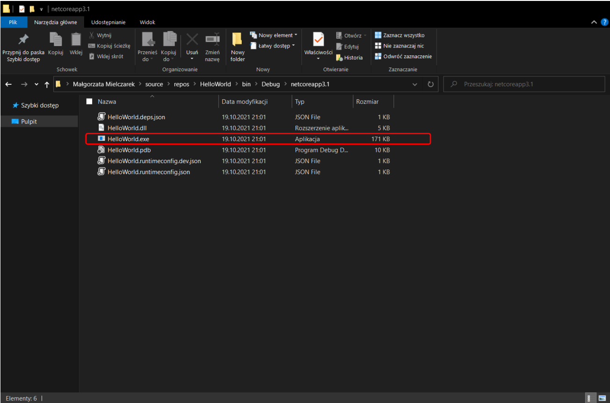
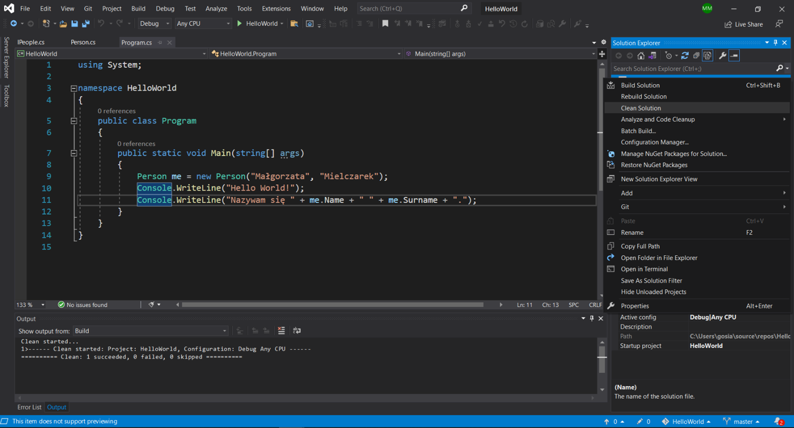
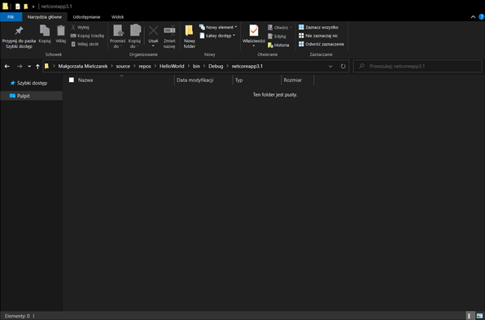
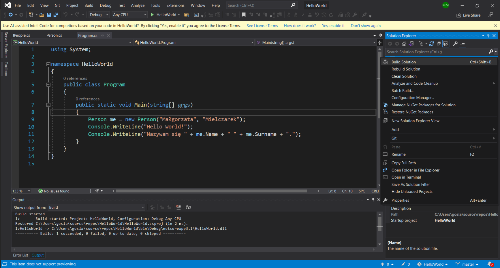
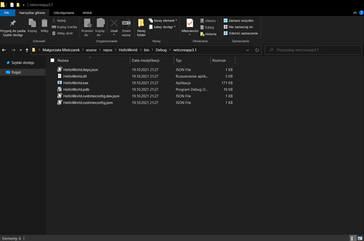
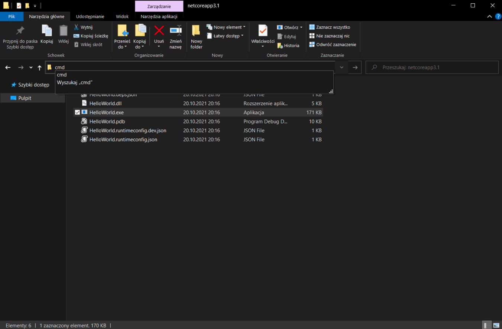
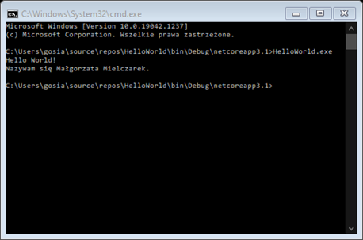
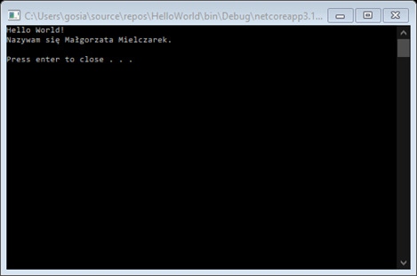

# LEKCJA 10 – Kompilator
Kompilator jest narzędziem służącym do kompilacji naszego kodu.
## Kompilacja
Proces tłumaczenia kodu programu napisanego w języku programowania (np. C#) na tzw. kod pośredni (ang. _Intermediate Code_). W jego wyniku tworzony jest dodatkowy plik możliwy do uruchomienia w danym środowisku. W przypadku platformy .NET i systemu operacyjnego Windows jest to plik .exe (ang. _executive_ – wykonywalny).
Jeżeli uruchomimy program w Visual Studio przy pomocy odpowiedniego przycisku z paska narzędzi w konfiguracji _Debug_, to zostanie uruchomiona kompilacja, nasz projekt zostanie zbudowany i uruchomiony, a w folderze _bin_ > _Debug_ utworzą nam się pliki wynikowe m.in. właśnie plik .exe

<br/>
_Rysunek 1 Pliki utworzone przez kompilator_

Pliki utworzone podczas poprzednich uruchomień programu można łatwo usunąć. W tym celu klikamy prawym przyciskiem myszki na nazwę solucji w _Solution Explorer_, a następnie wybieramy opcję _Clean Solution_. 

<br/>
_Rysunek 2 Czyszczenie solucji_

<br/>
_Rysunek 3 Folder z Rysunku 1. po wyczyszczeniu solucji_

Nasz program możemy również skompilować bez jego uruchamiania. W tym celu ponownie klikamy prawym przyciskiem myszki na nazwę solucji w _Solution Explorer_, a następnie wybieramy opcję _Build Solution_.

<br/>
_Rysunek 4 Kompilowanie solucji_

W ten sposób otrzymamy takie same pliki wynikowe co podczas uruchomienia programu „zieloną strzałką”, jednak bez uruchomienia programu. W tym wypadku polegało by ono na otwarciu konsoli i wyświetleniu w niej napisu:<br/>
Hello World!<br/>
Nazywam się Małgorzata Mielczarek.

<br/>
_Rysunek 5 Folder z Rysunku 1. po zbudowaniu solucji_

### Plik .exe
Plik odpowiadający za uruchomienie utworzonego programu.
### Plik .dll
Plik posiadający wszystkie pozostałe zaimplementowane przez nas klasy. To tu znajduje się cała logika naszej aplikacji.
### Pliki .json
Ponieważ pisaliśmy aplikację na platformie .NET Core dodatkowo utworzone zostały pliki .json zawierające informacje na jakiej platformie możemy uruchomić nasz program (zbudowany).

Program skompilowaliśmy na system operacyjny Windows. Gdybyśmy zrobili to na inny system, powiedzmy Linux, wówczas w wyniku zbudowania solucji otrzymalibyśmy inne pliki wynikowe (tzw. pliki runtime).
## Uruchomienie
Uruchomić możemy również bezpośrednio skompilowany plik .exe. Można to zrobić tradycyjnie poprzez dwukrotne kliknięcie na nazwę pliku w folderze. Takie uruchomienie spowoduje jednak automatyczne zamknięcie konsoli z naszym programem po zakończeniu jego działania. W naszym wypadku zaraz po wyświetleniu napisu:<br/>
Hello World!<br/>
Nazywam się Małgorzata Mielczarek.<br/>
konsola zostanie zamknięta. Efekt będzie więc taki, że okno konsoli tylko mignie nam przed oczami i nie zdążymy przeczytać co zostało w nim wyświetlone. Możemy tego uniknąć na kilka sposobów.
### 1.	Uruchomienie programu z konsoli
Po pierwsze zamiast tradycyjnego sposobu uruchamiania, możemy najpierw otworzyć konsolę Windows (cmd – ang. _Commend Line_), a następnie z jej poziomu uruchomić naszą aplikację. Skoro mamy już otwarty folder zawierający nasz plik .exe to najprościej będzie to zrobić poprzez kliknięcie w pasek adresu eksploratora plików, wpisanie „cmd” i wciśnięcie klawisza _Enter_.

<br/>
_Rysunek 6 Otwieranie konsoli Windows w danej lokalizacji_

Spowoduje to otwarcie konsoli Windows w tej lokalizacji (w naszym folderze _Debug_). Następnie uruchamiamy nasz program poprzez wpisanie nazwy pliku (_HelloWorld.exe_) i wciśnięcie _Enter_. Nie trzeba przy tym ręcznie wpisywać całej nazwy pliku. Można zacząć ją wpisywać a następnie wybrać odpowiedni plik poprzez wciskanie klawisza _Tab_. Można również oczywiście skopiować i wkleić nazwę pliku.

<br/>
_Rysunek 7 Uruchomienie programu w konsoli_

Jak widać na obrazku powyżej program zakończył swoją pracę, ale konsola w tym wypadku nie została zamknięta. Jeżeli jednak chcemy móc otwierać naszą aplikację tradycyjnie, również na to istnieją sposoby.
### 2.	Wstrzymanie pracy programu
Aby móc zobaczyć co zostało wyświetlone w konsoli zanim zostanie ona zamknięta musimy wstrzymać pracę programu po wykonaniu wszystkich pożądanych instrukcji. Najprościej zrobić to poprzez oczekiwanie na wciśnięcie przez użytkownika jakiegoś klawisza. Wówczas program zakończy się (konsola zostanie zamknięta) dopiero gdy użytkownik wciśnie klawisz _Enter_ (lub dowolny klawisz, w zależności od wersji kodu którą zaraz dopiszemy). W tym celu na końcu kodu naszego programu (tuż przed klamrą zamykającą metody _Main_) dopisujemy któryś z poniższych fragmentów kodu:
1. program oczekuje na wpisanie w konsoli przez użytkownika linii tekstu, kończy się więc, gdy wciśniemy _Enter_
``` csharp
Console.WriteLine();
Console.WriteLine("Press enter to close . . ."); 
Console.ReadLine(); 
```
2. program oczekuje na wpisanie przez użytkownika w konsoli jakiegoś tekstu i podobnie jak w poprzednim przypadku kończy swoją pracę po wciśnięciu _Enter_
``` csharp
Console.WriteLine();
Console.WriteLine("Press enter to close . . .");
Console.Read();
```
3. program oczekuje na wciśnięcie przez użytkownika jednego dowolnego klawisza (również może być to _Enter_) po czym kończy swoją pracę
``` csharp
Console.WriteLine();
Console.WriteLine("Press any key to close . . .");
Console.ReadKey();
```
Dodatkowo możemy wybrany z powyższych fragmentów kodu obudować dyrektywą preprocesora `#if DEBUG`, dzięki czemu takie wstrzymanie będzie miało miejsce tylko w przypadku zbudowania aplikacji w wersji do debugowania, ale nie wystąpi w ostatecznej wersji aplikacji (budowania solucji w wersji _Release_). Np.:
``` csharp
#if DEBUG
 Console.WriteLine();
 Console.WriteLine("Press enter to close . . .");
 Console.ReadLine();
#endif
```
Jeszcze dodatkowo możemy chcieć dodać instrukcję `try{}`, aby pozostawić okno konsoli otwarte nawet jeśli wystąpi jakiś niespodziewany (niewyłapywany przez nasz program) błąd. Wówczas nasz kod dopisujemy poniżej niej wewnątrz instrukcji `finally{}`. Np.:
 ``` csharp
 #if DEBUG
 try
 {
 // to keep window open if uncaught exception was thrown
 }
 finally
 {
 Console.WriteLine();
 Console.WriteLine("Press enter to close . . .");
 Console.ReadLine();
 }
#endif
```
Po dopisaniu na końcu kodu naszego programu wybranego fragmentu kodu po dwukrotnym kliknięciu na nazwę pliku (_HelloWorld.exe_) otworzy nam się konsola w której zostanie wyświetlone np.:

<br/>
_Rysunek 8 Przykładowa konsola programu po dopisaniu kodu wstrzymującego jego pracę_

W powyższym przykładzie program będzie działał, a co za tym idzie konsola będzie otwarta, tak długo dopóki użytkownik nie wciśnie klawisza _Enter_ lub nie zamknie konsoli.
## Kod pośredni (ang. _Intermediate Code_)
Kod programu zapisany w pliku .exe. Powstał po przetłumaczeniu kodu napisanego w języku programowania (np. C#) przez kompilator. Kod ten nie jest jeszcze zrozumiały przez procesor naszego komputera, dlatego właśnie nazywamy go pośrednim.
## CLR (ang. _Common Language Runtime_ – Środowisko Uruchomieniowe Wspólnego Języka)
Jest to środowisko uruchomieniowe dla naszych aplikacji. W przypadku .NET Core jest to CLR Core. Działa on na różnych platformach. W pewnym zakresie różni się w zależności od nich. Te zmiany są związane z dostosowaniem pod konkretny system operacyjny i konfigurację komputera. Jednym z głównych jego mechanizmów jest JIT.
### JIT (ang. _just-in-time compiler_ – kompilator _just-in-time_)
Kompilator tłumaczący dynamicznie (na bieżąco, podczas działania programu) kod pośredni na kod maszynowy (kod najniższego poziomu, zrozumiały dla procesora). Jest on automatycznie uruchamiany wraz z plikiem .exe. Umożliwia on dostosowanie aplikacji do konkretnego komputera, na którym jest uruchamiana.<br/>
JIT tłumaczy kod z pliku .exe, nie z pisanego przez nas kodu. Oznacza to, że w uruchomionym programie nie zobaczymy wprowadzanych przez nas zmian w kodzie projektu dopóki nie zostanie on ponownie skompilowany (do pliku .exe) i uruchomiony.
## Języki kompilowane, a języki skryptowe
### Języki skryptowe
Programy napisane w językach skryptowych uruchamia się bezpośrednio w interpreterze (serwerze aplikacji). Oznacza to, że napisany przez nas kod jest bezpośrednio uruchamiany. Aby program działał nie wykonuje się więc żadnych dodatkowych czynności. Oznacza to również, że wprowadzane przez nas zmiany w kodzie programu są od razu widoczne w jego działaniu.
### Języki kompilowane
Język C# należy do języków kompilowanych. Oznacza to, że w odróżnieniu od języków skryptowych, aby napisany przez nas kod działał trzeba go najpierw skompilować do języka pośredniego. Dopiero plik napisany w języku pośrednim nadaje się do uruchomienia. Oznacza to, że wprowadzanych przez nas zmian w kodzie nie widzimy w skompilowanym wcześniej pliku, czyli również w działaniu programu. Choć może się to wydawać pewną niedogodnością, jednak taki sposób działania ma swoje zalety.
1.	Skompilowany kod jest trudniej wykraść/podrobić.
Kiedy oddajemy aplikację do użytku nasza praca jest więc lepiej zabezpieczona.
2.	Aplikacja napisana w języku kompilowanym jest lepiej zoptymalizowana pod kontem uruchomienia na danej platformie.
Podczas kompilacji naszego kodu do kodu pośredniego, jest on dostosowywany do konkretnego systemu operacyjnego. Następnie jest on przystosowywany do danego komputera przez JIT. Oznacza to, że takie aplikacje są o wiele wydajniejsze, lepiej wykorzystują dostępne zasoby. Minusem jest jednak konieczność osobnej kompilacji kodu na różne systemy operacyjne.
