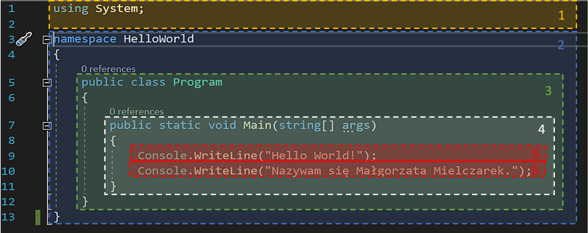

# LEKCJA 7 – Twój pierwszy program
W tej lekcji piszemy pierwszy program w języku C#. Zgodnie z programistyczną tradycją będzie to Hello World. Stworzymy konsolową aplikację desktopową w technologii ASP.NET Core.
 
Rysunek 1 Kod programu HelloWorld

## 1. Ogólna budowa programu:
### 1. Sekcja „using”
Część programu w której po słowie kluczowym _using_ umieszcza się nazwę biblioteki z których korzysta się w programie i kończy linię średnikiem. Jeżeli korzystamy z kilku bibliotek umieszczamy kilka takich linijek
```
using nazwa_biblioteki;
```
Biblioteka – paczka kodu zawierająca funkcje, stałe i klasy służące do określonego celu.
### 2. Namespace – z ang. przestrzeń nazw
Miejsce skupiające podobne klasy (o podobnych funkcjonalnościach lub roli w programie). Służy głównie do uporządkowania nazw typów, klas, funkcji itd., aby zmniejszyć ryzyko  kolizji nazw. Tworzy się ją podając kolejno słowo kluczowe _namespace_ i nazwę, którą chcemy mu nadać. Wnętrze przestrzeni nazw (klasy które zawiera) są ujęte w nawiasie klamrowym. Nawias klamrowy w języku C# oznacza zakres danego elementu, w tym wypadku przestrzeni nazw.
```
namespace Nazwa _rzestrzeni_nazw
{
    //klasy w niej zawarte
}
```
### 3. Klasa
Częściowa lub całkowita definicja dla obiektu. Opisuje domyślny początkowy stan obiektów, oraz ich zachowanie itp. Jest to zbiór atrybutów i metod opisujący jakiś obiekt (zbiór obiektów). Klasę tworzy się podając kolejno modyfikator dostępu określający poziom dostępu klasy, słowo kluczowe _class_ i nazwę klasy. Wnętrze klasy, wszystkie atrybuty i metody ją tworzące, są ujęte wewnątrz nawiasu klamrowego (ciało klasy jest ograniczone nawiasem klamrowym).
```
modyfikator_dostępu class Nazwa_klasy
{
    //atrybuty i/lub jej metody
}
```
W języku C# występują 4 modyfikatory dostępu:
        * _public_ (z ang. publiczny),
        * _protected_ (z ang. chroniony),
        * _internal_ (z ang. wewnętrzny),
        * _private_ (z ang. prywatny).
Przy ich pomocy można określić 6 poziomów dostępu:
        * _public_ – określa, że klasa jest ogólnie dostępna, ze wszystkich części programu (dostęp nie jest ograniczony);
        * _protected_ – określa, że dostęp jest ograniczony do zawierającej klasy lub typów pochodzących od klasy zawierającej;
        * _internal_ – określa, że dostęp jest ograniczony do bieżącego zestawu (ang. assembly).
Zestaw (ang. _assembly_) – zbiór typów i źródeł działających razem i tworzących logiczną jednostkę funkcjonalną. Tworzy ona plik .exe lub  .dll;
        * _protected internal_ – określa, że dostęp jest ograniczony do bieżącego zestawu lub typów pochodzących od klasy zawierającej;
        * _private_ – określa, że dostęp jest ograniczony do typu zawierającego;
        * _private protected_ – określa, że dostęp jest ograniczony do zawierającej klasy lub typów pochodzących od klasy zawierającej w bieżącym zestawie.
### 4. Metoda
Funkcja będąca częścią klasy. Zawiera logikę konkretnej czynności wykonywany przez obiekt danego typu. Tworzy się ją podając kolejno modyfikatory dostępu, następnie jeżeli chcemy aby klasa była statyczna wpisujemy słowo kluczowe _static_, po czym obowiązkowo musimy podać typ zmiennej zwracanej przez metodę, nazwę tworzonej metody i w nawiasie okrągłym parametry funkcji (dane przyjmowane przez metodę). Parametry określamy podając kolejno typ i nazwę każdego z nich. Jeżeli metoda przyjmuje więcej niż jeden parametr to oddzielamy je od siebie przecinkami. Wnętrze (ciało) metody jest ujęte w nawiasach klamrowych.
```
modyfikatory_dostępu opcjonalnie_inne_modyfikatory typ_danych_zwracanych_przez_metodę nazwa_metody(/*opcjonalnie*/ typ_parametru_1 nazwa_parametru_1, typ_parametru_2 nazwa_parametru_2 ...)
{
    //logika metody
}
```
Metoda statyczna – metoda tworzona na etapie kompilacji programu. W programie istnieje tylko jedna instancja tej metody (nie ma oddzielnej kopii dla każdego obiektu klasy). W praktyce oznacza to m.in., że można ją wykonywać przed utworzeniem obiektu klasy do której ta metoda należy.
Metoda _Main_ (z ang. główna) – metoda odpowiedzialna za kontrolę wykonywania pracy programu. Każda wykonywalna aplikacja (np. aplikacja konsolowa) musi ją zawierać. Tu program rozpoczyna i kończy swoją  pracę. Jest punktem wejściowym w pliku .exe programu. Aplikacja może mieć tylko jeden punkt wejściowy. Jeżeli więc w kodzie programu mamy kilka metod _Main_ na etapie kompilacji musimy podać która z nich będzie tym punktem (metody te muszą jednak należeć do różnych klas). Najlepiej jednak, aby aplikacja posiadała tylko jedną metodę _Main_. Musi ona być statyczna. Deklaruje się ją wewnątrz klasy lub struktury. Metoda _Main_ może, lecz nie musi zwracać dane w postaci liczb całkowitych (mieszczących się w pewnym zakresie). Jeżeli nie chcemy aby metoda cokolwiek zwracała, przypisujemy jej typ _void_ (z ang. pusty). Natomiast gdy chcemy uzyskać dane (najczęściej dotyczące poprawności wykonania programu – kody błędów) na zakończenie działania programu, przypisujemy jej typ _int_ (ang. integer – liczba całkowita). Metoda _Main_ może nie przyjmować żadnych parametrów. Wówczas po nazwie wstawiamy pusty nawias okrągły. Może również pobierać argumenty z wywołania programu w wierszu poleceń. Dane te są pobierane w postaci tablicy ciągu znaków alfanumerycznych. Wówczas wewnątrz nawiasu okrągłego wpisujemy _string[] args_.
### 5. Polecenia
Czynności wykonywane kolejno przez program. Każde polecenie zakończone jest średnikiem. Takim poleceniem może np. być wywołanie funkcji bibliotecznej. Wówczas podajemy nazwę metody której chcemy użyć, wraz z całą ścieżką dostępu. Następnie znajduje się nawias okrągły, a po nim średnik kończący polecenie. Jeżeli wywołana przez nas metoda przyjmuje jakieś parametry, dane określonego typu (same dane bez typu) podajemy wewnątrz, znajdującego się po nazwie, nawiasu okrągłego. Jeżeli funkcja ma kilka parametrów to dane które chcemy przypisać do kolejnych parametrów oddzielamy od siebie przecinkami.
Przez ścieżkę dostępu rozumie się nazwy klas w których zawarta jest metoda oddzielonych od siebie kropkami. Klasy podaje się od najbardziej zewnętrznej do wewnętrznej, do której bezpośrednio należy wywoływana funkcja. Następnie wstawia się kropkę i nazwę żądanej metody.

## 2. Elementy użyte w programie
### 1. Biblioteka System – biblioteka systemowa
Jedna z podstawowych i najczęściej używanych bibliotek C#. Zawiera podstawowe klasy, definiuje podstawowe typy danych itd.
### 2. Przestrzeń nazw _HelloWorld_
Utworzona przez nas przestrzeń nazw zawierającą cały kod naszego programu.
### 3. Klasa _Program_
Jedyna utworzona przez nas klasa zawierająca całą logikę naszego programu. Należy do przestrzeni nazw _HelloWorld_. Jest to klasa publiczna, co oznacza, że dostęp do niej można uzyskać z dowolnego miejsca programu.
### 4. Metoda _Main_
Stworzona przez nas publiczna, statyczna metoda klasy _Program_. Nasza metoda nie zwraca żadnych wartości (jest typu _void_). Przyjmuje natomiast dane w postaci tablicy ciągu znaków (_string[]_) i zapisuje do parametru _args_.
### 5. Metoda _WriteLine_
Metoda klasy _Console_ wyświetlająca w konsoli podaną linijkę tekstu (wypisywanie tekstu jest zakończone przejściem do nowej linii). Metoda przyjmuje jako argument ciąg znaków alfanumerycznych łącznie ze znakami białymi (spacje itp.) – typ _string_. Tekst który chcemy wyświetlić w konsoli umieszczamy wewnątrz nawiasu okrągłego wywołania metody, w cudzysłowie. Pierwsze z wywołań spowoduje pojawienie się w konsoli linijki tekstu – _Hello World!_. Drugie natomiast linijki – _Nazywam się Małgorzata Mielczarek._.

