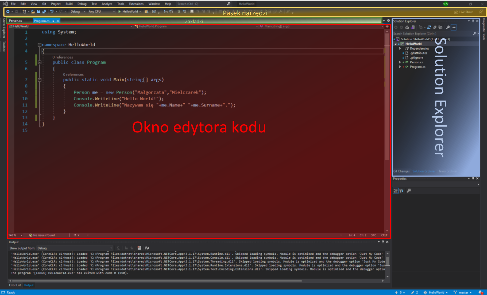
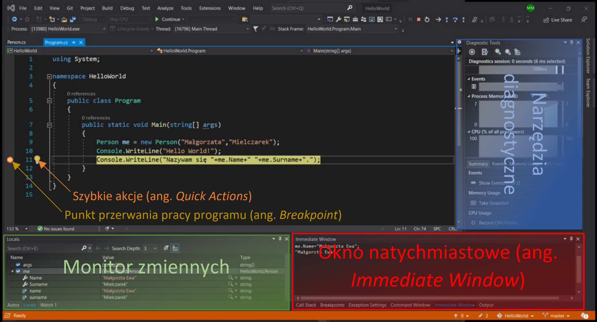

# LEKCJA 8 – Jak pracować z Visual Studio
Na potrzeby tej lekcji wykorzystamy zmodyfikowany program z lekcji poprzedniej - [HelloWorld](https://github.com/malgorzataMielczarek/HelloWorld/tree/fb82e35c1d13ff597543adc0384cb5bfe5577c85). W tej lekcji poznajemy podstawowy układ IDE w którym będziemy pracować – *Visual Studio*.
#### IDE (ang. _integrated development environment_ – zintegrowane środowisko programistyczne)
>Program lub zespół programów służących do tworzenia, modyfikowania, testowania i konserwacji oprogramowania. Programy będące zintegrowanymi środowiskami programistycznymi charakteryzują się tym, że udostępniają złożoną, wieloraką funkcjonalność obejmującą edycję kodu źródłowego, kompilowanie kodu źródłowego, tworzenie zasobów programu (tzn. formatek/ekranów/okien dialogowych, menu, raportów, elementów graficznych jak ikony, obrazy), tworzenie baz danych, komponentów i innych.
>  _Źródło: [Wikipedia](https://pl.wikipedia.org/wiki/Zintegrowane_środowisko_programistyczne)_

## Podstawowe okno programu Visual Studio

### :red_circle: Okno edytora kodu
Obszar IDE w którym wyświetlany jest cały kod klasy/pliku który przeglądamy.
### :green_circle: Zakładki
Wszystkie otwarte w programie pliki. 
Przełączanie zakładek umożliwia szybkie przeskakiwanie między klasami. Gwiazdka na końcu nazwy pliku oznacza, że są w nim niezapisane zmiany. Aktualnie otwarta karta (zakładka oznaczająca plik którego treść jest aktualnie widoczna w oknie edytora kodu) jest podświetlona.
### :large_blue_circle: _Solution Explorer_
Z ang. eksplorator rozwiązań. Zawiera drzewo rozwiązania (solucji) – wszystkie składające się na nie projekty, foldery, biblioteki, pliki, klasy itd..
#### Solucja (ang. _solution_ – rozwiązanie)
Jest to zbiór powiązanych ze sobą projektów, związanych z jedną aplikacją. 
Głównym jej zadaniem jest grupowanie oraz ułatwienie zarządzania powiązanych ze sobą projektów. Solucja może być pusta (nie zawiera żadnego projektu - kodu), lub składać się z przynajmniej jednego projektu. Jeżeli jest ich kilka jest to najczęściej projekt tworzonego programu oraz pisane do niego biblioteki. Projekty mogą być pisane w różnych językach programowania. Jeden z projektów musi być projektem startowym. Jest on wyróżniony poprzez pogrubienie nazwy w drzewie solucji pokazanym w oknie eksploratora rozwiązań (ang. _Solution Explorer_).
#### Projekt (ang. _project_)
Jest kontenerem zawierającym i porządkującym pliki z kodami źródłowymi aplikacji. Pozwala również na zarządzanie jej bibliotekami i pewnymi właściwościami takimi jak debugowanie, kompilacja, architektura, docelowa wersja platformy itd..
#### Projekt startowy
Jest to pierwszy projekt budowany w danej solucji. Musi być to projekt wykonywalny (np. _Consol Application_ – aplikacja konsolowa). Nie może nim być np. biblioteka (ang. _library_). Z pozostałych projektów można skorzystać tylko poprzez podpięcie ich do projektu startowego.

Rozwiązanie przedstawione na obrazku powyżej zawiera tylko jeden projekt (_HelloWorld_), będący projektem startowym. Nowe projekty można dodać do solucji poprzez kliknięcie jej nazwy, w oknie eksploratora rozwiązań, prawym przyciskiem myszki, a następnie wybranie **Add** -> **New Project...** Projekt startowy można natomiast zmienić klikając w Solution Explorerze nazwę projektu, który chcemy ustawić jako projekt startowy, prawym przyciskiem myszki, a następnie wybierając **Set as Startup Project**. W eksploratorze rozwiązań można również dodawać do projektu nowe pliki, klasy, foldery itd. (prawy przycisk myszki na nazwę projektu, następnie **Add** -> **New Item...**/**Class...**/**New Folder**/itd.). Podobnie można tu również zmieniać nazwy plików/projektów (**Rename**), usuwać je z solucji (**Remove**/**Delete**) i wiele, wiele innych.
### :yellow_circle: Pasek narzędzi 
Pasek w górnej części okna programu, zawierający ikonki z podstawowymi funkcjami. 
Jego prawa część składa się z typowych funkcjonalności programu, takich jak: przyciski nawigacji, nowy projekt, otwórz plik, zapisz plik wyświetlany aktualnie w oknie edytora kodu, zapisz wszystkie pliki, cofnij zmiany, wprowadź ponownie cofnięte zmiany itd.. Następnie znajdują się pola związane z uruchamianiem pisanej aplikacji. Możemy wybrać konfigurację w jakiej ma być uruchomiona solucja, platformy na których ma działać i uruchomić program (pole z zieloną strzałką "play"). Na końcu mamy inne przydatne funkcjonalności. Wyświetlany pasek może w rzeczywistości składać się z wielu pasków narzędzi. W standardowym układzie są to trzy paski: standardowych opcji, związany z edycją tekstu oraz z funkcjonalnościami dotyczącymi kontroli źródła. Paski narzędzi można dostosować do swoich potrzeb wybierając te, z pośród wielu dostępnych pasków i funkcjonalności programu, z których korzystamy najczęściej. Po lewej stronie paska znajdują się jeszcze dwa przyciski: do współpracy z innymi programistami w czasie rzeczywistym (_Visual Studio Live Share_) oraz do komunikacji z wytwórcą IDE.
## Okno programu Visual Studio podczas działania aplikacji

### :large_blue_circle: Narzędzia diagnostyczne
Wyświetlają się tylko podczas pracy pisanej aplikacji. Umożliwia monitorowanie ilości zasobów używanych przez nasz program (ilość zajmowanej przez proces pamięci – _Process Memory_) oraz obciążenie procesorów (_CPU_).
### :green_circle: Monitor zmiennych
Lista wszystkich aktualnie istniejących zmiennych, wraz z ich aktualnymi wartościami i typami. 
Na dole tego okna widzimy trzy zakładki:
* _Autos_ – pokazuje tylko zmienne używane w pobliżu aktualnie wykonywanej instrukcji,
* _Locals_ – lista wszystkich zmiennych lokalnych,
* _Watch 1_ – śledzi wybrane przez użytkownika zmienne.
### :red_circle: Okno natychmiastowe (ang. _Immediate Window_)
Służy do wprowadzania poleceń wykonywanych w locie na działającej aplikacji. Mają one skutek tylko w tym konkretnym uruchomieniu, nie wprowadzając zmian w kodzie programu. Skutek działania wprowadzonych komend jest natychmiastowy. Służy głównie do sprawdzenia czy dane polecenie da oczekiwany rezultat. Na dole okna znajdują się zakładki z innymi narzędziami.
### :orange_circle: Szybkie akcje (ang. _Quick Actions_)
Narzędzie proponujące zmiany w kodzie i wprowadzające je za zgodą programisty. Umożliwia ono np. poprawienie formatowania, utworzenie konstruktora klasy, obwarowanie pól klasy metodami _get_/_set_ itd. Ikona jest widoczna zarówno podczas pisania kodu, jak i w czasie pracy programu. Umożliwia ona dostęp do swoich funkcji w obu przypadkach. Wprowadzone w kodzie zmiany zostaną jednak zastosowane dopiero przy następnym uruchomieniu programu.
### :yellow_circle: Punkt przerwania pracy programu (ang. _Breakpoint_)
Zaznaczone przez programistę miejsce w kodzie, w którym wykonywanie programu będzie przerwane podczas debugowania. Breakpointy wstawia się poprzez kliknięcie lewym przyciskiem myszki na szary pasek po lewej stronie okna edytora kodu na wysokości linii przed którą chcemy zatrzymać program. Punkty przerwania pracy programu są widoczne zarówno podczas edycji kodu, jak i podczas działania aplikacji. W obu przypadkach można również wstawiać nowe punkty. Działający program zatrzyma się we wprowadzanych na bieżąco punktach o ile występują one w miejscach gdzie jeszcze się nie wykonał.
