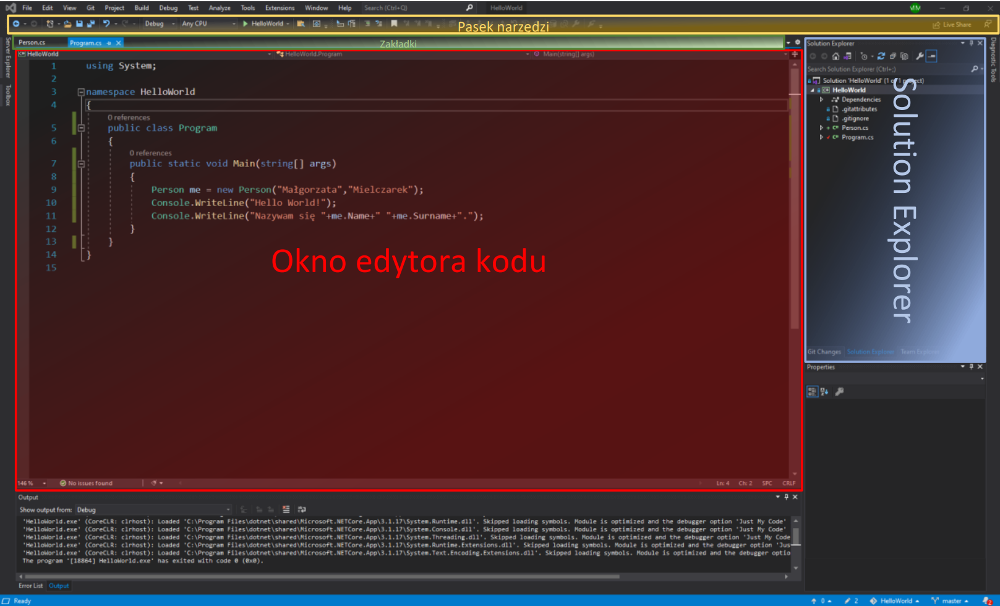
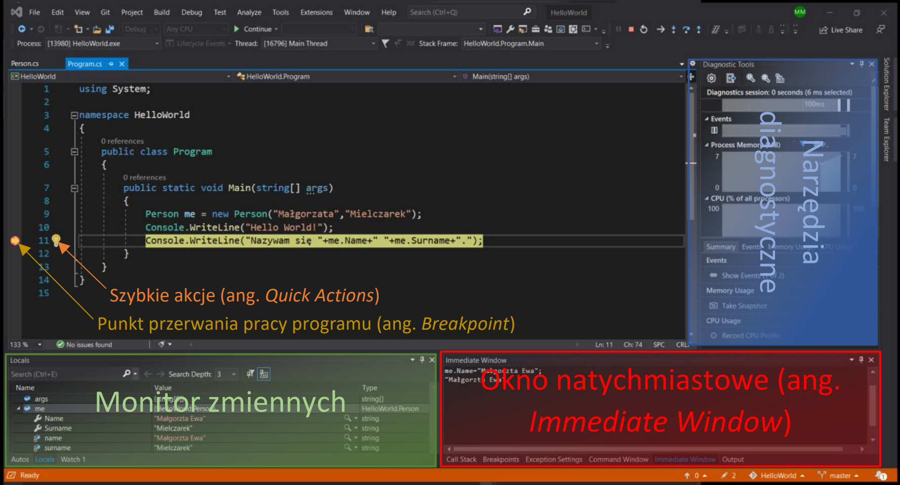
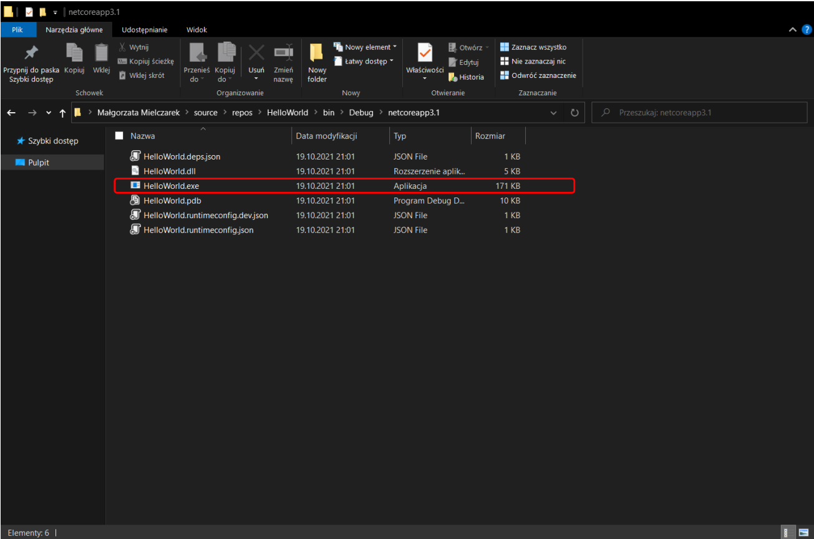
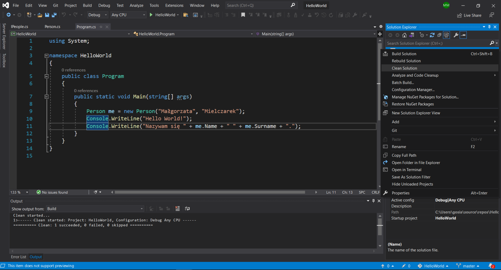
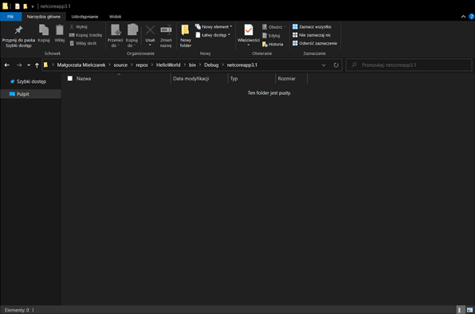
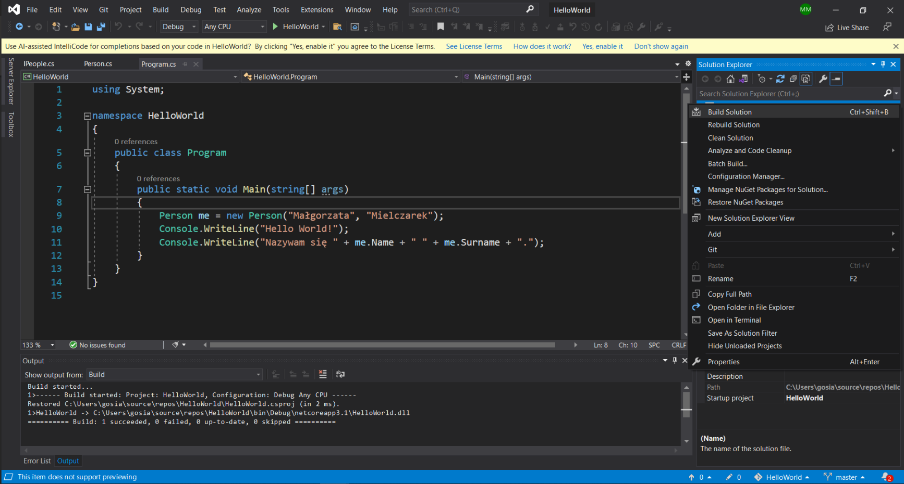
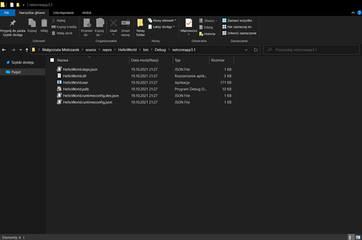
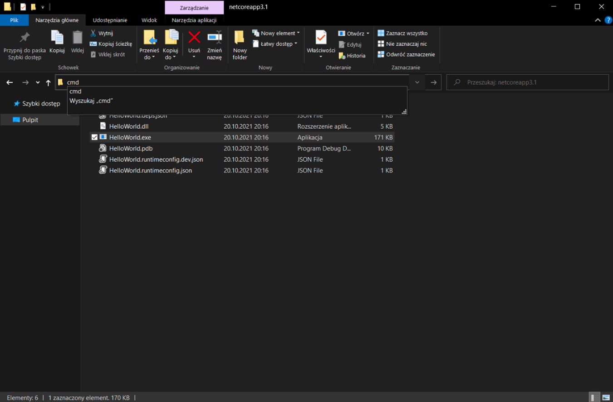
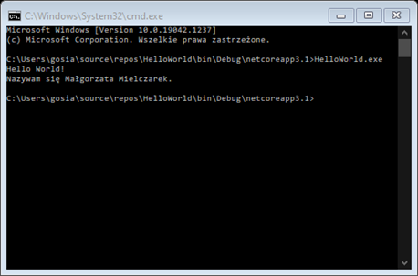
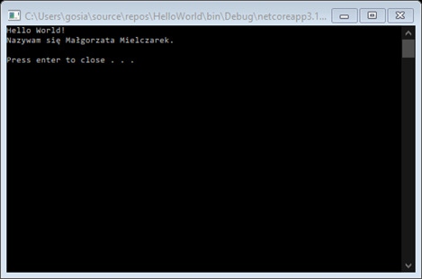

# TYDZIEŃ 1 – PLAN GRY
## Spis treści
### [BONUS 1 – Tworzenie Repozytorium GitHub](#bonus-1--tworzenie-repozytorium-github-1)
### [BONUS 2 – Podstawy pracy z GITem](#bonus-2--podstawy-pracy-z-gitem-1)
### [LEKCJA 1 – Powitanie](#lekcja-1--powitanie-1)
### [LEKCJA 2 – Plan gry](#lekcja-2--plan-gry-1)
### [LEKCJA 3 – Jak studiować ten kurs](#lekcja-3--jak-studiować-ten-kurs-1)
### [LEKCJA 4 – Co musisz umieć zanim przejdziesz dalej](#lekcja-4--co-musisz-umieć-zanim-przejdziesz-dalej-1)
### [LEKCJA 5 – Czym jest .NET](#lekcja-5--czym-jest-net-1)
### [LEKCJA 6 – Wymagania (potrzebne oprogramowanie)](#lekcja-6--wymagania-potrzebne-oprogramowanie-1)
### [LEKCJA 7 – Twój pierwszy program](#lekcja-7--twój-pierwszy-program-1)
### [LEKCJA 8 – Jak pracować z Visual Studio](#lekcja-8--jak-pracować-z-visual-studio-1)
### [LEKCJA 9 – Konwencje pisania (Dobre praktyki programowania)](#lekcja-9--konwencje-pisania-dobre-praktyki-programowania-1)
### [LEKCJA 10 – Kompilator](#lekcja-10--kompilator-1)
### [LEKCJA 11 – Debugowanie](#lekcja-11--debugowanie-1)
### [LEKCJA 12 – Błędy początkujących](#lekcja-12--błędy-początkujących-1)
### [LEKCJA 13 – Praca domowa](#lekcja-13--praca-domowa-1)

## [BONUS 1 – Tworzenie Repozytorium GitHub](https://kurs.szkoladotneta.pl/zostan-programista-asp-net/tydzien-1-plan-gry/bonus-1-tworzenie-repozytorium-github/)
Pracę z GitHubem rozpoczynamy od założenia konta na stronie [github.com](https://github.com/) poprzez kliknięcie przycisku ___Sign up___. Następnie wypełniamy formularz postępując zgodnie z instrukcjami pojawiającymi się na ekranie. Po założeniu konta możemy utworzyć nasze pierwsze repozytorium.

__Repozytorium__ - czyli po prostu nasz projekt, a dokładniej zapis składających się na niego plików, wraz z nanoszonymi na nie zmianami. Można powiedzieć, że jest to historia powstawania naszego projektu.

Tworząc projekty w Visual Studio najłatwiej zarządzać repozytoriami poprzez zintegrowanie naszego konta na GitHubie z naszym IDE.
1. Kiedy utworzyliśmy już nasz projekt, wybieramy w Visual Studio zakładkę _Git Changes_ i klikamy przycisk _Create Git Repository..._. Jeżeli nie widzimy zakładki, możemy ją wyszukać w belce _Search (Ctrl+Q)_, wpisując jej nazwę. Po kliknięciu przycisku _Create Git Repository..._ otworzy nam się okno.
2. W _Push to a new remote_ powinniśmy mieć wybraną opcję _GitHub_. Następnie Sprawdzamy i uzupełniamy dane. Używając GitHuba zawsze będziemy tworzyć dwa repozytoria. Pierwsze lokalne powstanie na dysku naszego komputera. Będziemy w nim zapisywać kolejne wprowadzane przez nas zmiany. Drugie będzie repozytorium zdalnym i będzie się znajdywać na serwerach witryny GitHub. Po zapisaniu jakichś zmian w repozytorium lokalnym będziemy je następnie wysyłać do repozytorium zdalnego (_Push_).
3. Pierwsza sekcja (_Initialize a local Git repository_) odpowiada za utworzenie repozytorium lokalnego.
    * W _Local path_ powinniśmy mieć ścieżkę do głównego katalogu naszego projektu.
    * Opcja _.gitignore template_ odpowiada za utworzenie pliku _.gitignore_ na podstawie predefiniowanego schematu. Tworząc projekty w Visual Studio powinniśmy wybrać opcję _Default (Visual Studio)_ lub _Visual Studio_. Plik _.gitignore_ zawiera listę plików, typów plików, folderów itp. wchodzących w skład naszego projektu, których jednak nie chcemy zapisywać w naszym repozytorium. Będą to np. pliki powstałe po kompilacji, które będą zmieniać się przy każdej zmianie w kodzie, więc ich zapisywanie mija się z celem, a zwiększa tylko objętość naszego repozytorium.
    * Następnie mamy pole _License template_ gdzie możemy wybrać szablon licencji, np. jeżeli tworzymy projekt komercyjny typu open-source, czyli z wolnym dostępem do naszego kodu. Licencja określa wówczas na jakich zasadach można korzystać z naszego kodu.
    * Poniżej mamy możliwość wybrania opcji _Add a README.md_. Jej zaznaczenie spowoduje automatyczne dodanie pliku _README.md_ do naszego projektu, co jest dobrą praktyką. W pliku tym umieszczamy szczegółowy opis naszego projektu. Opisujemy do czego służy nasz program, w jakich technologiach został utworzony, jak go używać. Możemy załączać do niego screeny naszego programu, fragmenty kodu z przykładami użycia jakichś funkcji itd.
4. Następnie mamy sekcję _Create a new GitHub repository_. To tutaj tworzymy repozytorium zdalne i łączymy nasze lokalne repozytorium Git z tym utworzonym na naszym koncie GitHub.
    * Na początku musimy więc wybrać nasze konto w polu _Account_. Jeżeli jeszcze nie przyłączyliśmy naszego konta logujemy się wybierając opcję _Add an account: GitHub_. Otworzy się nam strona na której wpisujemy nasz login i hasło, i klikamy _Sign in_.
    * Kiedy nasze konto zostanie połączone w polu poniżej (_Owner_) pojawi się nazwa użytkownika naszego konta. Będzie ona używana jako nasz identyfikator określający, że to właśnie my wprowadziliśmy daną zmianę w projekcie. Kiedy będziemy tworzyć projekty w zespołach umożliwi to stwierdzenie kto wprowadziła jaką zmianę w kodzie. 
    * Następnie w polu _Repository name_ wpisujemy nazwę jaką chcemy aby miało nasze zdalne repozytorium. Domyślnie zostaje tam wstawiona nazwa projektu, możemy ją jednak zmienić, chociaż raczej nie jest to zalecane.
    * Poniżej możemy umieścić krótki opis naszego projektu. Na stronie będzie on wyświetlany przy nazwie tego repozytorium i ułatwi potem identyfikację projektów.
    * Na końcu możemy wybrać opcję _Private repository_. Jej zaznaczenie spowoduje, że nasze zdalne repozytorium będzie prywatne, czyli widoczne i dostępne tylko dla nas i użytkowników z którymi je współtworzymy. Inni użytkownicy nie będą mogli go znaleźć. Odznaczenie tej opcji spowoduje utworzenie repozytorium publicznego, czyli takiego do którego dostęp mają wszyscy.
5. Po wypełnieniu wszystkich pól klikamy przycisk _Create and Push_. Spowoduje to utworzenie repozytorium lokalnego i zdalnego, i zapisanie w nich plików naszego projektu, w takim stanie, w jakim są obecnie.

## [BONUS 2 – Podstawy pracy z GITem](https://kurs.szkoladotneta.pl/zostan-programista-asp-net/tydzien-1-plan-gry/bonus-2-podstawy-pracy-z-gitem/)
W Visual Studio możemy nie tylko tworzyć repozytoria, ale również na bieżąco nimi zarządzać. Jeśli nasz projekt jest połączony z repozytorium możemy śledzić jakie zmiany wprowadziliśmy od czasu jego ostatniego zapisania w repozytorium.

 W używanej ostatnio zakładce _Git Changes_ będziemy mieli wypisane wszystkie zmienione pliki. Będą one miały odpowiednie statusy. Status można sprawdzić najeżdżając myszką na nazwę pliku lub patrząc na oznaczenie literowe znajdujące się na końcu linii.
 <ul>
 A - od ang. <i>added</i>, oznacza nowo dodany plik, czyli plik który nie istniał jeszcze podczas ostatniego zapisywania projektu w repozytorium.
 <br/>M - od ang. <i>modified</i>, oznacza zmieniony plik, czyli taki, który istnieje już w repozytorium, jednak od ostatniego zapisu zostały w nim wprowadzone zmiany.
 <br/>D - od ang. <i>deleted</i>, oznacza plik który istnieje obecnie w repozytorium, ale został usunięty od czasu ostatniego zapisu.
 </ul>

Jeżeli np. zmienimy nazwę jakiegoś pliku to w _Git Changes_ pojawią nam się dwa pliki: ze starą nazwą, oznaczony jako **D** i z nową nazwą, oznaczony **A**.

 W _Solution Explorer_ przed nazwami plików widzimy teraz dodatkowe ikonki.
<ul>
 oznacza, że plik jest zapisany w repozytorium i nie został zmieniony od czasów ostatniego zapisu.
<br/> oznacza, że plik istnieje już w repozytorium, ale został zmieniony od czasu ostatniego zapisu.
<br/> oznacza, że jest to nowy plik, który został utworzony po ostatnim zapisie projektu w repozytorium.
<br/> oznacza, że dany plik jest ignorowany przy zapisie projektu w repozytorium (znajduje się w pliku <i>.gitignore</i>).
</ul>

Aby zapisać zmiany w repozytorium musimy wykonać kolejno dwie czynności:
1. _Commit_ - jest to zapisanie zmian w projekcie do repozytorium lokalnego. Tworząc nowy commit możemy wybrać zmiany w jakich plikach chcemy w nim uwzględnić lub zapisać zmiany we wszystkich zmienionych plikach. Musimy również zawrzeć krótki opis wprowadzonych zmian w polu _Enter a message \<Required\>_.
2. _Push_ - jest to zapisanie zmian w repozytorium lokalnym do repozytorium zdalnego. Push zapisuje w repozytorium zdalnym wszystkie nowe (niezapisane jeszcze) commity z repozytorium lokalnego razem z ich opisami.

Możemy to zrobić przyciskając _Commit All_. Przycisk ten ma trzy opcje wykonania commita do wyboru:
* _Commit All_ - zapisuje wszystkie zmiany w śledzonych plikach projektu w repozytorium lokalnym.
* _Commit All and Push_ - zapisuje zmiany w śledzonych plikach projektu w repozytorium lokalnym, a następnie automatycznie przesyła utworzony commit do repozytorium zdalnego. Na początku tej opcji będziemy zapewne używać najczęściej.
* _Commit All and Sync_ - zapisuje wszystkie zmiany w śledzonych plikach projektu w repozytorium lokalnym i pobiera wszystkie niezapisane lokalnie zmiany z repozytorium zdalnego. Opcja ta jest przydatna szczególnie gdy pracujemy nad projektem zespołowo i chcemy sprawdzić czy ktoś nie wprowadził w między czasie żadnych zmian w projekcie. Możemy wówczas sprawdzić, czy w połączonym kodzie niema kolizji i ewentualnie naprawić je, zanim wyślemy zmiany do wspólnego repozytorium zdalnego.

Jeżeli chcemy na razie zapisać w repozytorium tylko część zmienionych plików, wówczas możemy kliknąć znak plusa znajdujący się po prawej stronie wybranych przez nas plików z listy w zakładce _Git Changes_. Spowoduje to dodanie ich do tzw. _Staged Changes_, czyli listy plików których zmiany chcemy zapisać w najbliższym commit'cie. Jeżeli wybierzemy w ten sposób jakieś pliki, wówczas we wszystkich opisanych powyżej opcjach _Commit All_ zostanie zastąpione przez _Commit Staged_ i w efekcie wykonywanego commitu zostaną zapisane tylko wybrane przez nas pliki.

Jeżeli wykonaliśmy sam commit, bez pusha, to w efekcie otrzymamy coś takiego:


Możemy teraz zrobić push klikając widoczną na rysunku powyżej ikonkę ze strzałką w górę. Oczywiście możemy od razu zapisać na repozytorium zdalnym kilka commitów.
<br/>Na powyższej ilustracji po lewej od ikonki _push_ widzimy jeszcze dwie przydatne funkcje. Pierwsza z nich (ta bardziej po lewej) to _Fetch_ jej kliknięcie spowoduje sprawdzenie, czy mamy aktualną wersję projektu (czy na repozytorium zdalnym ktoś nie zapisał jakichś commitów, których nie mamy na swoim repozytorium lokalnym). Jeżeli _fetch_ wykryje jakieś różnice należy zrobić _pull_, używając do tego sąsiedniego przycisku. Spowoduje to pobranie z repozytorium zdalnego "dodatkowych" commitów i zapisanie ich w naszym repozytorium lokalnym.

Repozytoria mają tzw. branche (ang. _branch_ - gałąź). Główna gałąź projektu najczęściej nazywana jest _master_, jeżeli tworzymy nowe repozytorium przy pomocy Visual Studio lub _main_, jeżeli robimy to na stronie github.com. Branch jest to można powiedzieć odmiana/wariant naszego projektu. Jeżeli planujemy wprowadzić w projekcie jakieś duże zmiany, albo przetestować jakieś rozwiązanie to dobrą praktyką jest utworzenie nowej gałęzi i przeprowadzanie tych zmian właśnie w niej. Oznacza to, że od pewnego momentu nasz projekt będzie mógł składać się z różnych plików lub te same pliki będą mogły mieć różną zawartość w zależności od tego na który branchu będziemy pracować. Dzięki temu możemy mieć w jednym miejscu działający program, a w drugim swobodnie go modyfikować i ulepszać bez obaw, że coś zepsujemy. Jeżeli przeprowadzone przez nas zmiany uznamy za sukces, możemy gałęzie połączyć i ponownie mieć tylko jedną wersję programu.

## [LEKCJA 1 – Powitanie](https://kurs.szkoladotneta.pl/zostan-programista-asp-net/tydzien-1-plan-gry/lekcja-1-powitanie/)
Zaczynam Kurs Szkoły Dotneta [Zostań programistą ASP.NET](https://kurs.szkoladotneta.pl/zostan-programista-asp-net/).
W takich plikach będę zamieszczać swoje notatki i przemyślenia dotyczące kolejnych lekcji.

## [LEKCJA 2 – Plan gry](https://kurs.szkoladotneta.pl/zostan-programista-asp-net/tydzien-1-plan-gry/lekcja-3-plan-gry/)
* Tydzień 1 – Wprowadzenie, pierwszy program, wybór projektów
* Tygodnie 2-4 – Aplikacja konsolowa – nauka podstaw składni języka C# (zmienne, pętle, warunki itd.)
* Tygodnie 5-8 – Aplikacja internetowa w ASP.NET Core MVC

## [LEKCJA 3 – Jak studiować ten kurs](https://kurs.szkoladotneta.pl/zostan-programista-asp-net/tydzien-1-plan-gry/lekcja-4-jak-studiowac-ten-kurs/)
Kurs należy studiować po kolei, nawet jeżeli coś już się umie. Pomaga to w usystematyzowaniu swojej wiedzy i nauczeniu się dobrych praktyk. Co więcej ułatwia to zrozumienie i zmniejsza prawdopodobieństwo pogubienia się w dalszej części kursu. Należy również wykonywać wszystkie zadania domowe umieszczone na końcu każdego tygodnia. Po ich zrobieniu publikuje się je na przeznaczonej do tego grupie.

## [LEKCJA 4 – Co musisz umieć zanim przejdziesz dalej](https://kurs.szkoladotneta.pl/zostan-programista-asp-net/tydzien-1-plan-gry/lekcja-5-czym-jest-net/)
Co musisz umieć zanim przejdziesz dalej? 	–	 **Nic**:bangbang: :scream_cat:
Wszystkie potrzebne informacje zostaną podane w kursie, w lekcjach video lub w dodatkowych materiałach pdf do których linki umieszczone są w opisach pod filmikami.

## [LEKCJA 5 – Czym jest .NET](https://kurs.szkoladotneta.pl/zostan-programista-asp-net/tydzien-1-plan-gry/lekcja-6-co-musisz-umiec-zanim-przejdziesz-dalej/)
#### Co to jest .NET?
.NET jest technologią cross-platformową służącą do tworzenia oprogramowania.

Technologia cross-platformowa to technologia pozwalająca na uruchamianie tworzonego oprogramowania na różnych systemach operacyjnych takich jak np. Windows, Linux, czy Mac OS.

#### W jakim języku się w nim programuje?
W .NETcie  można programować przy pomocy różnych języków. Głównie są to:
* C# – najbardziej powszechny i najczęściej stosowany język technologii .NET. Właśnie nim zajmiemy się w kursie;
* F# – rzadziej stosowany język, gdyż jest to język funkcyjny;
* Visual Basic – nowsza wersja języka BASIC;
* TypeScript – nadzbiór języka JavaScript umożliwiający opcjonalne statyczne typowanie (kod sprawdzany podczas kompilacji), kompilowany do języka JavaScript;

#### Jakie aplikacje można za jego pomocą tworzyć?
Można przy jej pomocy tworzyć aplikacje:
1. desktopowe, <br/>
        Aplikacje desktopowe, czyli programy instalowane i uruchamiane bezpośrednio na komputerze użytkownika. Są to zazwyczaj tzw. aplikacje okienkowe popularne w systemach Windows.
2. internetowe (webowe), <br/>
        Aplikacja internetowa to program pracujący na serwerze, komunikujący się z użytkownikiem (hostem) przy pomocy sieci. W tym celu wykorzystywana jest przeglądarka internetowa użytkownika. W pracy aplikacji internetowej musi pośredniczyć serwer www.
3. gry, <br/>
        Gry w technologii .NET tworzy się przy pomocy silnika gier Unity.
4. mobilne, <br/>
        Aplikacje mobilne, czyli programy przeznaczone na urządzenia przenośne. Mogą być to zarówno aplikacje:
    * samodzielne, czyli działające bez dostępu do Internetu (odpowiednik aplikacji desktopowych),
    * klienckie, aplikacja (klient) jest zainstalowana i działa na urządzeniu użytkownika, jednak na życzenie klienta łączy się z serwerem (pobieranie, zapisywanie danych) poprzez sieć internetową,
    * internetowe, czyli aplikacje webowe przystosowane do obsługi na urządzeniach mobilnych,
    * gry komputerowe, w technologii .NET również tworzone najczęściej przy pomocy silnika Unity, zaprojektowane jednak do obsługi na urządzeniach mobilnych.

    Do tworzenia cross-platformowych aplikacji mobilnych technologia .NET posiada specjalną platformę Xamarin, do programowania najczęściej w języku C#.
5. z zakresu uczenia maszynowego i sztucznej inteligencji,
6. związane z IoT (ang. Internet of Things – internet rzeczy) <br/>
        IoT jest to koncepcja, wedle której jednoznacznie identyfikowalne przedmioty mogą pośrednio albo bezpośrednio gromadzić, przetwarzać lub wymieniać dane za pośrednictwem instalacji elektrycznej inteligentnej KNX lub sieci komputerowej. Stosowana np. w rozwiązaniach inteligentnych domów.

####
.NET jest technologią firmy Microsoft, aktywnie przez nią wspieraną i rozwijaną. Posiada ponadto duże środowisko używających jej i rozwijających ją programistów. Dzięki temu łatwiej znaleźć pomoc przy pisaniu programów, a sama technologia nie prędko wyjdzie z użytku.

## [LEKCJA 6 – Wymagania (potrzebne oprogramowanie)](https://kurs.szkoladotneta.pl/zostan-programista-asp-net/tydzien-1-plan-gry/lekcja-7-wymagania-potrzebne-oprogramowanie/)
W tej lekcji pobieramy i instalujemy oprogramowanie z którego będziemy korzystać podczas wykonywania kursu. Będziemy korzystać z programów:
* Visual Studio 2022 Community
* Visual Studio Code
* SQL Server Management Studio

1. Przed instalacją należy sprawdzić czy nasz sprzęt spełnia wymagania systemowe: [link](https://docs.microsoft.com/en-us/visualstudio/releases/2022/system-requirements)  
Powyższy link kieruje do strony z wymaganiami systemowymi oprogramowania Visual Studio 2022 Community. Jeżeli sprzęt spełnia te wymagania, to na pewno spełni też wymagania wszystkich innych programów.
2. Pobieranie i instalacja oprogramowania:
    * [Visual Studio 2022 Community](https://visualstudio.microsoft.com/pl/vs/community/)
    * [Visual Studio Code](https://code.visualstudio.com/download)
    * [SQL Server Management Studio](https://learn.microsoft.com/en-us/sql/ssms/download-sql-server-management-studio-ssms?view=sql-server-ver15)


Jak zainstalować poszczególne programy można zobaczyć w filmie instruktarzowym z [tej lekcji](https://kurs.szkoladotneta.pl/zostan-programista-asp-net/tydzien-1-plan-gry/lekcja-7-wymagania-potrzebne-oprogramowanie/) lub instrukcjach instalacji poszczególnych programów. Instalacja programów szczególnie Visual Studio zajmie sporo czasu.


## [LEKCJA 7 – Twój pierwszy program](https://kurs.szkoladotneta.pl/zostan-programista-asp-net/tydzien-1-plan-gry/lekcja-8-konwencje-pisania/)
W tej lekcji piszemy pierwszy program w języku C#. Zgodnie z programistyczną tradycją będzie to Hello World. Stworzymy cross-platformową konsolową aplikację desktopową w technologii ASP.NET Core. Należy zwrócić uwagę aby wybrać wersję aplikacji konsolowej wspierającej wszystkie platformy (Window, Linux, macOS), w odróżnieniu od starszej wersji tworzonej przy użyciu .NET Framework, wspierającej jedynie platformę Windows. Zarówno tworzonemu projektowi (_Project name_) jak i solucji (_Solution name_) nadajemy nazwę HelloWorld. W nowszej wersji kursu używa się frameworka .NET 6.0. Poniżej opisany program był tworzony wcześniej jeszcze w starszej wersji 3.1.

### 1. [Kod programu HelloWorld](https://github.com/malgorzataMielczarek/HelloWorld/blob/cbc46abed557bb000ed8696b578ac3c082309107/Program.cs)
```csharp = 
using System;

namespace HelloWorld
{
    public class Program
    {
        public static void Main(string[] args)
        {
            Console.WriteLine("Hello World!");
            Console.WriteLine("Nazywam się Małgorzata Mielczarek.");
        }
    }
}
```


Aplikacja tworzona w nowszych wersjach (począwszy od .NET 5 - C# 9) może używać tzw. instrukcji najwyższego poziomu (ang. _top-level statements_). Oznacza to, że nie musimy już jawnie ustawiać metody Main(). Powyższy zapis może więc wyglądać prościej:
```csharp = 
    Console.WriteLine("Hello World!");
    Console.WriteLine("Nazywam się Małgorzata Mielczarek.");
```

### 2. Ogólna budowa programu:
#### :orange_circle: 1. [Sekcja „using”](https://github.com/malgorzataMielczarek/HelloWorld/blob/cbc46abed557bb000ed8696b578ac3c082309107/Program.cs#L1-L2)
Część programu w której po słowie kluczowym _using_ umieszcza się nazwę biblioteki z których korzysta się w programie i kończy linię średnikiem. Jeżeli korzystamy z kilku bibliotek umieszczamy kilka takich linijek
```csharp
using NazwaBiblioteki;
```
**Biblioteka** – paczka kodu zawierająca funkcje, stałe i klasy służące do określonego celu.
Później będziemy np. korzystać z takich bibliotek jak:
* _System.IO_ - służącej m.in. do obsługi plików, wejścia, wyjścia
* _System.Linq_ - do działania na kolekcjach
* _System.Security_ - do kryptografii, zabezpieczania aplikacji
* _System.Text_ - do działania na tekście, formatowania JSON-a.
#### :large_blue_circle: 2. [Namespace](https://github.com/malgorzataMielczarek/HelloWorld/blob/cbc46abed557bb000ed8696b578ac3c082309107/Program.cs#L3-L13) – z ang. przestrzeń nazw
Miejsce skupiające podobne klasy (o podobnych funkcjonalnościach lub roli w programie). Służy głównie do uporządkowania nazw typów, klas, funkcji itd., aby zmniejszyć ryzyko  kolizji nazw. Na ogół jest ona związana z folderem w którym znajduje się dany plik. Pliki będące w tej samej przestrzeni nazw mogą bezpośrednio się z sobą komunikować. Żeby móc skorzystać z elementów należących do innego namespace-a trzeba natomiast dodać go do sekcji "using" (`using NazwaNamespace;`). [Przestrzeń nazw tworzy się](https://github.com/malgorzataMielczarek/HelloWorld/blob/cbc46abed557bb000ed8696b578ac3c082309107/Program.cs#L3) podając kolejno słowo kluczowe _namespace_ i nazwę, którą chcemy mu nadać. [Wnętrze przestrzeni nazw](https://github.com/malgorzataMielczarek/HelloWorld/blob/cbc46abed557bb000ed8696b578ac3c082309107/Program.cs#L4-L13) (klasy które zawiera) są ujęte w nawiasie klamrowym. Nawias klamrowy w języku C# oznacza zakres danego elementu, w tym wypadku przestrzeni nazw.
```csharp
namespace NazwaPrzestrzeniNazw
{
    //klasy w niej zawarte
}
```

#### :green_circle: 3. [Klasa](https://github.com/malgorzataMielczarek/HelloWorld/blob/cbc46abed557bb000ed8696b578ac3c082309107/Program.cs#L5-L12)
Częściowa lub całkowita definicja dla obiektu. Opisuje domyślny początkowy stan obiektów, oraz ich zachowanie itp. Jest to zbiór atrybutów i metod opisujący jakiś obiekt (zbiór obiektów). [Klasę tworzy się](https://github.com/malgorzataMielczarek/HelloWorld/blob/cbc46abed557bb000ed8696b578ac3c082309107/Program.cs#L5) podając kolejno modyfikator dostępu określający poziom dostępu klasy, ewentualne dodatkowe modyfikatory (np. `static`), słowo kluczowe `class` i nazwę klasy. [Wnętrze klasy](https://github.com/malgorzataMielczarek/HelloWorld/blob/cbc46abed557bb000ed8696b578ac3c082309107/Program.cs#L6-L12), wszystkie atrybuty i metody ją tworzące, są ujęte wewnątrz nawiasu klamrowego (ciało klasy jest ograniczone nawiasem klamrowym).
```csharp
modyfikatorDostępu class NazwaKlasy
{
    //atrybuty i/lub jej metody
}
```
W języku C# występują 4 modyfikatory dostępu:
* `public` (z ang. publiczny),
* `protected` (z ang. chroniony),
* `internal` (z ang. wewnętrzny),
* `private` (z ang. prywatny).

Przy ich pomocy można określić 6 poziomów dostępu:
* `public` – określa, że klasa jest ogólnie dostępna, ze wszystkich części programu (dostęp nie jest ograniczony);
* `protected` – określa, że dostęp jest ograniczony do zawierającej klasy lub typów pochodzących od klasy zawierającej;
* `internal` – określa, że dostęp jest ograniczony do bieżącego zestawu.  
**Zestaw** (ang. _assembly_) – zbiór typów i źródeł działających razem i tworzących logiczną jednostkę funkcjonalną. Tworzy ona plik .exe lub  .dll;
* `protected internal` – określa, że dostęp jest ograniczony do bieżącego zestawu lub typów pochodzących od klasy zawierającej;
* `private` – określa, że dostęp jest ograniczony do typu zawierającego;
* `private protected` – określa, że dostęp jest ograniczony do zawierającej klasy lub typów pochodzących od klasy zawierającej w bieżącym zestawie.

#### :white_circle: 4. [Metoda](https://github.com/malgorzataMielczarek/HelloWorld/blob/cbc46abed557bb000ed8696b578ac3c082309107/Program.cs#L7-L11)
Funkcja będąca częścią klasy. Zawiera logikę konkretnej czynności wykonywany przez obiekt danego typu. [Tworzy się ją](https://github.com/malgorzataMielczarek/HelloWorld/blob/cbc46abed557bb000ed8696b578ac3c082309107/Program.cs#L7) podając kolejno modyfikatory dostępu, następnie jeżeli chcemy aby metoda była statyczna wpisujemy słowo kluczowe `static`, po czym obowiązkowo musimy podać typ zmiennej zwracanej przez metodę, nazwę tworzonej metody i w nawiasie okrągłym parametry funkcji (dane przyjmowane przez metodę). Parametry określamy podając kolejno typ i nazwę każdego z nich. Jeżeli metoda przyjmuje więcej niż jeden parametr to oddzielamy je od siebie przecinkami. Jeżeli metoda nie wymaga żadnych danych, to wstawiamy jedynie pusty nawias. Wnętrze metody ([ciało metody](https://github.com/malgorzataMielczarek/HelloWorld/blob/cbc46abed557bb000ed8696b578ac3c082309107/Program.cs#L8-L11)) jest ujęte w nawiasach klamrowych.
```csharp
modyfikatoryDostępu opcjonalnieInneModyfikatory typDanychZwracanychPrzezMetodę NazwaMetody(/*opcjonalnie*/ typParametru1 nazwaParametru1, typParametru2 nazwaParametru2 ...)
{
    //logika metody
}
```
**Metoda statyczna** – metoda tworzona na etapie kompilacji programu. W programie istnieje tylko jedna instancja tej metody (nie ma oddzielnej kopii dla każdego obiektu klasy). W praktyce oznacza to m.in., że można ją wykonywać przed utworzeniem obiektu klasy do której ta metoda należy.<br/>
**Metoda `Main`** (z ang. główna) – metoda odpowiedzialna za kontrolę wykonywania pracy programu. Każda wykonywalna aplikacja (np. aplikacja konsolowa) musi ją zawierać. Tu program rozpoczyna i kończy swoją  pracę. Jest punktem wejściowym w pliku .exe programu. Aplikacja może mieć tylko jeden punkt wejściowy. Jeżeli więc w kodzie programu mamy kilka metod `Main` na etapie kompilacji musimy podać która z nich będzie tym punktem (metody te muszą jednak należeć do różnych klas). Najlepiej jednak, aby aplikacja posiadała tylko jedną metodę `Main`. Musi ona być statyczna. Deklaruje się ją wewnątrz klasy lub struktury. Metoda `Main` może, lecz nie musi zwracać dane w postaci liczb całkowitych (mieszczących się w pewnym zakresie). Jeżeli nie chcemy aby metoda cokolwiek zwracała, przypisujemy jej typ `void` (z ang. pusty). Natomiast gdy chcemy uzyskać dane (najczęściej dotyczące poprawności wykonania programu – kody błędów) na zakończenie działania programu, przypisujemy jej typ `int` (ang. _integer_ – liczba całkowita). Metoda `Main` może nie przyjmować żadnych parametrów. Wówczas po nazwie wstawiamy pusty nawias okrągły. Może również pobierać argumenty z wywołania programu w wierszu poleceń. Dane te są pobierane w postaci tablicy ciągu znaków alfanumerycznych. Wówczas wewnątrz nawiasu okrągłego wpisujemy `string[] args`.

#### :red_circle: 5. [Polecenia](https://github.com/malgorzataMielczarek/HelloWorld/blob/cbc46abed557bb000ed8696b578ac3c082309107/Program.cs#L9-L10)
Czynności wykonywane kolejno przez program. Każde polecenie zakończone jest średnikiem. Takim poleceniem może [np.](https://github.com/malgorzataMielczarek/HelloWorld/blob/cbc46abed557bb000ed8696b578ac3c082309107/Program.cs#L9) być wywołanie funkcji bibliotecznej. Wówczas podajemy nazwę metody której chcemy użyć, wraz z całą ścieżką dostępu. Następnie znajduje się nawias okrągły, a po nim średnik kończący polecenie. Jeżeli wywołana przez nas metoda przyjmuje jakieś parametry, dane określonego typu (same dane bez typu) podajemy wewnątrz, znajdującego się po nazwie, nawiasu okrągłego. Jeżeli funkcja ma kilka parametrów to dane które chcemy przypisać do kolejnych parametrów oddzielamy od siebie przecinkami.
Przez ścieżkę dostępu rozumie się nazwy klas w których zawarta jest metoda oddzielonych od siebie kropkami. Klasy podaje się od najbardziej zewnętrznej do wewnętrznej, do której bezpośrednio należy wywoływana funkcja. Następnie wstawia się kropkę i nazwę żądanej metody.

### 3. Elementy użyte w programie

#### :orange_circle: 1. [Biblioteka `System`](https://github.com/malgorzataMielczarek/HelloWorld/blob/cbc46abed557bb000ed8696b578ac3c082309107/Program.cs#L1) – biblioteka systemowa
Jedna z podstawowych i najczęściej używanych bibliotek C#. Zawiera podstawowe klasy, definiuje podstawowe typy danych itd.

#### :large_blue_circle: 2. [Przestrzeń nazw `HelloWorld`](https://github.com/malgorzataMielczarek/HelloWorld/blob/cbc46abed557bb000ed8696b578ac3c082309107/Program.cs#L3-L13)
Utworzona przez nas przestrzeń nazw zawierającą cały kod naszego programu.

#### :green_circle: 3. [Klasa `Program`](https://github.com/malgorzataMielczarek/HelloWorld/blob/cbc46abed557bb000ed8696b578ac3c082309107/Program.cs#L5-L12)
Jedyna utworzona przez nas klasa zawierająca całą logikę naszego programu. Należy do przestrzeni nazw `HelloWorld`. Jest to klasa publiczna, co oznacza, że dostęp do niej można uzyskać z dowolnego miejsca programu.

#### :white_circle: 4. [Metoda `Main`](https://github.com/malgorzataMielczarek/HelloWorld/blob/cbc46abed557bb000ed8696b578ac3c082309107/Program.cs#L7-L11)
Stworzona przez nas publiczna, statyczna metoda klasy `Program`. Nasza metoda nie zwraca żadnych wartości (jest typu `void`). Przyjmuje natomiast dane w postaci tablicy ciągu znaków (`string[]`) i zapisuje do parametru `args`.

#### :red_circle: 5. [Metoda `WriteLine`](https://github.com/malgorzataMielczarek/HelloWorld/blob/cbc46abed557bb000ed8696b578ac3c082309107/Program.cs#L9-L10)
Metoda klasy `Console` wyświetlająca w konsoli podaną linijkę tekstu (wypisywanie tekstu jest zakończone przejściem do nowej linii). Metoda przyjmuje jako argument ciąg znaków alfanumerycznych łącznie ze znakami białymi (spacje itp.) – typ `string`. Tekst który chcemy wyświetlić w konsoli umieszczamy wewnątrz nawiasu okrągłego wywołania metody, w cudzysłowie. Pierwsze z wywołań spowoduje pojawienie się w konsoli linijki tekstu – [_Hello World!_](https://github.com/malgorzataMielczarek/HelloWorld/blob/cbc46abed557bb000ed8696b578ac3c082309107/Program.cs#L9). Drugie natomiast linijki – [_Nazywam się Małgorzata Mielczarek._](https://github.com/malgorzataMielczarek/HelloWorld/blob/cbc46abed557bb000ed8696b578ac3c082309107/Program.cs#L10).


## [LEKCJA 8 – Jak pracować z Visual Studio](https://kurs.szkoladotneta.pl/zostan-programista-asp-net/tydzien-1-plan-gry/lekcja-9-pierwszy-program/)
Na potrzeby tej lekcji wykorzystamy zmodyfikowany program z lekcji poprzedniej - [HelloWorld](https://github.com/malgorzataMielczarek/HelloWorld/tree/fb82e35c1d13ff597543adc0384cb5bfe5577c85). W tej lekcji poznajemy podstawowy układ IDE w którym będziemy pracować – **Visual Studio**.

##### IDE (ang. _integrated development environment_ – zintegrowane środowisko programistyczne)
>Program lub zespół programów służących do tworzenia, modyfikowania, testowania i konserwacji oprogramowania. Programy będące zintegrowanymi środowiskami programistycznymi charakteryzują się tym, że udostępniają złożoną, wieloraką funkcjonalność obejmującą edycję kodu źródłowego, kompilowanie kodu źródłowego, tworzenie zasobów programu (tzn. formatek/ekranów/okien dialogowych, menu, raportów, elementów graficznych jak ikony, obrazy), tworzenie baz danych, komponentów i innych.
><br/> _Źródło: [Wikipedia](https://pl.wikipedia.org/wiki/Zintegrowane_środowisko_programistyczne)_

### Podstawowe okno programu Visual Studio


#### :red_circle: Okno edytora kodu
Obszar IDE w którym wyświetlany jest cały kod klasy/pliku który przeglądamy.

#### :green_circle: Zakładki
Wszystkie otwarte w programie pliki.<br/>
Przełączanie zakładek umożliwia szybkie przeskakiwanie między klasami. Gwiazdka na końcu nazwy pliku oznacza, że są w nim niezapisane zmiany. Aktualnie otwarta karta (zakładka oznaczająca plik którego treść jest aktualnie widoczna w oknie edytora kodu) jest podświetlona.

#### :large_blue_circle: _Solution Explorer_
Z ang. eksplorator rozwiązań. Zawiera drzewo rozwiązania (solucji) – wszystkie składające się na nie projekty, foldery, biblioteki, pliki, klasy itd.

##### Solucja (ang. _solution_ – rozwiązanie)
Jest to zbiór powiązanych ze sobą projektów, związanych z jedną aplikacją.<br/>
Głównym jej zadaniem jest grupowanie oraz ułatwienie zarządzania powiązanych ze sobą projektów. Solucja może być pusta (nie zawiera żadnego projektu - kodu), lub składać się z przynajmniej jednego projektu. Jeżeli jest ich kilka jest to najczęściej projekt tworzonego programu oraz pisane do niego biblioteki. Projekty mogą być pisane w różnych językach programowania. Jeden z projektów musi być projektem startowym. Jest on wyróżniony poprzez pogrubienie nazwy w drzewie solucji pokazanym w oknie eksploratora rozwiązań (ang. _Solution Explorer_).

##### Projekt (ang. _project_)
Jest kontenerem zawierającym i porządkującym pliki z kodami źródłowymi aplikacji. Pozwala również na zarządzanie jej bibliotekami i pewnymi właściwościami takimi jak debugowanie, kompilacja, architektura, docelowa wersja platformy itd.

##### Projekt startowy
Jest to pierwszy projekt budowany w danej solucji. Musi być to projekt wykonywalny (np. _Consol Application_ – aplikacja konsolowa). Nie może nim być np. biblioteka (ang. _library_). Z pozostałych projektów można skorzystać tylko poprzez podpięcie ich do projektu startowego.

Rozwiązanie przedstawione na obrazku powyżej zawiera tylko jeden projekt (**HelloWorld**), będący projektem startowym. Nowe projekty można dodać do solucji poprzez kliknięcie jej nazwy, w oknie eksploratora rozwiązań, prawym przyciskiem myszki, a następnie wybranie **Add** -> **New Project...** Projekt startowy można natomiast zmienić klikając w _Solution Explorerze_ nazwę projektu, który chcemy ustawić jako projekt startowy, prawym przyciskiem myszki, a następnie wybierając **Set as Startup Project**. W eksploratorze rozwiązań można również dodawać do projektu nowe pliki, klasy, foldery itd. (prawy przycisk myszki na nazwę projektu, następnie **Add** -> **New Item...**/**Class...**/**New Folder**/itd.). Podobnie można tu również zmieniać nazwy plików/projektów (**Rename**), usuwać je z solucji (**Remove**/**Delete**) i wiele, wiele innych.

#### :yellow_circle: Pasek narzędzi 
Pasek w górnej części okna programu, zawierający ikonki z podstawowymi funkcjami.<br/>
Jego prawa część składa się z typowych funkcjonalności programu, takich jak: przyciski nawigacji, nowy projekt, otwórz plik, zapisz plik wyświetlany aktualnie w oknie edytora kodu, zapisz wszystkie pliki, cofnij zmiany, wprowadź ponownie cofnięte zmiany itd.. Następnie znajdują się pola związane z uruchamianiem pisanej aplikacji. Możemy wybrać konfigurację w jakiej ma być uruchomiona solucja, platformy na których ma działać i uruchomić program (pole z zieloną strzałką "play"). Na końcu mamy inne przydatne funkcjonalności. Wyświetlany pasek może w rzeczywistości składać się z wielu pasków narzędzi. W standardowym układzie są to trzy paski: standardowych opcji, związany z edycją tekstu oraz z funkcjonalnościami dotyczącymi kontroli źródła. Paski narzędzi można dostosować do swoich potrzeb wybierając te, z pośród wielu dostępnych pasków i funkcjonalności programu, z których korzystamy najczęściej. Po lewej stronie paska znajdują się jeszcze dwa przyciski: do współpracy z innymi programistami w czasie rzeczywistym (_Visual Studio Live Share_) oraz do komunikacji z wytwórcą IDE.
### Okno programu Visual Studio podczas działania aplikacji


#### :large_blue_circle: Narzędzia diagnostyczne
Wyświetlają się tylko podczas pracy pisanej aplikacji. Umożliwia monitorowanie ilości zasobów używanych przez nasz program (ilość zajmowanej przez proces pamięci – _Process Memory_) oraz obciążenie procesorów (_CPU_).

#### :green_circle: Monitor zmiennych
Lista wszystkich aktualnie istniejących zmiennych, wraz z ich aktualnymi wartościami i typami.<br/>
Na dole tego okna widzimy trzy zakładki:
* _Autos_ – pokazuje tylko zmienne używane w pobliżu aktualnie wykonywanej instrukcji,
* _Locals_ – lista wszystkich zmiennych lokalnych,
* _Watch 1_ – śledzi wybrane przez użytkownika zmienne.

#### :red_circle: Okno natychmiastowe (ang. _Immediate Window_)
Służy do wprowadzania poleceń wykonywanych w locie na działającej aplikacji. Mają one skutek tylko w tym konkretnym uruchomieniu, nie wprowadzając zmian w kodzie programu. Skutek działania wprowadzonych komend jest natychmiastowy. Służy głównie do sprawdzenia czy dane polecenie da oczekiwany rezultat. Na dole okna znajdują się zakładki z innymi narzędziami.

#### :orange_circle: Szybkie akcje (ang. _Quick Actions_)
Narzędzie proponujące zmiany w kodzie i wprowadzające je za zgodą programisty. Umożliwia ono np. poprawienie formatowania, utworzenie konstruktora klasy, obwarowanie pól klasy metodami _get_/_set_ itd. Ikona jest widoczna zarówno podczas pisania kodu, jak i w czasie pracy programu. Umożliwia ona dostęp do swoich funkcji w obu przypadkach. Wprowadzone w kodzie zmiany zostaną jednak zastosowane dopiero przy następnym uruchomieniu programu.

#### :yellow_circle: Punkt przerwania pracy programu (ang. _Breakpoint_)
Zaznaczone przez programistę miejsce w kodzie, w którym wykonywanie programu będzie przerwane podczas debugowania. Breakpointy wstawia się poprzez kliknięcie lewym przyciskiem myszki na szary pasek po lewej stronie okna edytora kodu na wysokości linii przed którą chcemy zatrzymać program. Punkty przerwania pracy programu są widoczne zarówno podczas edycji kodu, jak i podczas działania aplikacji. W obu przypadkach można również wstawiać nowe punkty. Działający program zatrzyma się we wprowadzanych na bieżąco punktach o ile występują one w miejscach gdzie jeszcze się nie wykonał.

## [LEKCJA 9 – Konwencje pisania (Dobre praktyki programowania)](https://kurs.szkoladotneta.pl/zostan-programista-asp-net/tydzien-1-plan-gry/lekcja-10-kompilator/)
Konwencje programowania, są to ogólnie przyjęte zasady pisania kodu. Nie mają one wpływu na działanie programu. Stosowanie ich zwiększa jednak czytelność i ułatwia programistą czytanie cudzego kodu. Konwencji programowania jest bardzo dużo. W tej lekcji poznamy tylko kilka z nich. Warto od razu wyrobić sobie nawyk ich stosowania, aby ułatwić sobie pracę w przyszłości.

### Konwencje nazywania elementów programu

#### **PascalCase**

| Wygląd | Zastosowanie |
|:---|:---|
| Wszystkie wyrazy nazwy piszemy razem, bez żadnych przerw. Pierwsza litera każdego wyrazu jest wielka a kolejne małe. | Nazywanie klas, plików, przestrzeni nazw (`namespace`), metod. |
|Np.: `CaloriesCalculator`, `HelloWorld`, `AddYears`. ||

#### **camelCase**

| Wygląd | Zastosowanie|
|:---|:---|
| Wszystkie wyrazy nazwy piszemy razem, bez żadnych przerw. Pierwsza litera prawie każdego wyrazu jest wielka a kolejne małe. Wyjątek stanowi pierwszy wyraz, który w całości jest pisany małymi literami. | Nazywanie lokalnych zmiennych i prywatnych elementów programu. |
| Np.: `addedYears`, `displayScreen`, `numberOfCircles`. ||

#### **UPPER_CASE**

| Wygląd | Zastosowanie |
|:---|:---|
| Nazwę piszemy w całości wielkimi literami (wszystkie litery). Wyrazy oddzielamy od siebie przy pomocy podkreślnika („_”). | Nazywanie stałych. |
| Np.: `PI_NUMBER`, `AGE_OF_CONSENT`, `NUMBER_OF_THREADS`. ||

### Konwencja zapisu nawiasów klamrowych
Nawiasy klamrowe są częstym elementem kodu w języku C#. Definiują zasięgi przestrzeni nazw, klas, metod oraz instrukcji warunkowych i pętli. W odróżnieniu od większości instrukcji, po nawiasie klamrowym nie stawia się średnika. W języku C# przyjęło się, że nawias klamrowy stawiamy w kolejnej linii niż instrukcja której dotyczy. Visual Studio domyślnie pomaga w utrzymaniu tej konwencji. Po zamykającym nawiasie klamrowym wstawiamy linię odstępu (pustą linię), chyba, że w kolejnej linijce jest kolejny zamykający nawias klamrowy. Wówczas nie ma pustej linii. W przypadku bloku instrukcji `if...else`, `if...else if...else` najlepiej zawsze stosować nawiasy klamrowe, nawet jeżeli blok instrukcji składa się tylko z jednego polecenia.

Np.:
```csharp
namespace HelloWorld
{
	public class Program
	{
		public static void Main(string[] args)
		{
			int a = GetA(args);
			int b = GetB(args);

			while (a > b)
			{
				// instrukcje wykonywane w przypadku spełnienia warunku;
				a--;
			}

			if (a == b)
			{
				// instrukcje wykonywane w przypadku spełnienia warunku;
			}

			// kolejne instrukcje
		}

		private static int GetA(string[] args)
		{
			// instrukcje do uzyskania wartości zmiennej a z argumentów wywołania programu
		}

		private static int GetB(string[] args)
		{
			// instrukcje do uzyskania wartości zmiennej b z argumentów wywołania programu
		}
	}
}
```

### Konwencja tworzenia nowych metod
Pomiędzy kolejnymi metodami umieszcza się maksymalnie jedną linię odstępu (pustą linię). Stosowanie większych odstępów zmniejsza czytelność kodu. Powoduje jego niepotrzebne wydłużenie. To z kolei utrudnia sprawną nawigację po kodzie.

### Konwencja pisania modyfikatorów dostępu
Zaleca się pisanie modyfikatora dostępu za każdym razem, nawet kiedy nie jest on wymagany. Standardowym i domyślnym modyfikatorem dostępu dla większości elementów języka C# jest `private` lub `internal`. W niektórych przypadkach można więc je pominąć, bez wpływu na funkcjonowanie programu. Zaleca się jednak zapisywanie ich w postaci jawnej, aby zwiększyć przejrzystość kodu. Związane jest to ze stosowaniem wielu słów kluczowych przed nazwami metod (takich jak `static`, czy typ zwracany przez metodę). Zapisanie modyfikatorów dostępu w postaci jawnej ułatwia przeglądanie kodu w poszukiwaniu metod o określonym typie dostępu.

### Konwencja tworzenia klas
Każda klasa powinna znajdować się w oddzielnym pliku (każdy plik powinien zawierać tylko jedną klasę). Język C# umożliwia umieszczenie wielu klas w jednym pliku. W miarę rozrastania się programu zmniejsza to jednak jego czytelność i utrudnia nawigację. Visual Studio umożliwia łatwe przeniesienie utworzonych już klas do nowych plików, przy pomocy Szybkich akcji.

### Konwencja stosowania typów w nazwach
W odróżnieniu od niektórych innych języków programowania, w języku C# w większości przypadków nazwy elementu NIE rozpoczyna się od jego typu (ani skrótu od nazwy typu elementu). Od tej zasady występuje jeden wyjątek, a mianowicie interfejs. Nazwy interfejsów zawsze rozpoczyna się od wielkiej litery „i” („I”, jak `interface`).

Np.:
```csharp
public interface IProgram
{
	// 
}
```

### Kolejność elementów w klasach (strukturach)
Elementy każdej klasy porządkujemy zgodnie z przynależnością do poniższych grup:
1. zmienne
2. właściwości
3. konstruktory
4. metody

Lub

1. zmienne
2. konstruktory
3. właściwości
4. metody

W obrębie każdej z tych grup porządkujemy elementy według modyfikatorów dostępu (od `public` do `private`), a następnie alfabetycznie wg. nazw.

### Komentarze
Pomiędzy znakami komentarza, a jego treścią stawiamy spację. Czyli
```csharp =
//źle
// dobrze
```

### Instrukcje warunkowe (`if`, `while`, `for` itd.)
W instrukcjach warunkowych pomiędzy słowem kluczowym, a nawiasem okrągłym z warunkiem stawiamy spację. Czyli:
```csharp =
if(a > b)
{
	// źle
}

if (a > b)
{
	// dobrze
}
```

## [LEKCJA 10 – Kompilator](https://kurs.szkoladotneta.pl/zostan-programista-asp-net/tydzien-1-plan-gry/lekcja-11-jak-pracowac-z-visual-studio/)
Kompilator jest narzędziem służącym do kompilacji naszego kodu.

### Kompilacja
Proces tłumaczenia kodu programu napisanego w języku programowania (np. C#) na tzw. kod pośredni (ang. _Intermediate Code_). W jego wyniku tworzony jest dodatkowy plik możliwy do uruchomienia w danym środowisku. W przypadku platformy .NET i systemu operacyjnego Windows jest to plik .exe (ang. _executive_ – wykonywalny).
Jeżeli uruchomimy program w Visual Studio przy pomocy odpowiedniego przycisku z paska narzędzi w konfiguracji _Debug_, to zostanie uruchomiona kompilacja, nasz projekt zostanie zbudowany i uruchomiony, a w folderze _bin_ > _Debug_ utworzą nam się pliki wynikowe m.in. właśnie plik .exe

<br/>
_Rysunek 1 Pliki utworzone przez kompilator_

Pliki utworzone podczas poprzednich uruchomień programu można łatwo usunąć. W tym celu klikamy prawym przyciskiem myszki na nazwę solucji w _Solution Explorer_, a następnie wybieramy opcję **Clean Solution**. 

<br/>
_Rysunek 2 Czyszczenie solucji_

<br/>
_Rysunek 3 Folder z Rysunku 1. po wyczyszczeniu solucji_

Nasz program możemy również skompilować bez jego uruchamiania. W tym celu ponownie klikamy prawym przyciskiem myszki na nazwę solucji w _Solution Explorer_, a następnie wybieramy opcję **Build Solution**.

<br/>
_Rysunek 4 Kompilowanie solucji_

W ten sposób otrzymamy takie same pliki wynikowe co podczas uruchomienia programu „zieloną strzałką”, jednak bez uruchomienia programu. W tym wypadku polegałoby ono na otwarciu konsoli i wyświetleniu w niej napisu:
>Hello World!  
>Nazywam się Małgorzata Mielczarek.

<br/>
_Rysunek 5 Folder z Rysunku 1. po zbudowaniu solucji_

#### Plik .exe
Plik odpowiadający za uruchomienie utworzonego programu.

#### Plik .dll
Plik posiadający wszystkie pozostałe zaimplementowane przez nas klasy. To tu znajduje się cała logika naszej aplikacji.

#### Pliki .json
Ponieważ pisaliśmy aplikację na platformie .NET Core dodatkowo utworzone zostały pliki .json zawierające informacje na jakiej platformie możemy uruchomić nasz program (zbudowany).

Program skompilowaliśmy na system operacyjny Windows. Gdybyśmy zrobili to na inny system, powiedzmy Linux, wówczas w wyniku zbudowania solucji otrzymalibyśmy inne pliki wynikowe (tzw. pliki runtime).

### Uruchomienie
Uruchomić możemy również bezpośrednio skompilowany plik .exe. Można to zrobić tradycyjnie poprzez dwukrotne kliknięcie na nazwę pliku w folderze. Takie uruchomienie spowoduje jednak automatyczne zamknięcie konsoli z naszym programem po zakończeniu jego działania. W naszym wypadku zaraz po wyświetleniu napisu:
>Hello World!  
>Nazywam się Małgorzata Mielczarek.

konsola zostanie zamknięta. Efekt będzie więc taki, że okno konsoli tylko mignie nam przed oczami i nie zdążymy przeczytać co zostało w nim wyświetlone. Możemy tego uniknąć na kilka sposobów.

#### 1.	Uruchomienie programu z konsoli
Po pierwsze zamiast tradycyjnego sposobu uruchamiania, możemy najpierw otworzyć konsolę Windows (cmd – ang. _Commend Line_), a następnie z jej poziomu uruchomić naszą aplikację. Skoro mamy już otwarty folder zawierający nasz plik .exe to najprościej będzie to zrobić poprzez kliknięcie w pasek adresu eksploratora plików, wpisanie „cmd” i wciśnięcie klawisza _Enter_.

<br/>
_Rysunek 6 Otwieranie konsoli Windows w danej lokalizacji_

Spowoduje to otwarcie konsoli Windows w tej lokalizacji (w naszym folderze _Debug_). Następnie uruchamiamy nasz program poprzez wpisanie nazwy pliku (_HelloWorld.exe_) i wciśnięcie **Enter**. Nie trzeba przy tym ręcznie wpisywać całej nazwy pliku. Można zacząć ją wpisywać a następnie wybrać odpowiedni plik poprzez wciskanie klawisza **Tab**. Można również oczywiście skopiować i wkleić nazwę pliku.

<br/>
_Rysunek 7 Uruchomienie programu w konsoli_

Jak widać na obrazku powyżej program zakończył swoją pracę, ale konsola w tym wypadku nie została zamknięta. Jeżeli jednak chcemy móc otwierać naszą aplikację tradycyjnie, również na to istnieją sposoby.

#### 2.	Wstrzymanie pracy programu
Aby móc zobaczyć co zostało wyświetlone w konsoli zanim zostanie ona zamknięta musimy wstrzymać pracę programu po wykonaniu wszystkich pożądanych instrukcji. Najprościej zrobić to poprzez oczekiwanie na wciśnięcie przez użytkownika jakiegoś klawisza. Wówczas program zakończy się (konsola zostanie zamknięta) dopiero gdy użytkownik wciśnie klawisz **Enter** (lub dowolny klawisz, w zależności od wersji kodu którą zaraz dopiszemy). W tym celu na końcu kodu naszego programu (tuż przed klamrą zamykającą metody `Main`) dopisujemy któryś z poniższych fragmentów kodu:
1. program oczekuje na wpisanie w konsoli przez użytkownika linii tekstu, kończy się więc, gdy wciśniemy **Enter**
``` csharp
Console.WriteLine();
Console.WriteLine("Press enter to close . . ."); 
Console.ReadLine(); 
```
2. program oczekuje na wpisanie przez użytkownika w konsoli jakiegoś tekstu i podobnie jak w poprzednim przypadku kończy swoją pracę po wciśnięciu **Enter**
``` csharp
Console.WriteLine();
Console.WriteLine("Press enter to close . . .");
Console.Read();
```
3. program oczekuje na wciśnięcie przez użytkownika jednego dowolnego klawisza (również może być to **Enter**) po czym kończy swoją pracę
``` csharp
Console.WriteLine();
Console.WriteLine("Press any key to close . . .");
Console.ReadKey();
```
Dodatkowo możemy wybrany z powyższych fragmentów kodu obudować dyrektywą preprocesora `#if DEBUG`, dzięki czemu takie wstrzymanie będzie miało miejsce tylko w przypadku zbudowania aplikacji w wersji do debugowania, ale nie wystąpi w ostatecznej wersji aplikacji (budowania solucji w wersji _Release_). Np.:
``` csharp
##if DEBUG
 Console.WriteLine();
 Console.WriteLine("Press enter to close . . .");
 Console.ReadLine();
##endif
```
Jeszcze dodatkowo możemy chcieć dodać instrukcję `try{}`, aby pozostawić okno konsoli otwarte nawet jeśli wystąpi jakiś niespodziewany (niewyłapywany przez nasz program) błąd. Wówczas nasz kod dopisujemy poniżej niej wewnątrz instrukcji `finally{}`. Np.:
 ``` csharp
##if DEBUG
 try
 {
 // to keep window open if uncaught exception was thrown
 }
 finally
 {
 Console.WriteLine();
 Console.WriteLine("Press enter to close . . .");
 Console.ReadLine();
 }
##endif
```
Po dopisaniu na końcu kodu naszego programu wybranego fragmentu kodu po dwukrotnym kliknięciu na nazwę pliku (_HelloWorld.exe_) otworzy nam się konsola w której zostanie wyświetlone np.:

<br/>
_Rysunek 8 Przykładowa konsola programu po dopisaniu kodu wstrzymującego jego pracę_

W powyższym przykładzie program będzie działał, a co za tym idzie konsola będzie otwarta, tak długo dopóki użytkownik nie wciśnie klawisza **Enter** lub nie zamknie konsoli.

### Kod pośredni (ang. _Intermediate Code_)
Kod programu zapisany w pliku .exe. Powstał po przetłumaczeniu kodu napisanego w języku programowania (np. C#) przez kompilator. Kod ten nie jest jeszcze zrozumiały przez procesor naszego komputera, dlatego właśnie nazywamy go pośrednim.

### CLR (ang. _Common Language Runtime_ – Środowisko Uruchomieniowe Wspólnego Języka)
Jest to środowisko uruchomieniowe dla naszych aplikacji. W przypadku .NET Core jest to CLR Core. Działa on na różnych platformach. W pewnym zakresie różni się w zależności od nich. Te zmiany są związane z dostosowaniem pod konkretny system operacyjny i konfigurację komputera. Jednym z głównych jego mechanizmów jest JIT.

#### JIT (ang. _just-in-time compiler_ – kompilator _just-in-time_)
Kompilator tłumaczący dynamicznie (na bieżąco, podczas działania programu) kod pośredni na kod maszynowy (kod najniższego poziomu, zrozumiały dla procesora). Jest on automatycznie uruchamiany wraz z plikiem .exe. Umożliwia on dostosowanie aplikacji do konkretnego komputera, na którym jest uruchamiana.<br/>
JIT tłumaczy kod z pliku .exe, nie z pisanego przez nas kodu. Oznacza to, że w uruchomionym programie nie zobaczymy wprowadzanych przez nas zmian w kodzie projektu dopóki nie zostanie on ponownie skompilowany (do pliku .exe) i uruchomiony.

### Języki kompilowane, a języki skryptowe

#### Języki skryptowe
Programy napisane w językach skryptowych uruchamia się bezpośrednio w interpreterze (serwerze aplikacji). Oznacza to, że napisany przez nas kod jest bezpośrednio uruchamiany. Aby program działał nie wykonuje się więc żadnych dodatkowych czynności. Oznacza to również, że wprowadzane przez nas zmiany w kodzie programu są od razu widoczne w jego działaniu.

#### Języki kompilowane
Język C# należy do języków kompilowanych. Oznacza to, że w odróżnieniu od języków skryptowych, aby napisany przez nas kod działał trzeba go najpierw skompilować do języka pośredniego. Dopiero plik napisany w języku pośrednim nadaje się do uruchomienia. Oznacza to, że wprowadzanych przez nas zmian w kodzie nie widzimy w skompilowanym wcześniej pliku, czyli również w działaniu programu. Choć może się to wydawać pewną niedogodnością, jednak taki sposób działania ma swoje zalety.
1.	Skompilowany kod jest trudniej wykraść/podrobić.
Kiedy oddajemy aplikację do użytku nasza praca jest więc lepiej zabezpieczona.
2.	Aplikacja napisana w języku kompilowanym jest lepiej zoptymalizowana pod kontem uruchomienia na danej platformie.
Podczas kompilacji naszego kodu do kodu pośredniego, jest on dostosowywany do konkretnego systemu operacyjnego. Następnie jest on przystosowywany do danego komputera przez JIT. Oznacza to, że takie aplikacje są o wiele wydajniejsze, lepiej wykorzystują dostępne zasoby. Minusem jest jednak konieczność osobnej kompilacji kodu na różne systemy operacyjne.

## [LEKCJA 11 – Debugowanie](https://kurs.szkoladotneta.pl/zostan-programista-asp-net/tydzien-1-plan-gry/lekcja-12-debugowanie/)
Debugowanie, z ang. odrobaczanie, polega na sprawdzaniu wykonywania programu (czy jest zgodne z oczekiwaniami) poprzez jego zatrzymywanie, w wybranych miejscach. Jest to funkcja każdego dobrego IDE. Znacznie ułatwia ona pracę programisty, a w szczególności wyszukiwanie błędów w kodzie. Bez debugera (narzędzia do debugowania) trzeba ręcznie wypisywać wszystkie wartości, które chcemy sprawdzić, do konsoli, co wydłuża proces i zaciemnia obraz programu. Narzędzie to jest tym bardziej potrzebne, że debugowanie zajmuje przeciętnie 80 procent czasu pracy programisty. Można spróbować go jednak nieco skrócić poprzez stosowanie testów.

### Debuger w Visual Studio

#### Utworzenie/usunięcie punktu zatrzymania programu (ang. _Breakpoint_)
1.	Kliknięcie myszką na lewym pasku okna edytora kodu, na wysokości linii (polecenia/instrukcji) w której chcemy wstawić/usunąć _Breakpoint_. Jeżeli w danej linii znajduje się kilka instrukcji to wykonywanie programu zostanie wstrzymane przed pierwszą z nich. Tym sposobem można wstawić w linii tylko jeden _Breakpoint_.
2.	Alternatywnie można użyć skrótu **F9**, co utworzy/usunie punkt zatrzymania przed poleceniem, w którym się właśnie znajdujemy. Jeżeli w jednej linii znajduje się wiele instrukcji, to tym sposobem można w niej utworzyć kilka punktów zatrzymania, maksymalnie po jednym na każdą instrukcję. Można również utworzyć tylko _Breakpoint_ dla kolejnej (nie pierwszej) instrukcji w linii.
3.	Ostatnią metodą jest kliknięcie na wybraną instrukcję (instrukcję przed którą chcemy zatrzymać wykonywanie programu) prawym przyciskiem myszki i wybranie opcji **Breakpoint > Insert Breakpoint**. Sposób ten działa analogicznie do użycia skrótu F9.

Polecenie którego dotyczy wstawiony punkt zatrzymania programu zaznaczone będzie w oknie edytora kodu czerwoną ramką. Wykonywanie programu, uruchomionego w trybie _Debug_, zostanie zatrzymane w miejscu w którym utworzyliśmy _Breakpoint_. Punktów zatrzymania można wstawić w programie dowolną ilość (maksymalnie jeden na polecenie). Można je również tworzyć i usuwać podczas pracy programu, a działania te zostaną zachowane również po jego zakończeniu. Działają one jednak tylko w IDE w którym je utworzyliśmy.

Podczas działania programu polecenie przed którego wykonaniem praca aplikacji została w danym momencie wstrzymana jest zaznaczone w oknie edytora kodu żółtą ramką.

#### Kontynuacja debugowania
Kiedy praca naszego programu została już wstrzymana możemy ją kontynuować na kilka sposobów.

##### Przejście do kolejnego polecenia
Możemy przejść do kolejnego polecenia (wykonać tylko jedną instrukcję i ponownie zatrzymać program). W tym celu możemy użyć skrótu **F10**, odpowiedniego przycisku z paska narzędzi (**Step Over**), opcji z menu głównego (**Debug > Step Over**) lub sposobu opisanego niżej jako [„Kontynuowanie działania programu do wybranej linii”](#Kontynuowanie-działania-programu-od-wybranej-linii), wybierając kolejną linię.

##### Wejście do wnętrza klasy/metody
Zamiast przechodzić do kolejnego polecenia można wejść do wnętrza metody/klasy użytej w instrukcji przed którą program został wstrzymany. W tym celu możemy użyć skrótu **F11**, odpowiedniego przycisku z paska narzędzi (**Step Into**), opcji z menu głównego (**Debug > Step Into**) lub sposobu opisanego niżej jako [„Kontynuowanie działania programu od wybranej linii”](#Kontynuowanie-działania-programu-od-wybranej-linii) wybierając pierwszą linię implementacji tej metody.

##### Wyjście z wnętrza klasy/metody
Debuger Visual Studio umożliwia również wyjście z metody/klasy w której właśnie się znajdujemy. W tym celu możemy użyć skrótu **Shift + F11**, odpowiedniego przycisku z paska narzędzi (**Step Out**) lub opcji z menu głównego (**Debug > Step Out**). Powoduje to przejście do miejsca w kodzie po wykonaniu metody, w której właśnie się znajdujemy. Tak więc jeżeli znajdujemy się w metodzie `Main` spowoduje to zakończenie działania programu (kontynuację jego pracy do kolejnego _Breakpointa_ lub innego zatrzymania niezwiązanego z debugerem). W innym wypadku przechodzimy do poleceń metody znajdującej się o poziom wyżej. Załóżmy, że zatrzymaliśmy program przed instrukcją przypisania wyniku działania jakiejś metody do zmiennej. Np.:
 ``` csharp
 Person me = new Person("Małgorzata", "Mielczarek");
 ```
Przeszliśmy następnie do wnętrza konstruktora `Person`. Po sprawdzeniu w nim co chcieliśmy wyszliśmy z jego wnętrza. Wykonywanie metody `Person` zostało więc zakończone. Krok wyjścia spowodował przeniesienie wykonywania programu przed operację przypisania (przed powyższą przykładową instrukcję).

##### Kontynuowanie działania programu od wybranej linii
Możemy również kontynuować wykonywanie programu zatrzymując go dopiero w wybranym miejscu. W tym celu możemy oczywiście wstawić kolejny punkt zatrzymania programu (zgodnie z opisem z punktu [„Utworzenie/usunięcie punktu zatrzymania programu (ang. _Breakpoint_)”](#utworzenieusunięcie-punktu-zatrzymania-programu-ang-breakpoint)) i kontynuować jego wykonywanie zgodnie ze sposobami opisanymi poniżej w punkcie [„Kontynuowanie działania programu”](#Kontynuowanie-działania-programu). Można to również zrobić bez wstawiania nowych _Breakpointów_. Podczas działania programu w konfiguracji _Debug_ po najechaniu wskaźnikiem myszki na linijki kodu na początku linii pojawia się ikonka  (**Run execution to her**). Jej kliknięcie powoduje zatrzymanie działania programu przed rozpoczęciem wykonywania znajdujących się w niej instrukcji. Ten sposób sprawdza się, gdy chcemy coś jednorazowo sprawdzić, gdyż nie będziemy musieli wówczas kasować _Breakpointa_. Jeżeli jednak kilkukrotnie będziemy chcieli wykonać program zatrzymując go za każdym razem w tym samym miejscu, warto wstawić tam punkt zatrzymania pracy programu.

##### Kontynuowanie działania programu
Wykonywanie programu można również kontynuować do momentu napotkania kolejnego punktu zatrzymania lub innego wydarzenia powodującego wstrzymanie programu (np. polecenia pobierającego dane od użytkownika). W tym celu można użyć skrótu **F5**, odpowiedniego przycisku z paska narzędzi (zielona strzałka **Continue**) lub opcji z menu głównego (**Debug > Continue**). Jeżeli znajdujemy się w funkcji `Main`, to możemy również skorzystać z opisanego wcześniej sposobu na wyjście z wnętrza metody ([„Wyjście z wnętrza klasy/metody”](#Wyjście-z-wnętrza-klasymetody)). Jeżeli w pozostałej części programu nie ma już żadnych przyczyn powodujących zatrzymanie pracy programu, to wówczas jego działanie zostaje zakończone.

#### Sprawdzanie wartości zmiennych podczas debugowania
Podczas działania programu w konfiguracji _Debug_, możemy sprawdzać wartości zmiennych w danym momencie wykonywania programu. Ich zmieniające się wartości możemy podglądać w monitorze zmiennych. W zakładce _Locals_ znajdziemy aktualne wartości wszystkich zmiennych, które istnieją w naszym programie. Istnieją, oznacza, że zostały zainicjowane, zadeklarowane i wciąż przetrzymują jakąś wartość. Jeżeli wyjdziemy z jakiejś metody/klasy to, o ile nie wskażemy inaczej, utworzone w niej zmienne przestają istnieć, więc znikają z zakładki _Locals_. Poza tym wartości zmiennych można podejrzeć najeżdżając wskaźnikiem myszki na nazwy zmiennych w kodzie programu w czasie debugowania. Jeżeli zmienna w danym momencie istnieje przy wskaźniku pojawi nam się okienko z nazwą zmiennej i jej aktualną wartością.

## [LEKCJA 12 – Błędy początkujących](https://kurs.szkoladotneta.pl/zostan-programista-asp-net/tydzien-1-plan-gry/lekcja-13-bledy-poczatkujacych/)
Od początku nauki warto wyłapywać i poprawiać swoje błędy. Po pierwsze zwróćmy więc uwagę na użyte w naszych programach nazewnictwo. Nazwy naszych zmiennych, metod, klas itd. powinny być w języku angielskim. Jest to ogólnie przyjęta zasada w środowisku programistów. Zwiększa to uniwersalność naszego kodu. Po drugie naprawdę warto mieć po angielsku również samo IDE Visual Studio. Jest to najpowszechniej używana jego wersja. Jeżeli więc będziemy szukać pomocy dotyczącej tego oprogramowania, nazwy funkcjonalności itp. najczęściej występować więc będą w tym języku.

## [LEKCJA 13 – Praca domowa](https://kurs.szkoladotneta.pl/zostan-programista-asp-net/tydzien-1-plan-gry/lekcja-14-praca-domowa/)
Pracą domową na pierwszy tydzień jest dołączenie do grupy, przywitanie się na forum (#tydzien1 #przywitanie) i założenie konta na [githubie](https://github.com/) (#tydzien1 #github [link do githuba](https://github.com/malgorzataMielczarek)).

