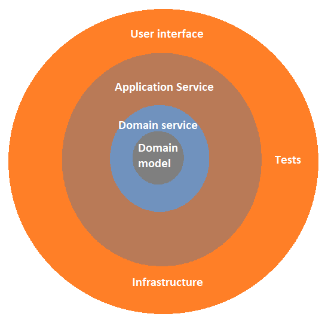

# [LEKCJA 4 – Architektura aplikacji](https://kurs.szkoladotneta.pl/zostan-programista-asp-net/tydzien-6-aplikacje-webowe-w-asp-net-core/lekcja-4-architektura-aplikacji/)
Naszą aplikację webową będziemy tworzyć zgodnie z najnowszymi standardami, czyli zgodnie z tzw. _Clean architecture_ (czystą architekturą). Obecnie uważa się, że najkorzystniejszą budowę dla aplikacji webowych, szczególnie związanych z .NET daje tzw. _Onion architecture_.
## _Onion architecture_
Typ architektury, który obrazowo przedstawia się w formie koncentrycznych warstw. Idąc od środka mamy kolejno: _Domain model_, _Domain service_, _Application service_ i w zewnętrznej warstwie _User interface_, _Infrastructure_ i _Tests_.

 
_Rysunek 1 Onion architecture_

