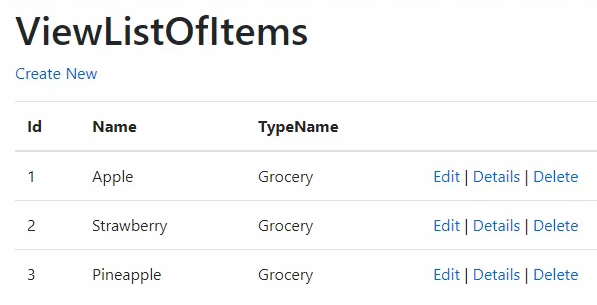

# [LEKCJA 7 – Model](https://kurs.szkoladotneta.pl/zostan-programista-asp-net/tydzien-6-aplikacje-webowe-w-asp-net-core/lekcja-7-model/)
Model we wzorcu MVC standardowo oznacza jednostkę danych, którą pobieramy z bazy danych. Kiedyś modele tworzone były bezpośrednio w aplikacji webowej. Współcześnie jednak, w onion architecture, mamy do tego celu osobną warstwę domeny. Modele w warstwie UI nadal są jednak używane, tylko do trochę innego celu. Modele w warstwie domeny są bezpośrednim odzwierciedleniem tabel w bazie danych. Znajdują się tam chociażby takie informacje, jak kiedy i przez kogo dany rekord został utworzony i zmodyfikowany. Takie informacje mogą być przydatne dla administratorów bazy danych, jednak są zupełnie niepotrzebne użytkownikowi naszej aplikacji. Dlatego w warstwie UI również tworzymy modele, tzw. modele widoków (_View model_). Będą one dopasowane do tego, jakie informacje chcemy przekazać do widoków. Mogę to być np. "odchudzone" wersje modeli z domeny lub powstałe poprzez zebranie informacji z różnych tabel bazodanowych.

## Tworzenie widoków na podstawie modeli
Stwórzmy nową klasę w folderze _Models_ naszej aplikacji webowej, np.:
```csharp =
namespace WarehouseMVC.Web.Models
{
    public class Item
    {
        public int Id { get; set; }
        public string Name { get; set; }
        public string TypeName { get; set; }
    }
}
```
Następnie w kontrolerze dopiszmy akcję, która będzie miała za zadanie wyświetlić listę `Item`ów. Ponieważ nie mamy jeszcze zaimplementowanych innych warstw aplikacji, na razie stworzymy tu też przykładową listę obiektów.
```csharp =
public IActionResult ViewListOfItems()
{
    // tymczasowy kod
    List<Item> items = new List<Item>();
    items.Add(new Item() { Id = 1, Name = "Apple", TypeName = "Grocery" });
    items.Add(new Item() { Id = 2, Name = "Strawberry", TypeName = "Grocery" });
    items.Add(new Item() { Id = 3, Name = "Pineapple", TypeName = "Grocery" });

    // wywolanie widoku do zaprezentowania listy itemow
    return View(items);
}
```

Oczywiście nie mamy jeszcze utworzonego widoku, który wiedziałby co zrobić z taką listą. Mamy jednak dostępny mechanizm, który na podstawie utworzonego przez nas modelu automatycznie wygeneruje dla nas taki prosty widok. Klikamy prawym przyciskiem myszki na nazwę naszej akcji (`ViewListOfItems`) i wybieramy opcję _Add View..._. Wyświetli nam się okno _Add New Scaffolded Item_. Wybieramy opcję _Razor View_ i klikamy _Add_. Wywoła to kolejne okno _Add Razor View_. Mamy w nim do ustawienia m.in:
* _View name:_, czyli nazwa naszego widoku. Zostanie ona automatycznie ustawiona na _ViewListOfItems_, czyli nazwę naszej akcji. Taką właśnie nazwę powinien mieć nasz widok, gdyż w taki właśnie sposób wewnętrzne mechanizmy ASP.NET MVC wyszukują widoków, do których odwołują się dane akcje w kontrolerze.
* _Template:_, czyli według jakiego szablonu chcemy utworzyć nasz widok. Ponieważ ma on wyświetlać listę itemów, więc wybieramy opcję _List_.
* _Model class:_, wskazujemy na podstawie jakiego modelu ma zostać utworzony widok. Oczywiście wyszukujemy na liście naszej klasy `Item`.

Pozostałe opcje zostawiamy w tej chwili tak jak są i klikamy _Add_. Spowoduje to wygenerowanie nowego widoku:
```csharp =
@model IEnumerable<WarehouseMVC.Web.Models.Item>

@{
    ViewData["Title"] = "ViewListOfItems";
}

<h1>ViewListOfItems</h1>

<p>
    <a asp-action="Create">Create New</a>
</p>
<table class="table">
    <thead>
        <tr>
            <th>
                @Html.DisplayNameFor(model => model.Id)
            </th>
            
            <th>
                @Html.DisplayNameFor(model => model.Name)
            </th>
            
            <th>
                @Html.DisplayNameFor(model => model.TypeName)
            </th>
            <th></th>
        </tr>
    </thead>
    <tbody>
@foreach (var item in Model){
        <tr>
            <td>
                @Html.DisplayFor(modelItem => item.Id)
            </td>
            <td>
                @Html.DisplayFor(modelItem => item.Name)
            </td>
            <td>
                @Html.DisplayFor(modelItem => item.TypeName)
            </td>
            <td>
                @Html.ActionLink("Edit", "Edit", new { /* id=item.PrimaryKey */ }) |
                @Html.ActionLink("Details", "Details", new { /* id=item.PrimaryKey */ }) |
                @Html.ActionLink("Delete", "Delete", new { /* id=item.PrimaryKey */ })
            </td>
        </tr>
}
    </tbody>
</table>  
```

Na górze wygenerowanego widoku możemy zobaczyć, że modelem dla niego jest właśnie lista `Item`ów. Poniżej mamy m.in. stworzoną tabelę HTML. W jej nagłówku znajdą się nazwy wszystkich właściwości klasy `Item`, a w ciele wartości, jakie przyjmą te właściwości dla kolejnych obiektów. W ostatniej kolumnie tabeli zostaną umieszczone linki do edycji (`"Edit"` - edytuj, `"Details"` - szczegóły, `"Delete"` - usuń). Ponieważ na razie nie mamy jeszcze utworzonych tych akcji będę to tylko szablony do późniejszego wypełnienia. Nasz nowo stworzony widok po wyświetleniu będzie wyglądał mniej więcej tak:

<br />
_Rysunek 1 Wygląd nowostworzonego widoku w przeglądarce_

Oczywiście tak wygenerowany widok możemy później edytować i dopasować do swoich potrzeb.