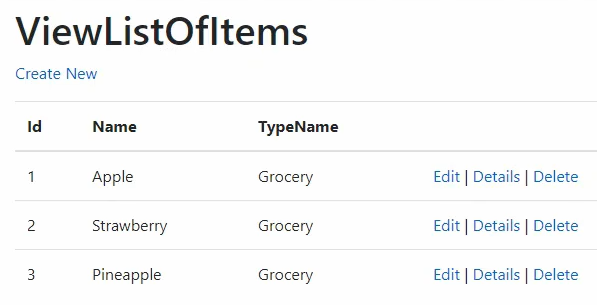

# TYDZIEŃ 6 - Aplikacje webowe w ASP.NET Core
## Spis treści
### [LEKCJA 1 – Powitanie](#lekcja-1--powitanie-1)
### [LEKCJA 2 – Tworzenie projektu](#lekcja-2--tworzenie-projektu-1)
### [LEKCJA 3 – Wzorzec MVC – omówienie](#lekcja-3--wzorzec-mvc--omówienie-1)
### [LEKCJA 4 – Architektura aplikacji](#lekcja-4--architektura-aplikacji-1)
### [LEKCJA 5 – Zależności między projektami](#lekcja-5--zależności-między-projektami-1)
### [LEKCJA 6 – Controller](#lekcja-6--controller-1)
### [LEKCJA 7 – Model](#lekcja-7--model-1)
### [LEKCJA 8 – View](#lekcja-8--view-1)
### [LEKCJA 9 – Dependency Injection](#lekcja-9--dependency-injection-1)
### [LEKCJA 10 – Routing](#lekcja-10--routing-1)
### [LEKCJA 11 – Błędy początkujących](#lekcja-11--błędy-początkujących-1)
### [LEKCJA 12 – Praca domowa](#lekcja-12--praca-domowa-1)

## [LEKCJA 1 – Powitanie](https://kurs.szkoladotneta.pl/zostan-programista-asp-net/tydzien-6-aplikacje-webowe-w-asp-net-core/lekcja-1-powitanie/)
W tym tygodniu zaczniemy tworzyć aplikację webową w ASP.NET Core. Poznamy wszystkie elementy wzorca MVC (_Model-View-Controller_) i dowiemy się w jaki sposób realizuje się tzw. czystą architekturę (ang. _Clean architecture_) nowoczesnych aplikacji internetowych. Poznamy więc podstawy organizacji naszej przyszłej aplikacji.

## [LEKCJA 2 – Tworzenie projektu](https://kurs.szkoladotneta.pl/zostan-programista-asp-net/tydzien-6-aplikacje-webowe-w-asp-net-core/lekcja-2-tworzenie-projektu/)
Podobnie jak to robiliśmy na początku kursu, tworzenie nowej aplikacji musimy oczywiście rozpocząć od utworzenia nowego projektu. Tym razem nie będzie to jednak projekt typu _Console_, tylko projekt typu _Web_. Visual Studio udostępnia nam wiele szablonów projektów związanych z aplikacjami webowymi. Mamy m.in.:
* _Blazor Server App_ - szablon do utworzenia frontendu do aplikacji webowej, przy pomocy frameworka Blazor,
* _ASP.NET Core Web API_ - do utworzenia czystego backendu aplikacji,
* _ASP.NET Core Empty_ - tworzący zupełnie pusty projekt (bez żadnego szablonu) platformy ASP.NET Core,
* **_ASP.NET Core Web App (Model-View-Controller)_** - tworzący podstawę do aplikacji budowanej zgodnie z architekturą MVC, czyli takiej, jaką chcemy stworzyć,
* _Blazor WebAssembly App_ - czyli kolejny szablon dla frameworka Blazor, do tworzenia aplikacji w nieco innej technologii, niż ten pierwszy,
* _ASP.NET Core with Angular_ - do aplikacji ASP.NET Core używającej Angulara we frontendzie,
* _ASP.NET Core with React.js_ - do aplikacji ASP.NET Core używającej React.js we frotendzie.

1. Uruchamiamy Visual Studio.
2. Wybieramy _Create a new project_.
3. Szukamy projektu _ASP.NET Core Web App (Model-View-Controller)_ (nazwa może się trochę różnić, ważne żeby było MVC).</br>
Aby ułatwić sobie szukanie możemy ustawić filtry kolejno na
    * _C#_,
    * _All platforms_,
    * _Web_.
4. Po wyszukaniu projektu sprawdzamy jeszcze tagi na dole, czy mamy _C#_, _Linux_, _macOS_, _Windows_, _Web_.
5. Po upewnieniu się, że wybraliśmy właściwy projekt klikamy _Next_.
6. Nazywamy projekt.
    * _Project name_ - będzie to nazwa dla tworzonego właśnie projektu aplikacji webowej. Będzie to frontend naszej aplikacji. Warto więc od razu zaznaczyć to w nazwie, np. dodając na końcu _.Web_. Np.: _WarehouseMVC.Web_.
    * _Location_ - to oczywiście lokalizacja naszego projektu.
    * _Solution name_ - nazwa całej solucji, czyli "kontenera" aplikacji w którym umieścimy wszystkie związane z nią projekty. Np. _WarehouseMVC_.
7. Przechodzimy dalej klikając _Next_.
8. Podajemy dodatkowe informacje.
    * _Framework_ - wybieramy wersję frameworka .NET, z której będziemy korzystać tworząc nasz projekt. Tworząc nowy projekt, warto skorzystać z najnowszej dostępnej wersji.
    * _Authentication type_ - wybieramy sposób uwierzytelniania użytkowników, zarządzania nimi.
        * _None_ - standardowo wybrana opcja, oznaczająca brak zarządzania użytkownikami,
        * **_Individual Accounts_** - oznacza, że będziemy tworzyć użytkowników w naszej bazie danych. Będziemy w niej mieć specjalne table _AspNetUserRoles_, _AspNetUsers_ itd. Na nasze potrzeby wybierzemy tą właśnie opcję.
        * _Microsoft identity platform_ - wybieramy, gdy chcemy skorzystać z zewnętrznych źródeł uwierzytelniania, np. mamy skonfigurowane usługi _Azure Active Directory B2C_ (_Azure AD B2C_), _IdentityServer_ itd.
        * _Windows_ - oznacza uwierzytelnienie przy pomocy użytkowników domenowych. Jeżeli tworzymy aplikację do wewnętrznego użytku np. w firmie i mamy skonfigurowaną domenę _Active Directory_, to możemy wybrać uwierzytelnianie Windowsowe i będziemy mogli bez problemu skomunikować się z domeną.
    * _Configure for HTTPS_ - zaznaczamy czy chcemy, aby nasza aplikacja używała połączenia szyfrowanego przez protokół HTTPS. Zawsze powinniśmy zostawiać tą opcję zaznaczoną.
    * Enable Docker - zaznaczamy tą opcję jeśli będziemy chcieli skonteneryzować naszą aplikację (skorzystać z Dockera). Na razie nie będziemy z niego korzystać, więc zostawiamy tą opcję odznaczoną.
    * _Do not use top-level statements_ - omawialiśmy już tą opcję przy okazji tworzenia projektu konsolowego. Jeśli chcemy uprościć wygląd naszego pliku _Program.cs_, to możemy ją wybrać. Jak kto chce.
9. Klikamy _Create_, aby utworzyć nasz projekt.

Utworzony projekt będzie zawierał prostą, działającą stronę internetową. Plik _Program.cs_ zawiera już cały potrzebny kod. Omówimy go sobie w kolejnych lekcjach. Możemy od razu uruchomić nasz nowy projekt.

Podczas pierwszego uruchomienia programu skonfigurowanego do użycia szyfrowanego połączenia HTTPS, zostanie utworzony i podpisany certyfikat ASP.NET Core SSL. Visual Studio zapyta nas, czy chcemy zaufać temu certyfikatowi i tym samym uniknąć ostrzeżeń przeglądarki. Ponieważ tworzymy nasz projekt lokalnie, więc bez zastanowienia możemy wszystkiemu ufać. Zaznaczamy więc opcję _Don't ask me again_, aby uniknąć ponownego wyświetlania się komunikatu i klikamy _Yes_. Później wyświetli nam się ostrzeżenie o instalacji certyfikatu. Oczywiście również potwierdzamy, że chcemy go zainstalować. Ten komunikat również pokaże nam się tylko przy pierwszym uruchomieniu.

Aplikacja uruchomi nam się w przeglądarce. Na razie jest to bardzo prosta strona składająca się ze strony głównej, którą będziemy później rozwijać, strony do umieszczenia naszej polityki prywatności. Mamy również przygotowane szablony do rejestracji i logowania użytkownika.

## [LEKCJA 3 – Wzorzec MVC – omówienie](https://kurs.szkoladotneta.pl/zostan-programista-asp-net/tydzien-6-aplikacje-webowe-w-asp-net-core/lekcja-3-wzorzec-mvc-omowienie/)
Wzorzec MVC, czyli wzorzec _Model-View-Controller_ (Model-Widok-Kontroler), to wzorzec architektury aplikacji, zgodnie z którym dzielimy ją na trzy warstwy. Każda z nich jest niezależna, a jej działanie nie zależy od budowy pozostałych warstw. Komunikują się one ze sobą, wymieniając dane, jednak jednej warstwy nie interesują szczegóły implementacyjne innej warstwy.

Gdy spojrzymy na utworzony w poprzedniej lekcji projekt, zobaczymy, że, przy pomocy analogicznie nazwanych katalogów, zostały w nim wyszczególnione te trzy warstwy.

### Views
Widoki mają za zadanie wyłącznie zaprezentować w sposób graficzny to, o co poprosił użytkownik. Nie umieszczamy tu żadnej logiki biznesowej, nie robimy żadnych obliczeń, nie zajmujemy się sterowaniem naszą aplikacją, tylko pokazujemy graficzną reprezentację danych. Jeżeli np. użytkownik chce zobaczyć listę wszystkich produktów sprzedawanych w sklepie, to musimy stworzyć widok, który przedstawi takie produkty np. w formie tabeli lub tzw. gridu.

W przypadku ASP.NET Core MVC widoki tworzy się w plikach .cshtml. Używają one składni HTML, jednak ponadto mamy do dyspozycji silnik Razor Engine. Pozwala on nam na dynamiczne pobieranie danych przy pomocy specjalnych atrybutów. Wszystkie elementy silnika Razor, których będziemy używać w naszym kodzie, będą poprzedzone symbolem `@`. Możemy przy jego pomocy pobierać wartości parametrów, wywoływać metody C#, a nawet pisać wewnątrz pliku .cshtml instrukcje warunkowe, tworzyć zmienne lokalne, czy korzystać z innych elementów języka C#.

Widoki we wzorcu MVC charakteryzują się tym, że nie posiadają one żadnej wiedzy na temat tego co robi kontroler i za co odpowiedzialny jest model. Jego rola polega tylko i wyłącznie na prezentacji graficznej informacji o które poprosił użytkownik.
### Controllers
Kontroler jest to można powiedzieć mózg aplikacji. Odbiera on od użytkownika informacje, co ten chce zrobić. Następnie przekazuje on uzyskane informacje do modelu i w zależności od sytuacji pobiera z modelu dane do wyświetlenia i wywołuje odpowiedni widok do ich prezentacji lub przesyła do niego dane, które powinny np. zostać zapisane w bazie danych. W związku z tym kontrolery zawierają część logiki. Pośredniczą one między widokami i modelami. Odpowiadają za wywoływanie kolejnych akcji, w zależności od tego co zrobi użytkownik.

Kontrolery są to po prostu klasy C# dziedziczące po klasie `Controller`. Umieszczamy więc je oczywiście w plikach .cs.
### Models
Modele są odpowiedzialne za reprezentacje danych, z których korzysta nasza aplikacja. Przechowuje on dane i zawiera naszą logikę biznesową. Są one również odpowiedzialne za komunikację z bazą danych.

Modele to zwykłe klasy C#, więc umieszczamy je w plikach .cs.

### Przykład
Załóżmy, że użytkownik chce wyświetlić wszystkie produkty.
1. Użytkownik wciska przycisk</br>
**Widok** będzie zapewne zawierał jakiś przycisk "Wszystkie produkty", czy coś takiego, który wywoła akcję wyświetlenia wszystkich produktów.
2. Przesłanie informacji o wciśnięciu przycisku</br>
**Kontroler** otrzymuje z widoku informację, że użytkownik chce zobaczyć wszystkie produkty.
3. Wysłanie informacji do modelu</br>
**Kontroler** wysyła do modelu informację, że chce uzyskać listę wszystkich produktów.
4. Pobranie danych z bazy danych</br>
**Model** wysyła do bazy danych odpowiednie zapytanie i pobiera z niej odpowiednie dane dotyczące wszystkich produktów.
5. Przekazanie uzyskanych danych</br>
**Kontroler** otrzymuje z modelu listę wszystkich produktów.
6. Wywołanie widoku</br>
**Kontroler** wywołuje odpowiedni widok i przekazuje mu uzyskane z modelu dane.
7. Wyświetlenie danych użytkownikowi</br>
**Widok** prezentujący listę produktów zostaje wyświetlony użytkownikowi.

### Podsumowanie
Obecnie, w nowoczesnych aplikacjach internetowych raczej nie używa się czystej architektury MVC. Dalej korzystamy z zalet tego wzorca, jednak przeplata się go z innymi wzorcami, które są lepsze w zarządzaniu, mają lepszą strukturę organizacyjną dotyczącą logiki biznesowej i prezentacji danych. Należy więc znać podstawy tego wzorca, jednak w praktyce będziemy do niego luźno podchodzić. Pamiętajmy, że wzorce mają nam ułatwić pracę, a nie nas ograniczać.

## [LEKCJA 4 – Architektura aplikacji](https://kurs.szkoladotneta.pl/zostan-programista-asp-net/tydzien-6-aplikacje-webowe-w-asp-net-core/lekcja-4-architektura-aplikacji/)
Naszą aplikację webową będziemy tworzyć zgodnie z najnowszymi standardami, czyli zgodnie z tzw. _Clean architecture_ (czystą architekturą). Obecnie uważa się, że najkorzystniejszą budowę dla aplikacji webowych, szczególnie związanych z .NET daje tzw. _Onion architecture_.
### _Onion architecture_
Typ architektury, który obrazowo przedstawia się w formie koncentrycznych warstw. Idąc od środka mamy kolejno: _Domain model_, _Domain service_, _Application service_ i w zewnętrznej warstwie _User interface_, _Infrastructure_ i _Tests_.
Zgodnie z zasadami tej architektury zewnętrzną warstwę można w każdym momencie usunąć, a core aplikacji (wewnętrzne warstwy) dalej powinien działać poprawnie. W praktyce oznacza to, że teoretycznie w każdej chwili można tą warstwę wymienić na inną (chociaż coś takiego zdarza się bardzo rzadko).

</br>
_Rysunek 1 Onion architecture_

#### _User interface_
Interfejs użytkownika, czyli frontend naszej aplikacji (warstwa prezentacji). Według onion architecture w każdej chwili możemy ją podmienić na inną, bez wpływu na pozostałe warstwy. Np. będziemy mogli podmienić frontend, który będziemy pisać w MVC, na frontend pisany w Angularze. Wymagać to będzie jedynie dopisania odpowiedniego Web API do komunikacji z nim.
#### _Infrastructure_
Baza danych naszej aplikacji. Według onion architecture reszta aplikacji jest od niej całkowicie niezależna, więc w każdej chwili możemy ją podmienić na inną np. z MS SQL na PostgreSQL, MySQL lub cokolwiek innego.
#### _Tests_
Testy są oczywiście tylko dodatkiem do naszej aplikacji i bez nich nasza aplikacja będzie działać dokładnie tak samo.
#### _Application service_
Warstwa spinająca naszą aplikację w całość. Będzie odpowiedzialna za reagowanie na zapytania użytkownika (z _user interface_). Na ich podstawie będzie odpowiedzialna za komunikację z _domain model_ za pośrednictwem _infrastructure_. Na podstawie odpowiedzi z infrastructure będzie odpowiedzialna za wysłanie odpowiedzi do _user interface_. Jest więc łącznikiem między _domain_, a _user interface_.
#### _Domain service_
Warstwa zawierająca wszystkie mechanizmy obsługujące wszelkie zasady związane z bazą danych. Będziemy tu tworzyć wszystkie tzw. rule biznesowe, czyli zasady biznesowe do tworzenia naszych modeli. Np. jakiej długości mogą być dane kolumny (ile znaków można do nich wpisać), jakiego typu danych powinniśmy użyć (np. `int`, czy `decimal`), czy dana wartość jest wymagana czy opcjonalna. Tu także zdefiniujemy połączenia pomiędzy tabelami oraz sposoby tworzenia kluczy głównych i obcych.
#### _Domain model_
Warstwa opisująca nasze entity, czyli główne modele, odzwierciedlające tabele w naszej bazie danych. Składa się z klas zawierających wyłącznie właściwości. Nazwa klasy będzie odpowiadała nazwie jednej tabeli w bazie danych, a każda właściwość będzie odpowiadała jednej jej kolumnie.

### Tworzenie architektury naszej aplikacji
Zbudujmy więc architekturę naszej aplikacji. Stworzymy odpowiednie foldery i projekty. Bezpośrednio w solucji stwórzmy wymienione niżej foldery i w każdym z nich odpowiedni projekt, z nazwą wskazującą na to za co będzie on odpowiedzialny:
* Folder _Application_ - na _Application Service_
    * Projekt _Class Library (.NET Core)_ - nazwa z dopiskiem _.Application_, np.: _WarehouseMVC.Application_
        * Folder _Interfaces_ - na interfejsy do _Dependency Injection_ (o tym w lekcji 9. tego tygodnia) dla _UI_ (tak aby nasza aplikacja webowa mogła tworzyć odpowiednie zapytania do aplikacji).
        * Folder _Services_ - na serwisy
* Folder _Domain_ - na _Domain service_ i _Domain model_
    * Projekt _Class Library (.NET Core)_ - nazwa z dopiskiem _.Domain_, np.: _WarehouseMVC.Domain_
        * Folder _Interface_ - na interfejsy do naszego _Repository_
        * Folder _Model_ - na _Domain models_
* Folder _Infrastructure_ - na _Infrastructure_
    * Projekt _Class Library (.NET Core)_ - nazwa z dopiskiem _.Infrastructure_, np.: _WarehouseMVC.Infrastructure_. Ten projekt będzie się łączył z naszą bazą danych.
        * Folder _Repositories_ - na implementację interfejsów zawartych w warstwie domenowej
* Folder _Test_ - na _Tests_
    * Projekt _xUnit Test Project (.NET Core)_ - nazwa z dopiskiem _.Tests_, np.: _WarehouseMVC.Tests_
* Folder _UI_ - na _User Interface_
    * Tu przeniesiemy stworzony przez nas projekt aplikacji webowej MVC.

Z utworzonych projektów możemy od razu usunąć przykładowe klasy.

## [LEKCJA 5 – Zależności między projektami](https://kurs.szkoladotneta.pl/zostan-programista-asp-net/tydzien-6-aplikacje-webowe-w-asp-net-core/lekcja-5-zaleznosci-miedzy-projektami/)
Ponieważ zależności pomiędzy projektami (warstwami aplikacji) są ważną częścią onion architecture, w której tworzymy naszą aplikację, więc zdefiniujmy je jeszcze przed rozpoczęciem implementacji naszej aplikacji. Dzięki temu nie będziemy mieć później problemów z używaniem elementów innych bibliotek i unikniemy błędów, próbując uzyskać dostęp do elementów, do których dostępu mieć nie powinniśmy. Nie możemy tworzyć sobie powiązań jak nam w danej chwili wygodnie, gdyż zgodnie z założeniami onion architecture, nie wszystkie projekty powinny "wiedzieć" o sobie nawzajem ("wiedzieć" o swoim istnieniu). Inaczej nie uda nam się utrzymać niezależnych, wymiennych warstw.

### Zależności w naszej aplikacji
#### Domena
W domenie (_Domain_) nie zmieniamy nic. Przypomnijmy, że jest to warstwa, która znajduje się w samym środku naszej "cebuli", więc jest ona niezależna od wszystkich innych warstw.
#### Infrastruktura
W infrastrukturze (_Infrastructure_) dodajemy referencję do domeny. W tej warstwie będziemy trzymać połączenie do bazy danych i łączyć tabele bazodanowe z modelami domeny. Ma ona implementować interfejsy domeny. Musi więc mieć do niej dostęp. Będą się tu znajdować powiązania związane z _dependency injection_.
#### Aplikacja
W aplikacji (_Application_) również dodajemy referencję do domeny. Używamy połączenia z domeną, a nie z infrastrukturą, gdyż implementacja infrastruktury jest dopasowana do konkretnego źródła danych (konkretnej bazy danych), a aplikacja ma być od niego niezależna. Używa więc ona interfejsów domeny. Połączenie konkretnego interfejsu z konkretną implementacją odbywa się dzięki _dependency injection_ o czym dowiemy się więcej w lekcji 9. tego tygodnia.
#### Aplikacja webowa
Teoretycznie nasza aplikacja webowa (_UI_) powinna mieć dostęp tylko do aplikacji, gdyż to właśnie do aplikacji nasz UI będzie wysyłać zapytania i to właśnie aplikacja będzie sterować dalszą, związaną z nim, logiką. Aby nieco ułatwić sobie pracę poza powiązaniem do aplikacji dodamy jeszcze jedno powiązanie, do infrastruktury. Zrobimy tak, aby uzyskać dostęp do znajdującego się tam _dependency injection_ i dzięki temu skrócić kod naszej klasy _Startup_. Połączenie to ustanawia się tylko i wyłącznie po to, aby uzyskać dostęp do jednej klasy infrastruktury związanej właśnie z _dependency injection_. Nie będziemy go w żaden sposób wykorzystywać do komunikacji z repozytoriami.

## [LEKCJA 6 – Controller](https://kurs.szkoladotneta.pl/zostan-programista-asp-net/tydzien-6-aplikacje-webowe-w-asp-net-core/lekcja-6-controller/)
Kontrolery odpowiadają za odebranie z widoków żądań użytkownika i przekazanie ich do dalszej części aplikacji.

Kiedyś kontrolery były sercem aplikacji. To w nich znajdowała się cała logika. Łączyły się one bezpośrednio z bazą danych, odbierały i przerabiały dane i wysyłały je do widoków. Metody kontrolerów były więc bardzo obszerne. Tworzyliśmy w nich modele, pobieraliśmy je z bazy danych i przekazywaliśmy modele do widoków. Oczywiście w razie potrzeby umieszczaliśmy tam również dodatkową logikę.

Dzisiaj, ponieważ zaczęto dzielić aplikację na więcej warstw, więc rola kontrolerów nieco się zmieniła. Dalej są one odpowiedzialne za przyjmowanie wszystkich żądań użytkownika. Kiedy np. użytkownik naciśnie jakiś przycisk, akcja ta jest prawdopodobnie spięta z jakąś akcją kontrolera, która zostanie wywołana. Obecnie panuje trend na tzw. cienkie kontrolery. Oznacza to, że akcje kontrolerów powinny być jak najmniejsze (nie więcej niż 5-10 linii) i przyjmować jak najmniejszą odpowiedzialność. Tak na prawdę to powinny jedynie przyjmować żądania od użytkownika i przesłać je bezpośrednio do serwisów warstwy aplikacji oraz przesłać uzyskaną odpowiedź. Jeżeli więc metody w naszych aplikacjach zaczynają za bardzo się rozrastać, należy się zastanowić, czy nie powinniśmy przenieść części kodu do serwisów.

### Budowa kontrolera
Kontroler jest to klasa dziedzicząca po klasie `Controller`. W zależności od tego jak go nazwiemy, tak będziemy się do niego odwoływać. W pasku adresu, po adresie naszej strony internetowej (na razie będzie to np. _https://localhost:44395_), po backslashach podajemy nazwę kontrolera (bez przyrostka `Controller`), backslash, nazwa metody, którą chcemy wywołać. Załóżmy, że mamy kontroler:
```csharp =
namespace WarehouseMVC.Web.Controllers
{
    public class HomeController : Controller
    {
        private readonly ILogger<HomeController> _logger;

        public HomeController(ILogger<HomeController> logger)
        {
            _logger = logger;
        }
        
        // przykladowe metody:

        // view
        public IActionResult Index()
        {
            return View();
        }

        // partial view
        public IActionResult TestPartial()
        {
            return PartialView();
        }

        // status http
        public IActionResult OkTest()
        {
            return Ok("Everything went fine");
        }

        // przekazywanie informacji prze JSON
        public IActionResult JsonResult()
        {
            return new JsonResult("JSON"); // zamiast "JSON" wstawiamy obiekt do serializacji
        }

        // zadania http
        [HttpGet]
        public IActionResult Index(int id)
        {
            return PartialView();
        }

        // implementacja kontrolera
    }
}
```
Jeżeli chcielibyśmy wywołać jego metodę `Index`, w pasku adresu w przeglądarce mielibyśmy np. _https://localhost:44395/Home/Index_.

Przyjrzyjmy się bliżej mechanizmom, z których możemy korzystać w kontrolerze.

#### Konstruktor
##### `ILogger`
Do konstruktora naszego kontrolera podajemy obiekt loggera. Logger jest to mechanizm do logowania informacji na temat błędów, interakcji z użytkownikiem i wszystkiego, co chcemy zachować na później, aby np. mieć możliwość powrotu do jakiejś akcji, którą wykonał użytkownik i prześledzenia informacji, aby ustalić co mogło spowodować błąd.
##### Serwisy
W przyszłości, poza loggerem, będziemy musieli do naszego kontrolera przekazywać jeszcze interfejsy naszych serwisów z warstwy aplikacji, abyśmy mogli z nich korzystać.

#### Akcje kontrolera
Akcje, czyli po prostu metody naszej klasy. Są one odpowiedzialne za wyświetlanie różnych widoków lub zwrócenie jakiejś informacji. Zwracają obiekt `IActionResult`. Mamy do dyspozycji kilka obiektów, które możemy zwrócić.
##### View
Metoda `View()` kontrolera, zwraca cały widok, czyli cały kontent naszej strony.
##### PartialView
Metoda `PartialView` kontrolera, zwraca tylko część widoku. Często, bardziej złożone widoki, składają się z kilku niezależnych części. Są to właśnie PartialViews, czyli widoki częściowe. Każdy z nich ma swoją niewielką odpowiedzialność.
##### Statusy HTTP
Czasami nie będziemy chcieli zwracać pełnego widoku, a jedynie jakąś informację. Np. mamy listę elementów i koło każdego z nich przycisk do usuwania. Chcemy usunąć jeden z elementów, więc wciskamy odpowiedni przycisk. Kontroler wywołuje więc akcję usuwania. Po usunięciu odpowiedniego elementu z bazy nie chcemy jednak na nowo ładować całego widoku, a jedynie uzyskać informację, czy akcja się udała. Do tego typu celów służą właśnie statusy HTTP. Zdefiniowano powszechnie używane statusy i przypisano im kody. Do poinformowania o pomyślnym przetworzeniu żądania, czyli w naszym przypadku, o tym, że element został usunięty może posłużyć status 200 (OK). Zwracamy go wywołując po prostu metodę `Ok()` kontrolera, z opcjonalnym parametrem `object?`, zawierającym np. opis.

Innym kodem z którym często się stykamy jest kod 400 (Bad Request), informujący, że serwer nie zrozumiał przesłanego przez użytkownika żądania. Zobaczymy go np. gdy próbujemy przejść na stronę, która nie istniej, wywołać nieistniejący w aplikacji kontroler itd. Taką odpowiedź zwróci nam metoda `BadRequest()` kontrolera. Występuje ona w trzech wersjach, bezparametrowej, z parametrem `ModelStateDictionary` (zawierającym błędy do zwrócenia klientowi) i z parametrem `object?` (zawierający obiekt błędu, np. opis, do zwrócenia klientowi).

###### [Kody statusów HTTP](https://www.restapitutorial.com/httpstatuscodes.html#)
Definiują one odpowiedzi jakie może wysłać serwer w odpowiedzi na otrzymane żądanie. Kody podzielono na klasy kodów, zawierające odpowiedzi o podobnym zastosowaniu. W poniższej tabeli przedstawiono kody z podziałem na klasy. Pogrubiono numery kodów, które są najczęściej używane.

<table>
<thead><tr><th style="text-align:center">Klasa kodów</th><th style="text-align:center">Nazwa EN</th><th style="text-align:center">Nazwa PL</th><th style="text-align:center">Opis</th></tr></thead>
<tbody>
<tr><th style="text-align:center">1xx</th><td style="text-align:center"><i>Informational</i></td><td style="text-align:center">Informacyjny</td><td>Klasa kodów statusów wskazująca prowizoryczną odpowiedź.<br />Odpowiedź składa się tylko ze Status-Line i opcjonalnego nagłówka i jest zakończona pustą linią. Ponieważ żaden z kodów tej klasy nie został zdefiniowany przez HTTP/1.0, serwery nie muszą wysyłać odpowiedzi tej klasy do klienta (aplikacji webowej). Klient musi być jednak przygotowany na przyjęcie jednej lub więcej odpowiedzi tej klasy, przed otrzymaniem odpowiedzi. User agent (aplikacja kliencka - przeglądarka) może zignorować nieoczekiwaną odpowiedź tej klasy.</td></tr>
<tr><td colspan=5><details>
<summary style="text-align:center">
Rozwiń kody klasy 1xx
</summary>

| Kod | Nazwa EN | Nazwa PL | Opis |
| ---: | :---: | :---: | --- |
| 100 | _Continue_ | Kontynuuj | Wskazuje, że klient powinien kontynuować swoje zapytanie.<br /> Taka odpowiedź może zostać wysłana, aby poinformować klienta, że otrzymano początkową część zapytania i nie została ona jeszcze odrzucona przez serwer. Klient powinien kontynuować wysyłanie reszty zapytania, lub zignorować tą odpowiedź, jeżeli całe zapytanie zostało już wysłane. Po zakończeniu obsługi zapytania, serwer musi wysłać ostateczną odpowiedź. |
| 101 | _Switching Protocols_ | Przełącz protokoły |Oznacza, że serwer zrozumiał i jest gotowy zrealizować wysłaną prośbę o zmianę protokołu.<br />Serwer zmieni protokół na ten o który proszono, zaraz za pustą linią znajdującą się na końcu tej odpowiedzi.<br />Protokół powinien zostać zamieniony, gdy jest to korzystne, np. gdy poproszono o nowszą wersję HTTP. |
| 102 | _Processing (WebDAV[^webdav])_ | Przetwarzanie | Jest to tymczasowa odpowiedź używana do poinformowania klienta, że serwer zaakceptował całe żądanie, ale jeszcze go nie ukończył.<br />Ten kod stanu powinien zostać wysłany tylko wtedy, gdy serwer ma uzasadnione oczekiwania, że wykonanie żądania zajmie dużo czasu. Jako wskazówka, jeśli wykonanie metody trwa dłużej niż 20 sekund, serwer powinien zwrócić tą odpowiedź. Serwer musi wysłać ostateczną odpowiedź po zakończeniu przetwarzania żądania. Jest ona np. wysyłana aby zapobiec automatycznemu wylogowaniu użytkownika z powodu przekroczenia czasu, gdy czeka on na odpowiedź. |
</details></td></tr>
<tr><th style="text-align:center">2xx</th><td style="text-align:center"><i>Success</i></td><td style="text-align:center">Sukces</td><td>Kody tej klasy oznaczają, że żądanie klienta zostało pomyślnie przyjęte, zrozumiane i przetworzone.</td></tr>
<tr><td colspan=5><details>
<summary style="text-align:center">Rozwiń kody klasy 2xx</summary>

| Kod | Nazwa EN | Nazwa PL | Opis |
| ---: | :---: | :---: | --- |
| **200** | **_OK_** | **OK** |Oznacza, że żądanie zakończyło się sukcesem. Informacja zwrócona razem z odpowiedzią zależy od metody użytej podczas żądania. Przykładowo:<ul style="list-style-type: none;"><li>GET entity odpowiadające żądanemu zasobowi jest wysyłane w odpowiedzi.</li><li>HEAD w odpowiedzi zostają wysłane tylko pola nagłówka entity, odpowiadającego żądanemu zasobowi, bez body wiadomości.</li><li>POST przesłanie entity opisującego lub zawierającego rezultat operacji</li><li>TRACE wysłanie entity zawierającego treść żądania w formie, w jakiej otrzymał je serwer końcowy</li></ul> |
| **201** | **_Created_** | **Utworzony** | Oznacza, że żądanie zostało wykonane i zaskutkowało utworzeniem nowego zasobu.<br />Do nowo utworzonego zasobu można się odwołać używając URI zwróconego w odpowiedzi. |
| 202 | _Accepted_ | Zaakceptowany | Żądanie zostało zaakceptowane do przetworzenia, ale przetworzenie jeszcze się nie zakończyło.<br />Tą odpowiedź stosuje się, aby pozwolić serwerowi na przyjęcie żądania dla innego procesu (być może takiego, który odbywa się raz na dobę), bez konieczności utrzymania połączenia między serwerem, a przeglądarką do czasu zakończenia przetwarzania. Odpowiedź powinna zawierać aktualny status żądania i wskaźnik do monitora statusu lub oszacowanie, kiedy użytkownik może się spodziewać odpowiedzi. |
| 203 | _Non-Authoritative Information_ | Informacja nieautorytatywna | Serwer pomyślnie przetworzył żądanie, ale zwraca informacje, które mogą pochodzić z innego źródła.<br />Użycie tego kodu nie jest wymagane i jest właściwe tylko wówczas, gdy w innym przypadku odpowiedź byłaby 200 (OK).<br />Ten kod nie jest dostępny w HTTP/1.0 (dostępny od HTTP/1.1). |
| **204** | **_No Content_** | **Brak zawartości** | Serwer spełnił żądanie, ale nie musi zwracać entity-body i może chcieć zwrócić zaktualizowane metainformacje.<br />Odpowiedź może zawierać nowe lub zaktualizowane metainformacje w postaci nagłówków encji, które, jeśli są obecne, powinny być powiązane z żądanym wariantem.<br />Jeśli klient jest przeglądarką, nie powinien zmieniać widoku swojego dokumentu z tego, który spowodował wysłanie żądania. Ta odpowiedź ma przede wszystkim na celu umożliwienie wykonania akcji, bez powodowania zmian w aktywnym widoku dokumentu, chociaż wszelkie nowe lub zaktualizowane metainformacje powinny zostać do niego zastosowane.<br />Odpowiedź nie może zawierać message-body, dlatego jest zawsze zakończona pierwszą pustą linią po polach nagłówka. |
| 205 | _Reset Content_ | Resetuj zawartość | Serwer spełnił żądanie, a agent użytkownika powinien zresetować widok dokumentu, który spowodował wysłanie żądania.<br />Tą odpowiedź stosuje się, aby przeprowadzić akcję za pośrednictwem danych wprowadzonych przez użytkownika, po której następuje wyczyszczenie inputów na dane wejściowe, aby użytkownik mógł łatwo wprowadzić kolejne dane.<br />Odpowiedź nie może zawierać entity. |
| 206 | _Partial Content_ | Częściowa zawartość | Serwer wykonał żądanie GET o część zasobu. |
| 207 | _Multi-Status (WebDAV[^webdav])_ | Multi-Status | Zapewnia status dla wielu niezależnych operacji.<br />Treść wiadomości, która następuje po niej, jest wiadomością XML i może zawierać kilka oddzielnych kodów odpowiedzi, w zależności od liczby złożonych żądań podrzędnych. |
| 208 | _Already Reported (WebDAV[^webdav])_ | Już zgłoszone | Członkowie powiązania DAV zostali już wymienieni w poprzedniej odpowiedzi na to żądanie i nie są uwzględniani ponownie.<br />Kod używany wewnątrz elementu odpowiedzi DAV: propstat. |
| 226 | _IM Used_| Użyto manipulacji instancji | Serwer wypełnił żądanie GET o zasób, a odpowiedź jest reprezentacją rezultatu jednej lub więcej manipulacji instancji, wykonanych na obecnej instancji.<br />Rzeczywista aktualna instancja może nie być dostępna, chyba, że przez połączenie odpowiedzi z innymi poprzednimi lub przyszłymi odpowiedziami. |
</details></td></tr>
<tr><th style="text-align:center">3xx</th><td style="text-align:center"><i>Redirection</i></td><td style="text-align:center">Przekierowanie</td><td>Ta klasa kodów stanu wskazuje, że agent użytkownika musi podjąć dalsze działania, aby spełnić żądanie.<br/>Wymagane działanie może zostać przeprowadzone przez agenta użytkownika bez interakcji z użytkownikiem wtedy i tylko wtedy, gdy metodą użytą w drugim żądaniu jest GET lub HEAD. Klient powinien wykrywać nieskończone pętle przekierowań, ponieważ takie pętle generują ruch sieciowy dla każdego przekierowania.<br /><b>Uwaga!</b> Poprzednie wersje tej specyfikacji zalecały maksymalnie pięć przekierowań. Twórcy treści powinni mieć świadomość, że mogą istnieć klienci, którzy wprowadzają takie stałe ograniczenie.</td></tr>
<tr><td colspan=5><details>
<summary style="text-align:center">Rozwiń kody klasy 3xx</summary>

| Kod | Nazwa EN | Nazwa PL | Opis |
| ---: | :---: | :---: | --- |
| 300 | _Multiple Choices_ | Wiele wyborów | Serwer wskazuje wiele opcji na uzyskanie zażądanego zasobu.<br />Zażądany zasób odpowiada dowolnemu spośród zestawu. W odpowiedzi serwer wskazuje więc wiele opcji na uzyskanie zasobu, którymi klient może podążyć. Ten status można np. wykorzystać do przedstawienia różnych opcji formatu wideo, listy plików z różnymi rozszerzeniami lub ujednoznacznienia znaczenia słów. |
| 301 | _Moved Permanently_ | Przeniesiony na stałe | To i wszystkie przyszłe żądania o zażądany zasób powinny być kierowane na podane URI.<br />Zażądany zasób został przypisany do nowego stałego URI i wszystkie przyszłe referencje do tego zasobu powinny używać jednego ze zwróconych URI. Klienci z możliwością edycji linków, powinni automatycznie przełączyć referencję URI żądania na jedną lub więcej referencję zwróconą przez serwer, jeżeli jest to możliwe. Ta odpowiedź jest zapisywana w pamięci podręcznej, chyba że wskazano inaczej.<br />Nowy stały URI powinien być podany w polu _Location_ odpowiedzi. O ile metodą żądania nie była HEAD, entity odpowiedzi powinna zawierać krótką notatkę hipertekstową z hiperłączem do nowych identyfikatorów URI.<br />Jeśli kod zostanie odebrany w odpowiedzi na żądanie inne niż GET lub HEAD, agent użytkownika nie może automatycznie przekierować żądania, chyba że użytkownik może to potwierdzić, ponieważ może to zmienić warunki, na jakich żądanie zostało wysłane.<br /><b>Uwaga!</b> Podczas automatycznego przekierowywania żądania POST po otrzymaniu tego kodu niektóre istniejące aplikacje klienckie HTTP/1.0 błędnie zmienią je w żądanie GET. |
| 302 | _Found_ | Znaleziono | Zażądany zasób znajduje się czasowo pod innym URI.<br />Ponieważ przekierowanie może być okazjonalnie zmieniane, klient powinien nadal używać żądanego URI w przyszłych żądaniach. Ta odpowiedź jest zapisywana w pamięci podręcznej tylko wtedy, gdy jest to wskazane przez pole nagłówka _Cache-Control_ lub _Expires_.<br />Tymczasowe URI powinno zostać podane w polu _Location_ odpowiedzi. O ile metodą żądania nie była HEAD, entity odpowiedzi powinna zawierać krótką notatkę hipertekstową z hiperłączem do nowych identyfikatorów URI.<br />Jeśli kod zostanie odebrany w odpowiedzi na żądanie inne niż GET lub HEAD, agent użytkownika nie może automatycznie przekierować żądania, chyba że użytkownik może to potwierdzić, ponieważ może to zmienić warunki, na jakich żądanie zostało wysłane.<br /><b>Uwaga!</b> RFC 1945 i RFC 2068 określają, że klient nie może zmieniać metody w przekierowanym żądaniu. Jednak większość istniejących implementacji agenta użytkownika traktuje 302 tak, jakby była to odpowiedź 303, wykonując GET na wartości pola _Location_ niezależnie od pierwotnej metody żądania. Dodano kody statusu 303 i 307 dla serwerów, które chcą jednoznacznie określić, jakiej reakcji oczekuje klient. |
| 303 | _See Other_ | Zobacz inne | Odpowiedź na żądanie można znaleźć pod innym identyfikatorem URI i powinna zostać pobrana przy użyciu metody GET dla tego zasobu.<br />Ta metoda istnieje przede wszystkim po to, aby umożliwić przekierowanie agenta użytkownika na wybrany zasób, przez wyjście skryptu aktywowanego przez POST. Nowe URI nie jest zamiennikiem referencji do oryginalnie żądanego zasobu. Odpowiedź nie może zostać zapisana w pamięci podręcznej, ale można zapisać odpowiedź na drugie (przekierowane) żądanie.<br />Inne URI powinno zostać podane w polu _Location_ odpowiedzi. O ile metodą żądania nie była HEAD, entity odpowiedzi powinna zawierać krótką notatkę hipertekstową z hiperłączem do nowych identyfikatorów URI.<br /><b>Uwaga!</b> Wiele programów klienckich starszych niż HTTP/1.1 nie rozumie stanu 303. Gdy istnieje możliwość pracy z takimi klientami, zamiast tego można użyć kodu stanu 302, ponieważ większość agentów użytkownika reaguje na odpowiedź 302, jak opisano tutaj dla 303. |
| **304** | **_Not Modified_** | **Niezmienione** | Odpowiedź sugerująca, że dokument nie został zmodyfikowany od ostatniego żądania.<br />Jeżeli klient wykonuje warunkowe żądanie GET i dostęp jest dozwolony, jednak dokument nie został zmieniony, serwer powinien zwrócić odpowiedź z tym kodem statusu. Nie musi ona zawierać ciała wiadomości, więc jest zawsze kończona pierwszą pustą linią za polem nagłówka.<br />Jeśli odpowiedź wskazuje na niezbuforowane obecnie entity, bufor musi zlekceważyć tą odpowiedź i wysłać ponownie żądanie bez warunku.<br />Jeżeli bufor używa otrzymaną odpowiedź do aktualizacji wpisów w pamięci podręcznej, to musi zaktualizować wpisy tak, aby każdą nową wartość pola zawartą w odpowiedzi. |
| 305 | _Use Proxy_ | Użyj proxy | Zażądany zasób dostępny przez proxy podane w polu _Location_.<br />Pole _Location_ zawiera identyfikator URI serwera proxy. Oczekuje się, że odbiorca powtórzy to pojedyncze żądanie za pośrednictwem podanego serwera proxy. Ta odpowiedź musi być generowana tylko przez serwer źródłowy.<br /><b>Uwaga!</b>RFC 2068 nie było jasne, czy 305 ma na celu przekierowanie pojedynczego żądania i ma być generowane tylko przez serwery źródłowe. Nieprzestrzeganie tych ograniczeń ma poważne konsekwencje dla bezpieczeństwa. Głównie ze względów bezpieczeństwa, wielu klientów HTTP (takich jak Mozilla i Internet Explorer) nie obsługuje poprawnie odpowiedzi z tym kodem stanu. |
| 306 | _(Unused)_ | (Nieużywany) | Ten kod statusu nie jest dłużej używany<br />Kod statusu 306 był używany w poprzedniej wersji specyfikacji i oznaczał: Kolejne żądania powinny używać określonego serwera proxy. Ten kod nie jest dłużej używany, jednak jest zarezerwowany. |
| 307 | _Temporary Redirect_ | Tymczasowe przekierowanie | Zażądany zasób znajduje się tymczasowo pod innym URI.<br />Ponieważ przekierowanie może czasami ulec zmianie, klient powinien nadal używać identyfikatora URI żądania w przypadku przyszłych żądań. Ta odpowiedź jest zapisywana w pamięci podręcznej tylko wtedy, gdy wskazano to przez pole nagłówka Cache-Control lub Expires.<br />Tymczasowy URI powinien być podany w polu _Location_ w odpowiedzi. O ile metodą żądania nie było HEAD, encja odpowiedzi powinna zawierać krótką notatkę hipertekstową z hiperłączem do nowych identyfikatorów URI, ponieważ wiele programów klienckich starszych niż HTTP/1.1 nie rozumie statusu 307. Dlatego notatka powinna zawierać informacje niezbędne użytkownikowi do powtórzenia pierwotnego żądania na nowym URI.<br />Jeśli kod stanu 307 zostanie odebrany w odpowiedzi na żądanie inne niż GET lub HEAD, agent użytkownika nie może automatycznie przekierować żądania, chyba że użytkownik może to potwierdzić, ponieważ może to zmienić warunki, na jakich żądanie zostało wysłane. W przeciwieństwie do 302, metoda żądania nie powinna być zmieniana przy ponownym wysyłaniu pierwotnego żądania. Na przykład żądanie POST musi zostać powtórzone przy użyciu innego żądania POST. |
| 308 | _Permanent Redirect (experimental)_ | Stałe przekierowanie (eksperymentalny status) | To i wszystkie przyszłe żądania o zażądany zasób powinny być kierowane na podane URI.<br />W odróżnieniu od 301 przekierowanie powinno nastąpić bez zmiany metody HTTP. |
</details></td></tr>
<tr><th style="text-align:center">4xx</th><td style="text-align:center"><i>Client Error</i></td><td style="text-align:center">Błąd klienta</td><td>Ta klasa kodów stanu przeznaczona jest dla przypadków, w których wydaje się, że klient popełnił błąd.<br />Z wyjątkiem odpowiedzi na żądanie HEAD, serwer powinien zawierać wyjaśnienie sytuacji błędu oraz informację, czy jest to stan tymczasowy, czy stały. Te kody stanu mają zastosowanie do dowolnej metody żądania. Aplikacje klienckie powinny wyświetlać użytkownikowi wszelkie informacje zawarte w odpowiedzi.<br />Jeśli klient wysyła dane, implementacja serwera korzystająca z protokołu TCP powinna uważać, aby klient potwierdził odbiór pakietu (ów) zawierającego odpowiedź, zanim serwer zamknie połączenie wejściowe. Jeśli klient kontynuuje wysyłanie danych do serwera po zamknięciu, stos TCP serwera wyśle ​​do klienta pakiet resetowania, który może wymazać niepotwierdzone bufory wejściowe klienta, zanim będą mogły zostać odczytane i zinterpretowane przez aplikację HTTP.</td></tr>
<tr><td colspan=5><details>
<summary style="text-align:center">Rozwiń kody klasy 4xx</summary>

| Kod | Nazwa EN | Nazwa PL | Opis |
| ---: | :---: | :---: | --- |
| **400** | **_Bad Request_** | **Złe żądanie** | Żądanie nie mogło zostać zrozumiane przez serwer z powodu nieprawidłowej składni.<br />Klient nie powinien powtarzać żądania bez modyfikacji.<br />Ogólny błąd podczas realizacji żądania spowodowałby nieprawidłowy stan. Błędy sprawdzania poprawności domeny, brakujące dane itp. to tylko niektóre przykłady. |
| **401** | **_Unauthorized_** | **Nieautoryzowany** | Żądanie wymaga uwierzytelnienia użytkownika.<br />Odpowiedź kodu błędu dla brakującego lub nieprawidłowego tokena uwierzytelniającego. Odpowiedź musi zawierać pole nagłówka WWW-Authenticate zawierające _challenge_ (_Challenge-response authentication_) odpowiedni dla żądanego zasobu. Klient może powtórzyć żądanie z odpowiednim polem _Authorization_ nagłówka. Jeśli żądanie zawierało już poświadczenia autoryzacji, odpowiedź 401 wskazuje, że odmówiono autoryzacji dla tych poświadczeń. Jeżeli odpowiedź zawiera ten sam _challenge_ co poprzednia odpowiedź i agent użytkownika już przynajmniej raz próbował uwierzytelniania, wówczas użytkownikowi powinna zostać przedstawiona informacja zawarta w odpowiedzi, gdyż może ona zawierać istotne informacje diagnostyczne.<br />Odpowiedź jest podobna do kodu statusu 403, ale przeznaczona specjalnie do użytku, gdy uwierzytelnianie jest możliwe, ale nie powiodło się lub nie zostało jeszcze dostarczone.  |
| 402 | _Payment Required_ | Opłata wymagana | Ten kod statusu jest zarezerwowany do przyszłego użytku.<br />Pierwotnym zamiarem było wykorzystanie tego kodu w ramach jakiejś formy schematu cyfrowej gotówki lub mikropłatności, ale tak się nie stało, a kod ten nie jest zwykle używany. Jednak jako przykład jego użycia usługa MobileMe firmy Apple generuje błąd 402 („httpStatusCode:402” w dzienniku konsoli Mac OS X), jeśli konto MobileMe jest zaległe. |
| **403** | **_Forbidden_** | **Zabronione** | Serwer zrozumiał żądanie, ale odmawia jego wykonania.<br />Autoryzacja nie pomorze i żądanie nie powinno być powtarzane. Jeżeli żądanie nie było typu HEAD i serwer chce podać do publicznej wiadomości dlaczego żądanie nie został wykonane, powinien opisać powód w encji odpowiedzi. Jeżeli serwer nie chce udostępniać klientowi informacji o powodach odmowy, może zamiast tego użyć kodu statusu 404.<br />Ten kod błędu używamy gdy użytkownik nie jest autoryzowany do wykonania danej operacji lub gdy zasób jest z jakiegoś powodu niedostępny (np. ograniczenia czasowe). |
| **404** | **_Not Found_** | **Nie znaleziono** | Server nie znalazł niczego co pasowałoby do żądanego URI.<br />Niema wskazania, czy ten stan jest tymczasowy, czy stały.<br />Jeżeli serwer wie, poprzez jakieś wewnętrzne konfigurowalne mechanizmy, że stary zasób jest stale niedostępny i niema żadnego adresu przekierowania, to powinien użyć kodu 410.<br />Ten kod statusu jest często używany, gdy serwer nie chce ujawnić dlaczego dokładnie odmówiono wykonania żądania lub gdy żadna inna odpowiedź nie jest akceptowalna.<br />W skrócie, ten kod jest używany, gdy żądany zasób nie został znaleziony, bo nie istnieje lub nastąpiło 401 lub 403, ale ze względów bezpieczeństwa serwer chce to zamaskować. |
| 405 | _Method Not Allowed_ | Metoda niedozwolona | Metoda zawarta w linii żądania nie jest dozwolona dla zasobu o podanym identyfikatorze URI.<br />Odpowiedź musi zawierać nagłówek _Allow_ zawierający listę metod dostępnych dla żądanego zasobu.<br />Nieprawidłowa metoda, to np. użycie GET na formularzu wymagającym przesłania danych przez POST, lub użycie PUT na zasobach tylko do odczytu. |
| 406 | _Not Acceptable_ | Nie akceptowalny | Zasób zidentyfikowany przez żądanie jest w stanie generować tylko entities odpowiedzi, których charakterystyka treści jest niedopuszczalna zgodnie z nagłówkami _Accept_ przesłanymi w żądaniu.<br />O ile nie było to żądanie HEAD, odpowiedź powinna zawierać encję zawierającą listę dostępnych cech i lokalizacji, z których użytkownik lub agent użytkownika może wybrać tę najbardziej odpowiednią. Format danych jest określony przez typ nośnika podany w polu nagłówka Content-Type. W zależności od formatu i możliwości agenta użytkownika, najodpowiedniejszy wybór może zostać przeprowadzony automatycznie. Niniejsza specyfikacja nie określa jednak żadnego standardu takiego automatycznego wyboru.<br /><b>Uwaga!</b> Serwery HTTP/1.1 mogą zwracać odpowiedzi, które są nieakceptowalne zgodnie z nagłówkami akceptacji przesłanymi w żądaniu. W niektórych przypadkach może to być nawet lepsze niż wysłanie tej odpowiedzi. Aplikacje klienckie są zachęcane do sprawdzania nagłówków przychodzącej odpowiedzi w celu określenia, czy jest ona akceptowalna. Jeśli odpowiedź może być nieakceptowalna, agent użytkownika powinien tymczasowo wstrzymać otrzymywanie większej ilości danych i zapytać użytkownika o decyzję dotyczącą dalszych działań.
| 407 | _Proxy Authentication Required_ | Wymagana autoryzacja proxy | Client musi najpierw uwierzytelnić się za pomocą serwera proxy.<br />Ten kod jest podobny do kodu 401, ale wskazuje, że klient musi najpierw uwierzytelnić się za pomocą serwera proxy. Serwer proxy musi zwrócić pole nagłówka Proxy-Authenticate zawierające _challenge_ stosowany do serwera proxy dla żądanego zasobu. Klient może powtórzyć żądanie z odpowiednim polem nagłówka Proxy-Authorization. |
| 408 | _Request Timeout_ | Przekroczenie limitu czasu żądania | Przekroczono limit czasu oczekiwania na żądanie serwera.<br />Klient nie wygenerował żądania w czasie, w którym serwer był gotowy na oczekiwanie. Klient może powtórzyć żądanie w dowolnym późniejszym czasie. |
| **409** | **_Conflict_** | **Konflikt** | Żądanie nie mogło zostać zakończone z powodu konfliktu w obecnym stanie zasobu.<br />Ten kod jest dozwolony tylko wówczas gdy oczekuje się, że użytkownik może być w stanie rozwiązać konflikt i ponownie przesłać żądanie. Ciało odpowiedzi powinno zawierać wystarczająco informacji, żeby użytkownik był wstanie zidentyfikować źródło konfliktu. Najlepiej, żeby odpowiedź zawierała wystarczająco informacji aby użytkownik lub aplikacja kliencka naprawiła problem, jednak to może nie być możliwe i nie jest wymagane.<br />Występowanie konfliktów jest najbardziej prawdopodobne w żądaniu PUT. Np., jeżeli było używane wersjonowanie, a przesłana w żądaniu encja wykonuje w źródle zmiany, które kolidują z tymi poczynionymi we wcześniejszym żądaniu (z innego źródła). Serwer może wówczas użyć tej odpowiedzi, aby wskazać, że nie może skończyć wykonywać żądania. W takim przypadku encja odpowiedzi prawdopodobnie zawierałaby listę różnic między dwiema wersjami w formacie zdefiniowanym przez _Content-Type_ odpowiedzi. Innymi przykładami może być, gdyby przetworzenie żądania spowodowało zduplikowane wpisy lub gdy zażądano usunięcia obiektu nadrzędnego, a usuwanie kaskadowe nie jest obsługiwane przez serwer. |
| 410 | _Gone_ | Zniknął | Żądany zasób nie jest i nie będzie już dostępny na serwerze i nie jest znany adres przekierowania.<br />Oczekuje się, że stan ten zostanie uznany za trwały. Klient nie powinien ponownie żądać tego zasobu w przyszłości. Klienci z możliwością edytowania linków powinni usuwać odniesienia do identyfikatora URI żądania po zatwierdzeniu przez użytkownika. Jeśli serwer nie wie lub nie ma możliwości określenia, czy stan jest trwały, powinien zostać użyty kod stanu 404. Ta odpowiedź jest zapisywana w pamięci podręcznej, chyba że wskazano inaczej.<br />Odpowiedź 410 ma przede wszystkim pomóc w zadaniu konserwacji sieci poprzez powiadomienie odbiorcy, że zasób jest celowo niedostępny i że właściciele serwerów chcą usunięcia zdalnych linków do tego zasobu. Takie zdarzenie jest powszechne w przypadku ograniczonych czasowo usług promocyjnych oraz zasobów należących do osób, które nie pracują już na serwerze. Nie jest konieczne oznaczanie wszystkich trwale niedostępnych zasobów jako _Gone_ ani utrzymywanie tego oznaczenia przez dłuższy czas — pozostaje to w gestii właściciela serwera. Większość przypadków użycia nie wymaga, aby klienci i wyszukiwarki wyczyściły zasób, a zamiast tego można użyć komunikatu 404. |
| 411 | _Length Required_ | Wymagane podanie długości | Serwer odmawia akceptacji żądania bez zdefiniowanego pola nagłówka _Content-Length_.<br />Klient może powtórzyć żądanie jeśli doda poprawne pole nagłówka _Content-Length_, zawierające długość ciała wiadomości w wiadomości żądania. |
| 412 | _Precondition Failed_ | Nie spełniono warunków wstępnych | Serwer nie spełnia przynajmniej jednego z warunków żądania.<br />Warunek wstępny podany w co najmniej jednym polu nagłówka żądania został oceniony jako fałszywy podczas testowania na serwerze. Ten kod odpowiedzi umożliwia klientowi postawienie warunków wstępnych dotyczących metainformacji bieżącego zasobu (dane pola nagłówka), a tym samym uniemożliwienie zastosowania żądanej metody do zasobu innego niż zamierzony. |
| 413 | _Request Entity Too Large_ | Zbyt duże żądanie | Żądanie jest większe niż serwer chce lub może przetworzyć.<br />Serwer odmawia przetworzenia żądania, gdyż jest ono większe niż serwer chce lub może przetworzyć. Serwer może zamknąć połączenie, aby zapobiec kontynuowaniu żądania. Jeżeli warunek jest tymczasowy, serwer powinien załączyć pole nagłówka _Retry-After_, aby wskazać, że jest to stan tymczasowy i po jakim czasie klient może spróbować ponownie. |
| 414 | _Request-URI Too Long_ | Zbyt długi identyfikator URI żądania | Podany identyfikator URI był zbyt długi, aby serwer mógł go przetworzyć.<br />Serwer odmawia obsługi żądania, ponieważ identyfikator URI żądania jest dłuższy, niż serwer jest skłonny zinterpretować. Ten rzadki stan może wystąpić tylko wtedy, gdy klient niewłaściwie przekonwertował żądanie POST na żądanie GET z długimi informacjami zapytania, gdy klient zeszedł do „czarnej dziury” przekierowania URI (np. prefix przekierowania URI wskazuje na swój sufiks) lub gdy serwer jest atakowany przez klienta próbującego wykorzystać luki w zabezpieczeniach obecne w niektórych serwerach przy użyciu buforów o stałej długości do odczytu lub manipulowania identyfikatorem URI żądania. |
| 415 | _Unsupported Media Type_ | Nieobsługiwany typ nośnika | Serwer odmawia obsługi żądania, ponieważ przesłany obiekt ma format nieobsługiwany przez żądany zasób dla żądanej metody.<br />Na przykład klient przesyła obraz jako image/svg+xml, ale serwer wymaga, aby obrazy używały innego formatu. |
| 416 | _Requested Range Not Satisfiable_ | Żądany zakres nie jest zadowalający | Klient zażądał części zasobu, spoza jego zakresu.<br />Serwer powinien zwrócić odpowiedź z tym kodem stanu, jeśli żądanie zawierało pole nagłówka _Range_ i żadna z wartości specyfikatora zakresu w tym polu nie pokrywa się z bieżącym zasięgiem wybranego zasobu, a żądanie nie zawierać pole nagłówka żądania If-Range. (Dla zakresów bajtów oznacza to, że pozycja pierwszego bajtu wszystkich wartości specyfikacji zakresu bajtów była większa niż bieżąca długość wybranego zasobu).<br />Kiedy ten kod stanu jest zwracany dla żądania zakresu bajtów, odpowiedź powinna zawierać pole nagłówka Content-Range określające aktualną długość wybranego zasobu. Ta odpowiedź nie może używać zawartości typu multipart/byteranges.<br />Serwer powinien zwrócić tą odpowiedź przykładowo, gdy klient poprosił o część pliku, która znajduje się poza końcem pliku. |
| 417 | _Expectation Failed_ | Nie spełnione oczekiwanie | Serwer nie może spełnić wymagań podanych w polu Expect nagłówka żądania.<bbr />Oczekiwanie podane w polu Expect nagłówka nie mogło zostać spełnione przez ten serwer lub, jeśli serwer jest proxy, serwer ma jednoznaczny dowód, że żądanie nie mogło zostać spełnione przez serwer następnego przeskoku. |
| 418 | _I'm a teapot (RFC 2324)_ | Jestem czajniczkiem | Kod będący żartem.<br />Ten kod został zdefiniowany w 1998 roku jako jeden z tradycyjnych primaaprilisowych żartów IETF[^ietf] w RFC 2324 (Hyper Text Coffee Pot Control Protocol) i nie oczekuje się, że zostanie zaimplementowany przez rzeczywiste serwery HTTP. Istnieją jednak znane implementacje. Serwer HTTP Nginx używa tego kodu do symulacji zachowania podobnego do goto w swojej konfiguracji. |
| 420 | _Enhance Your Calm (Twitter)_ | Zwiększ swój spokój | Kod własny Twittera.<br />Zwracany przez _Twitter Search and Trends API_ gdy klient ma ograniczoną szybkość. Tekst jest cytatem z filmu „Człowiek demolka”, a kod „420” jest prawdopodobnie odniesieniem do związku tej liczby z marihuaną. Zamiast tego inne usługi mogą chcieć zaimplementować kod odpowiedzi 429. |
| 422 | _Unprocessable Entity (WebDAV[^webdav])_ | Nieprzetwarzalne entity | Żądanie było dobrze sformułowane, ale nie można było go wykonać z powodu błędów semantycznych.<br />Serwer rozumie typ zawartości encji żądania (stąd kod stanu 415 jest niewłaściwy), a składnia encji żądania jest poprawna (stąd kod stanu 400 jest niewłaściwy), ale nie był w stanie przetworzyć zawartych instrukcji. Na przykład ten warunek błędu może wystąpić, jeśli treść żądania XML zawiera dobrze sformułowane (tj. poprawne składniowo), ale semantycznie błędne instrukcje XML. |
| 423 | _Locked (WebDAV[^webdav])_ | Zablokowane | Zażądany zasób jest zablokowany.<br />Zasób źródłowy lub docelowy metody jest zablokowany. Ta odpowiedź powinna zawierać odpowiedni kod warunku wstępnego lub końcowego, taki jak _lock-token-submitted_ (przesłano token blokady) lub _no-conflicting-lock_ (blokada bez konfliktu). |
| 424 | _Failed Dependency (WebDAV[^webdav])_ | Niepowodzenie zależności | Żądanie nie powiodło się z powodu niepowodzenia poprzedniego żądania.<br />nie można wykonać metody na zasobie, ponieważ żądana akcja zależała od innej akcji i ta akcja nie powiodła się. Na przykład, jeśli polecenie w metodzie PROPPATCH zakończy się niepowodzeniem, co najmniej pozostałe polecenia również zakończą się niepowodzeniem z kodem statusu 424. |
| 425 | _Reserved for WebDAV[^webdav]_ | Zarezerwowane dla WebDAV[^webdav] | Kod zarezerwowany dla WebDAV[^webdav], ale jeszcze nie używany.<br />Zdefiniowany w wersjach roboczych protokołu _WebDAV Advanced Collections Protocol_, ale nieobecne w _Web Distributed Authoring and Versioning (WebDAV) Ordered Collections Protocol_. |
| 426 | _Upgrade Required_ | Wymagana aktualizacja | Klient powinien przełączyć się na inny protokół, taki jak TLS/1.0.<br />Niezawodna, interoperacyjna negocjacja funkcji Update wymaga jednoznacznego sygnału awarii. Kod stanu 426 Upgrade Required umożliwia serwerowi definitywne określenie dokładnych rozszerzeń protokołów, z którymi dany zasób musi być obsługiwany. |
| 428 | _Precondition Required_ | Wymagany warunek wstępny | Serwer źródłowy wymaga, aby żądanie było warunkowe.<br />Jego typowym zastosowaniem jest uniknięcie problemu „utraconej aktualizacji”. Występuje on gdy klient w odpowiedzi na żądanie GET otrzymuje stan zasobu, modyfikuje go. Następnie używając żądanie PUT wysyła go z powrotem na serwer. W międzyczasie (pomiędzy żądaniami GET i PUT) strona trzecia zmodyfikowała stan na serwerze. Prowadzi to do konfliktu. Wymagając, aby żądania były warunkowe, serwer może zapewnić, że klienci pracują z poprawnymi kopiami.<br />Odpowiedzi korzystające z tego kodu stanu powinny wyjaśniać, jak pomyślnie przesłać żądanie.<br />Kod statusu 428 jest opcjonalny. Klienci nie mogą polegać na jego użyciu w celu zapobiegania konfliktom „utraconej aktualizacji”. |
| 429 | _Too Many Requests_ | Zbyt wiele żądań | Wskazuje, że użytkownik wysłał zbyt wiele żądań w określonym czasie.<br />Przeznaczony do użytku z programami ograniczającymi szybkość.<br />Odpowiedź powinna zawierać szczegóły wyjaśniające warunek i mogą zawierać nagłówek Retry-After wskazujący, jak długo należy czekać przed wysłaniem nowego żądania.<br />Gdy serwer jest atakowany lub po prostu otrzymuje bardzo dużą liczbę żądań od jednej strony, odpowiadanie na każde z kodem stanu 429 spowoduje zużycie zasobów. Dlatego serwery nie muszą używać kodu statusu 429. W przypadku ograniczania wykorzystania zasobów bardziej odpowiednie może być po prostu zerwanie połączeń lub podjęcie innych kroków. |
| 431 | _Request Header Fields Too Large_ | Pola nagłówka żądania są za duże | Serwer nie chce przetworzyć żądania, ponieważ pojedyncze pole nagłówka lub wszystkie pola nagłówka łącznie są za duże.<br />Żądanie może zostać przesłane ponownie po zmniejszeniu rozmiaru pól nagłówka żądania. Jeżeli ta odpowiedź jest spowodowana nadmierną wielkością pojedynczego pola nagłówka, powinna wówczas zawierać informację, w którym polu nagłówka występuje błąd.<br />Serwery nie muszą używać tego kodu stanu. W przypadku ataku bardziej odpowiednie może być po prostu zerwanie połączenia lub podjęcie innych kroków. |
| 444 | _No Response (Nginx)_ | Brak odpowiedzi | Serwer nie zwraca żadnych informacji klientowi i zamyka połączenie.<br />Rozszerzenie serwera HTTP Nginx. Przydatne jako środek odstraszający przed złośliwym oprogramowaniem. |
| 449 | _Retry With (Microsoft)_ | Spróbuj ponownie za pomocą | Żądanie należy ponowić po wykonaniu odpowiedniej akcji.<br />Rozszerzenie firmy Microsoft. |
| 450 | _Blocked by Windows Parental Controls (Microsoft)_ | Zablokowane przez kontrolę rodzicielską systemu Windows | Ten błąd pojawia się, gdy Kontrola rodzicielska systemu Windows jest włączona i blokuje dostęp do danej strony internetowej.<br />Rozszerzenie firmy Microsoft. |
| 451 | _Unavailable For Legal Reasons_ | Niedostępne z powodów prawnych | Przeznaczony do użycia w przypadku odmowy dostępu do zasobów z powodów prawnych.<br />Przykładami powodów prawnych może być cenzura lub zablokowanie dostępu przez rząd.<br />Numer kodu jest odniesieniem do dystopijnej powieści Fahrenheit 451 z 1953 roku, w której książki są zakazane, a temperatura samozapłonu papieru wynosi 451°F. |
| 499 | _Client Closed Request (Nginx)_ | Klienckie żądanie zamknięcia | Połączenie zamknięte przez klienta.<br />Rozszerzenie serwera HTTP Nginx. Ten kod jest wprowadzany w celu rejestrowania przypadku, gdy połączenie jest zamykane przez klienta, gdy serwer HTTP przetwarza swoje żądanie, uniemożliwiając serwerowi odesłanie nagłówka HTTP. |
</details></td></tr>
<tr><th style="text-align:center">5xx</th><td style="text-align:center"><i>Server Error</i></td><td style="text-align:center">Błąd serwera</td><td>Klasa kodów stanu, wskazująca na przypadki, w których serwer ma świadomość, że popełnił błąd lub nie jest w stanie wykonać żądania.<br />Z wyjątkiem odpowiedzi na żądanie HEAD, serwer powinien zawierać wyjaśnienie sytuacji błędu oraz informację, czy jest to stan tymczasowy, czy stały. Aplikacje klienckie powinny wyświetlać użytkownikowi wszelkie uzyskane w odpowiedzi informacje. Kody tej klasy mają zastosowanie do dowolnej metody żądania.</td></tr>
<tr><td colspan=5><details>
<summary style="text-align:center">Rozwiń kody klasy 5xx</summary>

| Kod | Nazwa EN | Nazwa PL | Opis |
| ---: | :---: | :---: | --- |
| **500** | **_Internal Server Error_** | **Wewnętrzny błąd serwera** | Ogólny błąd typu catch-all, gdy serwer zgłasza wyjątek.<br />Oznacza, że serwer napotkał nieoczekiwany stan, który uniemożliwił mu wykonanie żądania.<br />Jest używany, gdy żaden bardziej szczegółowy komunikat nie jest odpowiedni. |
| 501 | _Not Implemented_ | Niewdrożone | Serwer nie obsługuje funkcji wymaganych do realizacji żądania.<br />Jest to właściwa odpowiedź, gdy serwer nie rozpoznaje metody żądania i nie jest w stanie jej obsłużyć dla żadnego zasobu. |
| 502 | _Bad Gateway_ | Zła bramka | Serwer, działając jako brama lub serwer proxy, otrzymał nieprawidłową odpowiedź od serwera nadrzędnego, do którego uzyskał dostęp, próbując spełnić żądanie. |
| 503 | _Service Unavailable_ | Usługa niedostępna | Serwer obecnie nie może obsłużyć żądania z powodu tymczasowego przeciążenia lub konserwacji serwera.<br />Oznacza to, że jest to stan tymczasowy, który zostanie złagodzony po pewnym czasie. Jeśli jest znana, długość opóźnienia może być wskazana w nagłówku Retry-After. Jeśli nie podano Retry-After, klient powinien obsłużyć odpowiedź tak, jak w przypadku odpowiedzi 500.<br />**Uwaga!** Istnienie kodu stanu 503 nie oznacza, że serwer musi go używać w przypadku przeciążenia. Niektóre serwery mogą chcieć po prostu odrzucić połączenie. |
| 504 | _Gateway Timeout_ | Upłynął limit czasu bramki | Serwer, działając jako brama lub serwer proxy, nie otrzymał na czas odpowiedzi od serwera nadrzędnego.<br />Serwer nadrzędny jest określony przez URI. Może to być np. serwer HTTP, FTP, LDAP lub inny serwer pomocniczy, np. DNS. Serwer otrzymujący żądanie potrzebował uzyskać dostęp do serwera nadrzędnego w celu realizacji żądania.<br />**Uwaga!** Niektóre wdrożone serwery proxy zwracają 400 lub 500, gdy upłynie limit czasu wyszukiwania DNS. |
| 505 | _HTTP Version Not Supported_ | Wersja HTTP nie jest obsługiwana | Serwer nie obsługuje lub odmawia obsługi wersji protokołu HTTP użytej w komunikacie żądania.<br />Serwer wskazuje, że nie może lub nie chce wykonać żądania przy użyciu tej samej wersji głównej co klient inaczej niż za pomocą tego komunikatu o błędzie. Odpowiedź powinna zawierać element opisujący, dlaczego ta wersja nie jest obsługiwana i jakie inne protokoły są obsługiwane przez ten serwer. |
| 506 | _Variant Also Negotiates (Experimental)_ | Wariant również negocjuje | Przejrzysta negocjacja treści dla żądania skutkuje odwołaniem cyklicznym.<br />Kod eksperymentalny wskazujący, że serwer ma wewnętrzny błąd konfiguracji: wybrany zasób wariantu jest skonfigurowany do angażowania się w przejrzystą negocjację zawartości, a zatem nie jest właściwym punktem końcowym procesu negocjacji. |
| 507 | _Insufficient Storage (WebDAV[^webdav])_ | Za mało pamięci | Serwer nie może zapisać reprezentacji potrzebnej do zrealizowania żądania.<br />Oznacza, że nie można wykonać metody na zasobie, ponieważ serwer nie może przechowywać reprezentacji potrzebnej do pomyślnego wykonania żądania. Ten stan jest uważany za tymczasowy. Jeśli żądanie, które otrzymało ten kod stanu, było wynikiem działania użytkownika, nie wolno go powtarzać, dopóki nie zażąda tego oddzielne działanie użytkownika. |
| 508 | _Loop Detected (WebDAV[^webdav])_ | Wykryto pętlę | Serwer zakończył operację, ponieważ napotkał nieskończoną pętlę podczas przetwarzania żądania z _Depth: infinity_.<br />Ten stan wskazuje, że cała operacja nie powiodła się. |
| 509 | _Bandwidth Limit Exceeded (Apache)_ | Przekroczono limit przepustowości | Ten kod stanu, chociaż jest używany przez wiele serwerów, nie jest określony w żadnym dokumencie RFC. |
| 510 | _Not Extended_ | Nie przedłużony | Aby serwer mógł je spełnić, wymagane są dalsze rozszerzenia żądania.<br />Zasady dostępu do zasobu nie zostały spełnione w żądaniu. Serwer powinien odesłać wszystkie informacje potrzebne klientowi do wystawienia rozszerzonego żądania. Określenie, w jaki sposób rozszerzenia informują klienta, wykracza poza zakres specyfikacji.<br />Jeśli odpowiedź zawiera informacje o rozszerzeniach, których nie było w pierwotnym żądaniu, klient może powtórzyć żądanie, jeśli ma powody sądzić, że może spełnić zasady dotyczące rozszerzeń, modyfikując żądanie zgodnie z informacjami podanymi w odpowiedzi. W przeciwnym razie klient może przedstawić użytkownikowi informację zawartą w odpowiedzi, ponieważ ta jednostka może zawierać istotne informacje diagnostyczne. |
| 511 | _Network Authentication Required_ | Wymagane uwierzytelnienie sieciowe | Klient musi się uwierzytelnić, aby uzyskać dostęp do sieci.<br />Odpowiedź powinna zawierać link do zasobu, który umożliwia użytkownikowi przesłanie danych uwierzytelniających (np. za pomocą formularza HTML).<br />Pamiętaj, że odpowiedź 511 nie powinna zawierać wyzwania ani samego interfejsu logowania, ponieważ przeglądarki wyświetlałyby interfejs logowania jako powiązany z pierwotnie żądanym adresem URL, co może powodować zamieszanie.<br />Status 511 nie powinien być generowany przez serwer źródłowy. Jest przeznaczony do użytku przez pośredniczące serwery proxy, jako metoda kontroli dostępu do sieci (np. „portale przechwytujące”, które wymagały akceptacji Warunków korzystania z usługi przed przyznaniem pełnego dostępu do Internetu za pośrednictwem hotspotu Wi-Fi).<br />Odpowiedzi 511 nie mogą być przechowywane w pamięci podręcznej.<br />Kod stanu 511 ma na celu złagodzenie problemów powodowanych przez „portale przechwytujące” dla oprogramowania (zwłaszcza agentów innych niż przeglądarki), które oczekują odpowiedzi od serwera, do którego wysłano żądanie, a nie od interweniującej infrastruktury sieciowej. Nie ma na celu zachęcania do wdrażania portali przechwytujących, a jedynie ograniczenie powodowanych przez nie szkód.<br />Operator sieci, który chce wymagać uwierzytelnienia, akceptacji warunków lub innej interakcji użytkownika przed udzieleniem dostępu, zwykle robi to, identyfikując klientów, którzy tego nie zrobili („nieznani klienci”), używając ich adresów MAC.<br />Nieznani klienci mają wówczas zablokowany cały ruch, z wyjątkiem ruchu na porcie TCP 80, który jest wysyłany do serwera HTTP („serwera logowania”) przeznaczonego do „logowania” nieznanych klientów i oczywiście ruchu do samego serwera logowania.<br />Należy pamiętać, że portale przechwytujące używające tego kodu stanu w połączeniu SSL lub TLS (zwykle port 443) będą generować błąd certyfikatu na kliencie. |
| 598 | _Network read timeout error_ | Błąd przekroczenia limitu czasu odczytu sieci | Ten kod stanu nie jest określony w żadnym dokumencie RFC, ale jest używany przez niektóre serwery proxy HTTP do sygnalizowania przekroczenia limitu czasu odczytu sieciowego za serwerem proxy klientowi przed serwerem proxy. |
| 599 | _Network connect timeout error_ | Błąd przekroczenia limitu czasu połączenia sieciowego | Ten kod stanu nie jest określony w żadnym dokumencie RFC, ale jest używany przez niektóre serwery proxy HTTP do sygnalizowania przekroczenia limitu czasu połączenia sieciowego za serwerem proxy klientowi przed serwerem proxy. |
</details></td></tr>
</tbody>
</table>

##### Modele w JSONie
Ostatnim elementem który możemy zwrócić standardowo z naszej akcji jest model w JSONie. Jeżeli staramy się robić dużo rzeczy bez konieczności przeładowania strony to za modyfikacje w naszych widokach często będą odpowiadać skrypty JavaScript. Najlepiej komunikować się z nimi właśnie przy pomocy JSONów. Nasze modele serializujemy do formatu JSON i zwracamy. Następnie skrypt odbiera go i przy pomocy odpowiednich metod konwertuje do obiektu, który podmienia w naszym widoku. Do przesłania modelu w postaci JSON, w ASP.NET Core, możemy posłużyć się metodą `Json(object?)` kontrolera,
```csharp =
[Microsoft.AspNetCore.Mvc.NonAction]
public virtual Microsoft.AspNetCore.Mvc.JsonResult Json (object? data);
```
```csharp =
[Microsoft.AspNetCore.Mvc.NonAction]
public virtual Microsoft.AspNetCore.Mvc.JsonResult Json (object? data, object? serializerSettings);
```
gdzie `data` to obiekt do serializacji (nasz model), a `serializerSettings` ustawienia serializatora. Gdy używamy `System.Text.Json`, ustawienia te powinny być instancją klasy `JsonSerializerOptions`, natomiast dla biblioteki `Newtonsoft.Json`, `JsonSerializerSettings`. Metoda zwraca obiekt `JsonResult`, który serializuje podane dane do odpowiedzi jako JSON.

Zamiast użycia metody kontrolera, możemy również bezpośrednio stworzyć nowy obiekt klasy `JsonResult`. Konstruktor tej klasy przyjmuje takie same parametry jak powyższa metoda.

##### Żądania HTTP
Standardowe żądania, jakie możemy odebrać od użytkownika. Typ żądania, jakiego oczekuje dana metoda podajemy nad nią jako atrybut (w nawiasach kwadratowych). Najczęściej używamy żądań:
###### HttpGet
Najbardziej standardowy typ zapytania od użytkownika, o konkretny model. Używa ono jawnego przesyłania parametrów w adresie. Gdybyśmy więc chcieli wywołać metodę `Indeks` naszego kontrolera z parametrem `5`, to w pasku adresu mielibyśmy coś takiego: _https://localhost:44395/Home/Index/5_.
###### HttpPost
Ten typ używa niejawnego przesyłania wartości parametrów przy pomocy formularza HTML. Więcej na temat formularzy dowiemy się w dalszej części kursu.
###### HttpDelete
Używamy gdy chcemy usunąć jakiś element. Przesyłamy wtedy np. samo id. Moglibyśmy do tego użyć również żądania HttpGet lub HttpPost, ale tu dostajemy bezpośrednio informację, że powinniśmy wywołać akcję usunięcia danego rekordu z bazy danych. Jest to dodatkowe zabezpieczenie, że akcją którą chcemy wywołać ma związek z usuwaniem.
###### HttpPut
Żądanie zbliżone z HttpPost, związane jednak z tworzeniem nowego obiektu. Przy pomocy HttpPost możemy np. modyfikować istniejący obiekt, natomiast HttpPut będzie zazwyczaj oznaczał dodanie nowego rekordu do bazy danych.

Nie musimy stosować żądań HttpDelete i HttpPut, gdyż ich funkcję mogą z powodzeniem wykonać żądania HttpGet iHttpPut. Są one jedynie dodatkowym potwierdzeniem.

[^webdav]: WebDAV (_Web Distributed Authoring and Versioning_) jest rozszerzeniem protokołu HTTP pozwalającym na zarządzanie i kontrolę wersji plików na serwerze WWW. Standard ten dodaje do protokołu HTTP takie metody jak:<ul><li>PROPFIND - pobierz własności zasobu</li><li>PROPPATCH - zmień lub skasuj różne własności zasobu w atomowej operacji</li><li>MKCOL - utwórz "kolekcję" (katalog)</li><li>COPY - skopiuj zasób z jednego adresu na drugi</li><li>MOVE - przenieś zasób z jednego adresu na drugi</li><li>LOCK - zablokuj zasób (zarówno dzielone jak i wyłączne blokady)</li><li>UNLOCK - usuń blokadę z zasobu</li></ul>

[^ietf]: Internet Engineering Task Force - nieformalne, międzynarodowe stowarzyszenie osób zainteresowanych ustanawianiem standardów technicznych i organizacyjnych w Internecie oraz sieciami komputerowymi.

## [LEKCJA 7 – Model](https://kurs.szkoladotneta.pl/zostan-programista-asp-net/tydzien-6-aplikacje-webowe-w-asp-net-core/lekcja-7-model/)
Model we wzorcu MVC standardowo oznacza jednostkę danych, którą pobieramy z bazy danych. Kiedyś modele tworzone były bezpośrednio w aplikacji webowej. Współcześnie jednak, w onion architecture, mamy do tego celu osobną warstwę domeny. Modele w warstwie UI nadal są jednak używane, tylko do trochę innego celu. Modele w warstwie domeny są bezpośrednim odzwierciedleniem tabel w bazie danych. Znajdują się tam chociażby takie informacje, jak kiedy i przez kogo dany rekord został utworzony i zmodyfikowany. Takie informacje mogą być przydatne dla administratorów bazy danych, jednak są zupełnie niepotrzebne użytkownikowi naszej aplikacji. Dlatego w warstwie UI również tworzymy modele, tzw. modele widoków (_View model_). Będą one dopasowane do tego, jakie informacje chcemy przekazać do widoków. Mogę to być np. "odchudzone" wersje modeli z domeny lub powstałe poprzez zebranie informacji z różnych tabel bazodanowych.

### Tworzenie widoków na podstawie modeli
Stwórzmy nową klasę w folderze _Models_ naszej aplikacji webowej, np.:
```csharp =
namespace WarehouseMVC.Web.Models
{
    public class Item
    {
        public int Id { get; set; }
        public string Name { get; set; }
        public string TypeName { get; set; }
    }
}
```
Następnie w kontrolerze dopiszmy akcję, która będzie miała za zadanie wyświetlić listę `Item`ów. Ponieważ nie mamy jeszcze zaimplementowanych innych warstw aplikacji, na razie stworzymy tu też przykładową listę obiektów.
```csharp =
public IActionResult ViewListOfItems()
{
    // tymczasowy kod
    List<Item> items = new List<Item>();
    items.Add(new Item() { Id = 1, Name = "Apple", TypeName = "Grocery" });
    items.Add(new Item() { Id = 2, Name = "Strawberry", TypeName = "Grocery" });
    items.Add(new Item() { Id = 3, Name = "Pineapple", TypeName = "Grocery" });

    // wywolanie widoku do zaprezentowania listy itemow
    return View(items);
}
```

Oczywiście nie mamy jeszcze utworzonego widoku, który wiedziałby co zrobić z taką listą. Mamy jednak dostępny mechanizm, który na podstawie utworzonego przez nas modelu automatycznie wygeneruje dla nas taki prosty widok. Klikamy prawym przyciskiem myszki na nazwę naszej akcji (`ViewListOfItems`) i wybieramy opcję _Add View..._. Wyświetli nam się okno _Add New Scaffolded Item_. Wybieramy opcję _Razor View_ i klikamy _Add_. Wywoła to kolejne okno _Add Razor View_. Mamy w nim do ustawienia m.in:
* _View name:_, czyli nazwa naszego widoku. Zostanie ona automatycznie ustawiona na _ViewListOfItems_, czyli nazwę naszej akcji. Taką właśnie nazwę powinien mieć nasz widok, gdyż w taki właśnie sposób wewnętrzne mechanizmy ASP.NET MVC wyszukują widoków, do których odwołują się dane akcje w kontrolerze.
* _Template:_, czyli według jakiego szablonu chcemy utworzyć nasz widok. Ponieważ ma on wyświetlać listę itemów, więc wybieramy opcję _List_.
* _Model class:_, wskazujemy na podstawie jakiego modelu ma zostać utworzony widok. Oczywiście wyszukujemy na liście naszej klasy `Item`.

Pozostałe opcje zostawiamy w tej chwili tak jak są i klikamy _Add_. Spowoduje to wygenerowanie nowego widoku:
```csharp =
@model IEnumerable<WarehouseMVC.Web.Models.Item>

@{
    ViewData["Title"] = "ViewListOfItems";
}

<h2>ViewListOfItems</h2>

<p>
    <a asp-action="Create">Create New</a>
</p>
<table class="table">
    <thead>
        <tr>
            <th>
                @Html.DisplayNameFor(model => model.Id)
            </th>
            
            <th>
                @Html.DisplayNameFor(model => model.Name)
            </th>
            
            <th>
                @Html.DisplayNameFor(model => model.TypeName)
            </th>
            <th></th>
        </tr>
    </thead>
    <tbody>
@foreach (var item in Model){
        <tr>
            <td>
                @Html.DisplayFor(modelItem => item.Id)
            </td>
            <td>
                @Html.DisplayFor(modelItem => item.Name)
            </td>
            <td>
                @Html.DisplayFor(modelItem => item.TypeName)
            </td>
            <td>
                @Html.ActionLink("Edit", "Edit", new { /* id=item.PrimaryKey */ }) |
                @Html.ActionLink("Details", "Details", new { /* id=item.PrimaryKey */ }) |
                @Html.ActionLink("Delete", "Delete", new { /* id=item.PrimaryKey */ })
            </td>
        </tr>
}
    </tbody>
</table>  
```

Na górze wygenerowanego widoku możemy zobaczyć, że modelem dla niego jest właśnie lista `Item`ów. Poniżej mamy m.in. stworzoną tabelę HTML. W jej nagłówku znajdą się nazwy wszystkich właściwości klasy `Item`, a w ciele wartości, jakie przyjmą te właściwości dla kolejnych obiektów. W ostatniej kolumnie tabeli zostaną umieszczone linki do edycji (`"Edit"` - edytuj, `"Details"` - szczegóły, `"Delete"` - usuń). Ponieważ na razie nie mamy jeszcze utworzonych tych akcji będę to tylko szablony do późniejszego wypełnienia. Nasz nowo stworzony widok po wyświetleniu będzie wyglądał mniej więcej tak:

<br />
_Rysunek 1 Wygląd nowostworzonego widoku w przeglądarce_

Oczywiście tak wygenerowany widok możemy później edytować i dopasować do swoich potrzeb.

## [LEKCJA 8 – View](https://kurs.szkoladotneta.pl/zostan-programista-asp-net/tydzien-6-aplikacje-webowe-w-asp-net-core/lekcja-8-view/)
Widoki w modelu MVC znajdują się w folderze _Views_ naszej aplikacji webowej. Tworzymy w nim osobny katalog dla każdego kontrolera, o nazwie zgodnej z nazwą kontrolera. Będziemy w nim umieszczać wszystkie widoki związane z akcjami tego kontrolera. Poza folderami poszczególnych kontrolerów w _Views_ znajduje się jeszcze jeden katalog, _Shared_. W nim umieszczamy wszystkie widoki współdzielone pomiędzy różnymi akcjami i kontrolerami. Znajduje się tu m.in plik _\_Layout.cshtml_.

### _\_Layout.cshtml_
Jest to plik zawierający szablon do stworzenia strony internetowej (pełny dokument html). W nim będą w odpowiednim miejscu wstawiane nasze widoki. Ponieważ jest to plik .cshtml, a nie .html, więc możemy w nim również korzystać z mechanizmów silnika Razor.

### Wyszukiwanie widoku
Aby przejść do pliku z widokiem, który zostanie wywołany przez wybraną akcję naszego kontrolera, możemy w folderze _Views_ w podfolderze naszego kontrolera wyszukać plik .cshtml o tej samej nazwie co nazwa akcji lub kliknąć prawym przyciskiem myszki na nazwę metody i wybrać _Go To View_ (skrót _Ctrl+M, Ctrl+G_).

### Znaczniki Razor (ang. _Razor markup_)
Widoki .cshtml używają silnika Razor, umożliwiającego tworzenie dynamicznych stron internetowych (zmieniających się w zależności od warunków). Umożliwia nam on m.in używania składni C# wewnątrz naszych widoków np. pętli, warunków itp.

#### Pomocnicze atrybuty `<a>`
Wprowadza też dodatkowe atrybuty do elementu `<a>` html (hiperłącze, link), np.:
* `asp-page` - ustawia URL na podaną stronę. Jeżeli przed nazwą strony wstawimy `/`, to zostanie stworzony URL pasującej strony począwszy od roota aplikacji. Jeżeli strona o podanym linku nie istnieje, to link będzie prowadził do aktualnej strony.
* `asp-area` - ustawia nazwę obszaru użytego do ustawienia URL
* `asp-controller` - przypisuje kontroler użyty przy generowaniu URL
* `asp-action` - przypisuje akcję kontrolera, która zostanie załączona w generowanym URL

Jeżeli `asp-controller` jest określony, a `asp-action` nie, domyślną akcją jest akcja związana z aktualnie wykonywanym widokiem. W odwrotnej sytuacji, gdy mamy określone `asp-action`, a `asp-controller` nie, użyty zostaje domyślny kontroler wywołujący aktualnie wykonywany widok. Atrybut `asp-page` nie może zostać użyty równocześnie z atrybutami `asp-route`, `asp-controller` i `asp-action`.

#### Pomocnicze znaczniki
Składnia Razor wprowadza również dodatkowe znaczniki, które nie występują w czystym html-u. Jednym z nich jest `<partial>`. Jest on używany do renderowania _partial views_. Ma on jeden wymagany atrybut, `name`. Wskazuje on nazwę lub ścieżkę widoku częściowego, który ma zostać wyrenderowany (w to miejsce zostanie wstawiony nasz widok częściowy). Poza tym mamy do dyspozycji atrybuty:
* `for` - przypisuje `ModelExpression`, czyli wyrażenie wykonywane na obecnym modelu. Domyślnie przypisane wyrażenie zostaje przy wykonywaniu poprzedzone `@Model.`, czyli np. `for="Id"` oznacza to samo co `for="@Model.Id"`. Domyślne zachowanie nadpisuje się przez użycie symbolu `@` do zdefiniowania wyrażenia.
* `model` - definiuje instancję modelu, która zostanie przekazana do _partial view_. Możemy tu np. stworzyć nowy obiekt z przypisanymi danymi, np. `model='new Item() { Id = 1, Name = "Apple", TypeName = "Grocery" }'`. Atrybut `model` nie może zostać użyty równocześnie z atrybutem `for`.
* `view-data` - przypisuje `ViewDataDictionary`, który zostanie przekazany do widoku częściowego.

#### Przekazywanie danych do widoku
Do widoku możemy przekazać dane silnie lub słabo typowane.
##### Dane silnie typowane (ang. _Strongly-typed data_) - _viewmodel_
Jak już wspominaliśmy do widoku możemy przekazywać modele, tzw. _viewmodel_ (modele widoków). Podajemy je jako argument metody `View` kontrolera. Są to właśnie silnie typowane dane. Jeżeli chcemy, aby nasz widok przyjmował dane w tej formie, to w pierwszej linii umieszczamy dyrektywę `@model`, po której podajemy typ jaki ma nasz model. Do widoku będziemy mogli w ten sposób przekazać tylko i wyłącznie dane sprecyzowanego typu. Np. w pierwszej linii stworzonego przez nas w poprzedniej lekcji widoku mieliśmy `@model IEnumerable<WarehouseMVC.Web.Models.Item>`, co oznaczało, że do tego widoku możemy przekazywać tylko i wyłącznie kolekcję obiektów `Item`, implementującą interfejs `IEnumerable`, np. listę. Dzięki temu w widoku mogliśmy się odwoływać do przekazanego obiektu, znając jego właściwości. Wiedzieliśmy więc, że model jest `IEnumerable`, a co za tym idzie mogliśmy zrobić po nim pętlę `foreach`. Określiliśmy również, że zawiera on obiekty typu `Item`, dzięki czemu mogliśmy się odwoływać do właściwości każdego z nich. Model w widoku niema żadnej nazwy. Odwołujemy się do niego przez `@Model`. `Model`, jest to po prostu właściwość readonly, która zostaje nam przekazana z kontrolera i zawsze tak samo się nazywa.
##### Dane słabo typowane (_Weakly typed data_) - `ViewData`, atrybut `[ViewData]` i `ViewBag`
Poza modelami, możemy przekazywać dane do widoku używając kolekcji `ViewData`. Nie musimy się martwić przesyłaniem tej kolekcji do widoku (jak to się dzieje w przypadku modeli), gdyż odbywa się to automatycznie. Przekazywane w ten sposób dane są słabo typowane, co oznacza, że nie deklarujemy wyraźnie jakiego typu danych będziemy używać. Możemy go używać do przekazywania niewielkiej ilości danych z i do kontrolera i widoku.
Przekazywanie danych pomiędzy |Przykład
:-----------------------------|:-------
Kontrolerem a widokiem        |Wypełnienie listy rozwijanej danymi
Widokiem a widokiem \_Layout  |Ustawienie zawartości elementu `<title>` w _layout view_ z pliku widoku
Widokiem częściowym i widokiem|Widget wyświetlający dane zależnie od strony web, o którą poprosił użytkownik

Słabo typowane mechanizmy są rozwiązywane dynamicznie w czasie wykonywania. W związku z tym nie oferują one sprawdzania typów podczas kompilacji. Co za tym idzie są one bardziej podatne na błędy niż viewmodele. Z tego powodu niektórzy deweloperzy wolą ograniczyć lub wykluczyć ich użycie.
###### `ViewData`
Jest to obiekt `ViewDataDictionary`. Jak sama nazwa wskazuje jest to obiekt typu `Dictionary`, czyli słownik. Jego klucze są typu `string` i nie jest w nich rozróżniana wielkość liter. Jako wartość możemy wpisać obiekt dowolnego typu, jednak zostanie on zapisany jako `string`. Jeżeli więc przechowujemy w `ViewData` obiekty inne niż `string`, aby je potem użyć musimy dokonać jawnego rzutowania.
####### Przykład:
Akcja kontrolera:
```csharp =
public IActionResult SomeAction()
{
    ViewData["Greeting"] = "Hello";
    ViewData["Address"]  = new Address()
    {
        Name = "Steve",
        Street = "123 Main St",
        City = "Hudson",
        State = "OH",
        PostalCode = "44236"
    };

    return View();
}
```
Widok:
```csharp =
@{
    // Since Address isn't a string, it requires a cast.
    var address = ViewData["Address"] as Address;
}

@ViewData["Greeting"] World!

<address>
    @address.Name<br>
    @address.Street<br>
    @address.City, @address.State @address.PostalCode
</address>
```
###### Atrybut `ViewData`
`ViewDataDictionary` można również użyć przez `ViewDataAttribute`. Właściwości kontrolera lub modelu oznaczone atrybutem `[ViewData]`, mają swoje wartości przechowywane i ładowane ze słownika `ViewData`.
####### Przykład:
Fragment kontrolera:
```csharp =
public class HomeController : Controller
{
    [ViewData]
    public string Title { get; set; }

    public IActionResult About()
    {
        Title = "About Us";
        ViewData["Message"] = "Your application description page.";

        return View();
    }
}
```
Fragment _\_Layout.cshtml_:
```html =
<!DOCTYPE html>
<html lang="en">
<head>
    <title>@ViewData["Title"] - WebApplication</title>
    ...
```
###### `ViewBag`
| :warning:**UWAGA!** |
| :---: |
|`ViewBag` nie jest domyślnie dostępny w klasach `PageModel` _Razor Pages_. |

`ViewBag` jest obiektem `Microsoft.AspNetCore.Mvc.ViewFeatures.Internal.DynamicViewData`, zapewniającym dynamiczny dostęp do obiektów przechowywanych w `ViewData`. Może on być nieco wygodniejszy w użyciu, gdyż nie wymaga rzutowania obiektów. Tworzy on jakby nowe właściwości o nazwach tożsamych z kluczami słownika. Do przechowywanych obiektów nie odwołuje się więc przez notację słownikową, ale przez notację z kropką, tak jakbyśmy odwoływali się do właściwości. Użyte nazwy, podobnie jak klucze w `ViewData`, nie rozpoznają wielkości liter.
####### Przykład:
Akcja kontrolera:
```csharp =
public IActionResult SomeAction()
{
    ViewBag.Greeting = "Hello";
    ViewBag.Address  = new Address()
    {
        Name = "Steve",
        Street = "123 Main St",
        City = "Hudson",
        State = "OH",
        PostalCode = "44236"
    };

    return View();
}
```
Widok:
```html =
@ViewBag.Greeting World!

<address>
    @ViewBag.Address.Name<br>
    @ViewBag.Address.Street<br>
    @ViewBag.Address.City, @ViewBag.Address.State @ViewBag.Address.PostalCode
</address>
```

Ponieważ `ViewData` i `ViewBag` odwołują się do tego samego obiektu, można więc je stosować zamiennie, np. zapisać dane używając `ViewData` i odczytać używając `ViewBag` lub na odwrót. To którego podejścia użyć zależy wyłącznie od indywidualnych preferencji. Wprawdzie oba podejścia można dowolnie mieszać, jednak wybór jednego zwiększa czytelność kodu i ułatwia jego utrzymanie.

###### Różnice między `ViewData` i `ViewBag`
Cecha|`ViewData`|`ViewBag`
----:|:--------:|:------:
Klasa bazowa|`ViewDataDictionary`|`Microsoft.AspNetCore.Mvc.ViewFeatures.Internal.DynamicViewData`
Dodatkowe zalety|Ma dostęp do metod takich jak `ContainsKey`, `Add`, `Remove`i `Clear`. Ponieważ klucz jest typu `string`, więc pozwala na stosowanie białych znaków.|Nie wymaga rzutowania. Składnia może być szybsza do dodania do kontrolerów i widoków. Łatwiej sprawdzić wartości `null`, np.: `@ViewBag.Person?.Name`
Sposób odwołania|`ViewData["Some Key With Whitespace"]`|`@ViewBag.SomeKey = <value or object>`
Rzutowanie|Każdy obiekt inny niż `string` wymaga rzutowania.|Nie wymaga rzutowania.
#### Pomocnicze metody
Silnik Razor umożliwia nam również korzystanie z pomocniczych metod, np. `@RenderBody` i `@RenderSection` oraz metody klasy `HtmlHelper<TModel>` np. `@Html.DisplayFor()` i `@Html.DisplayNameFor()`.
##### `@RenderBody()`
Jest to jakby _placeholder_ dla naszych widoków. W środku tej metody zostaną wyrenderowane wszystkie elementy aktualnego widoku.
##### `@RenderSection(string name, [bool required])`
Powoduje wyrenderowanie sekcji o podanej nazwie. Dodatkowy parametr `bool` wskazuje, czy sekcja musi zostać wyrenderowana, np. czy widok musi obowiązkowo posiadać taką sekcję. Jest to więc _placeholder_ na sekcje. Sekcje zapewniają sposób na zorganizowanie, gdzie pewne elementy strony powinny zostać umieszczone. Sekcje zdefiniowane na stronie lub w widoku, są dostępne tylko w ich bezpośredniej stronie _layout_. Nie można się do nich odnosić z widoków częściowych, komponentów itd.
###### Przykład
Definicja sekcji, np. w widoku
```html =
@section Scripts {
     <script type="text/javascript" src="~/scripts/main.js"></script>
}
```
Umiejscowienie sekcji, fragment _\_Layout.cshtml_
```csharp =
<script type="text/javascript" src="~/scripts/global.js"></script>

@RenderSection("Scripts", required: false)
```
##### `@Html.DisplayFor()`
Jako parametr podajemy wyrażenie, wskazujące na to co chcemy zaprezentować. Metoda w zależności od tego jakiego typu dane wskazaliśmy generuje odpowiednie elementy html prezentujące wskazane dane. W wygenerowanym w poprzedniej lekcji widoku użyto tej metody, do wypełnienia tabeli danymi:
```html =
<tbody>
@foreach (var item in Model){
        <tr>
            <td>
                @Html.DisplayFor(modelItem => item.Id)
            </td>
            <td>
                @Html.DisplayFor(modelItem => item.Name)
            </td>
            <td>
                @Html.DisplayFor(modelItem => item.TypeName)
            </td>
            <td>
                @Html.ActionLink("Edit", "Edit", new { /* id=item.PrimaryKey */ }) |
                @Html.ActionLink("Details", "Details", new { /* id=item.PrimaryKey */ }) |
                @Html.ActionLink("Delete", "Delete", new { /* id=item.PrimaryKey */ })
            </td>
        </tr>
}
    </tbody>
```
##### `@Html.DisplayNameFor()`
Podobnie jak w poprzedniej metodzie, jako parametr podajemy wyrażenie, wskazujące na element. Tym razem nie zostanie jednak zaprezentowana wartość tego elementu, a jego nazwa, np. nazwa właściwości. Została ona również użyta w wygenerowanym w poprzedniej lekcji widoku, przy tworzeniu nagłówków tabeli:
```html =
<thead>
        <tr>
            <th>
                @Html.DisplayNameFor(model => model.Id)
            </th>
            
            <th>
                @Html.DisplayNameFor(model => model.Name)
            </th>
            
            <th>
                @Html.DisplayNameFor(model => model.TypeName)
            </th>
            <th></th>
        </tr>
    </thead>
```
Prezentowana nazwa nie musi być jednak bezpośrednio nazwą wybranej właściwości. Istnieje coś takiego jak _data annotations_. Pozwala nam ona na większą personalizację poprzez użycie odpowiednich atrybutów w naszych modelach. Jeżeli np. chcielibyśmy aby powyższa metoda zamiast nazwy właściwości zwróciła jakiś inny tekst (np. w innym języku), to wystarczy, że w _viewmodel_ dodamy do właściwości atrybut `[DisplayName("Nasz tekst")]`, w którym zdefiniujemy nasz własny tekst, np.:
```csharp =
namespace WarehouseMVC.Web.Models
{
    public class Item
    {
        [DisplayName("Identyfikator")]
        public int Id { get; set; }
        [DisplayName("Nazwa")]
        public string Name { get; set; }
        [DisplayName("Typ")]
        public string TypeName { get; set; }
    }
}
```
DisplayName właściwości którym nie nadamy atrybutu `[DisplayName]`, dalej będzie mieć domyślną wartość nazwy parametru.
#### Elementy C#
Jak już wspomnieliśmy Razor pozwala nam na użycie pewnych elementów składni C# w naszych widokach. W widoku wygenerowanym w poprzedniej lekcji użyliśmy np. pętli `@foreach`, aby przeiterować po wszystkich elementach kolekcji:
```csharp =
@foreach (var item in Model){
        <tr>
            <td>
                @Html.DisplayFor(modelItem => item.Id)
            </td>
            <td>
                @Html.DisplayFor(modelItem => item.Name)
            </td>
            <td>
                @Html.DisplayFor(modelItem => item.TypeName)
            </td>
            <td>
                @Html.ActionLink("Edit", "Edit", new { /* id=item.PrimaryKey */ }) |
                @Html.ActionLink("Details", "Details", new { /* id=item.PrimaryKey */ }) |
                @Html.ActionLink("Delete", "Delete", new { /* id=item.PrimaryKey */ })
            </td>
        </tr>
}
```
Możemy też chociażby użyć warunków (`@if`, `else if`, `else` i `@switch`), np. do uzależnienia co ma zostać wyrenderowane od wartości jakiegoś parametru:
```html =
@if (value % 2 == 0)
{
    <p>The value was even.</p>
}
else if (value >= 1337)
{
    <p>The value is large.</p>
}
else
{
    <p>The value is odd and small.</p>
}
```
Lub innych rodzajów pętli (`@for`, `@foreach`, `@while` i `@do while`). Możemy również używać deklaracji `@using`, aby upewnić się, że jakiś element zostanie usunięty z pamięci, jak również dyrektywę `@using`, która pozwoli nam odwoływać się do innych namespace'ów, albo bloków `@try`, `catch`, `finally`, żeby wyświetlić komunikat o błędzie itd. Możemy też w końcu tworzyć całe bloki kodu C#, gdzie będziemy chociażby tworzyć zmienne:
```html =
@{
    var quote = "The future depends on what you do today. - Mahatma Gandhi";
}

<p>@quote</p>

@{
    quote = "Hate cannot drive out hate, only love can do that. - Martin Luther King, Jr.";
}

<p>@quote</p>
```

## [LEKCJA 9 – Dependency Injection](https://kurs.szkoladotneta.pl/zostan-programista-asp-net/tydzien-6-aplikacje-webowe-w-asp-net-core/lekcja-9-dependency-injection/)
Wzorzec projektowy _Dependency Injection_ (_DI_ - wstrzykiwanie zależności) jest to technika pozwalająca na osiągnięcie _Inversion of Control_ (_IoC_ - odwrócenie sterowania) pomiędzy klasami i ich zależnościami.

### _Inversion of Control_
 Inaczej _Dependency inversion_ (odwrócenie zależności), to zasada architektoniczna bazująca na interfejsach. Mówi ona, że klasa zależna od innej klasy, powinna bazować na jej interfejsie, a nie implementacji. Normalnie zależności czasu kompilacji płyną w kierunku wykonywania, tworząc schemat bezpośredniej zależności.

 <br />
_Rysunek 1. Schemat bezpośredniej zależności<br/>
Źródło: https://learn.microsoft.com/en-us/dotnet/architecture/modern-web-apps-azure/architectural-principles#dependency-inversion_

Jak widać klasa A wywołuje metodę klasy B, a klasa B zależy od klasy C. Gdyby teraz od klasy B zależało więcej klas i chcielibyśmy jej implementację podmienić na jakąś inną, to musielibyśmy te zmiany wprowadzić we wszystkich tych klasach. Zastosowanie zasady odwróconej zależności pozwala klasie A wywoływać metodę abstrakcji (interfejsu lub klasy abstrakcyjnej, bazowej), którą implementuje klasa B. Dzięki temu w czasie wykonywania klasa A może wywoływać metodę klasy B, jednak w czasie kompilacji zarówno klasa A, jak i klasa B zależą od tej abstrakcji, a nie bezpośrednio od siebie (stąd odwrócenie zależności czasu kompilacji). Przebieg wykonywania programu pozostaje bez zmian, jednak wprowadzenie interfejsów oznacza, że można łatwo podłączyć ich różne implementacje. Czyli teraz, gdybyśmy chcieli zmienić implementację, musielibyśmy tylko podmienić implementację interfejsu, bez wprowadzania zmian w klasie A i innych klasach od niego zależnych.

 <br />
_Rysunek 2. Schemat odwróconej zależności<br/>
Źródło: https://learn.microsoft.com/en-us/dotnet/architecture/modern-web-apps-azure/architectural-principles#dependency-inversion_

_Dependency inversion_ jest kluczowe do budowania luźno powiązanych aplikacji, gdyż implementacje powstają na podstawie abstrakcji, a nie implementacji innych części aplikacji. Tak zbudowane aplikacje są łatwiejsze do przetestowania, modularne i łatwiejsze w utrzymaniu.

### _Dependency Injection_ w .NET
_Dependency Injection_ jest wbudowaną częścią frameworka .NET. Bazuje ona na użyciu interfejsów lub klas bazowych do wyabstrahowania implementacji zależności. Ponadto dostarcza wbudowany kontener na serwisy, `IServiceProvider`, do rejestrowania zależności. Serwisy są zwykle rejestrowane na początku aplikacji i dodawane do kolekcji `IServiceCollection`. Po dodaniu wszystkich serwisów, można użyć `BuildServiceProvider`, aby stworzyć kontener serwisów. Aby użyć serwisu w klasie, wstrzykujemy go do jej konstruktora (dodajemy jako parametr). Framework przyjmuje na siebie odpowiedzialność za tworzenie instancji zależności (serwisu) i usunięcie jej, gdy nie jest już potrzebna.
#### Przykład
1. Tworzenie interfejsu
```csharp =
namespace DependencyInjection.Example;

public interface IMessageWriter
{
    void Write(string message);
}
```
2. Implementacja interfejsu
```csharp =
namespace DependencyInjection.Example;

public class MessageWriter : IMessageWriter
{
    public void Write(string message)
    {
        Console.WriteLine($"MessageWriter.Write(message: \"{message}\")");
    }
}
```
3. Utworzenie i dodanie serwisu i utworzenie kontenera
```csharp =
using DependencyInjection.Example;

// utworzenie obiektu HostApplicationBuilder, posiadajacego wlasciwosc Services, bedaca kolekcja IServiceCollection
HostApplicationBuilder builder = Host.CreateApplicationBuilder(args);

// utworzenie i dodanie serwisow
// dodanie do kolekcji serwisu typu Worker, jako serwisu zarzadzanego przez hosta aplikacji
builder.Services.AddHostedService<Worker>();
// dodanie do kolekcji serwisu typu IMessageWriter, implementowanego przez typ MessageWriter, jako serwisu z zakresem (określonym okresem uzytkowania, na czas pojedynczego zadania)
builder.Services.AddScoped<IMessageWriter, MessageWriter>(); // przypisanie konkretnej implementacji do interfejsu

// zbudowanie hosta aplikacji
using IHost host = builder.Build(); // ta metoda moze byc wywolana tylko raz

// uruchomienie aplikacji
host.Run();
```
4. Utworzenie klasy `Worker`, wykorzystującej metodę `Write` i wstrzyknięcie serwisu `IMessageWriter`.
```csharp =
namespace DependencyInjection.Example;

public sealed class Worker : BackgroundService
{
    private readonly IMessageWriter _messageWriter;
    // wstrzykniecie serwisu
    public Worker(IMessageWriter messageWriter) =>
        _messageWriter = messageWriter;

    protected override async Task ExecuteAsync(CancellationToken stoppingToken)
    {
        while (!stoppingToken.IsCancellationRequested)
        {
            // uzycie metody interfejsu (serwisu)
            _messageWriter.Write($"Worker running at: {DateTimeOffset.Now}");
            await Task.Delay(1_000, stoppingToken);
        }
    }
}
```

Nie tworzymy nigdzie instancji klasy `MessageWriter`. Robi to kontener DI. Host zawiera `IServiceProvider`, do wstrzykiwania zależności. Zawiera również wszystkie inne serwisy wymagane do automatycznego utworzenia instancji klasy `Worker` i dostarczenia odpowiedniej implementacji interfejsu `IMessageWriter` jako argumentu.

### Dodawanie serwisu do kolekcji `ServiceCollection`
W powyższym przykładzie dodaliśmy serwis do kolekcji używając metody `AddScoped<TService, TImplementation>()`, tworzącej serwis zakresowy (ang. _scoped service_). Do dyspozycji mamy jeszcze dwie inne metody: `AddTransient<TService,TImplementation>()`, tworzącą serwis przejściowy (ang. _transient service_) i `AddSingleton<TService,TImplementation>()`, tworzącą serwis singletonowy (ang. _singleton service_). Używamy je analogicznie do metody `AddScoped<TService, TImplementation>()`.

#### Scoped service
```csharp =
builder.Services.AddScoped<IMessageWriter, MessageWriter>();
```
W tym typie serwisu:
* tworzona jest nową instancja w każdym żądaniu HTTP
* ta sama instancja jest zapewniona na cały okres trwania danego żądania
    * np. gdy mamy kilka parametrów w kontrolerze zależnych od tego serwisu, wszystkie te obiekty będą zawierać tą samą instancję serwisu na czas trwania żądania

Wybieramy go, gdy chcemy utrzymać stan wewnątrz żądania.
<br />
_Rysunek 3. Schemat serwisu zakresowego (scoped service)<br/>
Źródło: https://www.c-sharpcorner.com/article/differences-between-scoped-transient-and-singleton-service/_
#### Transient service
```csharp =
builder.Services.AddTransient<IMessageWriter, MessageWriter>();
```
W tym typie serwisu:
* tworzona jest nową instancja dla każdego obiektu w żądaniu HTTP
* instancja jest tworzona za każdym razem, co zwiększa użycie pamięci i zasobów. To podejście może więc mieć niekorzystny wpływ na wydajność aplikacji.

Wybieramy go, gdy aplikacja działa wielowątkowo, gdyż dzięki temu obiekty są od siebie niezależne. Możemy go również wykorzystać do lekkich serwisów z niewielkim stanem lub bez stanu.
<br />
_Rysunek 3. Schemat serwisu przejściowego (transient service)<br/>
Źródło: https://www.c-sharpcorner.com/article/differences-between-scoped-transient-and-singleton-service/_
#### Singleton service
```csharp =
builder.Services.AddSingleton<IMessageWriter, MessageWriter>();
```
W tym typie serwisu:
* tworzona jest tylko jedna instancja na czas życia aplikacji
* ta sama instancja jest używana za każdym razem, gdy serwis jest potrzebny
* ewentualne wycieki pamięci będą się z czasem namnażać, ponieważ używamy cały czas tego samego obiektu
* zapewniona jest największa wydajność, jeśli chodzi o zużycie pamięci, gdyż serwis jest tworzony jednokrotnie i wszędzie jest używany ten sam obiekt
#### Kiedy używać którego podejścia
Typ podejścia|Użycie
------------:|:-----
Singleton    |Serwis logowania, flagi funkcjonalności(_feature flag_) - do włączania i wyłączania modułu podczas wdrażania, serwis e-mail
Scope        |Gdy chcemy zachować stan na cały czas trwania żądania
Transient    |Do lekkich serwisów, z niewielkim stanem lub bez stanu. W podejściu wielowątkowym.
### _Property Dependencie Injection_
Powyżej omawialiśmy _Method Dependency Injection_, czyli wstrzykiwanie zależności przy użyciu metody, a dokładniej konstruktora. Właśnie tego podejścia będziemy też najczęściej używać. Może się jednak zdarzyć, że chcemy wstrzyknąć zależność do klasy bez modyfikacji jej konstruktora. Raczej nie zdarzy się to w naszej nowotworzonej aplikacji, ale gdy np. będziemy modyfikować jakąś rozbudowaną aplikację i do którejś z jej klas będziemy chcieli wstrzyknąć zależność. Obiekty tej klasy mogą być tworzone w wielu miejscach aplikacji, więc zmiana konstruktora wiązałaby się z wieloma zmianami w kodzie. Wtedy z pomocą może nam przyjść _Property Dependencie Injection_. Podobnie jak podczas wstrzykiwania przez konstruktor, w klasie korzystającej z naszego serwisu tworzymy prywatne pole, gdzie ten serwis będziemy przechowywać. Dodatkowo tworzymy jednak publiczną właściwość, przez którą będzie to pole obsługiwać. Teraz, zamiast przekazywać serwis w konstruktorze, zrobimy to przez seter publicznej właściwości. Takie podejście ma jednak zasadniczy minus, mianowicie narażamy się na NullReferenceException. Kiedy wstrzykiwaliśmy zależność przez konstruktor, mieliśmy pewność, że w każdym utworzonym obiekcie naszej klasy będzie istniał obiekt serwisu. W przypadku użycia property injection, może się zdarzyć, że przez nieuwagę będziemy chcieli skorzystać z obiektu serwisu, który nie został jeszcze utworzony. Musimy więc być czujni.

Poza trudnościami w zmianie istniejącego kodu _Property Dependencie Injection_ może nam się jeszcze przydać np. gdy z jakiegoś powodu musimy zmieniać serwis od którego zależy obiekt naszej klasy, podczas życia tego obiektu.

## [LEKCJA 10 – Routing](https://kurs.szkoladotneta.pl/zostan-programista-asp-net/tydzien-6-aplikacje-webowe-w-asp-net-core/lekcja-10-routing/)
Routing, czyli po polsku trasowanie - sposób zamiany adresu na wywołanie konkretnej akcji, konkretnego kontrolera. Podczas trasowania nie jest uwzględniana wielkość liter (ani w tekście dosłownym, ani np. w nazwach kontrolerów, czy akcji).

Standardowo routing konfigurujemy w klasie `Startup` projektu MVC (od ASP.NET Core 6 kod z klasy `Startup` został dodany do klasy `Program`). W utworzonym domyślnie szablonie na końcu tej klasy mamy:
```csharp =
app.UseEndpoints(endpoints =>
{
    endpoints.MapControllerRoute(
        name: "default",
        pattern: "{controller=Home}/{action=Index}/{id?}");
    endpoints.MapRazorPages();
});
```
Metoda `UseEndpoints()` hosta naszej aplikacji służy właśnie do skonfigurowania tzw. endpointów do rozpoznawania adresów. Dzięki temu nasza aplikacja rozpoznaje jaka akcja jakiego kontrolera powinna zostać wywołana, w zależności od tego co zostanie wpisane (jaki adres). Najbardziej standardowy i najczęściej stosowany route został już dla nas automatycznie utworzony. Jest to ten fragment: `endpoints.MapControllerRoute( name: "default", pattern: "{controller=Home}/{action=Index}/{id?}");` z kodu powyżej. Mówi nam on, że pierwszy człon, po adresie naszej strony, jest nazwą kontrolera, który chcemy użyć, kolejny to nazwa akcji do wywołania, a następnie w razie potrzeby może zostać podany parametr, który zostanie przekazany do akcji jako `id` (dokładnie taka nazwa musi zostać użyta dla parametru w definicji akcji). Dopiszmy jeszcze jeden przykładowy route, a potem omówimy dokładniej metodę `MapControllerRoute`:
```csharp =
app.UseEndpoints(endpoints =>
{
    endpoints.MapControllerRoute(
        name: "blog",
        pattern: "blog/{*article}",
        defaults: new  { controller = "Blog", action = "Article" });
    endpoints.MapControllerRoute(
        name: "default",
        pattern: "{controller=Home}/{action=Index}/{id?}");
    endpoints.MapRazorPages();
});
```
### `MapControllerRoute`
Metoda dodaje endpoint dla akcji kontrolera do buildera routingu `IEndpointRouteBilder`. Precyzuje sposób w jaki ma zostać przeprowadzone trasowanie przy pomocy następujących parametrów:
#### `name`
`string name` - nazwa tej trasy. Może być to dowolna wymyślona przez nas nazwa. W utworzonym kodzie użyto nazwy `"default"`, jest to jednak tylko nazwa i nie niesie z sobą żadnego dodatkowego znaczenia. Nazwy tras muszą być jednak unikatowe w obrębie całej aplikacji. Jest to parametr obowiązkowy.
#### `pattern`
`string pattern` - wzór URL tej trasy. Jest to parametr obowiązkowy.<br />
Wzór może składać się z kilku elementów:
* dosłowny tekst - możemy wpisać tekst, który będzie musiał znaleźć się w URL np. tekst `blog`, z naszego przykładu. Wielkość liter w adresie URL niema wpływu na dopasowanie.
* parametry - w URL możemy zaszyć dowolną ilość parametrów. We wzorze zapisujemy je w nawiasach klamrowych, podając nazwę parametru. W naszych przykładach mamy więc zdefiniowane 4 parametry: `article` (`{*article}`), `controller` (`{controller=Home}`), `action` (`{action=Index}`) i `id` (`{id?}`). Podczas definiowania parametrów poza podaniem ich nazwy, możemy zrobić jeszcze kilka rzeczy:
    * parametr _catch-all_ (`*`)<br />
    W przykładzie, przed nazwą parametru `article`, znajduje się symbol `*`, oznacza to że jest to tzw. _catch-all parameter_, czyli wszystko co wpiszemy w adresie URL po _blog/_ zostanie przypisane do parametru `article` (nawet jeśli będą się tam znajdywać np. backslashe). Tylko ostatni parametr we wzorze może być tego typu.
    * parametr z wartością domyślną<br />
    Do parametru możemy przypisać wartość domyślną, jak to zrobiliśmy w przypadku parametrów `controller` i `action`. Po nazwie parametru wstawiamy znak `=` i podajemy wartość, którą przyjmie nasz parametr, jeżeli nie zostanie ona podana w URL. To znaczy, że wszystkie ścieżki _/Home/Index/8_, _/Home/Index_, _/Home_, _/_, będą prowadzić do akcji `Index` kontrolera `Home`.
    * parametr z ograniczeniami<br />
    Oznacza to, że URL zostanie dopasowany do danego wzoru, jeżeli wartość parametru będzie spełniać określone warunki. W naszych przykładach nie mamy akurat takich parametrów, ale przykłady będzie można zobaczyć przy okazji omówienia parametru [`constraints`](#constraints).
    * parametr opcjonalny (`?`)<br />
    Wstawiając `?` po nazwie parametru, jak w przypadku parametru `id`, oznaczamy go jako opcjonalny. Oznacza to, że może, ale nie musi zostać on uwzględniony w adresie URL. Oczywiście, opcjonalne mogą być tylko końcowe (dowolna ilość) parametry. W przypadku stosowania parametrów opcjonalnych, należy pamiętać, aby w naszych akcjach sprawdzić czy nie mają one wartości `null`, albo nadać parametrom akcji wartości domyślne.
* backslashe - parametry oddzielamy od siebie lub od tekstu dosłownego backslashami (`/`).
##### Zarezerwowane nazwy trasowania
Routing system ma zarezerwowane pewne nazwy, które stosuje do określonych celów. Oznacza to, że nie możemy ich używać np. jako nazw naszych parametrów, używanych np. do przekazania wartości jako parametru akcji. W naszym przykładzie użyliśmy dwóch takich specjalnych parametrów: `controller` i `action`. Jak wiem, pozwalają one naszej aplikacji wywołać odpowiedni kontroler i jego akcję. Takimi zarezerwowanymi nazwami, gdy używamy `Controllers` lub _Razor Pages_, są:
* `action`,
* `area`,
* `controller`,
* `handler`,
* `page`,

a w kontekście _Razor view_ lub _Razor Page_:
* `page`,
* `using`,
* `namespace`,
* `inject`,
* `section`,
* `inherits`,
* `model`,
* `addTagHelper`,
* `removeTagHelper`.

Te słowa kluczowe nie powinny być używane przy generowaniu linków, do parametrów związanych z modelami i właściwości _top level_.
#### `defaults`
`[object? defaults = default]` - obiekt zawierający domyślne wartości dla parametrów route. Właściwości obiektu reprezentują nazwy i domyślne wartości. Jest to parametr z wartością domyślną `null`. Zamiast podawać wartości domyśle w osobnym parametrze, można to również zrobić bezpośrednio we wzorze (w parametrze `pattern`), tak jak w naszym wygenerowanym kodzie. Możemy tu również wpisać wartości domyślne parametrów nie będących częścią `pattern`, jak to zrobiliśmy w dopisanym przez nas przykładzie. Oznacza on, że wszystkie adresy URL rozpoczynające się od członu _blog_ będą wywoływać akcję `Article`, kontrolera `Blog`.
#### `constraints`
`[object? constraints = default]` - obiekt zawierający ograniczenia dla tego route. Właściwości obiektu reprezentują nazwy i wartości ograniczeń. Jest to parametr z wartością domyślną `null`.<br />Możemy używać tego parametru np. do określenia typu danych jakiego powinien być dany parametr trasy. Używamy tu określonych słów kluczowych. Podobnie jak w przypadku wartości domyślnych, ograniczenia możemy zawrzeć w osobnym parametrze lub wewnątrz wzoru (w parametrze `pattern`).
Ograniczenie     |Przykład               |Przykładowe dopasowania             |Uwagi
----------------:|:---------------------:|:----------------------------------:|:----
`int`              |`{id:int}`               |`123456789`, `-123456789`               |Dopasowuje dowolną liczbę całkowitą.
`bool`             |`{active:bool}`          |`true`, `FALSE`                         |Dopasowuje _true_ lub _false_. Wielkość liter niema znaczenia.
`datetime`         |`{dob:datetime}`         |`2016-12-31`, `2016-12-31 7:32pm`       |Dopasowuje prawidłową wartość `DateTime` niezależną od kultury (`InvariantCulture`).
`decimal`          |`{price:decimal}`        |`49.99`, `-1,000.01`                    |Dopasowuje prawidłową wartość `decimal` niezależną od kultury (`InvariantCulture`).
`double`           |`{weight:double}`        |`1.234`, `-1,001.01e8`                  |Dopasowuje prawidłową wartość `double` niezależną od kultury (`InvariantCulture`).
`float`            |`{weight:float}`         |`1.234`, `-1,001.01e8`                  |Dopasowuje prawidłową wartość `float` niezależną od kultury (`InvariantCulture`).
`guid`             |`{id:guid}`              |`CD2C1638-1638-72D5-1638-DEADBEEF1638`|Dopasowuje prawidłową wartość `Guid` (_globally unique identifier_ - globalnie unikatowy identyfikator).
`long`             |`{ticks:long}`           |`123456789`, `-123456789`               |Dopasowuje prawidłową wartość `long`.
`minlength(value)` |`{username:minlength(4)}`|`Rick`                                |Ciąg musi składać się z przynajmniej 4 znaków.
`maxlength(value)` |`{filename:maxlength(8)}`|`MyFile`                              |Ciąg musi składać się z nie więcej niż 8. znaków.
`length(length)`   |`{filename:length(12)}`  |`somefile.txt`                        |Ciąg musi składać się z dokładnie 12. znaków.
`length(min,max)`  |`{filename:length(8,16)}`|`somefile.txt`                        |Ciąg musi mieć przynajmniej 8 i nie więcej niż 16 znaków.
`min(value)`       |`{age:min(18)}`          |`19`                                  |Liczba całkowita nie mniejsza niż 18.
`max(value)`       |`{age:max(120)}`         |`91`                                  |Liczba całkowita nie większa niż 120.
`range(min,max)`   |`{age:range(18,120)}`    |`91`                                  |Liczba całkowita o wartości przynajmniej 18, ale nie większej niż 120.
`alpha`            |`{name:alpha}`           |`Rick`                                |Ciąg musi składać się z co najmniej jednego znaku alfabetycznego, a-z, bez uwzględniania wielkości liter.
`regex(expression)`|`{ssn:regex(^\\d{{3}}-\\d{{2}}-\\d{{4}}$)}`|`123-45-6789`       |Ciąg musi pasować do wyrażenia regularnego. Używając `System.Text.RegularExpressions` do przetwarzania niezaufanych danych wejściowych, przekaż limit czasu. Złośliwy użytkownik może wprowadzić dane wejściowe do wyrażeń regularnych, powodując atak typu „odmowa usługi”. Interfejsy API platformy ASP.NET Core korzystające z wyrażeń regularnych przekazują limit czasu.
`required`         |`{name:required}`        |`Rick`                                |Służy do wymuszenia obecności wartości niebędącej parametrem podczas generowania adresu URL.

Do jednego parametru można zastosować kilka ograniczeń, np.`{id:int:min(1)}`.
| :warning:**UWAGA!** |
| :---: |
Nie należy używać ograniczeń do walidacji danych wejściowych. Jeżeli to zrobimy, nieprawidłowe dane spowodują odpowiedź 404(_Not Found_ - nie znaleziono), a powinny powodować odpowiedź 400(_Bad Request_ - złe żądanie) z odpowiednią informacją o błędzie. Ograniczenia route służą do ujednoznaczniania podobnych tras, a nie do sprawdzania poprawności danych wejściowych dla określonego route.
#### `dataTokens`
`[object? dataTokens = default]` - obiekt zawierający tokeny danych dla tego route. Właściwości obiektu reprezentują nazwy i wartości tokenów danych. Jest to parametr z wartością domyślną `null`. W odróżnieniu od dwóch poprzednich parametrów, `dataTokens` nie da się dołączyć do parametru `pattern`, jeżeli więc potrzebujemy ich użyć, musimy przypisać wartość do tego parametru.<br />
_Data tokens_ są to dodatkowe wartości (dodatkowy obiekt) powiązane z tą konkretną trasą. Nie mają one wpływu na sam proces routingu. Zasadniczo zostały one zaprojektowane, aby powiązać dane stanu z konkretną trasą. Wartości nie są dynamiczne, nie zmieniają się więc w zależności od URL. Zamiast tego są ustalone dla danego route. To znaczy, że możemy ich użyć do ustalenia, która trasa została wybrana podczas routingu. Może to być użyteczne, gdy mamy kilka możliwości, które mapują tą samą akcję i musimy wiedzieć, która z nich została wybrana (np. akcja różni się w zależności od wybranej trasy). Tego typu akcje nie powinny jednak występować. `dataTokens` raczej się więc nie używa.
### Hierarchia trasowania
Podczas trasowania, aplikacja stara się dopasować podany adres URL do zdefiniowanych tras, w kolejności ich dodawania. Oznacza to, że w naszym przykładzie, route `blog` jest nadrzędny w stosunku do trasy `default`. Czyli otrzymany adres URL najpierw zostanie porównany z trasą `blog`. Jeżeli do niej pasuje, to zostaje wywołana akcja `Article` kontrolera `Blog`. Jeżeli nie pasuje, to zostaje porównany z kolejną trasą (`default`). Jeśli jest zgodny, zostaje wywołana odpowiednia akcja, odpowiedniego kontrolera. Jeżeli nie jest zgodny, to zostaje zwrócony błąd 404, gdyż nie mamy zdefiniowanych więcej tras.

| :warning:**UWAGA!** |
| :---: |
|Dopisując własne trasy, zwróć uwagę na kolejność w jakiej dodajesz je do buildera. Jeżeli jakiś adres URL będzie pasował do kilku tras, będzie to miało wpływ na to, który route zostanie wybrany, a w efekcie na trasowanie.|

### `MapRazorPages`
Na koniec routingu dodajemy do buildera endpointy dla naszych _Razor Pages_, czyli naszych stron, które utworzyliśmy przy pomocy silnika Razor. Robimy to przy pomocy metody `MapRazorPages()`, wywołanej na naszym builderze.

### Trasowanie przez atrybuty
Sytuacja, że potrzebujemy dodawać do routingu własne trasy, zdarza się tylko w specyficznych sytuacjach (jak np. podany w przykładzie blog). Chociaż oczywiście możemy to robić, taka konieczność zdarza się raczej rzadko. Jeżeli potrzebujemy stworzyć bardziej zaawansowane trasowanie, częściej będziemy korzystać z atrybutów przypisanych bezpośrednio do kontrolerów i akcji. Służą do tego klasy implementujące interfejs `IRouteTemplateProvider`. Najbardziej podstawową jest `RouteAttribute`. Jak wszystkie atrybuty, zapisujemy je w nawiasach kwadratowych nad nazwą akcji/kontrolera której/ego dotyczą. W jednym atrybucie możemy umieścić jedną trasę, podając jako argument konstruktora wzór, taki jak zapisywaliśmy [w parametrze `pattern` metody `MapControllerRoute`](#pattern).
| :warning:**UWAGA!** |
| :---: |
| Trasy zdefiniowane przez atrybuty nadpisują te zdefiniowane w konwencjonalny sposób (opisany powyżej).|
#### Przykład
```csharp =
[Route("[controller]/[action]")]
public class HomeController : Controller
{
    [Route("~/")]
    [Route("/Home")]
    [Route("~/Home/Index")]
    public IActionResult Index()
    {
        return View();
    }

    [Route("{id?}")]
    public IActionResult About(int? id)
    {
        return View(id);
    }
}
```
* Atrybuty możemy przypisywać zarówno do kontrolera, jak i do akcji (ale możemy też przypisać np. tylko do akcji).
* Jeżeli do kontrolera jest przypisana trasa, to route akcji jest dopisywany na jej końcu, chyba że rozpoczyna się od `/` lub `~/` (jak w trasach do akcji `Index` w przykładzie). Wówczas route akcji stanowi kompletną trasę.
* Do jednego elementu (kontrolera, akcji) możemy przypisać dowolną ilość tras.
* We wzorach możemy stosować parametry (również _catch-all_, z ograniczeniami, z wartościami domyślnymi, opcjonalne), tekst dosłowny i podstawienie tokenów (_token replacement_).
* _Token replacement_ pozwala wstawić w template trasy tokeny `[action]`, `[area]` i `[controller]`, które zostają zastąpione odpowiednio przez nazwę akcji, nazwę obszaru i nazwę kontrolera.
* Jeżeli ustalimy trasę dla kontrolera (nie używającą tokenu `[action]`), to musimy również ustalić trasy dla jego akcji. Inaczej trasa kontrolera będzie prowadzić do wielu endpointów (do wszystkich akcji, dla których nie ustalono trasy i ewentualnie tych, które mają taki sam route jak kontroler), więc aplikacja wyrzuci błąd.
* Jeżeli nie ustalimy trasy dla kontrolera to możemy np. ustalić trasy tylko dla niektórych akcji. Wówczas reszta będzie trasowana według naszego standardowego routingu zdefiniowanego dla naszej aplikacji (w pliku _Startup.cs_ lub _Program.cs_).

#### Atrybuty metod HTTP
Jeżeli któraś z akcji ma odpowiadać tylko na konkretne żądanie HTTP, to zamiast używać `RouteAttribute`, trasę możemy podać jako argument konstruktora odpowiedniej klasy pochodnej `HttpMethodAttribute`. Np. `HttpGetAttribute`:
```csharp =
[Route("api/[controller]")]
[ApiController]
public class Test2Controller : ControllerBase
{
    [HttpGet]   // GET /api/test2
    public IActionResult ListProducts()
    {
        return ControllerContext.MyDisplayRouteInfo();
    }

    [HttpGet("{id}")]   // GET /api/test2/xyz
    public IActionResult GetProduct(string id)
    {
       return ControllerContext.MyDisplayRouteInfo(id);
    }

    [HttpGet("int/{id:int}")] // GET /api/test2/int/3
    public IActionResult GetIntProduct(int id)
    {
        return ControllerContext.MyDisplayRouteInfo(id);
    }

    [HttpGet("int2/{id}")]  // GET /api/test2/int2/3
    public IActionResult GetInt2Product(int id)
    {
        return ControllerContext.MyDisplayRouteInfo(id);
    }
}
```
### Jawne przekazywanie wartości parametrów przez URL
Wiemy już, że możemy w ścieżce podać wartości parametrów, które zdefiniowaliśmy w trasie. Istnieje jednak jeszcze jeden sposób. URL poza wywołaniem odpowiedniej akcji może również w sposób całkowicie jawny przypisać wartości jej parametrom. Wówczas po ścieżce wpisujemy znak _?_, a następnie nazwę parametru, równa się i jego wartość. Np. adres _https://learn.microsoft.com/en-us/aspnet/core/mvc/controllers/routing?view=aspnetcore-7.0_, przypisze parametrowi `view`, odpowiedniej akcji, wartość `"aspnetcore-7.0"` (lub jej odpowiednik, po przekonwertowaniu na odpowiedni typ danych). Jeżeli chcemy przekazać wartości dla kilku parametrów, to wstawiamy pomiędzy znak _&_. Np. _https://localhost:7131/Home/User?name=JanKowalski&admin=true_ wywoła nam jakąś akcję `User` kontrolera `Home` z dwoma parametrami: `name` (równym `"JanKowalski"`) i `admin` (równym `true`). Jest to przekazywanie parametrów przez żądanie HTTP GET.
| :warning:**UWAGA!** |
| :---: |
| Jeżeli podana w adresie URL wartość parametru nie będzie dała się przekonwertować na typ jaki ma odpowiadający mu parametr akcji, to parametr akcji będzie miał wartość domyślną dla swojego typu. Dzieje się tak niezależnie czy przekazano wartość parametru w postaci jawnej, czy w postaci uwzględnionej w trasie. |
| Jeżeli w trasie zdefiniowaliśmy dodatkowe parametry (nie opcjonalne) i nie podaliśmy ich w adresie URL to dostaniemy błąd 404. |
| Jeżeli wywołano akcję przyjmującą parametry, ale nie podano wartości tych parametrów lub podano wartości niezgodne z typem, to parametry akcji będą miały wartości domyślne dla swojego typu. |

## [LEKCJA 11 – Błędy początkujących](https://kurs.szkoladotneta.pl/zostan-programista-asp-net/tydzien-6-aplikacje-webowe-w-asp-net-core/lekcja-11-bledy-poczatkujacych/)
1. Za dużo logiki w kontrolerach<br />
Powinniśmy tworzyć tzw. cienkie kontrolery. Nie powinny one zawierać żadnej logiki biznesowej. Obecnie jedyną ich funkcją jest odbieranie i przekazywanie danych pomiędzy użytkownikiem, a warstwą aplikacji.
2. Zbyt skomplikowane widoki<br />
Nie komplikujmy sobie życia tworząc nadmierną ilość widoków. Na razie stwórzmy tylko najbardziej podstawowe. W kolejnych tygodniach kursu dowiemy się w jaki sposób tworzyć widoki i wykorzystywać partial view, aby miało to jak najwięcej sensu i było to jak najbardziej wydajne.

## [LEKCJA 12 – Praca domowa](https://kurs.szkoladotneta.pl/zostan-programista-asp-net/tydzien-6-aplikacje-webowe-w-asp-net-core/lekcja-12-praca-domowa/)
Kiedy zgodnie z początkowymi lekcjami tego tygodnia stworzymy już nowy projekt i zbudujemy w solucji szablon pod _onion architecture_ to implementujemy kilka prostych funkcjonalności. Na razie skupmy się wyłącznie na aplikacji MVC. Stwórzmy kilka prostych kontrolerów, widoków i modeli. Na razie nie implementujmy niczego w innych warstwach aplikacji. Nie korzystamy na razie z bazy danych. Stwórzmy więc jakąś przykładową listę obiektów. Wyświetlmy ją. Wyświetlmy widok szczegółów jakiegoś obiektu itd.

