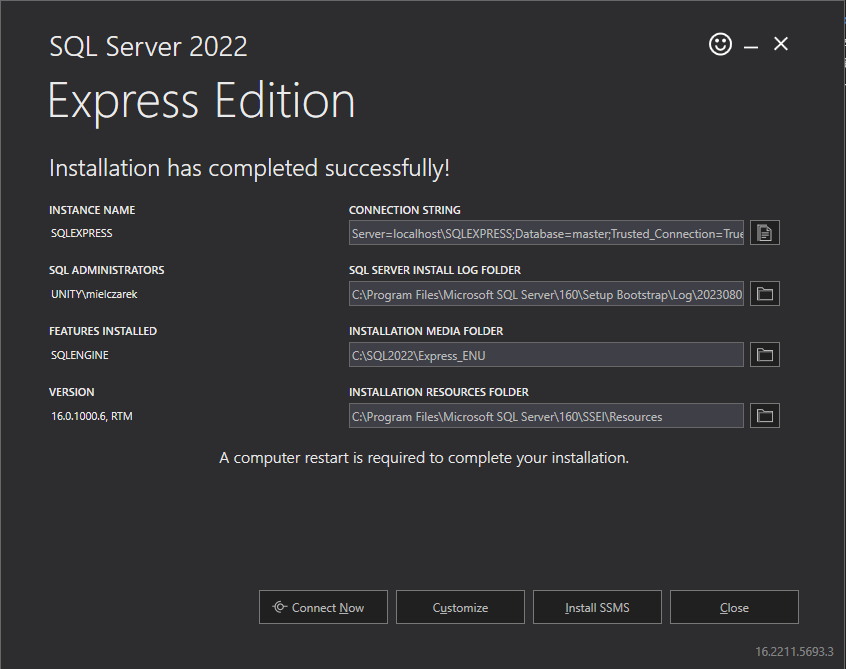

# [LEKCJA 8 – Instalacja SQL Server](https://kurs.szkoladotneta.pl/zostan-programista-asp-net/tydzien-7-bazy-danych/lekcja-8-instalacja-sql-server/)
Na początku kursu zainstalowaliśmy narzędzie Microsoft SQL Server Management Studio, którego będziemy używać do pracy z naszą bazą danych. Nie zainstalowaliśmy jednak jeszcze samego silnika bazodanowego. Zróbmy to teraz.
## Instalacja silnika bazodanowego
Na stronie: https://www.microsoft.com/pl-pl/sql-server/sql-server-downloads wyszukujemy sekcję zatytułowaną "Lub pobierz bezpłatną, specjalistyczną edycję" i pobieramy wersję _Express_. Po pobraniu i uruchomieniu instalatora wybieramy w nim opcję _Basic_, akceptujemy wszelkie zgody i klikamy _Install_. Po zakończeniu instalacji pojawi nam się ekran z podsumowaniem:

<br />
_Rysunek 1. Przykładowy ekran podsumowania instalacji silnika bazodanowego SQL Server_

Znajduje się tu kilka ważnych informacji. Po pierwsze mamy nazwę instancji (_INSTANCE NAME_), która zaraz nam się przyda. Po drugie mamy _CONNECTION STRING_, który pozwoli nam na łączenie się z naszą bazą danych. Jest on bardzo ważny, dla tego od razy go sobie skopiujmy i zapiszmy w jakimś osobnym pliku. Reszta informacji na razie nas specjalnie nie interesuje. Gdy zapiszemy _CONNECTION STRING_ możemy zamknąć instalator klikając _Close_.
## Połączenie aplikacji z utworzoną instancją serwera bazodanowego
Kiedy zainstalowaliśmy już nasz lokalny serwer połączmy z nim od razu naszą aplikację.

Kiedy zmienialiśmy konfigurację naszej aplikacji MVC, tak aby korzystała z utworzonego przez nas kontekstu, mieliśmy tam m.in. taki kod:
```csharp =
var connectionString = builder.Configuration.GetConnectionString("DefaultConnection") ?? throw new InvalidOperationException("Connection string 'DefaultConnection' not found.");
builder.Services.AddDbContext<Context>(options =>
    options.UseSqlServer(connectionString));
```
Widzimy tu zmienną `connectionString`, tworzoną z jakiegoś skonfigurowanego `"DefaultConnection"` (domyślnego połączenia). W kolejnej instrukcji z kolei wskazywaliśmy builderowi, aby nasz kontekst korzystał ze wskazanego przez tą zmienną serwera SQL. W tym właśnie miejscu w kodzie łączyliśmy nasz kontekst z serwerem bazodanowym. `"DefaultConnection"` jest skonfigurowane w pliku JSON _appsettings.json_ naszego projektu _.Web_. Na początku tego pliku powinniśmy mieć coś takiego:
```json =
"ConnectionStrings": {
    "DefaultConnection": "Server=(localdb)\\mssqllocaldb;Database=aspnet-TitlesOrganizer.Web-730df0ff-8ddf-4542-9564-b259fc927467;Trusted_Connection=True;MultipleActiveResultSets=true"
  }
```
czyli właśnie konfigurację domyślnego połączenia. Zawiera ona w tej chwili automatycznie wygenerowany podczas tworzenia naszej aplikacji ciąg połączenia. Zastąpmy go ciągiem wygenerowanym podczas instalacji dla naszego serwera (_CONNECTION STRING_, który przed chwilą zapisywaliśmy w oddzielnym pliku). Czyli będziemy mieć teraz np.:
```json =
"ConnectionStrings": {
    "DefaultConnection": "Server=localhost\\SQLEXPRESS;Database=master;Trusted_Connection=True;"
  }
```
I już.
## Otwarcie serwera w Microsoft SQL Server Management Studio
Nasz serwer możemy teraz spróbować otworzyć w programie Microsoft SQL Server Management Studio. Otwieramy program. Powinno wyświetlić nam się od razu okienko _Connect to Server_. Musimy podać tu kilka informacji.
* _Server type:_ wybieramy _Database Engine_
* _Server name:_ musimy wpisać nazwę naszego serwera. Składa się ona z nazwy naszego komputera, backslasha i nazwy instancji naszego serwera. Jeśli nie znamy nazwy naszego komputera, możemy zamiast niej wstawić kropkę, lub słowo _localhost_. Nazwa instancji naszego serwera była podana w podsumowaniu instalacji. Prawdopodobnie jest to _SQLEXPRESS_. Pełna nazwa serwera jest też podana na początku naszego connection stringa. Czyli np. wpisujemy: _localhost\SQLEXPRESS_.
* _Authentication:_ powinno być ustawione na _Windows Authentication_, ponieważ jest to lokalny serwer na naszym komputerze.

Gdy wszystko uzupełnimy klikamy _Connect_.

Jeżeli okno _Connect to Server_ nie otworzyło nam się automatycznie po uruchomieniu programu, możemy je otworzyć wybierając w _Object Explorer_ -> _Connect_ -> _Database Engine..._, klikając w _Object Explorer_ ikonkę wtyczki (_Connect Object Explorer_) lub wybierając z menu _File_ -> _Connect Object Explorer..._

Kiedy połączymy się już z naszym serwerem w _Object Explorer_ (F8, jeśli się nie wyświetla) możemy zobaczyć co się na nim znajduje. Nasze bazy danych zostaną umieszczone w folderze _Databases_, kiedy już je utworzymy.