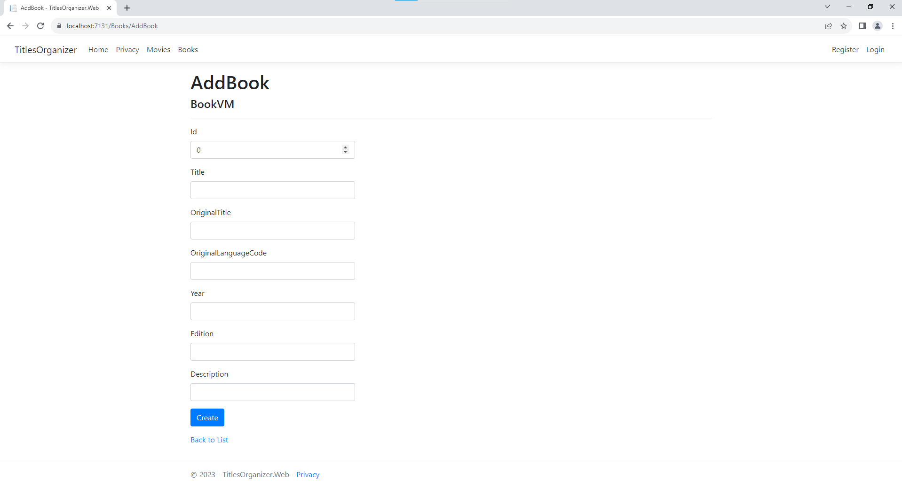
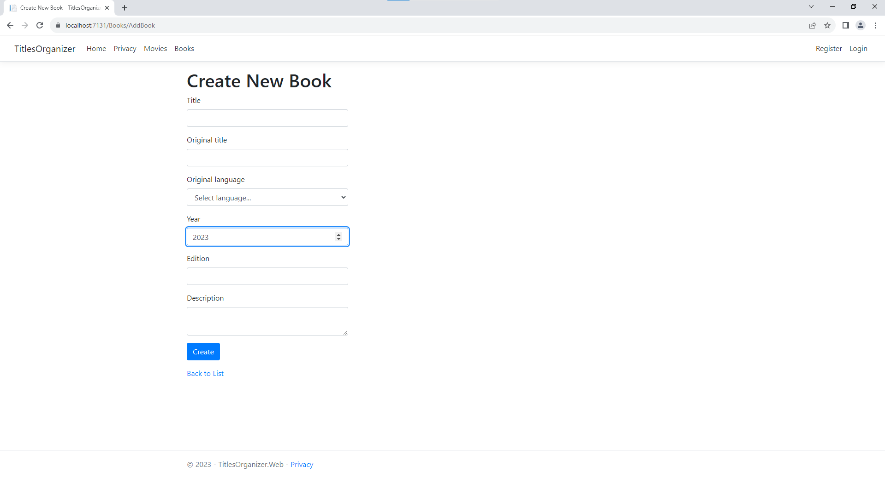

# [LEKCJA 10 – Praca z formularzami](https://kurs.szkoladotneta.pl/zostan-programista-asp-net/tydzien-8-od-widoku-do-modelu/lekcja-10-praca-z-formularzami/)
O formularzach mówiliśmy już trochę w poprzedniej lekcji. Formularze służą do przesyłania danych od klienta na serwer. Najczęściej używa się ich w połączeniu z metodą POST żądań http. Oznacza to, że dane nie są przesyłane jawnie w pasku adresu (jak to ma miejsce w przypadku żądań GET), ale są spakowane w obiekt i wysyłane jako tzw. **data content**. Formularze będziemy wykorzystywać zarówno do tworzenia nowych obiektów (rekordów) w naszej bazie danych, edycji już istniejących, ale również do czynności nie związanych z wprowadzaniem jakichkolwiek zmian w bazie danych, jak chociażby przedstawione w poprzedniej lekcji filtrowanie, wyszukiwanie i paginacja.

Zobaczmy więc użycie formularza na kolejnym przykładzie. Tym razem zajmiemy się dodawaniem nowego obiektu do listy. Wykorzystajmy ponownie użyty w poprzedniej lekcji przykład listy książek.
## Przykład
Uprościmy na razie nasz przypadek i podczas dodawania nowych książek pominiemy dodawanie autorów, gatunków i przynależności do serii książek, które są przechowywane w osobnych tabelach i są obiektami powiązanymi.
### 1. Viewmodel
Nasz uproszczony viewmodel dla widoku dodawania nowych książek będzie wyglądał następująco:
```csharp
namespace TitlesOrganizer.Application.ViewModels.BookVMs
{
    public class BookVM
    {
        public int Id { get; set; }
        public required string Title { get; set; }
        public string? OriginalTitle { get; set; }
        public string? OriginalLanguageCode { get; set; }
        public int? Year { get; set; }
        public string? Edition { get; set; }
        public string? Description { get; set; }
    }
}
```
### 2. Kontroler
W naszym kontrolerze ponownie będziemy potrzebować dwóch akcji.
1. Będzie odpowiadać na żądania typu GET. Zostanie ona wywołana w pierwszej kolejności, gdy użytkownik będzie chciał utworzyć nową książkę.
2. Będzie odpowiadać na żądania POST. Będzie ona wywoływana przez widok wywołany w pierwszej akcji. Widok prześle przez formularz wstępnie zwalidowane dane wprowadzone przez użytkownika.

Podobnie jak to miało miejsce w przypadku akcji `Index` z poprzedniej lekcji obie akcje będą miały taką samą nazwę, a różnić się będą argumentami (pierwsza będzie bezargumentowa, druga będzie przyjmować viewmodel `BookVM`) i atrybutami określającymi typ żądania http na jakie odpowiada (pierwsza GET, druga POST). Nazwijmy te metody `AddBook`. Będziemy więc mieli coś takiego:
```csharp
 [HttpGet]
public ActionResult AddBook()
{
    return View(new BookVM() { Title = string.Empty });
}

[HttpPost]
public ActionResult AddBook(BookVM book)
{
    int id = _bookService.AddBook(book); // oczywiscie aby aplikacja sie uruchomila, to musimy miec utworzony odpowiedni serwis i ta metode, ale nie bedziemy sie tym w tej lekcji zajmowac

    return View();
}
```
W `BookVM` mamy właściwość `OriginalLanguageCode`, która jest kluczem głównym z tabeli ze wszystkimi językami. Podczas dodawania nowej książki będziemy więc chcieli mieć rozwijaną listę z językami do wyboru. Musimy więc również przesłać do naszego widoku listę z językami (nazwa i kod języka). Ponieważ listy będziemy używać w elemencie `<select>`, więc chcemy aby była ona w postaci `IEnumerable<SelectListItem>`. Musimy jeszcze dokonać odpowiedniego rzutowania. Zrobimy to przy pomocy metody `Select` LINQ. Zrobimy to w tym wypadku w kontrolerze a nie w serwisie, gdyż klasa `SelectListItem` należy do biblioteki `Microsoft.AspNetCore.Mvc`, która jest zainstalowana tylko dla warstwy UI naszej aplikacji. Otrzymaną listę prześlemy do widoku przy pomocy ViewBag. Dopiszmy więc do pierwszej metody odpowiedni kod.
```csharp
[HttpGet]
public ActionResult AddBook()
{
    var languages = _languageService.GetAllLanguagesForList(); // musimy utworzyc odpowiedni serwis, ta metode i viewmodel zwiazany z jezykami, ale nie bedziemy tego w tej lekcji omawiac
    ViewBag.Languages = languages.Select(lang => new SelectListItem(lang.Name, lang.Code));

    return View(new BookVM() { Title = string.Empty });
}
```
Dokładną zawartością drugiej metody na razie nie będziemy się zajmować.
### 3. Widok
Utwórzmy widok dla akcji GET. Klikamy prawym przyciskiem myszki na nazwie akcji i wybieramy _Add View..._. W nowo otwartym oknie wybieramy _Razor View_ i klikamy _Add_. _Template_ ustawiamy tym razem na _Create_ i wyszukujemy nasz viewmodel `BookVM`. Po kliknięciu _Add_ rozpocznie się generowanie nowego widoku. Będzie on wyglądał następująco:
```cshtml
@model TitlesOrganizer.Application.ViewModels.BookVMs.BookVM

@{
    ViewData["Title"] = "AddBook";
}

<h1>AddBook</h1>

<h4>BookVM</h4>
<hr />
<div class="row">
    <div class="col-md-4">
        <form asp-action="AddBook">
            <div asp-validation-summary="ModelOnly" class="text-danger"></div>
            <div class="form-group">
                <label asp-for="Id" class="control-label"></label>
                <input asp-for="Id" class="form-control" />
                <span asp-validation-for="Id" class="text-danger"></span>
            </div>
            <div class="form-group">
                <label asp-for="Title" class="control-label"></label>
                <input asp-for="Title" class="form-control" />
                <span asp-validation-for="Title" class="text-danger"></span>
            </div>
            <div class="form-group">
                <label asp-for="OriginalTitle" class="control-label"></label>
                <input asp-for="OriginalTitle" class="form-control" />
                <span asp-validation-for="OriginalTitle" class="text-danger"></span>
            </div>
            <div class="form-group">
                <label asp-for="OriginalLanguageCode" class="control-label"></label>
                <input asp-for="OriginalLanguageCode" class="form-control" />
                <span asp-validation-for="OriginalLanguageCode" class="text-danger"></span>
            </div>
            <div class="form-group">
                <label asp-for="Year" class="control-label"></label>
                <input asp-for="Year" class="form-control" />
                <span asp-validation-for="Year" class="text-danger"></span>
            </div>
            <div class="form-group">
                <label asp-for="Edition" class="control-label"></label>
                <input asp-for="Edition" class="form-control" />
                <span asp-validation-for="Edition" class="text-danger"></span>
            </div>
            <div class="form-group">
                <label asp-for="Description" class="control-label"></label>
                <input asp-for="Description" class="form-control" />
                <span asp-validation-for="Description" class="text-danger"></span>
            </div>
            <div class="form-group">
                <input type="submit" value="Create" class="btn btn-primary" />
            </div>
        </form>
    </div>
</div>

<div>
    <a asp-action="Index">Back to List</a>
</div>

@section Scripts {
    @{await Html.RenderPartialAsync("_ValidationScriptsPartial");}
}
```
W widoku, poza różnymi nagłówkami itp. mamy przede wszystkim formularz `<form asp-action="AddBook"></form>`. Ma on jeden atrybut (`asp-action`). Wskazuje on, do jakiej akcji kontrolera ma zostać przesłany ten formularz. Jeśli tak jak w tym przypadku nie wskażemy kontrolera do którego ma zostać przesłany formularz, to zostanie on wysłany do kontrolera, który wywołał dany widok, czyli tak jak chcemy.

Na początku formularza mamy `<div>` z atrybutem `asp-validation-summary`. Kiedy użytkownik spróbuje przesłać formularz z niepoprawnymi danymi (nie przechodzącymi wstępnej walidacji) to w tym właśnie miejscu mają zostać wyświetlone komunikaty o błędach.

Dalej znajdują się kontenery `<div>` związane z poszczególnymi polami formularza. W każdym znajduje się `<label>` z opisem danego pola (oczekiwanych danych), następnie odpowiedni `<input>` do pobrania danych od użytkownika, a na samym końcu `<span>` na komunikaty o wprowadzeniu błędnych danych w dany `<input>`.

Walidacją zajmiemy się w kolejnych lekcjach.

W ostatnim kontenerze `<div>` formularza znajduje się przycisk `<input type="submit">`, którego kliknięcie spowoduje przesłanie formularza na serwer.

Wszystkim elementom formularza przypisano odpowiednie klasy Bootstrap.

Na samym dole widoku mamy sekcję `Scripts`. Dołączamy w nim plik ze skryptami związanymi z walidacją, a dokładniej plik *_ValidationScriptsPartial.cshtml*. Gdy zajrzymy do projektu webowego do folderu _Views\Shared_, to zobaczymy, że został on tam automatycznie utworzony i zawiera w tej chwili jedynie wstawienie skryptów z dwoma bibliotekami jquery związanymi z walidacją:
```cshtml
<script src="~/lib/jquery-validation/dist/jquery.validate.min.js"></script>
<script src="~/lib/jquery-validation-unobtrusive/jquery.validate.unobtrusive.min.js"></script>

```
Ten automatycznie wygenerowany widok po wyświetleniu w przeglądarce wygląda następująco:



Możemy zobaczyć, że dla wartości `Id` książki (która jest typu `int`) został wygenerowany `<input>` typu `"number"`. W prawdzie nie widać tego akurat na powyższym zrzucie, ale input tego samego typu został utworzony dla właściwości `Year`. Pozostałe właściwości viewmodelu są typu `string`, więc wygenerowano dla nich proste inputy typu `"text"`.

Kiedy przetestujemy otrzymany widok zobaczymy, że działa on tak, jak byśmy tego w tej chwili chcieli. Użytkownik może wprowadzić wszystkie dane związane z `BookVM`, a wciśnięcie przycisku `Create` spowoduje przesłanie ich do utworzonej na początku akcji `AddBook` reagującej na żądania POST. Ponieważ właściwość `Title` viewmodelu ma specyfikator `required`, więc próba wysłania formularza z pustym polem `Title` nie powiedzie się i zostanie nam wyświetlony komunikat o błędzie. Nie wszystko wygląda jednak dokładnie tak, jakbyśmy tego chcieli. Wprowadźmy więc jeszcze kilka zmian.
1. Po pierwsze nie chcemy, aby użytkownik wpisywał numer identyfikacyjny wprowadzanej książki. Zostanie on nadany automatycznie przez silnik bazodanowy w momencie tworzenia nowego rekordu. Możemy więc usunąć cały element `<div>` (wraz z jego zawartością) związany z właściwością `Id` viewmodelu (drugi `<div>` formularza). Aby jednak formularz był zgodny z viewmodelem, musi znajdować się w nim pole związane z `Id`. Ponieważ jednak nie chcemy aby było ono widoczne dla użytkownika, więc cały `<div>` związany z `Id` zastępujemy ukrytym polem (`<input type="hidden" asp-for="Id" />`).
2. Elementy związane z `Title` zostawmy na razie bez zmian.
3. Elementy związane z `OriginalTitle` są prawie takie, jak chcemy. Napis "OriginalTitle" jest jednak mało naturalny. Wstawmy więc jego bardziej naturalny odpowiednik (`Original title`) pomiędzy tag otwierający, a zamykający odpowiedniego elementu `<label>`.
4. Następnie mamy elementy związane z właściwością `OriginalLanguageCode`. Jak już wspominaliśmy zawiera ona klucz obcy i chcielibyśmy, aby użytkownik wstawiał do niej dane, wybierając odpowiednią opcję z listy rozwijanej. Musimy więc zastąpić `<input>` elementem `<select>`. Jak być może pamiętamy w akcji kontrolera przesyłaliśmy do widoku listę `IEnumerable<SelectListItem>` z dostępnymi do wyboru językami. Robiliśmy to przez `ViewBag`, pod nazwą `Languages`. Skorzystajmy więc z atrybutu `asp-items` silnika Razor, która przyjmuje właśnie element typu `IEnumerable<SelectListItem>` i na jego podstawie tworzy odpowiednie elementy `<option>`. Przekażmy więc zapisaną w ViewBag listę (`asp-items="@ViewBag.Languages"`). Ponieważ książka nie musi być powiązana z żadnym językiem (użytkownik nie musi podawać oryginalnego języka książki jeśli nie chce), dodajmy do tworzonego selecta jeszcze jedną opcję o pustej wartości (`value=""`), np. `<option value="">Select language...</option>`. Zostanie ona wstawiona jako pierwsza opcja rozwijanej listy, a co za tym idzie będzie automatycznie wybrana po otwarciu strony. Ponieważ wyświetlanie nazwy "OriginalLanguageCode" również jest mało naturalne, zmieńmy to więc, tak jak zmienialiśmy wyświetlaną nazwę w poprzednim punkcie.
5. Elementy związane z `Year` właściwie moglibyśmy zostawić tak jak są. Możemy zostawić użytkownikowi możliwość wstawienia daty poprzez iterowanie przy pomocy strzałek w górę/w dół. Gdyby ktoś jednak miał wstawić rok wydania jakiejś współczesnej książki poprzez iterowanie po jeden rozpoczynając od zera, to taka funkcjonalność mija się z celem. Spróbujmy więc to nieco ulepszyć. Można do tematu podejść na kilka sposobów. Najprościej będzie ustawić minimalną i maksymalną dostępną wartość. Ustawmy więc jawnie nasz `<input>` na typ `"number"` i ustawmy wartości minimalną i maksymalną odpowiedni przy pomocy atrybutów `min` i `max`. Jest już trochę lepiej. Krok iteracji musi być jeden, gdyż każdy rok pomiędzy musi być dostępny do wyboru. Kiedy użytkownik wciśnie strzałkę to iteracja rozpoczyna się od wartości minimalnej. Nie jest to dla nas sytuacja idealna, gdyż różnica lat pomiędzy najstarszymi istniejącymi książkami, które teoretycznie mógłby wstawić użytkownik, a tymi bardziej współczesnymi, które najprawdopodobniej będzie wstawiał, jest wciąż ogromna. Wolelibyśmy więc rozpoczynać iterację od wartości maksymalnej. Niestety nie da się tego zrobić w prosty sposób. Zastosujemy więc małą sztuczkę z użyciem JavaScript. Kiedy użytkownik kliknie na input (lub przejdzie do niego przy pomocy przycisku tabulacji), a input będzie pusty, wstawimy do niego automatycznie maksymalną wartość (obecny rok). Dzięki temu iterować będziemy mogli zacząć od tej właśnie wartości. Odpowiedni kod wstawimy na dole widoku w sekcji `Scripts` (omówienie kodu w komentarzach w kodzie wstawionym poniżej).
6. Elementy związane z `Edition` na razie również zostawimy bez zmian.
7. Na końcu formularza użytkownik może wstawić opis książki. Obecnie jest do tego użyty element `<input type="text">`. Umożliwia on wprowadzenie przez użytkownika wyłącznie jednej linii tekstu. Opis książki będzie się jednak najprawdopodobniej składał z wielu paragrafów. Zaproponowany przez generator element nie daje nam takiej możliwości. Zamiast niego musimy więc użyć przeznaczonego do takich celów elementu `<textarea></textarea>`.

To na ten moment wszystkie zmiany jakie wprowadzimy. Po modyfikacjach nasz kod może wyglądać jak poniżej:
```cshtml
@model TitlesOrganizer.Application.ViewModels.BookVMs.BookVM

@{
    ViewData["Title"] = "Create New Book";
}

<h1>Create New Book</h1>
<div class="row">
    <div class="col-md-4">
        <form asp-action="AddBook">
            <div asp-validation-summary="ModelOnly" class="text-danger"></div>
            <input type="hidden" asp-for="Id" />
            <div class="form-group">
                <label asp-for="Title" class="control-label"></label>
                <input asp-for="Title" class="form-control" />
                <span asp-validation-for="Title" class="text-danger"></span>
            </div>
            <div class="form-group">
                <label asp-for="OriginalTitle" class="control-label">Original title</label>
                <input asp-for="OriginalTitle" class="form-control" />
                <span asp-validation-for="OriginalTitle" class="text-danger"></span>
            </div>
            <div class="form-group">
                <label asp-for="OriginalLanguageCode" class="control-label">Original language</label>
                <select asp-for="OriginalLanguageCode" class="form-control" asp-items="@ViewBag.Languages">
                    <option value="">Select language...</option>
                </select>
                <span asp-validation-for="OriginalLanguageCode" class="text-danger"></span>
            </div>
            <div class="form-group">
                <label asp-for="Year" class="control-label"></label>
                <input type="number" max="@DateTime.Now.Year" min="800" asp-for="Year" class="form-control" />
                <span asp-validation-for="Year" class="text-danger"></span>
            </div>
            <div class="form-group">
                <label asp-for="Edition" class="control-label"></label>
                <input asp-for="Edition" class="form-control" />
                <span asp-validation-for="Edition" class="text-danger"></span>
            </div>
            <div class="form-group">
                <label asp-for="Description" class="control-label"></label>
                <textarea asp-for="Description" class="form-control"></textarea>
                <span asp-validation-for="Description" class="text-danger"></span>
            </div>
            <div class="form-group">
                <input type="submit" value="Create" class="btn btn-primary" />
            </div>
        </form>
    </div>
</div>

<div>
    <a asp-action="Index">Back to List</a>
</div>

@section Scripts {
    <script type="text/javascript">
    @* Wyszukanie inputa Year po id *@
        var year = document.getElementById("Year");
    @* Dodanie nasłuchiwania na wypadek klikniecia lub uzyskania focusa (np. przy przechodzeniu miedzy inputami z uzyciem Tab) na inpucie Year i wywolanie zdefiniowanej nizej funkcji w przypadku wystapienia ktoregos z tych eventow. *@
        year.addEventListener("click", (event) => YearFirstClicked());
        year.addEventListener("focus", (event) => YearFirstClicked());

    @* Funkcja sprawdza, czy w elemencie year wpisano jakas wartosc, jesli nie wpisuje jego maksymalna wartosc *@
        function YearFirstClicked()
        {
            if (!year.value)
            {
                year.value = year.max;
            }
        }
    </script>
    @{
        await Html.RenderPartialAsync("_ValidationScriptsPartial");
    }
}
```
Po tych zmianach w przeglądarce otrzymamy następującą stronę:


