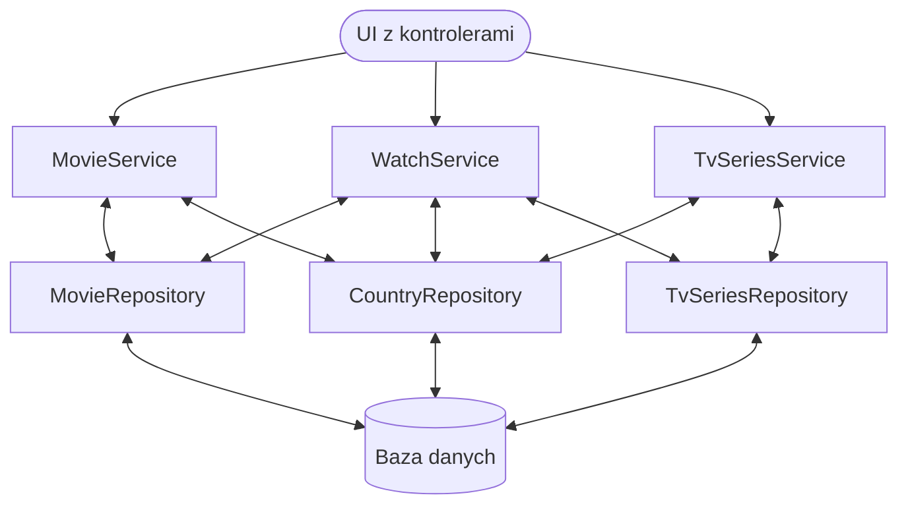

# [LEKCJA 2 – Wzorzec „Repozytorium-serwis”](https://kurs.szkoladotneta.pl/zostan-programista-asp-net/tydzien-8-od-widoku-do-modelu/lekcja-2-wzorzec-repozytorium-serwis/)
Wzorzec "Repozytorium-serwis" (ang. _The Repository-Service Pattern_) jest to prosty wzorzec architektoniczny dzielący backend naszej aplikacji na dwie warstwy: repozytoriów i serwisów. Jak już wcześniej wspominaliśmy repozytoria odpowiadają za komunikację z bazą danych (pobieranie i zapisywanie danych). Serwisy z kolei zawierają całą logikę biznesową naszej aplikacji. Obie warstwy komunikują się ze sobą i powinny być luźno powiązane. Luźno, to znaczy serwisy nie powinny np. mieć wpływu na to jakie i w jaki sposób pobierane są dane. Repozytoria z kolei nie powinny zawierać żadnej logiki.

Dodatkowo, poza repozytoriami i serwisami, będziemy używać trzeciej warstwy, kontrolerów. Znajdzie się ona na froncie naszej aplikacji. Posłuży nam do komunikacji z użytkownikiem. Czasami ten wzorzec nazywamy więc _repository-service-controller pattern_. Omówmy jeszcze raz dokładnie wszystkie jego warstwy.

## Kontrolery
Na początku mamy kontrolery. Jest to "pierwsza linia" naszej aplikacji. Jak już wspominaliśmy, w dzisiejszych czasach, powinny być one jak najcieńsze. Służą do obsługi żądań użytkownika. Czyli np. w odpowiedzi na przesłane żądanie wywołują odpowiednią akcją serwisu.

Co więc powinno znaleźć się w kontrolerach?
1. Pierwsza walidacja - pierwsze zabezpieczenie przed atakami - sprawdzamy, czy dane (żądanie), otrzymane od użytkownika, są zgodne z oczekiwaniami.
2. Przesłanie żądania do _application_ - jeżeli żądanie jest poprawne, to przesyłamy je dalej, do warstwy aplikacji (do serwisu).

## Serwisy
Drugą warstwą są serwisy. Zawierają one logikę biznesową naszej aplikacji. Logika biznesowa, czyli wymagania naszego klienta (wymagania jakie stawiamy przed naszą aplikacją).

Co powinno znaleźć się w serwisach?
1. Sprawdzenie wszelkich warunków.
2. Połączenia między elementami warstwy domenowej.
3. Kod związany z reagowaniem na żądania użytkownika.
    * Przygotowanie danych do zapisu.
        * Łączenie danych pobranych od użytkownika z danymi uzupełnianymi automatycznie (np. nazwa pobrana od użytkownika i data transakcji - automatycznie uzupełniana bieżąca data).
        * Wyliczanie danych na podstawie otrzymanych informacji.
        * Uzupełnianie np. o numery id, tworzenie połączeń między encjami.
    * Przesłanie przygotowanych danych do repozytorium.
    * Pobranie zażądanych danych z repozytorium.
    * Obróbka danych z bazy danych (np. łączenie danych z różnych źródeł, odfiltrowanie danych, których użytkownik nie powinien widzieć).

## Repozytoria
Ostatnią warstwą są repozytoria. Znajdują się tu ponownie dosyć proste metody bazujące na wykonywaniu podstawowych operacji na bazie danych.

Co może znaleźć się w repozytoriach?
* Zwracanie odpowiednich informacji z bazy danych.
* Dodawanie odpowiednich informacji do bazy danych (repozytoria powinny zakładać, że zostały im przesłane kompletne i prawidłowe dane).

Czego nie umieszczamy w repozytoriach?
* Przygotowywania informacji (obróbki danych).
* Instrukcji warunkowych (poza ewentualnym sprawdzeniem, czy jest `null`).
* Wyliczania danych.
* Dokładania danych.
* Walidacji.

## Przykładowy schemat

