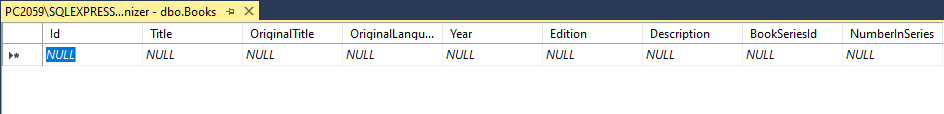

# [LEKCJA 8 – Wyświetlanie obiektów](https://kurs.szkoladotneta.pl/zostan-programista-asp-net/tydzien-8-od-widoku-do-modelu/lekcja-8-wyswietlanie-obiektow/)
Jeżeli jeszcze tego nie zrobiliśmy, uaktualnijmy kontrolery naszej aplikacji MVC.
1. Wstrzyknijmy przez konstruktor kontrolera odpowiednie serwisy (a dokładniej interfejsy serwisów) z warstwy aplikacji. Stwórzmy prywatne pola readonly do ich przechowywania i przypiszmy im wartości w konstruktorze.
2. Zaimplementujmy metody kontrolera przy użyciu interfejsów serwisów i viewmodeli z warstwy aplikacji. Jeżeli jeszcze tego nie zrobiliśmy, to zaimplementujmy również serwisy, ich interfejsy i odpowiednie viewmodele. Zróbmy odpowiednie mapowania i dodajmy do kolekcji w _Program.cs_ (lub, jeśli istnieje, w _Startup.cs_) serwisy do dependency injection. Modele z warstwy UI możemy usunąć.
3. Stwórzmy widoki analogicznie jak to robiliśmy w tygodniu 6. (lekcja 8.), tylko tym razem użyjmy modeli, które stworzyliśmy do tego celu w warstwie aplikacji.
    1. Możemy np. kliknąć prawym przyciskiem myszki na nazwę akcji kontrolera.
    2. Wybieramy _Add View..._.
    3. W otwartym oknie zaznaczamy _Razor View_ i klikamy _Add_.
    4. Pojawi nam się kolejna okno, w którym wybieramy odpowiedni szablon (_Template:_), np. _List_, gdy chcemy wyświetlić tabelę do wyświetlenia danych z listy obiektów, _Details_, gdy w widoku będziemy wyświetlać szczegółowe informacje o konkretnym obiekcie itd. Jeżeli chcemy samodzielnie stworzyć cały widok, wybieramy _Empty (without model)_.
    5. O ile nie wybraliśmy pustego szablonu (_Template: Empty (without model)_), musimy wskazać na podstawie jakiego modelu ma zostać stworzony nasz widok. Wybieramy z rozwijanej listy klasę odpowiedniego viewmodelu.
    6. Nie podajemy klasy DbContext (_DBContext class:_), gdyż nie chcemy dodawać naszego viewmodelu do kontekstu.
    7. Kiedy już wybierzemy odpowiedni szablon i model klikamy _Create_. Spowoduje to stworzenie nowego pliku z widokiem, co może chwilę zająć. Plik znajdzie się w folderze _Views_, w podfolderze odpowiedniego kontrolera. Powinien się on otworzyć automatycznie, po utworzeniu.
    8. Utworzony widok możemy modyfikować aby dostosować go do swoich potrzeb.
    9. Uważajmy na viewmodele które składały się z dwóch właściwości: listy elementów i `Count` zawierającego liczbę elementów na liście. Będziemy musieli poprawić dla niej zarówno model, jak i szablon widoku. Możemy podczas tworzenia widoku zgodnie z szablonem listy wskazać typ, który jest przechowywany w liście, zamiast typu zawierającego listę. Później, po stworzeniu widoku musimy zmienić model w pierwszej linii kodu na właściwy. Iterować nie będziemy również po `Model`, ale po `Model.NazwaWlasciwosciZLista`. Musimy również poprawić nazwy nagłówków tabeli (wnętrze sekcji `<thead></thead>`). Najłatwiej będzie wprost wpisać tekst, który chcemy, aby się wyświetlił, zamiast odwoływać się do nazw właściwości (bo teraz musielibyśmy pobierać nazwy właściwości elementów z listy, a nie wprost modelu). Dzięki tworzeniu szablonu dla "wewnętrznego" modelu będziemy już mieli stworzone odpowiednie kolumny wyświetlonej tabeli, będziemy musieli je tylko poprawić, aby pasowały do właściwego modelu.
4. Dodajmy do naszej bazy danych jakieś dane. W tym celu otwórzmy SQL Server Management Studio. Jeżeli przypadkiem mamy obecnie zainstalowaną wersję SSMS 18, to pobierzmy najpierw nowszą wersję [SSMS 19](https://learn.microsoft.com/en-us/sql/ssms/download-sql-server-management-studio-ssms?view=sql-server-ver16) (w poprzedniej wersji nie wszystkie funkcjonalności działają). Po otwarciu SSMS połączmy się z naszym serwerem i odszukajmy w _Object Explorer_ naszą bazę danych. W jej folderze _Tables_ odszukajmy wybraną tabelę i kliknijmy na jej nazwę prawym przyciskiem myszki. Wybierzmy opcję _Edit Top 200 Rows_. Powinno to spowodować wyświetlenie okna z naszą tabelką. Jeżeli w naszej tabeli nie umieściliśmy jeszcze żadnych danych, to będzie ono wyglądać np. jak na rysunku poniżej.
 
_Rysunek 1. Przykładowy widok okna edycji danych w pustej tabeli w SSMS_  
Jeżeli w wybranej tabeli znajdują się już jakieś dane, to wybranie opcji _Edit Top 200 Rows_ spowoduje wyświetlenie pierwszych 200 rekordów naszej tabeli (lub mniej, jeśli nasza tabela zawiera mniej rekordów) z możliwością ich edycji. Nie zależnie od obecnego stanu tabeli, ostatni rząd w tabeli wyświetlonej w oknie, będzie analogiczny do tego pokazanego na obrazku ("wypełniony" samymi nullami). Umożliwia on dodawanie nowych rekordów do tabeli bazodanowej. Właśnie z tego mechanizmu skorzystamy. W miejsce napisów _NULL_ wstawiamy odpowiednią daną. Po w pisaniu pierwszej danej, poniżej utworzy nam się nowy wiersz z nullami. Po wypełnieniu danych z jednego rekordu, możemy przejść do wprowadzania kolejnego. Wprowadzone dane zostaną automatycznie zapisane w bazie danych gdy opuścimy dany rekord (przejdziemy do kolejnego).
5. Kiedy już wszystko zaimplementujemy i poprawimy ewentualne błędy kompilacji, to możemy w końcu uruchomić naszą aplikację, aby zobaczyć nasze widoki. W odpowiednich widokach powinny być teraz widoczne dane, które umieściliśmy w bazie danych.