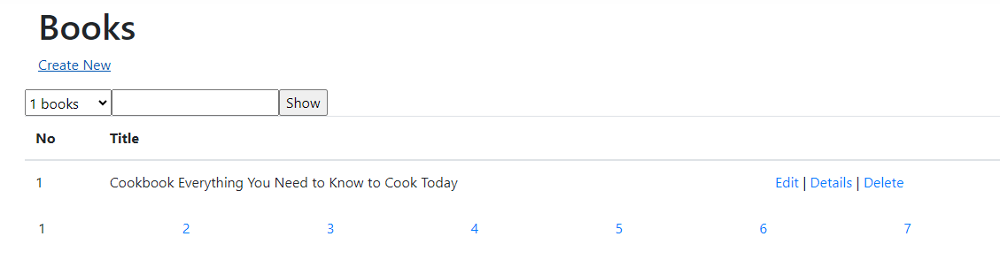
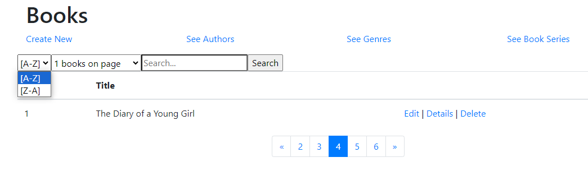

# [LEKCJA 9 – Filtrowanie, wyszukiwanie, paginacja](https://kurs.szkoladotneta.pl/zostan-programista-asp-net/tydzien-8-od-widoku-do-modelu/lekcja-9-filtrowanie-wyszukiwanie-paginacja/)
**Paginacja** - inaczej stronicowanie, a po ang. _paging_. Jest to często stosowany mechanizm dzielący duże (długie) tabele na strony. Dzięki temu na stronę musimy na raz przesłać mniejszą ilość danych. Użytkownik natomiast, żeby zobaczyć kolejne dane, zamiast używać scrolla, zmienia "stronę tabeli".

Jeżeli mamy do wyświetlenia dużą ilość danych (np. lista wszystkich klientów, produktów, książek, filmów itp.), warto, jeśli jest to możliwe, użyć mechanizmów filtrowania, paginacji i wyszukiwania. Zarówno zmniejszy to ilość danych którą musi przesłać do klienta nasz serwer, jak i korzystnie wpłynie na przejrzystość aplikacji i umożliwi użytkownikowi szybsze dotarcie do szukanych informacji.

## Przykład
Pokażmy więc na przykładzie jak zaimplementować te dodatkowe mechanizmy. Załóżmy, że dodamy filtrowanie, wyszukiwanie i paginację do podstawowej akcji `Index` naszego kontrolera, która wyświetla listę książek (tytułów).
1. Przesłanie do kontrolera dodatkowych danych.
    - Utworzenie w kontrolerze dodatkowej metody `Index`, przyjmującej trzy parametry: wielkość strony, numer aktualnie wyświetlanej strony i string do wyszukania w tytule. Parametry będziemy przesyłać przez formularz.
    - Zaznaczmy, że pierwotna (bezparametrowa) metoda `Index` będzie odpowiadała na żądania GET, a ta nowo utworzona, na żądania POST.
    - Obie metody będą musiały przekazać te dodatkowe dane do serwisu. Metoda bezparametrowa przekazuje wartości domyślne, czyli jakąś wybraną, domyślną wielkość strony (np. 10), numer strony ustawia na `1`, a wyszukiwany string na `string.Empty`.
2. Obróbka danych przez serwis.
    - Odebranie odpowiednich danych.
    - Przygotowanie ograniczonej listy (przefiltrowanej i zawierającej tylko wyniki dla odpowiedniej strony)
    - Przesłanie odpowiednich danych do viewmodelu.
3. Dodanie dodatkowych danych (wielkość i numer strony, wyszukiwany string) do viewmodelu z listą książek.
    - Teraz lista będzie zawierać tylko max. wielkość strony elementów zawierających wyszukiwany ciąg (może być mniej, jeżeli znaleziono mniej elementów lub np. jest to ostatnia strona).
    - Parametr `Count` będzie natomiast zawierał liczbę wszystkich elementów w bazie spełniających kryteria wyszukiwania. Będzie nam to potrzebne do obliczenia liczby stron tabeli.
4. Modyfikacja widoku.
    - Dodanie formularza do przesyłania danych przez POST (tag `<form></form>`).
    - Można dodać możliwość wyboru wielkości strony (liczby wyświetlanych na stronie wyników) np. w formie rozwijanej listy, tzw. dropdown listy (tag `<select></select>`, a wewnątrz niego tagi `<option></option>` z możliwymi do wyboru opcjami).
    - Dodanie pola do wpisywania wyszukiwanego stringu (tag `<input type="text" />`).
    - Dodanie przycisku uruchamiającego wyszukiwanie, czyli przesyłającego formularz do kontrolera (tag `<input type="submit" />`).
    - Dodanie linków do zmiany strony tabeli (np. tag `<a></a>`), wywołującego metodę JavaScript, którą zaraz dopiszemy.
    - Dodanie ukrytego pola do zapisywania wybranego numeru strony (tag `<input type="hidden" />`).
    - Dodanie skryptu JavaScript implementującego metodę, przypisującą wartość wybranego numeru strony do ukrytego pola i przesyłającą formularz.

Zacznijmy od początku.
### 1. Kontroler
Załóżmy, że w kontrolerze mamy metodę:
```csharp =
public ActionResult Index()
{
    ListBookForListVM list = _bookService.GetAllBooksForList();
    return View(list);
}
```
Dodajmy więc jeszcze drugą metodę o tej samej nazwie, która będzie przyjmować dane potrzebne do implementacji filtrowania i paginacji: `public ActionResult Index(int pageSize, int? pageNo, string searchString){//...}`. Dopiszmy atrybuty wskazujące jakie żądania Http ma obsługiwać dana metoda i przekażmy odpowiednie dane do serwisu. Np.:
```csharp =
[HttpGet]
public ActionResult Index()
{
    // ustawiamy wielkosc strony np. na 10, numer strony na 1, a wyszukiwany string na pusty string
    ListBookForListVM list = _bookService.GetAllBooksForList(10, 1, "");
    return View(list);
}

[HttpPost]
public ActionResult Index(int pageSize, int? pageNo, string searchString)
{
    if (!pageNo.HasValue) // sprawdzamy czy przeslano numer strony (pageNo nie jest null)
    {
        pageNo = 1; // jezeli nie przeslano, to ustawiamy sie na pierwsza strone
    }               // wrocimy do tego pozniej

    ListBookForListVM list = _bookService.GetAllBooksForList(pageSize, (int)pageNo, searchString);
    return View(list);
}
```
Możemy dodatkowo wrzucić domyślną wielkość strony do osobnej zmiennej, aby ułatwić sobie późniejsze zmiany, gdybyśmy kiedyś chcieli tą wielkość zmienić. Np. dopisujemy do klasy kontrolera dodatkowe pole `const`:
```csharp = 
private const int PAGE_SIZE = 10;

[HttpGet]
public ActionResult Index()
{
    ListBookForListVM list = _bookService.GetAllBooksForList(PAGE_SIZE, 1, "");
    return View(list);
}
```
jeżeli w danym kontrolerze będziemy wyświetlać kilka różnych takich list, np. książki, autorów, gatunki itp., ale nie chcemy mieć wspólnej wartości dla wszystkich kontrolerów. Gdybyśmy chcieli mieć stałą domyślną wielkość strony dla wszystkich kontrolerów, wówczas musielibyśmy taką zmienną wyrzucić poza klasę kontrolera, np. do osobnej klasy/struktury pomocniczej lub utworzyć nadrzędny kontroler bazowy, jeśli nasze kontrolery będą mieć więcej punktów wspólnych.
### 2. Serwis
Do metody `GetAllBooksForList` serwisu i jego interfejsu dopiszmy odpowiednie parametry (`int pageSize, int pageNo, string searchString`). Moglibyśmy teraz przesłać te dane do repozytorium i bezpośrednio tam wyszukać i pobrać odpowiednie elementy. Chcemy jednak dostać całą listę, aby wiedzieć ile jest na niej elementów (do parametru `Count` viewmodelu i określenia liczby stron tabeli). Tak na prawdę to moglibyśmy zrobić wyszukiwanie po stronie repozytorium, ale ponieważ jest to część logiki biznesowej aplikacji, więc zostawmy to w serwisie. Załóżmy, że nasza metoda wyglądała wcześniej tak:
```csharp =
public ListBookForListVM GetAllBooksForList()
{
    var books = _bookRepository.GetAllBooks()
        .OrderBy(b => b.Title)
        .ProjectTo<BookForListVM>(_mapper.ConfigurationProvider)
        .ToList();

    return new ListBookForListVM()
    {
        List = books,
        Count = books.Count
    };
}
```
Dodajmy do niej implementację związaną z filtrowaniem i stronicowaniem.
1. Najpierw wyszukamy tylko te książki, których tytuły zawierają wskazany ciąg znaków.
     - Użyjemy do tego metody `Where` LINQ i metody `StartsWith`, jeśli chcemy wyszukiwać tytułów zaczynających się od wskazanego tekstu lub `Contains`, jeżeli wpisany przez użytkownika tekst ma się znajdować w dowolnym miejscu tytułu (niekoniecznie na początku).
2. Liczebność otrzymanej listy będziemy zapisywać w parametrze `Count` viewmodelu.
3. Następnie z otrzymanej listy wybieramy tylko te elementy, które mają znaleźć się na wskazanej stronie.
    - Używamy do tego metod `Skip`, do pominięcia elementów z wcześniejszych stron i `Take` do pobrania odpowiedniej liczby elementów.
4. Na koniec tworzymy obiekt viewmodelu naszej listy i umieszczamy w nim otrzymaną w poprzednim punkcie listę, wielkość listy otrzymanej w punkcie pierwszym i wszystkie informacje związane z filtrowaniem i stronicowaniem.

Po tych modyfikacjach metoda serwisu może więc wyglądać tak:
```csharp =
public ListBookForListVM GetAllBooksForList(int pageSize, int pageNo, string searchString)
{
    searchString ??= string.Empty; // zabezpieczenie przed proba wyszukiwania w tytule wartosci null

    var books = _bookRepository.GetAllBooks()
        .Where(b => b.Title.Contains(searchString)) // pobiez tylko ksiazki, ktorych tytuly zawieraja wyszukiwany string
        .OrderBy(b => b.Title)
        .ProjectTo<BookForListVM>(_mapper.ConfigurationProvider)
        .ToList();
    var limitedList = books
        .Skip(pageSize * (pageNo - 1)) // pomijamy wszystkie elementy z kazdej wczesniejszej strony,
        // czyli dla pierwszej strony nie pomijamy nic, dla drugiej tyle elementow ile miesci sie na stronie itd.
        .Take(pageSize) // biezemy kolejne pageSize elementow lub tyle ile jest, jezeli zostalo mniej
        .ToList();

    return new ListBookForListVM()
    {
        List = limitedList, // lista ksiazek do wyswietlenia na tej stronie
        Count = books.Count, // liczba wszystkich ksiazek spelniajacych podane kryterium wyszukiwania, na wszystkich stronach
        PageSize = pageSize, // wielkosc strony, liczba elementow (ksiazek) wyswietlanych na stronie
        CurrentPage = pageNo, // numer aktualnie wyswietlanej strony
        SearchString = searchString // parametr filtrowania, string wyszukiwany w tytulach ksiazek
    };
}
```
Nie zapomnijmy również poprawić deklaracji w interfejsie serwisu. Czyli 
```csharp
ListBookForListVM GetAllBooksForList();
```
zmieniamy na
```csharp
ListBookForListVM GetAllBooksForList(int pageSize, int pageNo, string searchString);
```
### 3. ViewModel
Dopasujmy implementację viewmodela związanego z tą akcją kontrolera, tak, aby znajdowały się w nim odpowiednie właściwości, do których przypisywaliśmy wartości w metodzie serwisu. Czyli coś takiego:
```csharp
public class ListBookForListVM
{
    public int Count { get; set; }
    public List<BookForListVM> List { get; set; }
}
```
zamieniamy na coś takiego:
```csharp
public class ListBookForListVM
{
    public int Count { get; set; }
    public List<BookForListVM> List { get; set; }
    public int CurrentPage { get; set; }
    public int PageSize { get; set; }
    public string SearchString { get; set; }
}
```
### 4. View
Załóżmy, że mieliśmy taki widok:
```cshtml
@model TitlesOrganizer.Application.ViewModels.BookVMs.ListBookForListVM

@{
    ViewData["Title"] = "Books";
}

<h1>Books</h1>

<p class="row"><a asp-action="Create" class="col">Create New</a></p>
<div class="row">
    <table class="table">
        <thead>
            <tr>
                <th>No</th>
                <th>Title</th>
                <th></th>
            </tr>
        </thead>
        <tbody>
        @foreach (var (book, index) in Model.List.Select((value, index) => (value, index + 1)))
        {
            <tr>
                <td>@Html.DisplayFor(modelItem => index)</td>
                <td>@Html.DisplayFor(modelItem => book.Title)</td>
                <td>
                    @Html.ActionLink("Edit", "Edit", new { id = book.Id }) |
                    @Html.ActionLink("Details", "Details", new { id = book.Id }) |
                    @Html.ActionLink("Delete", "Delete", new { id = book.Id })
                </td>
            </tr>
        }
        </tbody>
    </table>
</div>
```
Dołóżmy do niego odpowiednie kontrolki do filtrowania i paginacji. Pomiędzy paragrafem z linkiem "Create New", a divem z tabelką umieścimy dropdown listę do wyboru wielkości strony (ile książek chcemy umieścić na stronie) i kontrolkę do wpisywania wyszukiwanej w tytule frazy. Dodamy tam również przycisk, umożliwiający przesłanie do kontrolera wybranych z dropdown listy i wpisanych w kontrolkę wyszukiwania danych. Poniżej tabeli z książkami umieścimy natomiast linki z numerami stron, umożliwiające nam przechodzenie między stronami tabeli. Umieścimy tam również dodatkową ukrytą kontrolkę, do której przy pomocy JavaScript będziemy wpisywać wybrany przez użytkownika numer strony.

Wszystkie kontrolki zawierające dane, które chcemy przesłać do kontrolera musimy umieścić w formularzu (gdyż jak już wspominaliśmy chcemy je wysyłać metodą POST). Ponieważ te kontrolki chcemy umieścić za równo na górze jak i na dole widoku, więc poza formularzem w tym przypadku może znaleźć się jedynie nagłówek i pierwszy paragraf widoku.

Na samym dole dokumentu dodamy jeszcze sekcję `Scripts`, w której umieścimy skrypt z naszą funkcją w JavaScript.

Zobaczmy jak mogą wyglądać wszystkie te elementy na naszym przykładzie:
```cshtml
@model TitlesOrganizer.Application.ViewModels.BookVMs.ListBookForListVM

@{
    ViewData["Title"] = "Books";
}

<h1>Books</h1>

<p class="row"><a asp-action="Create" class="col">Create New</a></p>

@*Wszystkie kontrolki z danymi do przeslania do kontrolera umieszczamy w formularzu*@
<form asp-action="Index" asp-controller="Books" method="post">
    <div class="row">
    @*Dropdown lista do wyboru liczby ksiazek do wyswietlenia na stronie*@
        <select asp-for="PageSize">
            <option value="1">1 books</option> @* dodane na potrzeby prezentacji *@
            <option value="5">5 books</option>
            <option value="10">10 books</option>
            <option value="20">20 books</option>
            <option value="30">30 books</option>
            <option value="50">50 books</option>
            <option value="100">100 books</option>
        </select>
    @*Kontrolka do wpisania przez uzytkownika wyszukiwanej w tytule frazy*@
        <input type="text" asp-for="SearchString" name="searchString" id="searchString" />
    @*Przycisk do przeslania danych do kontrolera*@
        <input type="submit" value="Show" />
    </div>
    <div class="row">
        <table class="table">
            <thead>
                <tr>
                    <th>No</th>
                    <th>Title</th>
                    <th></th>
                </tr>
            </thead>
            <tbody>
            @foreach (var (book, index) in Model.List.Select((value, index) => (value, index + 1)))
            {
                <tr>
                    <td>@Html.DisplayFor(modelItem => index)</td>
                    <td>@Html.DisplayFor(modelItem => book.Title)</td>
                    <td>
                        @Html.ActionLink("Edit", "Edit", new { id = book.Id }) |
                        @Html.ActionLink("Details", "Details", new { id = book.Id }) |
                        @Html.ActionLink("Delete", "Delete", new { id = book.Id })
                    </td>
                </tr>
            }
            </tbody>
        </table>
    </div>
    <div class="row">
    @*Tworzymy linki do zmiany strony tabeli*@
        @for (int i = 1; i <= Math.Ceiling(Model.Count / (double)Model.PageSize); i++)
        {
            <div class="col">
            @if (i == Model.CurrentPage)
            {
                <span>@i</span> @*numer biezacej strony nie jest linkiem*@
            }
            else
            {
                @*Numery wczesniejszych/pozniejszych stron sa linkami wywolujacymi metode JavaScript PagerClick i przesylajacymi do niej, po kliknieciu, numer wybranej strony*@
                <a href="javascript:PagerClick(@i)">@i</a>
            }
            </div>
        }
    @*Ukryta (nie widoczna dla uzytkownika) kontrolka do umieszczenia wybranego numeru strony*@
        <input type="hidden" name="pageNo" id="pageNo"/>
    </div>
@*Koniec formularza*@
</form>

@*Sekcja ze skryptami*@
@section Scripts
{
    @*Skrypt JavaScript z funkcja PagerClick*@
    <script type="text/javascript">
        function PagerClick(index){
            @*Wartosc przeslana jako parametr funkcji wstawiamy do ukrytej kontrolki*@
            document.getElementById("pageNo").value = index;
            @*Przesylamy formularz do akcji kontrolera*@
            document.forms[0].submit();
        }
    </script>
}
```
Co w przeglądarce będzie wyglądać następująco:



1. Tag formularza (`<form></form>`)<br />
W tagu formularza użyliśmy dwóch tzw. pomocników tagów formularzy: `asp-action` i `asp-controller`. W pierwszym wskazujemy akcję, do której ma zostać przesłany formularz, a w drugim kontroler, do którego ta akcja należy. Zamias nich można również użyć atrybutu html `action` podając w nim ścieżkę URL do akcji (`action="/Books/Index"`). Używamy również atrybutu `method`, wskazującego jaką metodą chcemy przesyłać formularz (`method="post"`). Na ogół będzie to metoda POST, tak jak w naszym przykładzie.
2. Pomocnik tagów wejściowych `asp-for`<br />
W kontrolkach związanych z danymi, które chcemy pobierać z przesłanego viewmodelu będziemy używać pomocnika `asp-for`. Powiąże on element wejściowy html (input, select itd.) z wyrażeniem viewmodelu w widoku Razor (czyli np. z konkretną właściwością viewmodelu). Pomocnik `asp-for` m.in.:
    - generuje atrybuty html `id` i `name` dla nazwy wyrażenia podanej w atrybucie `asp-for`. `asp-for="Property1.Property2"` jest równoważne `m => m.Property1.Property2`.
    - dla kontrolki `<input></input>` ustawia atrybut html `type` na podstawie viewmodelu i jego atrybutów, chyba, że został on podany.

    Typ .NET|`<input type=`
    --:|:--
    `Bool`|`type="checkbox"`
    `String`|`type="text"`
    `DateTime`|`type="datetime-local"`
    `Byte`|`type="number"`
    `Int`|`type="number"`
    `Single, Double`|`type="number"`

    Atrybut viewmodelu|`<input type=`
    --:|:--
    `[EmailAddress]`|`type="email"`
    `[Url]`|`type="url"`
    `[HiddenInput]`|`type="hidden"`
    `[Phone]`|`type="tel"`
    `[DataType(DataType.Password)]`|`type="password"`
    `[DataType(DataType.Date)]`|`type="date"`
    `[DataType(DataType.Time)]`|`type="time"`
3. Tag `<option></option>`<br />
Wewnątrz tagu `<select></select>` tworzącego kontrolkę listy rozwijanej, umieszczamy elementy `<option></option>`. Każdy taki element definiuje jedną pozycję na liście. Tekst umieszczony między tagiem otwierającym (`<option>`), a zamykającym (`</option>`) zostanie wyświetlony użytkownikowi w liście rozwijanej. Dodatkowo można zdefiniować jeszcze atrybut `value`. Podana w nim wartość zostanie przesłana przez formularz, jeżeli użytkownik wybierze daną opcję. Jeśli nie zdefiniujemy atrybutu `value`, to jego wartość będzie taka sama jak wyświetlanego tekstu (umieszczonego między otwierającym a zamykającym tagiem).
4. Atrybuty `id`<br />
`id` jest atrybutem globalnym, co oznacza, że jest dostępny dla wszystkich elementów html. Określa on unikatowy identyfikator danego elementu. Na jednej stronie html nie mogą na raz występować dwa elementy o takim samym `id`. Służy do odwołania się do jednego konkretnego elementu np. w skryptach JS, czy przy definiowaniu stylów w CSS.
5. Atrybut `name`<br />
Określa nazwę danego elementu html. W odróżnieniu od `id` nie jest to atrybut globalny. Można go zdefiniować dla następujących elementów: `<button>`, `<fieldset>`, `<form>`, `<iframe>`, `<input>`, `<map>`, `<meta>`, `<object>`, `<output>`, `<param>`, `<select>`, `<textarea>`. Podobnie jak `id`, `name` służy do odwoływania się do danego obiektu. W odróżnieni od `id`, `name` nie musi być unikatowe. Może więc występować kilka elementów o takiej samej nazwie. Oznacza to, że gdy będziemy odwoływać się do elementów po samej nazwie, to może być tak, że będziemy odwoływać się do kilku elementów, a nie jednego. W skryptach JS może to np. oznaczać, że otrzymamy nie jeden element, a array. Dla poszczególnych typów elementów atrybut `name` może mieć jeszcze dodatkowe zastosowania:
    - w `<form>` jest używany jako odniesienie podczas przesyłania danych.
    - w `<iframe>` może zostać użyty do kierowania przesyłania formularza.
    - w `<map>` jest powiązany z atrybutem `usemap` elementu `` i tworzy relację pomiędzy obrazem a mapą.
    - w `<meta>` określa nazwę dla informacji/wartości atrybutu `content`, np. `<meta name="description" content="Free Web tutorials">`, `<meta name="keywords" content="HTML,CSS,XML,JavaScript">`. Może przyjmować wartości: `"application-name"`, `"author"`, `"description"`, `"generator"`, `"keywords"`, `"viewport"`
    - w `<param>` jest używany w połączeniu z atrybutem `value`, aby sprecyzować parametry dla pluginów nadrzędnego elementu `<object>`, np. `<object data="horse.wav"><param name="autoplay" value="true"></object>`
6. Atrybut `class`<br />
Podobnie jak `id` jest to atrybut globalny. Określa on nazwy klas CSS do których należy dany element. Jeden element może nie należeć do żadnej klasy albo należeć do jednej lub kilku klas. Jeżeli chcemy aby element należał do kilku klas, to wypisujemy je wszystkie jako wartość atrybutu, oddzielając je od siebie spacjami. W powyższym przykładzie używaliśmy klas zdefiniowanych w zestawie narzędzi Bootstrap.
7. Atrybut `type`<br />
Atrybut elementów `<a>`, `<button>`, `<embed>`, `<input>`, `<link>`, `<menu>`, `<object>`, `<script>`, `<source>`, `<style>` określający typ danego elementu.<br />
Dla elementów `<input>` atrybut `type` może przyjmować następujące wartości:
    - `"button"` - definiuje możliwy do kliknięcia przycisk,
    - `"checkbox"` - definiuje checkbox,
    - `"color"` - definiuje kontrolkę do wyboru kolorów,
    - `"date"` - definiuje kontrolkę do wyboru daty (rok, miesiąc, dzień (bez czasu)),
    - `"datetime-local"` - definiuje kontrolkę do wyboru daty i czasu (rok, miesiąc, dzień, czas (bez strefy czasowej)),
    - `"email"` - definiuje pole na adres e-mailowy,
    - `"file"` - definiuje pole wyboru pliku w formie przycisku wywołującego okno wyboru,
    - `"hidden"` - definiuje ukryte (niewidoczne dla użytkownika) pole,
    - `"image"` - definiuje obrazek jako przycisk przesyłania danych,
    - `"month"` - definiuje kontrolkę do wyboru miesiąca i roku (bez stref czasowych),
    - `"number"` - definiuje pole do wpisania numeru (ze strzałkami w górę/w dół do inkrementacji/dekrementacji, z możliwością zdefiniowania wartości minimalnej, maksymalnej i kroku). Html umożliwia wpisanie w takie pole wyłącznie znaków związanych z liczbami, czyli cyfr, przecinków, małej literki e (związanej z notacją wykładniczą) itd. Wpisanie znaków nie związanych z jakimkolwiek zapisem liczbowym nie powiedzie się,
    - `"password"` - definiuje pole na hasło,
    - `"radio"` - definiuje przycisk wyboru opcji (radio button, wszystkie przyciski należące do jednej grupy, wybór jednej opcji z kilku, muszą mieć taką samą nazwę `name`),
    - `"range"` - definiuje kontrolkę zakresową (np. slider - suwak),
    - `"reset"` - definiuje przycisk resetu,
    - `"search"` - definiuje pole do wpisywania wyszukiwanego tekstu,
    - `"submit"` - definiuje przycisk do przesłania na serwer wprowadzonych danych,
    - `"tel"` - definiuje pole do wprowadzania numeru telefonu,
    - `"text"` - definiuje jednoliniowe pole tekstowe. Jest to typ domyślny,
    - `"time"` - definiuje kontrolkę do wprowadzenia czasu (bez strefy czasowej),
    - `"url"` - definiuje pole na URL,
    - `"week"` - definiuje kontrolkę na tydzień i rok (bez strefy czasowej).
8. Tag wejściowy `<input />`<br />
Elementy input służą do wprowadzania danych przez użytkownika i przesyłania ich na serwer. W poprzednich punktach omówiliśmy atrybuty `id`, `name`, `type` i `asp-for`, które możemy m.in. używać dla elementów input. Używamy jeszcze atrybutu `value`. W przypadku inputów, definiuje ona tekst, który zostanie wyświetlony w kontrolce, np. napis na przycisku, domyślnie wpisany tekst, czy wybraną datę. Oczywiście istnieją również inne atrybuty, także specyficzne dla konkretnego typu. Do zdefiniowania pola do wpisywania wyszukiwanej frazy użyliśmy domyślnego typu `"text"`, ale moglibyśmy zamiast niego użyć typu `"search"`.
9. Tag `<span></span>`<br />
Jest to kontener inline, używany do wydzielenia części tekstu lub dokumentu. Można go łatwo wystylizować w CSS lub manipulować nim w JS przy użyciu jego atrybutu `class` lub `id`. Jest to tylko kontener, spełnia więc podobną funkcję jak `<div>`, jednak w odróżnieniu od niego, jest elementem typu inline, a nie block. W naszym przykładzie użyliśmy go do umieszczenia w nim numeru aktualnie wyświetlanej strony. Nie chcemy, aby był to element interaktywny. Moglibyśmy więc wypisać numer bezpośrednio na stronie, bez użycia dodatkowego kontenera. Użycie elementu `<span>` pozwoli nam jednak później dopasować wygląd numeru strony do naszych preferencji oraz umieścić element w odpowiednim miejscu strony.
10. Tag `<a></a>`<br />
Definiuje hiperlinki. Jest używany do przekierowywania z jednej strony na drugą. Najważniejszym atrybutem elementu jest `href`, definiujący miejsce docelowe łącza. W naszym przykładzie, zamiast przekierowywać użytkownika na inną stronę, użyjemy hiperłącza do wywołania funkcji JavaScript. Do atrybutu `href`, zamiast adresu URL, przypiszemy więc wywołanie naszej funkcji poprzedzone znacznikiem "javascript:". Pomiędzy tagiem otwierającym (`<a>`), a zamykającym (`</a>`) kotwicy (ang. _anchor_) umieszczamy tekst, który zostanie wyświetlony jako nasze hiperłącze. W naszym przypadku będzie to po prostu numer strony.
11. Obliczanie numerów stron<br />
Numer aktualnie wyświetlanej strony mamy zapisany w modelu jako `@Model.CurrentPage`. Nie wiemy natomiast ile stron powinna mieć nasza tabela. Musimy to więc obliczyć. Ponieważ znamy łączną liczbę elementów na liście (`@Model.Count`) i liczbę elementów wyświetlanych na jednej stronie (`@Model.PageSize`), dzieląc jedno przez drugie możemy obliczyć liczbę stron. Liczba stron musi być przy tym liczbą całkowitą z zaokrągleniem w górę (uwzględniamy ewentualną ostatnią niepełną stronę). Do zaokrąglania w górę możemy użyć funkcji `Ceiling` statycznej klasy `System.Math`. Pamiętajmy jednak, że zarówno `Count` jak i `PageSize` są typu `int`. Oznacza to, że podzielenie jednej wartości przez drugą da nam wynik typu `int`, powstały przez odcięcie części dziesiętnej (zaokrąglenie w dół). Aby móc zaokrąglić nasze dzielenie w górę, musimy więc najpierw dokonać rzutowania przynajmniej jednej z wartości na typ zmiennoprzecinkowy, tak aby wynik dzielenia również był liczbą zmiennoprzecinkową (np. `double`). Dopiero po otrzymaniu wyniku w postaci liczby zmiennoprzecinkowej, możemy go sensownie zaokrąglić w górę. Całe działanie może więc wyglądać następująco `Math.Ceiling(Model.Count / (double)Model.PageSize)`. Kiedy wiemy już ile stron ma nasza tabela (znamy numer ostatniej strony), możemy przeiterować po wszystkich numerach stron (od 1 do obliczony numer) i wyświetlić ja na stronie odpowiednio jako zwykły napis (obecna strona) lub hiperlink (wszystkie inne strony), np. przy pomocy pętli `for`.
12. Funkcja JavaScript do zmiany numeru wyświetlanej strony<br />
Na końcu widoku tworzymy sekcję `Scripts` oczekiwaną przez główny layout naszej strony.<br />
Pod koniec pliku *_Layout.cshtml*, definiującego ogólny schemat wyglądu każdej naszej strony html (wstawiane są do niego nasze widoki), znajduje się kod `@await RenderSectionAsync("Scripts", required: false)`. Oznacza on właśnie, że layout oczekuje na sekcję `Scripts`. Kod umieszczony wewnątrz tej sekcji zostanie umieszczony na wygenerowanej stronie html w miejscu gdzie umieszczony został kod `@await...`. Sekcja ta jest przeznaczona do umieszczania w niej skryptów JavaScript. Miejsce umieszczenia skryptów w pliku html ma duże znaczenie. Jeżeli bowiem będziemy używać dodatkowych bibliotek (np. jquery, czy bootstrap), to korzystające z nich skrypty muszą znajdować się w dokumencie poniżej linków do bibliotek. Dlatego też na końcu (tuż przed tagiem zamykającym body - `</body>`) schematu strony definiowanego przez plik *_Layout.cshtml* umieszczona zostaje sekcja ze skryptami.<br />
Tworzymy więc w sekcji skrypt przy pomocy znaczników `<script type="text/javascript"></script>`, pomiędzy którymi umieszczamy treść naszego skryptu, pisaną już w języku JavaScript. W tym wypadku będzie to funkcję `PagerClick`, którą wywoływały nasze hiperłącza.<br />
Do funkcji przekazujemy jeden parametr, wybrany numer strony. Otrzymaną wartość chcemy przypisać do ukrytego pola `pageNo`, tak, aby móc ją przesłać w formularzu do akcji kontrolera.
    1. Wyszukanie odpowiedniego elementu html<br />
    Element wyszukamy po `id`, przy pomocy przeznaczonej do tego funkcji `getElementById` wywoływanej na obiekcie `document`, czyli cały aktualnie wyświetlany dokument (strona) html. Funkcja przyjmuje jako parametr `id` szukanego elementu i zwraca znaleziony element o podanym `id`. Aby znaleźć nasze ukryte pole piszemy więc `document.getElementById("pageNo")`.
    2. Odwołanie się do atrybutu<br />
    Kiedy mamy już odpowiedni element, możemy m.in. odwoływać się do jego atrybutów. W tym wypadku interesuje nas atrybut `value`, czyli wartość, jaka jest zapisana w naszym polu. Odwołać możemy się do niego pisząc po prostu `[element].value`.
    3. Przypisanie wartości do atrybutu<br />
    Do otrzymanego atrybutu możemy przypisać teraz nową wartość przy pomocy operatora przypisania (`=`). Łączne zapisanie tych kroków da nam polecenie `document.getElementById("pageNo").value = index;`, gdzie `index` to nazwa parametru funkcji, czyli wybrany numer strony.
    4. Przesłanie formularza<br />
    Kiedy przypiszemy już odpowiedni numer strony do ukrytego pola formularza, cały formularz możemy wysłać do akcji kontrolera. Podobnie jak poprzednio musimy najpierw znaleźć odpowiedni element `<form>`. Tym razem użyjemy jednak atrybutu `forms` naszego obiektu `document`. Atrybut ten zwraca wszystkie formularze znajdujące się na stronie, a więc obiekt array. Na jednej stronie mogłoby się bowiem znaleźć wiele formularzy. U nas znajduje się jednak tylko jeden, wiemy więc, że pierwszy element otrzymanej tabeli będzie naszym formularzem. Piszemy więc `document.forms[0]`. Do przesłania formularza służy jego funkcja `submit`. Cała instrukcja będzie więc wyglądać następująco `document.forms[0].submit();`.

Jak być może zauważyliśmy w powyższym kodzie formularz może być przesłany na dwa sposoby:
1. przy pomocy przycisku `<input type="submit" value="Show" />`,
2. przy pomocy funkcji JavaScript `PagerClick` wywoływanej przez tagi `<a></a>` z numerami stron.

W obu przypadkach w formularzu zostaną wysłane wszystkie znajdujące się w nim w danym momencie dane (dane z inputów, selectów itd.). Jeżeli prześlemy formularz przy pomocy przycisku submit (pierwszy sposób), oznacza to, że nie umieściliśmy żadnej wartości w naszym ukrytym polu `pageNo`. Stąd też parametr `pageNo` akcji naszego kontrolera może nie mieć wartości (a właściwie mieć przypisaną wartość domyślną, która dla typu `int?` wynosi `null`). Dzięki temu wiemy, kiedy użytkownik chce tylko przejść na następną stronę, a kiedy zmienił kryteria wyszukiwania albo wielkość strony. Ponieważ w tym drugim przypadku (zmiana kryteriów wyszukiwania lub wielkości strony) chcemy zawsze przenosić użytkownika na pierwszą stronę, więc takie rozróżnienie jest nam na rękę, a odpowiedni mechanizm musieliśmy uwzględnić w akcji kontrolera. To samo moglibyśmy osiągnąć przypisując "na sztywno" wartość `1` do naszego ukrytego pola. W tym wypadku moglibyśmy rzeczywiście tak zrobić bo mechanizm przenoszenia na pierwszą stronę jest dość oczywisty i bardzo wątpliwe aby ulegał zmianie, jest to jednak w pewnym sensie niepotrzebne przenoszenie logiki na widok, czego powinniśmy unikać.

Przedstawione modyfikacje widoku uwzględniają mechanizmy filtrowania i paginacji w dość podstawowej formie. Możemy się nimi dalej bawić np. dodając wybór mechanizmu sortowania listy książek, definiując możliwe do wyboru wielkości stron w osobnej klasie, czy ulepszając paginację chociażby przy pomocy Bootstrapa.

Np. widok:
```cshtml
@model TitlesOrganizer.Application.ViewModels.BookVMs.ListBookForListVM

@{
    ViewData["Title"] = "Books";
}

<h1>Books</h1>

<p class="row"><a asp-action="Create" class="col">Create New</a></p>
<form asp-action="Index" asp-controller="Books" method="post">
    <div class="row">
        <select asp-for="SortBy" asp-items="Html.GetEnumSelectList<TitlesOrganizer.Application.ViewModels.Common.SortByEnum>()" onchange="javascript:Submit();"></select>
        <select asp-for="PageSize" asp-items="new SelectList(TitlesOrganizer.Application.ViewModels.Common.PageSize.List, TitlesOrganizer.Application.ViewModels.Common.PageSize.DataValueField, TitlesOrganizer.Application.ViewModels.Common.PageSize.DataTextField)" onchange="javascript:Submit();" action="/Books/Index"></select>
        <input type="search" asp-for="SearchString" name="searchString" id="searchString" placeholder="Search..." onchange="javascript:Submit();" />
        <input type="submit" value="Search" />
    </div>
    <div class="row">
        <table class="table">
            <thead>
                <tr>
                    <th>No</th>
                    <th>Title</th>
                    <th></th>
                </tr>
            </thead>
            <tbody>
            @foreach (var (book, index) in Model.List.Select((value, index) => (value, index + 1))) {
                <tr>
                    <td>@Html.DisplayFor(modelItem => index)</td>
                    <td>@Html.DisplayFor(modelItem => book.Title)</td>
                    <td>
                        @Html.ActionLink("Edit", "Edit", new { id = book.Id }) |
                        @Html.ActionLink("Details", "Details", new { id = book.Id }) |
                        @Html.ActionLink("Delete", "Delete", new { id = book.Id })
                    </td>
                </tr>
            }
            </tbody>
        </table>
    </div>
    <div class="row justify-content-center">
        @{
            var pages = Math.Ceiling(Model.Count / (double)Model.PageSize);
            int numbersNextTo = 2;
        }
        <nav aria-label="...">
            <ul class="pagination">
                @if (Model.CurrentPage > numbersNextTo + 1)
                {
                    <li class="page-item">
                        <a class="page-link" href="javascript:PagerClick(@(Model.CurrentPage - numbersNextTo - 1))" aria-label="Previous">
                            <span aria-hidden="true">&laquo;</span>
                        </a>
                    </li>
                }
                @for (int i = numbersNextTo; i >= 1; i--)
                {
                    if (i < Model.CurrentPage)
                    {
                        <li class="page-item"><a class="page-link" href="javascript:PagerClick(@(Model.CurrentPage - i))">@(Model.CurrentPage - i)</a></li>
                    }
                }
                @if (pages > 1)
                {
                    <li class="page-item active" aria-current="page">
                        <span class="page-link">@Model.CurrentPage</span>
                    </li>
                }
                @for (int i = 1; i <= numbersNextTo && Model.CurrentPage + i <= pages; i++)
                {
                    <li class="page-item"><a class="page-link" href="javascript:PagerClick(@(Model.CurrentPage + i))">@(Model.CurrentPage + i)</a></li>
                }
                @if (Model.CurrentPage + numbersNextTo + 1 <= pages)
                {
                    <li class="page-item">
                        <a class="page-link" href="javascript:PagerClick(@(Model.CurrentPage + numbersNextTo + 1))" aria-label="Next">
                            <span aria-hidden="true">&raquo;</span>
                        </a>
                    </li>
                }
            </ul>
        </nav>
        <input type="hidden" name="pageNo" id="pageNo"/>
    </div>
</form>
@section Scripts
{
    <script type="text/javascript">
        function PagerClick(index){
            document.getElementById("pageNo").value = index;
            Submit();
        }
        function Submit(){
            document.forms[0].submit();
        }
    </script>
}
```
z pomocniczymi klasami i enumem we viewmodelach:
```csharp
using System.ComponentModel.DataAnnotations;
using System.Linq.Expressions;

namespace TitlesOrganizer.Application.ViewModels.Common
{
    public enum SortByEnum
    {
        [Display(Name = "[A-Z]")]
        Ascending = 0,

        [Display(Name = "[Z-A]")]
        Descending = 1
    }

    public static class SortByExtensions
    {
        public static IOrderedQueryable<T> Sort<T, TKey>(this IQueryable<T> listToSort, SortByEnum sortBy, Expression<Func<T, TKey>> selector)
        {
            return sortBy switch
            {
                SortByEnum.Descending => listToSort.OrderByDescending(selector),
                _ => listToSort.OrderBy(selector)
            };
        }

        public static IOrderedQueryable<T> Sort<T, TKey, TThenKey>(this IQueryable<T> listToSort, SortByEnum sortBy, Expression<Func<T, TKey>> selector, params Expression<Func<T, TThenKey>>[] thenSelectors)
        {
            var result = sortBy switch
            {
                SortByEnum.Descending => listToSort.OrderByDescending(selector),
                _ => listToSort.OrderBy(selector)
            };

            foreach (var thenSelector in thenSelectors)
            {
                result = sortBy switch
                {
                    SortByEnum.Descending => result.ThenByDescending(thenSelector),
                    _ => result.ThenBy(thenSelector)
                };
            }

            return result;
        }

        public static IOrderedQueryable<T> Sort<T, TKey, TThenKey>(this IQueryable<T> listToSort, SortByEnum sortBy, Expression<Func<T, TKey>> selector, params (SortByEnum SortBy, Expression<Func<T, TThenKey>> Selector)[] thenSort)
        {
            var result = sortBy switch
            {
                SortByEnum.Descending => listToSort.OrderByDescending(selector),
                _ => listToSort.OrderBy(selector)
            };

            foreach (var then in thenSort)
            {
                result = then.SortBy switch
                {
                    SortByEnum.Descending => result.ThenByDescending(then.Selector),
                    _ => result.ThenBy(then.Selector)
                };
            }

            return result;
        }
    }
}
```
```csharp
namespace TitlesOrganizer.Application.ViewModels.Common
{
    public static class PageSize
    {
        public static string DataTextField = "Value";
        public static string DataValueField = "Key";

        public static Dictionary<int, string> List = new Dictionary<int, string>()
        {
            {1, "1 books on page" }, // dodane na potrzeby prezentacji
            {5, "5 books on page" },
            {10, "10 books on page" },
            {20, "20 books on page" },
            {50, "50 books on page" },
            {100, "100 books on page" },
            {150, "150 books on page" },
            {200, "200 books on page" },
            {250, "250 books on page" },
            {500, "500 books on page" }
        };
    }
}
```
Co w przeglądarce wygląda następująco:



Dodano jeszcze mechanizm sortowania tytułów alfabetycznie rosnąco lub malejąco, co wymagało oczywiście dodania sortowania w serwisie przy pomocy metod rozszerzających klasy `SortByExtensions` oraz dodania odpowiedniego parametru do akcji kontrolera i metody serwisu (i jego interfejsu), a także dodania właściwości w viewmodelu. Dodatkowo formularz zostaje również automatycznie przesłany przy zmianie sposobu sortowania lub liczby wyświetlanych na stronie książek. Zmienił się również wygląd paginacji. Wyświetlane są maksymalnie numery dwóch wcześniejszych i dwóch kolejnych stron (jeśli takowe istnieją) oraz na końcach podwójne "strzałki" w odpowiednią stronę jeśli istnieją jakieś wcześniejsze/późniejsze strony. Do wystylizowania kontrolek stronicowania wykorzystano [mechanizmy paginacji Bootstrapa](https://getbootstrap.com/docs/4.6/components/pagination/).